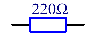
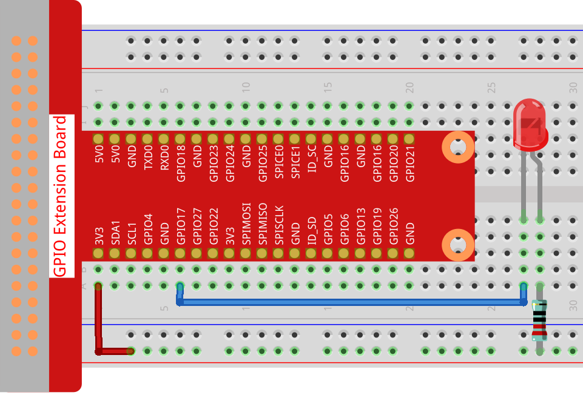
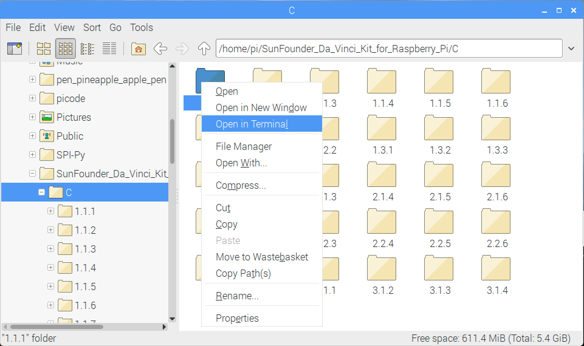
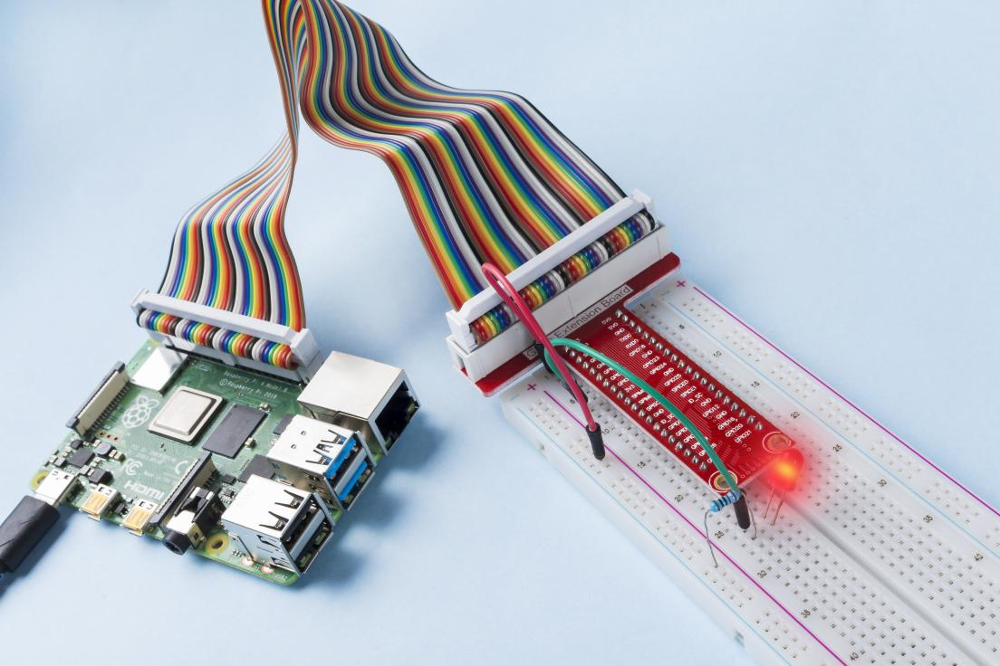

1.1.1 Blinkende LED
=========================

Einführung
-----------------

In dieser Lektion lernen wir, wie man durch Programmierung eine blinkende LED erzeugt. 
Durch Ihre Einstellungen kann Ihre LED eine Reihe interessanter Phänomene erzeugen. Jetzt mach es.

Komponenten
------------------

.. image:: media/blinking_led_list.png
    :width: 800
    :align: center

.. note::
    Um reibungslos fortzufahren, müssen Sie Ihren eigenen Raspberry Pi, TF-Karte und Raspberry Pi-Strom mitbringen.

Prinzip
-----------

**Steckbrett**

Ein Steckbrett ist eine Konstruktionsbasis für das Prototyping von Elektronik. Es wird verwendet, 
um Schaltungen schnell aufzubauen und zu testen, bevor ein Schaltungsentwurf abgeschlossen wird. 
Und es hat viele Löcher, in die oben erwähnte Komponenten wie ICs und Widerstände sowie Jumperdrähte eingesetzt werden können. 
Mit dem Steckbrett können Sie Komponenten einfach anschließen und entfernen.

Das Bild zeigt die interne Struktur eines Voll+ Steckbretts. 
Obwohl diese Löcher auf dem Steckbrett unabhängig voneinander zu sein scheinen, sind sie tatsächlich intern über Metallstreifen miteinander verbunden.

.. image:: media/image41.png

**LED**

LED ist eine Art Diode. 
Die LED leuchtet nur, 
wenn der lange Stift der LED mit der positiven Elektrode und der kurze Stift mit der negativen Elektrode verbunden ist.

.. |image42| image:: media/image42.png

.. |image43| image:: media/image43.png

|image42|\ |image43|

Die LED kann nicht direkt an die Stromversorgung angeschlossen werden, die Komponente kann daruas beschädigt werden. 
Ein Widerstand mit 160 Ω oder mehr (Arbeit in 5V) muss in der LED-Schaltung in Reihe geschaltet werden.

**Widerstand**

Der Widerstand ist ein elektronisches Element, das den Zweigstrom begrenzen kann. Ein fester Widerstand ist ein Tpy von Widerstand, dessen Widerstand nicht geändert werden kann, während der eines Potentiometers oder eines variablen Widerstands eingestellt werden kann.

In diesem Kit wird ein fester Widerstand angewendet. In der Schaltung ist es wichtig, die angeschlossenen Komponenten zu schützen. Die folgenden Bilder zeigen ein reales Objekt, einen 220Ω-Widerstand und zwei allgemein verwendete Schaltungssymbole des Widerstands. Ω ist die Widerstandseinheit und die größeren Einheiten umfassen KΩ, MΩ usw. Ihre Beziehung kann wie folgt gezeigt werden: 1 MΩ = 1000 KΩ, 1 KΩ = 1000 Ω. Normalerweise ist der Widerstandswert darauf markiert. Wenn Sie diese Symbole in einer Schaltung sehen, bedeutet, es gibt ein Widerstand.

|image45|\ |image46|

Wenn wir einen Widerstand verwenden, müssen wir zuerst seinen Widerstand kennen. 
Hier sind zwei Methoden: Sie können die Bänder am Widerstand beobachten oder den Widerstand mit einem Multimeter messen. 
Es wird empfohlen, die erste Methode zu verwenden, da diese bequemer und schneller ist. Verwenden Sie ein Multimeter, um den Wert zu messen.

Wie auf der Karte gezeigt, steht jede Farbe für eine Nummer.

.. image:: media/image47.jpeg

Schematische Darstellung
------------------------

In diesem Experiment schließen Sie einen 220 Ω-Widerstand an die Anode (den langen Pin der LED) und dann den Widerstand an 3,3 V an und verbinden Sie die Kathode (den kurzen Pin) der LED mit GPIO17 von Raspberry Pi. 
Da um eine LED einzuschalten, muss der GPIO17-Niveau niedrig (0V) sein. Wir können dieses Phänomen durch Programmierung erhalten.

.. note::

    **Pin11** bezieht sich von links nach rechts auf den 11. Pin des Raspberry Pi. Die entsprechenden **wiringPi** und BCM-Pin-Nummern sind in der folgenden Tabelle aufgeführt.

In den C-Sprachinhalten machen wir GPIO0 sz bis 0 in der wiringPi. 
U Unter den Python-Sprachinhalten, BCM 17 ist 17 in der BCM-Spalte der folgenden Tabelle. 
Gleichzeitig sind sie gleich mit dem 11. Pin des Raspberry Pi, Pin 11.

============ ======== ======== ====
T-Karte Name physisch wiringPi BCM
GPIO17       Pin 11   0        17
============ ======== ======== ====

.. image:: media/image48.png
    :width: 800
    :align: center

Experimentelle Verfahren
-----------------------------

Schritt 1: Bauen Sie die Schaltung auf.

Für Benutzer in C-Sprache
^^^^^^^^^^^^^^^^^^^^^^^^^^^^^^

Schritt 2: Gehen Sie zum Ordner des Codes.

1. Wenn Sie einen Bildschirm verwenden, sind die folgenden Schritte empfohlen.

Gehen Sie zu ``/home/pi/`` und suchen Sie den Ordner ``davinci-kit-for-raspberry-pi`` .

Suchen Sie C im Ordner, klicken Sie mit der rechten Maustaste darauf und wählen **Open in Terminal**.

Dann öffnet sich ein Fenster wie unten gezeigt. Nun haben Sie den Pfad des Codes **1.1.1_BlinkingLed.c** eingegeben.

.. image:: media/image51.png
    :width: 800
    :align: center

In den folgenden Lektionen verwenden wir den Befehl, um die Codedatei einzugeben, anstatt mit der rechten Maustaste zu klicken. Aber Sie können die Methode wählen, die Sie bevorzugen.

2. Wenn Sie sich beim Raspberry Pi aus der Ferne anmelden, wechseln Sie mit ``cd`` das Verzeichnis:

.. raw:: html

   <run></run>

.. code-block::

   cd /home/pi/davinci-kit-for-raspberry-pi/c/1.1.1/

.. note::
    Ändern Sie das Verzeichnis in den Codepfad in diesem Experiment durch ``cd``.

In jedem Fall befinden Sie sich jetzt im Ordner C. Die weiteren Verfahren, die auf diesen beiden Methoden basieren, sind gleich. Lass uns weitermachen.

Schritt 3: Kompilieren Sie die Kode

.. raw:: html

   <run></run>

.. code-block::

   gcc 1.1.1_BlinkingLed.c -o BlinkingLed -lwiringPi

.. note::
    Hinweis: gcc ist die gcc ist die GNU Compilersammlung.. Hier funktioniert es wie das Kompilieren der C-Sprachdatei ``1_BlinkingLed.c`` und das Ausgeben einer ausführbaren Datei.

Im Befehl bedeutet ``-o`` die Ausgabe (das Zeichen unmittelbar nach ``-o`` ist die Dateinamenausgabe nach der Kompilierung, 
und eine ausführbare Datei namens ``BlinkingLed`` wird hier generiert) , ``-lwiringPi`` ist das Laden der Bibliothek wiringPi ( ``l`` ist die Abkürzung der Bibliothek).

Schritt 4: Führen Sie die Ausgabe der ausführbaren Datei im vorherigen Schritt aus.

.. raw:: html

   <run></run>

.. code-block::

   sudo ./BlinkingLed

.. note::

   Um das GPIO zu steuern, müssen Sie das Programm mit dem Befehl sudo (Superuser do) ausführen. Der Befehl ``./`` gibt das aktuelle Verzeichnis an. 
   Der gesamte Befehl ist für die Ausführung der ``BlinkingLed`` im aktuellen Verzeichnis.

.. image:: media/image52.png
    :width: 800
    :align: center

Nachdem der Kode ausgeführt wurde, blinkt die LED.

.. note::

   Wenn es nach dem Ausführen nicht funktioniert oder eine Fehlermeldung angezeigt wird ``wiringPi.h: No such file or directory``, please refer to :ref:`faq_c_nowork` .

Wenn Sie die Kodedatei ``1.1.1_BlinkingLed.c`` bearbeiten möchten, drücken Sie ``Ctrl + C`` , 
um die Ausführung des Kodes zu beenden. Geben Sie dann den folgenden Befehl ein und öffnen es:

.. raw:: html

   <run></run>

.. code-block::

   nano 1.1.1_BlinkingLed.c

.. note::
    nano ist ein Texteditor. Der Befehl wird verwendet, um die Kodedatei ``1.1.1_BlinkingLed.c`` mit diesem Tool zu öffnen.

Drücken Sie ``Ctrl+X`` für Ausfahrt Wenn Sie die Kode geändert haben, werden Sie gefragt, 
ob Sie die Änderungen speichern möchten oder nicht. Geben Sie ``Y`` (speichern) oder ``N`` (nicht speichern) ein. 
Drücken Sie dann die ``Enter`` , um den Vorgang zu beenden. Wiederholen Sie ``Schritt 3`` und ``Schritt 4`` , um den Effekt nach dem Ändern zu sehen.

.. image:: media/image53.png
    :width: 800
    :align: center

**Code**

Der Programmkode wird wie folgt angezeigt:

.. code-block:: c

   #include <wiringPi.h>  
   #include <stdio.h>
   #define LedPin      0
   int main(void)
   {
      // When initialize wiring failed, print message to screen
      if(wiringPiSetup() == -1){
         printf("setup wiringPi failed !");
         return 1;
      }
      pinMode(LedPin, OUTPUT);// Set LedPin as output to write value to it.
      while(1){
         // LED on
         digitalWrite(LedPin, LOW);
         printf("...LED on\n");
         delay(500);
         // LED off
         digitalWrite(LedPin, HIGH);
         printf("LED off...\n");
         delay(500);
      }
      return 0;
   }

**Code Erklärung**

.. code-block:: c

   include <wiringPi.h>

Die Hardware-Laufwerksbibliothek wurde für die C-Sprache von Raspberry Pi entwickelt. 
Das Hinzufügen dieser Bibliothek fördert die Initialisierung der Hardware und die Ausgabe von I/O ports, PWM usw.

.. code-block:: c

   #include <stdio.h>

Standard I/O Bibliothek. Die Pintf-Funktion zum Drucken der auf dem Bildschirm angezeigten Daten wird von dieser Bibliothek realisiert. 
Es gibt viele andere Leistungsfunktionen, die Sie erkunden können.

.. code-block:: c

   #define LedPin 0

Pin GPIO17 der T_Erweiterungskarte entspricht dem GPIO0 in WiringPi. 
Weisen Sie Ledpin GPIO0 zu, was GPIO0 im zukünftigen Kode darstellt.

.. code-block:: c

    if(wiringPiSetup() == -1){
        printf("setup wiringPi failed !");
        return 1;

Dadurch wird wiringPi initialisiert und geht davon aus, dass das aufrufende Programm das wiringPi Nummerierungsschema verwendet.

Diese Funktion muss mit Root-Rechten aufgerufen werden. Wenn die Initialisierung der Verkabelung fehlgeschlagen ist, drucken Sie die Nachricht auf dem Bildschirm. Die Funktion ``return`` wird verwendet, um aus der aktuellen Funktion herauszuspringen. Wenn Sie die Funktion Rückgabe in ``main()`` verwenden, wird das Programm beendet.

.. code-block:: c

   pinMode(LedPin, OUTPUT);

Stellen Sie LedPin als Ausgabe ein, um einen Wert darauf zu schreiben.

.. code-block:: c

   digitalWrite(LedPin, LOW);

Stellen Sie GPIO0 auf 0V (niedriger Niveau) ein. Da die Kathode der LED mit GPIO0 verbunden ist, 
leuchtet die LED auf, wenn GPIO0 niedrig eingestellt ist. Im Gegenteil, stellen Sie GPIO0 als High-Level ein. 
``digitalWrite(LedPin, HIGH)``: Die LED erlischt.

.. code-block:: c

   printf("...LED off\n");

Die printf-Funktion ist eine Standardbibliotheksfunktion und ihr Funktionsprototyp befindet sich in der Header-Datei ``stdio.h``. 
Die allgemeine Form des Aufrufs lautet: ``printf("Format Control String“, Spalten der Ausgabetabelle)`` . 
Die Formatsteuerzeichenfolge wird verwendet, um das Ausgabeformat anzugeben, das in Formatzeichenfolge und Nichtformatzeichenfolge unterteilt ist. 
Die Formatzeichenfolge beginnt mit ``%``, gefolgt von Formatzeichen, z. B. ``%d`` für die Ausgabe von Dezimalzahlen. 
Unformatierte Zeichenfolgen werden als Prototypen gedruckt. Hier wird eine nicht formatierte Zeichenfolge verwendet, gefolgt von ``n``, 
einem Zeilenumbruchzeichen, das den automatischen Zeilenumbruch nach dem Drucken einer Zeichenfolge darstellt.

.. code-block:: c

   delay(500);

Die ``delay(500)`` hält den aktuellen HIGH- oder LOW-Status für 500 ms.

Dies ist eine Funktion, die das Programm für einen bestimmten Zeitraum anhält. 
Und die Geschwindigkeit des Programms wird von unserer Hardware bestimmt. 
Hier schalten wir die LED ein oder aus. Wenn es keine Verzögerungsfunktion gibt, führt das Programm das gesamte Programm sehr schnell und kontinuierlich aus. 
Wir brauchen also die Verzögerungsfunktion, um das Programm schreiben und debuggen zu können.

.. code-block:: c

   return 0;

Normalerweise wird es hinter der Hauptfunktion platziert, was anzeigt, dass die Funktion bei erfolgreicher Ausführung 0 zurückgibt.

Für Python-Sprachbenutzer
^^^^^^^^^^^^^^^^^^^^^^^^^^^^^^^

Schritt 2: Gehen Sie zum Ordner des Codes und führen Sie ihn aus.

1. Wenn Sie einen Bildschirm verwenden, sind die folgenden Schritte empfohlen.

Suchen Sie ``1.1.1_BlinkingLed.py`` und doppelklicken Sie darauf, um es zu öffnen. Jetzt bist du in der Datei.

Klicken Sie im Fenster auf **Run** ->\ **Run Module** . Der folgende Inhalt wird angezeigt.

Um die Ausführung zu stoppen, klicken Sie einfach auf die X-Schaltfläche oben rechts, 
um sie zu schließen, und kehren Sie dann zum Code zurück. Wenn Sie die Kode ändern, 
müssen Sie ihn zuerst speichern, bevor Sie auf **Run Module (F5)** klicken. Dann können Sie die Ergebnisse sehen.

2. Wenn Sie sich beim Raspberry Pi aus der Ferne anmelden, geben Sie den folgenden Befehl ein:

.. raw:: html

   <run></run>

.. code-block::

   cd /home/pi/davinci-kit-for-raspberry-pi/python

.. note::
    Wechseln Sie in diesem Experiment per ``cd`` in den Pfad der Kode.

Schritt 3: Führen Sie die Kode aus

.. raw:: html

   <run></run>

.. code-block::

   sudo python3 1.1.1_BlinkingLed.py

.. note::
    Hier tun sudo - superuser do und python bedeutet, die Datei von Python auszuführen.

Nachdem der Kode ausgeführt wurde, blinkt die LED.

Schritt 4: Wenn Sie die Dodedatei ``1.1.1_BlinkingLed.py`` , bearbeiten möchten, 
drücken Sie ``Ctrl + C``, um die Ausführung der Kode zu beenden. Geben Sie dann den folgenden Befehl ein, um ``1.1.1_BlinkingLed.py``: zu öffnen:

.. raw:: html

   <run></run>

.. code-block::

   nano 1.1.1_BlinkingLed.py

.. note::
    nano ist ein Texteditor. Mit dem Befehl wird die Dodedatei ``1.1.1_BlinkingLed.py`` by this tool.von diesem Tool geöffnet.

Drücken Sie ``Ctrl+X`` für Ausfahrt Wenn Sie die Kode geändert haben, werden Sie gefragt, 
ob Sie die Änderungen speichern möchten oder nicht. Geben Sie ``Y`` (speichern) oder ``N`` (nicht speichern) ein.

Drücken Sie dann ``Enter``, um den Vorgang zu beenden. Geben Sie nano ``1.1.1_BlinkingLed.py`` erneut ein, um den Effekt nach der Änderung zu sehen.

**Code**

.. note::

   Sie können den folgenden Code **Ändern/Zurücksetzen/Kopieren/Ausführen/Stoppen**. Zuvor müssen Sie jedoch zu einem Quellcodepfad wie ``davinci-kit-for-raspberry-pi/python`` gehen. 
   
   
.. raw:: html
   
   <run></run>

.. code-block:: python

   import RPi.GPIO as GPIO
   import time
   LedPin = 17
   def setup():
      # Set the GPIO modes to BCM Numbering
      GPIO.setmode(GPIO.BCM)
      # Set LedPin's mode to output,and initial level to High(3.3v)
      GPIO.setup(LedPin, GPIO.OUT, initial=GPIO.HIGH)
   # Define a main function for main process
   def main():
      while True:
         print ('...LED ON')
         # Turn on LED
         GPIO.output(LedPin, GPIO.LOW)
         time.sleep(0.5)
         print ('LED OFF...')
         # Turn off LED
         GPIO.output(LedPin, GPIO.HIGH)
         time.sleep(0.5)
   # Define a destroy function for clean up everything after the script finished
   def destroy():
      # Turn off LED
      GPIO.output(LedPin, GPIO.HIGH)
      # Release resource
      GPIO.cleanup()                   
   # If run this script directly, do:
   if __name__ == '__main__':
      setup()
      try:
         main()
      # When 'Ctrl+C' is pressed, the program destroy() will be  executed.
      except KeyboardInterrupt:
         destroy()

**Code Erklärung**

.. code-block:: python

   #!/usr/bin/env python3

Wenn das System dies erkennt, durchsucht es den Installationspfad von Python in der Umgebung env und ruft dann den entsprechenden Interpreter auf, 
um den Vorgang abzuschließen. Dies soll verhindern, dass der Benutzer die Python nicht auf dem Defaultpfad ``/usr/bin`` installiert.

.. code-block:: python

   import RPi.GPIO as GPIO

Importieren Sie auf diese Weise die RPi.GPIO-Bibliothek und definieren Sie dann eine Variable, GPIO, um RPI.GPIO in der folgenden Kode zu ersetzen.

.. code-block:: python

   import time

Zeitpaket importieren, für Zeitverzögerungsfunktion im folgenden Programm.

.. code-block:: python

   LedPin = 17

Die LED wird mit dem GPIO17 der T-förmigen Erweiterungskarte, nämlich BCM 17, verbunden.

.. code-block:: python

   def setup():
      GPIO.setmode(GPIO.BCM)
      GPIO.setup(LedPin, GPIO.OUT, initial=GPIO.HIGH)

Stellen Sie den LedPin-Modus auf Ausgabe und den AnfangsNiveau auf Hoch (3.3v).

Es gibt zwei Wisen, die IO -Pins eines Raspberry Pi in RPi.GPIO zu nummerieren: BOARD-Nummern und BCM-Nummern. In unseren Lektionen verwenden wir BCM-Nummern. Sie müssen jeden Kanal einrichten, den Sie als Eingang oder Ausgang verwenden.

.. code-block:: python

   GPIO.output(LedPin, GPIO.LOW)

Stellen Sie GPIO17 (BCM17) auf 0V (niedriger Niveau) ein. Da die Kathode der LED mit GPIO17 verbunden ist, leuchtet die LED auf.

.. code-block:: python

   time.sleep(0.5)

Verzögerung um 0,5 Sekunden. Hier ähnelt die Anweisung der Verzögerungsfunktion in der Sprache C, die Einheit ist die zweite.

.. code-block:: python

   def destroy():
      GPIO.cleanup()  

Definieren Sie eine Zerstörungsfunktion, um alles nach Abschluss des Skripts zu bereinigen.

.. code-block:: python

   if __name__ == '__main__':
      setup()
      try:
         main()
      # When 'Ctrl+C' is pressed, the program destroy() will be  executed.
      except KeyboardInterrupt:
         destroy()

Dies ist die allgemeine Ausführungsstruktur der Kode Wenn das Programm gestartet wird, wird der Pin durch Ausführen von ``setup()`` initialisiert und anschließend der Kode in der Funktion ``main()`` ausgeführt, 
um den Pin auf hohe und niedrige Niveau zu setzen. Wenn ``Ctrl+C`` gedrückt wird, wird das Programm ``destroy()`` ausgeführt.

Phänomen Bild
--------------------

