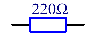
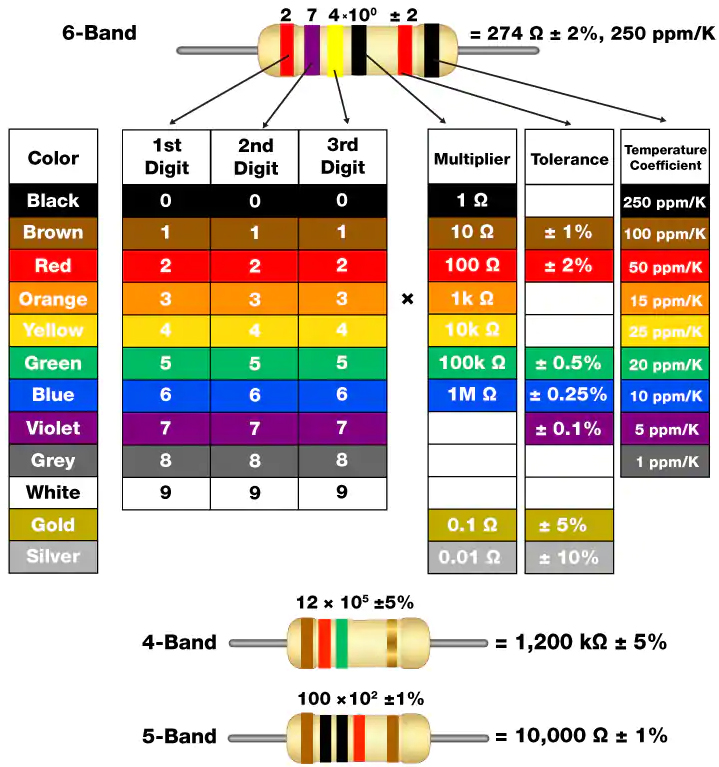
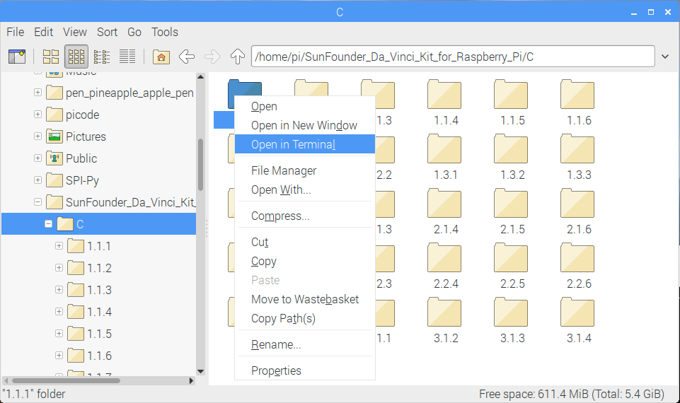
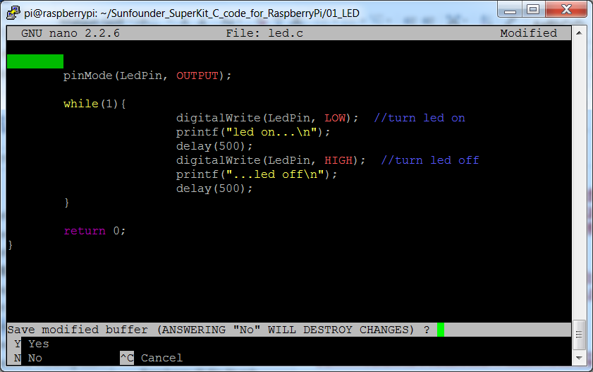

.. note::

    ¡Hola! Bienvenido a la comunidad de entusiastas de SunFounder para Raspberry Pi, Arduino y ESP32 en Facebook. Únete a otros apasionados y profundiza en el mundo de Raspberry Pi, Arduino y ESP32.

    **¿Por qué unirte?**

    - **Soporte Experto**: Resuelve problemas posventa y supera desafíos técnicos con el apoyo de nuestra comunidad y equipo.
    - **Aprende y Comparte**: Intercambia consejos y tutoriales para mejorar tus habilidades.
    - **Acceso Exclusivo**: Obtén acceso anticipado a anuncios de nuevos productos y adelantos especiales.
    - **Descuentos Especiales**: Disfruta de descuentos exclusivos en nuestros productos más recientes.
    - **Promociones Festivas y Sorteos**: Participa en sorteos y promociones durante las festividades.

    👉 ¿Listo para explorar y crear con nosotros? Haz clic en [|link_sf_facebook|] y únete hoy.

1.1.1 LED Parpadeante
=========================

Introducción
-----------------

En esta lección, aprenderemos a hacer parpadear un LED mediante programación.
Con tus ajustes, tu LED puede producir una serie de efectos interesantes. ¡Manos a la obra!

Componentes
------------------

.. image:: img/blinking_led_list.png
    :width: 800
    :align: center

.. note::
    Para proceder sin problemas, necesitas contar con tu propia
    Raspberry Pi, tarjeta TF y fuente de alimentación para Raspberry Pi.

Principio
--------------

**Protoboard**

Una protoboard es una base de construcción para el prototipado de circuitos electrónicos. Se
usa para construir y probar circuitos rápidamente antes de finalizar cualquier diseño de circuito. 
Tiene muchos orificios en los que se pueden insertar componentes como ICs, resistencias y cables de puente. 
La protoboard permite conectar y retirar componentes fácilmente.

La imagen muestra la estructura interna de una protoboard completa. Aunque
estos orificios en la protoboard parecen independientes entre sí,
en realidad están conectados mediante tiras de metal internamente.

.. image:: img/image41.png

**LED**

El LED es un tipo de diodo. Solo brillará si el pin largo del LED está
conectado al electrodo positivo y el pin corto está conectado al electrodo negativo.

|image42|\ |image43|

El LED no se puede conectar directamente a la fuente de alimentación, lo cual podría dañar
el componente. Se debe conectar una resistencia de 160Ω o mayor (funcionando a 5V) en
serie en el circuito del LED.

**Resistencia**

La resistencia es un componente electrónico que puede limitar la corriente en una rama del circuito. Una
resistencia fija es un tipo de resistencia cuyo valor no puede cambiarse, mientras que el de un potenciómetro
o resistencia variable sí se puede ajustar.

En este kit se utiliza una resistencia fija. En el circuito, es esencial para proteger
los componentes conectados. Las siguientes imágenes muestran una resistencia de 220Ω
y dos símbolos de circuito comúnmente utilizados. Ω es la unidad de resistencia y las unidades mayores incluyen KΩ,
MΩ, etc. Su relación es: 1 MΩ=1000 KΩ, 1 KΩ = 1000 Ω. Normalmente, el valor de resistencia se marca en ella.
Así que si ves estos símbolos en un circuito, significa que hay una resistencia.

|image45|\ |image46|

Al usar una resistencia, necesitamos saber su valor de resistencia. Aquí hay dos métodos:
observar las bandas en la resistencia o usar un multímetro para medir la resistencia.
Se recomienda el primer método por ser más conveniente y rápido. Para medir el valor, usa un multímetro.
Como se muestra en la tarjeta, cada color representa un número.

Diagrama Esquemático
------------------------

En este experimento, conecta una resistencia de 220Ω al ánodo (el pin largo del LED),
luego conecta la resistencia a 3.3 V y conecta el cátodo (el pin corto) del LED a GPIO17 de Raspberry Pi. 
Por lo tanto, para encender un LED, necesitamos configurar GPIO17 en nivel bajo (0V). 
Podemos lograr esto mediante programación.

.. note::

    **Pin11** se refiere al 11º pin de la Raspberry Pi de izquierda a derecha, y sus correspondientes números de pin en **wiringPi** y **BCM** se muestran en la siguiente tabla.

En el contenido relacionado con el lenguaje C, hacemos que GPIO0 sea 
equivalente a 0 en wiringPi. En el contenido relacionado con el lenguaje 
Python, BCM 17 es 17 en la columna BCM de la siguiente tabla. Al mismo tiempo, 
es el mismo que el 11º pin en la Raspberry Pi, Pin 11.

============ ======== ======== ====
T-Board Name physical wiringPi BCM
GPIO17       Pin 11   0        17
============ ======== ======== ====

Procedimientos Experimentales
---------------------------------

**Paso 1:** Construye el circuito.

.. image:: img/image49.png
    :width: 800
    :align: center

Para Usuarios del Lenguaje C
^^^^^^^^^^^^^^^^^^^^^^^^^^^^^^^^^^

**Paso 2:** Dirígete a la carpeta del código.

1) Si usas una pantalla, te recomendamos seguir los siguientes pasos.

Ve a **~/** y encuentra la carpeta **davinci-kit-for-raspberry-pi**.

Encuentra **C** en la carpeta, haz clic derecho sobre ella y selecciona **Abrir en Terminal**.

Aparecerá una ventana como se muestra a continuación. Ahora has ingresado en la ruta del código **1.1.1_BlinkingLed.c**.

.. image:: img/image51.png
    :width: 800
    :align: center

En las lecciones siguientes, usaremos el comando para acceder al archivo de 
código en lugar de hacer clic derecho. Pero puedes elegir el método que prefieras.

2) Si inicias sesión en la Raspberry Pi de forma remota, usa ``cd`` para cambiar de directorio:

.. raw:: html

   <run></run>

.. code-block::

   cd ~/davinci-kit-for-raspberry-pi/c/1.1.1/

.. note::
    Cambia el directorio a la ruta del código en este experimento mediante cd.

De cualquier manera, ahora estás en la carpeta C. Los procedimientos posteriores 
basados en estos dos métodos son los mismos. Continuemos.

**Paso 3:** Compila el código

.. raw:: html

   <run></run>

.. code-block::

   gcc 1.1.1_BlinkingLed.c -o BlinkingLed -lwiringPi

.. note::
    gcc es la Colección de Compiladores de GNU. Aquí, funciona como compilador 
    para el archivo en lenguaje C *1_BlinkingLed.c* y produce un archivo 
    ejecutable.

En el comando, ``-o`` significa salida (el carácter inmediatamente después de 
-o es el nombre del archivo generado tras la compilación, y aquí se creará un 
ejecutable llamado ``BlinkingLed``) y ``-lwiringPi`` es para cargar la biblioteca 
wiringPi (``l`` es la abreviatura de biblioteca).

**Paso 4:** Ejecuta el archivo ejecutable generado en el paso anterior.

.. raw:: html

   <run></run>

.. code-block::

   sudo ./BlinkingLed

.. note::

   Para controlar el GPIO, necesitas ejecutar el programa con el comando 
   sudo (superuser do). El comando ``./`` indica el directorio actual. 
   Todo el comando ejecuta el archivo ``BlinkingLed`` en el directorio actual.

.. image:: img/image52.png
    :width: 800
    :align: center

Después de ejecutar el código, verás el LED parpadeando.

.. note::

   Si no funciona después de ejecutarlo o aparece un error: \"wiringPi.h: No such file or directory\", consulta :ref:`C code is not working?`.

Si deseas editar el archivo de código ``1.1.1_BlinkingLed.c``, presiona 
``Ctrl + C`` para detener la ejecución del código. Luego escribe el siguiente 
comando para abrirlo:

.. raw:: html

   <run></run>

.. code-block::

   nano 1.1.1_BlinkingLed.c

.. note::
    nano es una herramienta de edición de texto. El comando se usa para abrir 
    el archivo de código ``1.1.1_BlinkingLed.c`` con esta herramienta.

Presiona ``Ctrl+X`` para salir. Si has modificado el código, aparecerá un mensaje 
preguntando si deseas guardar los cambios. Escribe ``Y`` (guardar) o ``N`` (no guardar). 
Luego presiona ``Enter`` para salir. Repite ``Paso 3`` y ``Paso 4`` para ver el efecto tras modificar.

**Código**

El código del programa se muestra a continuación:

.. code-block:: c

   #include <wiringPi.h>  
   #include <stdio.h>
   #define LedPin      0
   int main(void)
   {
      // Si falla la inicialización de wiring, imprime un mensaje en la pantalla
      if(wiringPiSetup() == -1){
         printf("setup wiringPi failed !");
         return 1;
      }
      pinMode(LedPin, OUTPUT); // Configura LedPin como salida para escribir valor en él.
      while(1){
         // LED encendido
         digitalWrite(LedPin, LOW);
         printf("...LED on\n");
         delay(500);
         // LED apagado
         digitalWrite(LedPin, HIGH);
         printf("LED off...\n");
         delay(500);
      }
      return 0;
   }

**Explicación del Código**

.. code-block:: c

   include <wiringPi.h>

La biblioteca de control de hardware está diseñada para el lenguaje C de 
Raspberry Pi. Agregar esta biblioteca facilita la inicialización del hardware 
y la salida de puertos de E/S, PWM, etc.

.. code-block:: c

   #include <stdio.h>

Biblioteca estándar de E/S. La función printf, utilizada para imprimir los 
datos en pantalla, está implementada en esta biblioteca. Existen muchas otras 
funciones útiles que puedes explorar.

.. code-block:: c

   #define LedPin 0

El pin GPIO17 de la placa de extensión T corresponde a GPIO0 en wiringPi. 
Asigna GPIO0 a LedPin, y LedPin representará GPIO0 en el código más adelante.

.. code-block:: c

    if(wiringPiSetup() == -1){
        printf("setup wiringPi failed !");
        return 1;

Esta línea inicializa wiringPi y asume que el programa en uso empleará el 
esquema de numeración de pines de wiringPi.

Esta función necesita ser llamada con privilegios de root. Cuando la 
inicialización de wiring falla, imprime un mensaje en la pantalla. 
La función "return" se usa para salir de la función actual. Utilizar 
"return" en main() finalizará el programa.

.. code-block:: c

   pinMode(LedPin, OUTPUT);

Configura LedPin como salida para poder escribir un valor en él.

.. code-block:: c

   digitalWrite(LedPin, LOW);

Configura GPIO0 a 0V (nivel bajo). Dado que el cátodo del LED está conectado 
a GPIO0, el LED se encenderá si GPIO0 está en bajo. Por el contrario, al 
configurar GPIO0 en nivel alto con digitalWrite(LedPin, HIGH), el LED se apagará.

.. code-block:: c

   printf("...LED off\n");

La función printf es una función estándar de la biblioteca y su prototipo 
está en el archivo de encabezado "stdio.h". La forma general de la llamada 
es: printf("cadena de control de formato", columnas de salida). La cadena 
de control de formato especifica el formato de salida y se divide en cadena 
con formato y sin formato. La cadena con formato empieza con '%' seguido de 
caracteres de formato, como '%d' para salida de enteros decimales. 
Las cadenas sin formato se imprimen como están. Aquí se usa una cadena sin 
formato, seguida de "\n", un carácter de nueva línea que indica un salto de 
línea automático después de imprimir la cadena.

.. code-block:: c

   delay(500);

Delay (500) mantiene el estado actual en ALTO o BAJO durante 500 ms.

Esta función pausa el programa por un período de tiempo. La velocidad del 
programa está determinada por el hardware. Aquí encendemos o apagamos el LED. 
Sin la función de retardo, el programa ejecutaría rápidamente el ciclo completo, 
por lo que necesitamos esta función para ayudarnos a escribir y depurar el programa.

.. code-block:: c

   return 0;

Generalmente, se coloca al final de la función principal, indicando que la función devuelve 0 tras una ejecución exitosa.

Para Usuarios de Python
^^^^^^^^^^^^^^^^^^^^^^^^^^^^^^

**Paso 2:** Ve a la carpeta del código y ejecútalo.

1. Si utilizas una pantalla, se recomienda seguir estos pasos:

Busca **1.1.1_BlinkingLed.py** y haz doble clic para abrirlo. Ahora estás en el archivo.

Haz clic en **Run** -> **Run Module** en la ventana, y aparecerán los siguientes contenidos.

Para detener la ejecución, haz clic en el botón X en la esquina superior 
derecha para cerrarlo, y regresarás al código. Si modificas el código, 
antes de hacer clic en **Run Module (F5)**, asegúrate de guardarlo primero. 
Luego podrás ver los resultados.

2. Si accedes a la Raspberry Pi de forma remota, escribe el siguiente comando:

.. raw:: html

   <run></run>

.. code-block::

   cd ~/davinci-kit-for-raspberry-pi/python

.. note::
    Cambia el directorio a la ruta del código de este experimento mediante ``cd``.

**Paso 3:** Ejecuta el código

.. raw:: html

   <run></run>

.. code-block::

   sudo python3 1.1.1_BlinkingLed.py

.. note::
    Aquí, sudo - superuser do, y python indica que el archivo se ejecuta con Python.

Al ejecutar el código, verás que el LED parpadea.

**Paso 4:** Si deseas editar el archivo de código 1.1.1_BlinkingLed.py,
presiona ``Ctrl + C`` para detener la ejecución del código. Luego escribe 
el siguiente comando para abrir 1.1.1_BlinkingLed.py:

.. raw:: html

   <run></run>

.. code-block::

   nano 1.1.1_BlinkingLed.py

.. note::
    nano es una herramienta de edición de texto. El comando se utiliza para 
    abrir el archivo de código 1.1.1_BlinkingLed.py con esta herramienta.

Presiona ``Ctrl+X`` para salir. Si has modificado el código, aparecerá un 
mensaje preguntando si deseas guardar los cambios. Escribe ``Y`` (guardar) o ``N`` (no guardar).

Luego presiona ``Enter`` para salir. Escribe nuevamente ``nano 1.1.1_BlinkingLed.py`` para ver el efecto tras el cambio.

**Código**

.. note::

   Puedes **Modificar/Restablecer/Copiar/Ejecutar/Detener** el código a continuación. Pero antes de eso, debes dirigirte a la ruta del código fuente como ``davinci-kit-for-raspberry-pi/python``.

.. raw:: html

   <run></run>

.. code-block:: python

   import RPi.GPIO as GPIO
   import time
   LedPin = 17
   def setup():
      # Configura el modo GPIO en numeración BCM
      GPIO.setmode(GPIO.BCM)
      # Configura LedPin como salida y nivel inicial en alto (3.3V)
      GPIO.setup(LedPin, GPIO.OUT, initial=GPIO.HIGH)
   # Define la función principal para el proceso principal
   def main():
      while True:
         print ('...LED ON')
         # Enciende el LED
         GPIO.output(LedPin, GPIO.LOW)
         time.sleep(0.5)
         print ('LED OFF...')
         # Apaga el LED
         GPIO.output(LedPin, GPIO.HIGH)
         time.sleep(0.5)
   # Define la función destroy para limpiar todo después de finalizar el script
   def destroy():
      # Apaga el LED
      GPIO.output(LedPin, GPIO.HIGH)
      # Libera recursos
      GPIO.cleanup()                   
   # Si se ejecuta este script directamente, haz lo siguiente:
   if __name__ == '__main__':
      setup()
      try:
         main()
      # Cuando se presiona 'Ctrl+C', el programa ejecutará destroy().
      except KeyboardInterrupt:
         destroy()

**Explicación del Código**

.. code-block:: python

   #!/usr/bin/env python3

Cuando el sistema detecta esto, buscará la ruta de instalación de Python 
en la configuración de env y luego llamará al intérprete correspondiente 
para completar la operación. Esto evita que el usuario no instale Python 
en la ruta predeterminada /usr/bin.

.. code-block:: python

   import RPi.GPIO as GPIO

De esta manera, se importa la biblioteca RPi.GPIO, luego se define una 
variable, GPIO, para reemplazar RPI.GPIO en el código siguiente.

.. code-block:: python

   import time

Importa el paquete time, para funciones de retardo de tiempo en el programa siguiente.

.. code-block:: python

   LedPin = 17

El LED se conecta al GPIO17 de la placa de extensión en forma de T, es decir, BCM 17.

.. code-block:: python

   def setup():
      GPIO.setmode(GPIO.BCM)
      GPIO.setup(LedPin, GPIO.OUT, initial=GPIO.HIGH)

Configura LedPin en modo de salida y nivel inicial en alto (3.3V).

Hay dos maneras de numerar los pines IO en una Raspberry Pi dentro de RPi.GPIO: 
números BOARD y números BCM. En nuestras lecciones, utilizamos números BCM. 
Debes configurar cada canal que estás usando como entrada o salida.

.. code-block:: python

   GPIO.output(LedPin, GPIO.LOW)

Configura GPIO17 (BCM17) en 0V (nivel bajo). Como el cátodo del LED está 
conectado a GPIO17, el LED se encenderá.

.. code-block:: python

   time.sleep(0.5)

Retrasa 0.5 segundos. Aquí, la declaración es una función de retardo en lenguaje C, la unidad es segundos.

.. code-block:: python

   def destroy():
      GPIO.cleanup()  

Define una función destroy para limpiar todo después de que el script termine.

.. code-block:: python

   if __name__ == '__main__':
      setup()
      try:
         main()
      # Cuando se presiona 'Ctrl+C', el programa destroy() será ejecutado.
      except KeyboardInterrupt:
         destroy()

Esta es la estructura general de ejecución del código. Cuando el programa 
comienza a ejecutarse, inicializa el pin ejecutando setup(), y luego ejecuta 
el código en la función main() para establecer el pin en niveles altos y bajos. 
Cuando se presiona 'Ctrl+C', el programa ejecutará destroy().

Imagen del Fenómeno
-----------------------

.. image:: img/image54.jpeg
    :width: 800
    :align: center