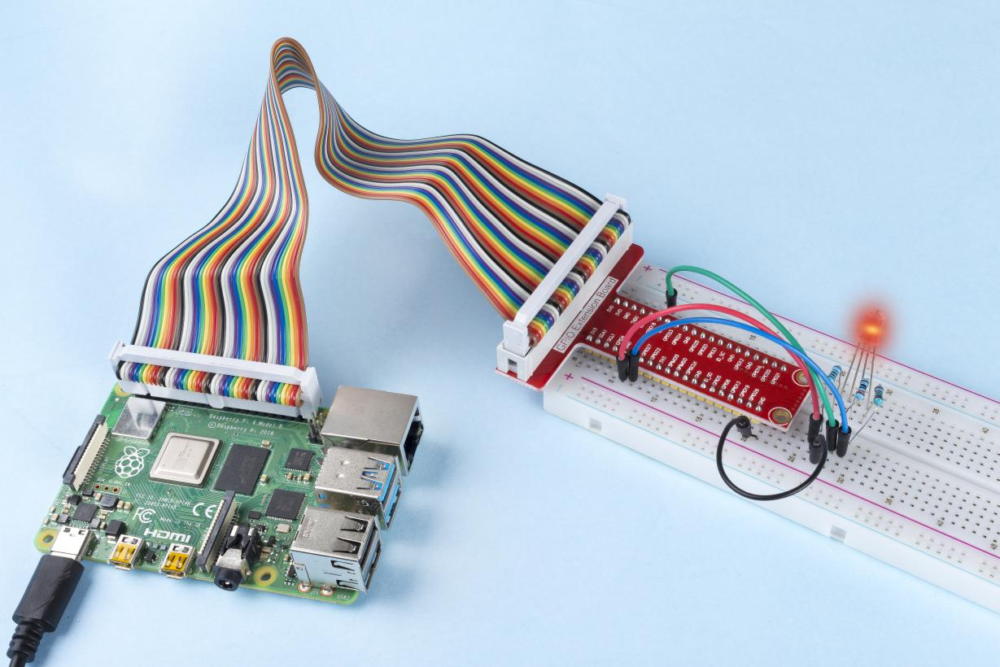

.. note::

    Bonjour et bienvenue dans la communauté SunFounder Raspberry Pi & Arduino & ESP32 Enthusiasts sur Facebook ! Plongez plus profondément dans l'univers de Raspberry Pi, Arduino et ESP32 avec d'autres passionnés.

    **Pourquoi nous rejoindre ?**

    - **Support d'experts** : Résolvez vos problèmes après-vente et vos défis techniques avec l'aide de notre communauté et de notre équipe.
    - **Apprenez et partagez** : Échangez des astuces et des tutoriels pour améliorer vos compétences.
    - **Aperçus exclusifs** : Profitez d'un accès anticipé aux annonces de nouveaux produits et aux avant-premières.
    - **Réductions exclusives** : Bénéficiez de réductions sur nos derniers produits.
    - **Promotions festives et cadeaux** : Participez à des promotions et à des cadeaux lors des fêtes.

    👉 Prêt à explorer et à créer avec nous ? Cliquez sur [|link_sf_facebook|] et rejoignez-nous dès aujourd'hui !

1.1.2 RGB LED
====================

Introduction
---------------

Dans cette leçon, nous allons apprendre à contrôler une LED RVB pour afficher différentes couleurs.

Composants
-------------

.. image:: img/list_rgb_led.png
    :align: center

Principe
-----------

**PWM**

Le Pulse Width Modulation (PWM) est une technique permettant d'obtenir des 
résultats analogiques à partir de moyens numériques. Le contrôle numérique crée 
une onde carrée, un signal alternant entre allumé et éteint. Ce motif allumé-éteint 
peut simuler des tensions intermédiaires entre complètement allumé (5 Volts) et éteint
 (0 Volts) en changeant la durée pendant laquelle le signal reste allumé par rapport à 
 la durée pendant laquelle il est éteint. La durée pendant laquelle le signal est actif 
 est appelée largeur d'impulsion. Pour obtenir des valeurs analogiques variables, vous 
 modifiez cette largeur. Si vous répétez ce motif assez rapidement, par exemple avec une 
 LED, le résultat sera une tension stable entre 0 et 5V contrôlant la luminosité de la LED.

**Cycle de service**

Le cycle de service est le pourcentage d'une période pendant laquelle un signal est actif. 
Une période est le temps nécessaire pour compléter un cycle allumé-éteint. En formule, un 
cycle de service peut s'exprimer comme suit :

.. image:: img/image56.png
   :width: 1.16667in
   :height: 0.36458in
   :align: center

Où **D** représente le cycle de service, **T** est le temps où le signal est actif, et **P** 
est la période totale du signal. Ainsi, un cycle de service de 60 % signifie que le signal 
est actif pendant 60 % du temps, et inactif 40 % du temps.

.. image:: img/image57.jpeg
   :width: 4.325in
   :height: 5.49167in
   :align: center

**LED RVB**

.. image:: img/rgb_led_sch.png
    :width: 500
    :align: center

Les trois couleurs primaires de la LED RVB peuvent être combinées en différentes couleurs 
en ajustant leur luminosité. La luminosité de chaque LED peut être ajustée via le PWM. Le 
Raspberry Pi n'a qu'un canal pour la sortie PWM matérielle, mais il en faut trois pour 
contrôler la LED RVB. Heureusement, la bibliothèque softPwm simule le PWM par programmation. 
Il vous suffit d'inclure le fichier d'en-tête softPwm.h (pour les utilisateurs du langage C), 
puis d'appeler les API fournies pour contrôler facilement la LED RVB via plusieurs canaux 
de sortie PWM, ce qui permet d'afficher toutes sortes de couleurs.

Schéma de câblage
-----------------

Après avoir connecté les broches R, G et B à une résistance de limitation de courant, 
connectez-les respectivement aux GPIO17, GPIO18 et GPIO27. La broche la plus longue de 
la LED (GND) se connecte au GND du Raspberry Pi. Lorsque les trois broches reçoivent 
des valeurs PWM différentes, la LED RVB affiche différentes couleurs.

============ ======== ======== ===
T-Board Name physical wiringPi BCM
GPIO17       Pin 11   0        17
GPIO18       Pin 12   1        18
GPIO27       Pin 13   2        27
============ ======== ======== ===

.. image:: img/rgb_led_schematic.png

Procédures expérimentales
-----------------------------

**Étape 1 :** Construisez le circuit.

.. image:: img/image61.png
   :width: 6.59097in
   :height: 4.29722in

Pour les utilisateurs du langage C
^^^^^^^^^^^^^^^^^^^^^^^^^^^^^^^^^^^^^^^^

**Étape 2 :** Accédez au dossier du code.

.. raw:: html

   <run></run>

.. code-block::

    cd ~/davinci-kit-for-raspberry-pi/c/1.1.2/

**Étape 3 :** Compilez le code.

.. raw:: html

   <run></run>

.. code-block::

    gcc 1.1.2_rgbLed.c -lwiringPi

.. note::

    Lorsque la commande "gcc" est exécutée, si l'option "-o" n'est pas appelée, le fichier exécutable sera nommé "a.out".

**Étape 4 :** Exécutez le fichier exécutable.

.. raw:: html

   <run></run>

.. code-block::

    sudo ./a.out

Après l'exécution du code, vous verrez que la LED RVB affiche les couleurs rouge, 
verte, bleue, jaune, rose et cyan.

.. note::

    Si cela ne fonctionne pas après l'exécution, ou s'il y a un message d'erreur comme 
    "wiringPi.h: No such file or directory", veuillez consulter :ref:`C code is not working?`.

**Code**

.. code-block:: c

    #include <wiringPi.h>
    #include <softPwm.h>
    #include <stdio.h>
    #define uchar unsigned char
    #define LedPinRed    0
    #define LedPinGreen  1
    #define LedPinBlue   2

    void ledInit(void){
        softPwmCreate(LedPinRed,  0, 100);
        softPwmCreate(LedPinGreen,0, 100);
        softPwmCreate(LedPinBlue, 0, 100);
    }

    void ledColorSet(uchar r_val, uchar g_val, uchar b_val){
        softPwmWrite(LedPinRed,   r_val);
        softPwmWrite(LedPinGreen, g_val);
        softPwmWrite(LedPinBlue,  b_val);
    }

    int main(void){

        if(wiringPiSetup() == -1){ // Si l'initialisation de wiring échoue, afficher un message à l'écran
            printf("setup wiringPi failed !");
            return 1;
        }

        ledInit();
        while(1){
            printf("Red\n");
            ledColorSet(0xff,0x00,0x00);   //red     
            delay(500);
            printf("Green\n");
            ledColorSet(0x00,0xff,0x00);   //green
            delay(500);
            printf("Blue\n");
            ledColorSet(0x00,0x00,0xff);   //blue
            delay(500);
            printf("Yellow\n");
            ledColorSet(0xff,0xff,0x00);   //yellow
            delay(500);
            printf("Purple\n");
            ledColorSet(0xff,0x00,0xff);   //purple
            delay(500);
            printf("Cyan\n");
            ledColorSet(0xc0,0xff,0x3e);   //cyan
            delay(500);
        }
        return 0;
    }

**Explication du code**

.. code-block:: c

    #include <softPwm.h>

Bibliothèque utilisée pour réaliser la fonction PWM par logiciel.

.. code-block:: c

    void ledInit(void){
        softPwmCreate(LedPinRed,  0, 100);
        softPwmCreate(LedPinGreen,0, 100);
        softPwmCreate(LedPinBlue, 0, 100);
    }

Cette fonction utilise le logiciel pour créer une broche PWM et définit sa période entre 100us et 10000us.

Le prototype de la fonction softPwmCreate(LedPinRed, 0, 100) est le suivant :

.. code-block:: c

    int softPwmCreate(int pin, int initialValue, int pwmRange);

* **Paramètre pin :** Toute broche GPIO du Raspberry Pi peut être définie comme broche PWM.
* **Paramètre initialValue :** La largeur d'impulsion initiale est initialValue multiplié par 100us.
* **Paramètre pwmRange :** La période du PWM est pwmRange multiplié par 100us.

.. code-block:: c

    void ledColorSet(uchar r_val, uchar g_val, uchar b_val){
        softPwmWrite(LedPinRed,   r_val);
        softPwmWrite(LedPinGreen, g_val);
        softPwmWrite(LedPinBlue,  b_val);
    }

Cette fonction permet de définir les couleurs de la LED. En utilisant le modèle RVB, 
le paramètre formel **r_val** représente l'intensité du rouge, **g_val** celle du 
vert et **b_val** celle du bleu.

Le prototype de la fonction softPwmWrite(LedPinBlue, b_val) est le suivant :

.. code-block:: c

    void softPwmWrite (int pin, int value) ;

* **Paramètre pin :** Toute broche GPIO du Raspberry Pi peut être définie comme broche PWM.
* **Paramètre value :** La largeur d'impulsion du PWM est value multiplié par 100us. Notez que la valeur doit être inférieure à pwmRange défini précédemment ; si elle est supérieure, elle sera limitée à pwmRange.

.. code-block:: c

    ledColorSet(0xff,0x00,0x00);

Appelle la fonction définie précédemment. Écrire 0xff dans LedPinRed et 0x00 dans 
LedPinGreen et LedPinBlue. Seule la LED rouge s'allume après l'exécution de ce code. 
Si vous souhaitez allumer des LED d'autres couleurs, il suffit de modifier les paramètres.

Pour les utilisateurs du langage Python
^^^^^^^^^^^^^^^^^^^^^^^^^^^^^^^^^^^^^^^^^^^^^^

**Étape 2 :** Ouvrez le fichier de code.

.. raw:: html

   <run></run>

.. code-block::

    cd ~/davinci-kit-for-raspberry-pi/python

**Étape 3 :** Exécutez.

.. raw:: html

   <run></run>

.. code-block::

    sudo python3 1.1.2_rgbLed.py

Après l'exécution du code, vous verrez que la LED RVB affiche les couleurs 
rouge, verte, bleue, jaune, rose et cyan.

**Code**

.. note::

    Vous pouvez **Modifier/Réinitialiser/Copier/Exécuter/Arrêter** le code ci-dessous. Mais avant cela, vous devez accéder au chemin du code source tel que ``davinci-kit-for-raspberry-pi/python``.

.. raw:: html

    <run></run>

.. code-block:: python

    import RPi.GPIO as GPIO
    import time

    # Définir une table de couleurs en Hexadécimal
    COLOR = [0xFF0000, 0x00FF00, 0x0000FF, 0xFFFF00, 0xFF00FF, 0x00FFFF]
    # Définir les broches via un dictionnaire
    pins = {'Red':17, 'Green':18, 'Blue':27}

    def setup():
        global p_R, p_G, p_B
        # Définir les modes GPIO sur la numérotation BCM
        GPIO.setmode(GPIO.BCM)
        # Définir tous les modes LedPin sur la sortie et le niveau initial à High (3,3 V)
        for i in pins:
            GPIO.setup(pins[i], GPIO.OUT, initial=GPIO.HIGH)

        # Définir tous les LED en tant que canal PWM avec une fréquence de 2 kHz
        p_R = GPIO.PWM(pins['Red'], 2000)
        p_G = GPIO.PWM(pins['Green'], 2000)
        p_B = GPIO.PWM(pins['Blue'], 2000)

        # Initialiser toutes les LED avec une valeur de 0
        p_R.start(0)
        p_G.start(0)
        p_B.start(0)

    # Définir une fonction MAP pour mapper les valeurs. Par exemple de 0~255 à 0~100
    def MAP(x, in_min, in_max, out_min, out_max):
        return (x - in_min) * (out_max - out_min) / (in_max - in_min) + out_min

    # Définir une fonction pour configurer les couleurs
    # l'entrée doit être en hexadécimal avec des valeurs pour rouge, bleu et vert.
    def setColor(color):
        # Configure la luminosité des trois LED en fonction de la valeur de couleur donnée.
        # Décomposer les couleurs à partir de la variable 'color'
        R_val = (color & 0xFF0000) >> 16
        G_val = (color & 0x00FF00) >> 8
        B_val = (color & 0x0000FF) >> 0
        # Ces lignes analysent la variable de couleur en attribuant les deux premières valeurs au rouge,
        # les deux du milieu au vert, et les deux dernières au bleu (opérations de décalage).

        # Mapper les valeurs de couleur de 0~255 à 0~100
        R_val = MAP(R_val, 0, 255, 0, 100)
        G_val = MAP(G_val, 0, 255, 0, 100)
        B_val = MAP(B_val, 0, 255, 0, 100)

        # Changer les couleurs
        p_R.ChangeDutyCycle(R_val)
        # Assigner la valeur mappée du cycle de service au canal PWM correspondant pour changer la luminosité.
        p_G.ChangeDutyCycle(G_val)
        p_B.ChangeDutyCycle(B_val)

        print ("color_msg: R_val = %s,	G_val = %s,	B_val = %s"%(R_val, G_val, B_val))	 

    def main():
        while True:
            for color in COLOR: # Affecter chaque élément de la liste COLOR respectivement et changer la couleur de la LED RVB via la fonction setColor().
                setColor(color) # Changer la couleur de la LED RVB
                time.sleep(0.5) # Fixer un délai de 0,5s après chaque changement de couleur. Modifier ce paramètre modifie la vitesse de changement des couleurs de la LED.

    def destroy():
        # Arrêter tous les canaux PWM
        p_R.stop()
        p_G.stop()
        p_B.stop()
        # Libérer les ressources
        GPIO.cleanup()

    # Si ce script est exécuté directement, faire :
    if __name__ == '__main__':
        setup()
        try:
            main()
        # Lorsque 'Ctrl+C' est pressé, la fonction destroy() sera exécutée.
        except KeyboardInterrupt:
            destroy()

**Explication du code**

.. code-block:: python

    p_R = GPIO.PWM(pins['Red'], 2000)
    p_G = GPIO.PWM(pins['Green'], 2000)
    p_B = GPIO.PWM(pins['Blue'], 2000)

    p_R.start(0)
    p_G.start(0)
    p_B.start(0)

Appeler la fonction GPIO.PWM() pour définir les broches Rouge, Vert et Bleu en 
tant que broches PWM et fixer la fréquence à 2000 Hz. Ensuite, utiliser la fonction 
Start() pour définir le cycle de service initial à zéro.

.. code-block:: python

    def MAP(x, in_min, in_max, out_min, out_max):
        return (x - in_min) * (out_max - out_min) / (in_max - in_min) + out_min

Définir une fonction MAP pour mapper les valeurs. Par exemple, si x=50, in_min=0, 
in_max=255, out_min=0, out_max=100, la fonction renverra 19,6.

.. code-block:: python

    def setColor(color):
        R_val = (color & 0xFF0000) >> 16
        G_val = (color & 0x00FF00) >> 8
        B_val = (color & 0x0000FF) >> 0

Configurer la luminosité des trois LED avec la valeur de couleur donnée. 
Par exemple, si color=0xFF00FF, R_val=（0xFF00FF & 0xFF0000）>> 16 = 0xFF, 
G_val = 0x00, B_val=0xFF.

.. code-block:: python

    R_val = MAP(R_val, 0, 255, 0, 100)
    G_val = MAP(G_val, 0, 255, 0, 100)
    B_val = MAP(B_val, 0, 255, 0, 100)

Utiliser la fonction MAP pour convertir les valeurs RVB entre 0~255 en une plage 
de cycle de service PWM de 0 à 100.

.. code-block:: python

    p_R.ChangeDutyCycle(R_val) 
    p_G.ChangeDutyCycle(G_val)
    p_B.ChangeDutyCycle(B_val)

Affecter la valeur mappée du cycle de service au canal PWM correspondant pour 
changer la luminosité.

.. code-block:: python

    for color in COLOR:
        setColor(color)
        time.sleep(0.5)

Affecter chaque élément de la liste COLOR à la variable color et changer la 
couleur de la LED RVB via la fonction setColor().

Image du phénomène
----------------------

