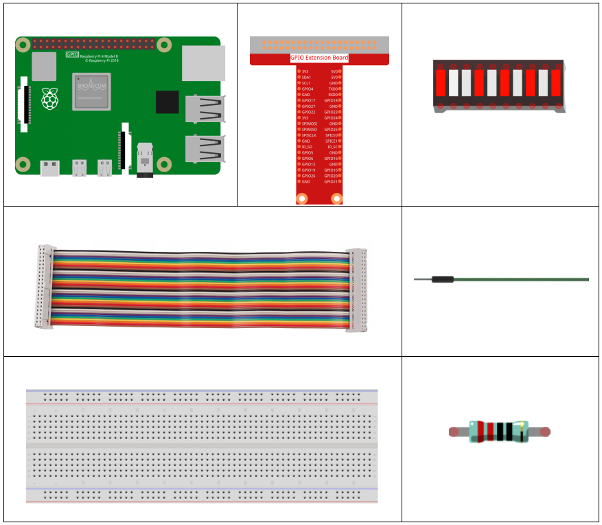
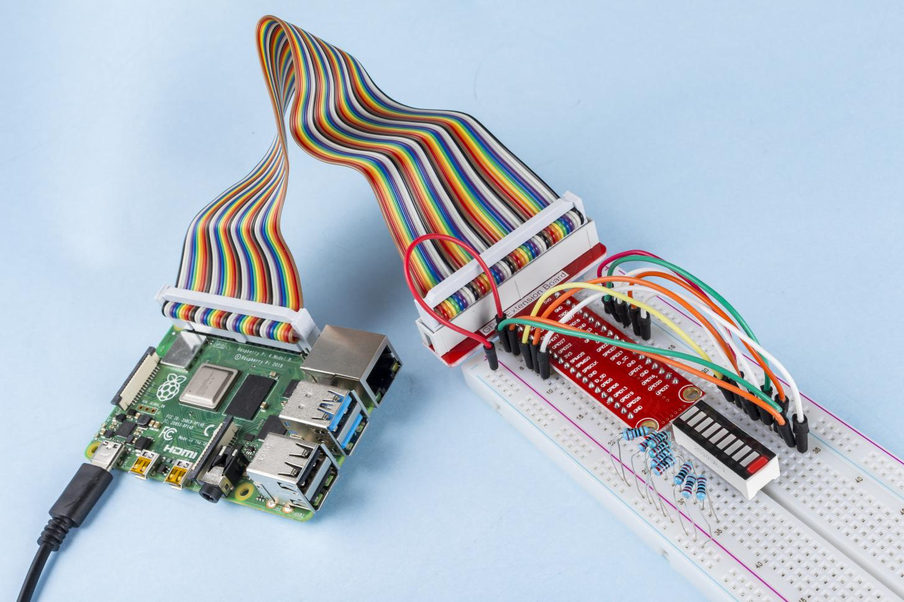

1.1.3 LED Bar Graph
======================

Introduction
-------------

In this project, we sequentially illuminate the lights on the LED Bar
Graph.

Components
----------------

Principle
--------------

**LED Bar Graph**

LED Bar Graph is an LED array, which is used to connect with electronic
circuit or microcontroller. It’s easy to connect LED bar graph with the
circuit like as connecting 10 individual LEDs with 10 output pins.
Generally we can use the LED bar graph as a Battery level Indicator,
Audio equipments, and Industrial Control panels. There are many other
applications of LED bar graphs.

.. image:: media/led_bar_sche.png

Schematic Diagram
-------------------------

============ ======== ======== ===
T-Board Name physical wiringPi BCM
GPIO17       Pin 11   0        17
GPIO18       Pin 12   1        18
GPIO27       Pin 13   2        27
GPIO22       Pin 15   3        22
GPIO23       Pin 16   4        23
GPIO24       Pin 18   5        24
GPIO25       Pin 22   6        25
SDA1         Pin 3    8        2
SCL1         Pin 5    9        3
SPICE0       Pin 24   10       8
============ ======== ======== ===

.. image:: media/schematic_led_bar.png

Experimental Procedures
------------------------------

**Step 1**: Build the circuit.

.. image:: media/image66.png

For C Language Users
^^^^^^^^^^^^^^^^^^^^^^^^^

**Step 2**: Go to the folder of the code.

.. raw:: html

   <run></run>

.. code-block::

    cd ~/davinci-kit-for-raspberry-pi/c/1.1.3/

**Step 3**: Compile the code.

.. raw:: html

   <run></run>

.. code-block::

    gcc 1.1.3_LedBarGraph.c -lwiringPi

**Step 4:** Run the executable file.

.. raw:: html

   <run></run>

.. code-block::

    sudo ./a.out

After the code runs, you will see the LEDs on the LED bar turn on and
off regularly.

**Code**

.. code-block:: c

    #include <wiringPi.h>
    #include <stdio.h>

    int pins[10] = {0,1,2,3,4,5,6,8,9,10};
    void oddLedBarGraph(void){
        for(int i=0;i<5;i++){
            int j=i*2;
            digitalWrite(pins[j],HIGH);
            delay(300);
            digitalWrite(pins[j],LOW);
        }
    }
    void evenLedBarGraph(void){
        for(int i=0;i<5;i++){
            int j=i*2+1;
            digitalWrite(pins[j],HIGH);
            delay(300);
            digitalWrite(pins[j],LOW);
        }
    }
    void allLedBarGraph(void){
        for(int i=0;i<10;i++){
            digitalWrite(pins[i],HIGH);
            delay(300);
            digitalWrite(pins[i],LOW);
        }
    }
    int main(void)
    {
        if(wiringPiSetup() == -1){ //when initialize wiring failed,print message to screen
            printf("setup wiringPi failed !");
            return 1;
        }
        for(int i=0;i<10;i++){       //make led pins' mode is output
            pinMode(pins[i], OUTPUT);
            digitalWrite(pins[i],LOW);
        }
        while(1){
            oddLedBarGraph();
            delay(300);
            evenLedBarGraph();
            delay(300);
            allLedBarGraph();
            delay(300);
        }
        return 0;
    }

**Code Explanation**

.. code-block:: c

    int pins[10] = {0,1,2,3,4,5,6,8,9,10};

Create an array and assign it to the pin number corresponding to the LED
Bar Graph (0,1,2,3,4,5,6,8,9,10) and the array will be used to control
the LED.

.. code-block:: c

    void oddLedBarGraph(void){
        for(int i=0;i<5;i++){
            int j=i*2;
            digitalWrite(pins[j],HIGH);
            delay(300);
            digitalWrite(pins[j],LOW);
        }
    }

Let the LED on the odd digit of the LED Bar Graph light on in turn.

.. code-block:: c

    void evenLedBarGraph(void){
        for(int i=0;i<5;i++){
            int j=i*2+1;
            digitalWrite(pins[j],HIGH);
            delay(300);
            digitalWrite(pins[j],LOW);
        }
    }

Make the LED on the even digit of the LED Bar Graph light on in turn.

.. code-block:: c

    void allLedBarGraph(void){
        for(int i=0;i<10;i++){
            digitalWrite(pins[i],HIGH);
            delay(300);
            digitalWrite(pins[i],LOW);
        }
    }

Let the LED on the LED Bar Graph light on one by one.

For Python Language Users
^^^^^^^^^^^^^^^^^^^^^^^^^^^^^

**Step 2:** Go to the folder of the code.

.. raw:: html

   <run></run>

.. code-block::

    cd /home/pi/davinci-kit-for-raspberry-pi/python/

**Step 3**: Run the executable file.

.. raw:: html

   <run></run>

.. code-block::

    sudo python3 1.1.3_LedBarGraph.py

After the code runs, you will see the LEDs on the LED bar turn on and
off regularly.

**Code**

.. code-block:: python

    import RPi.GPIO as GPIO
    import time

    ledPins = [11, 12, 13, 15, 16, 18, 22, 3, 5, 24]

    def oddLedBarGraph():
        for i in range(5):
            j = i*2
            GPIO.output(ledPins[j],GPIO.HIGH)
            time.sleep(0.3)
            GPIO.output(ledPins[j],GPIO.LOW)

    def evenLedBarGraph():
        for i in range(5):
            j = i*2+1
            GPIO.output(ledPins[j],GPIO.HIGH)
            time.sleep(0.3)
            GPIO.output(ledPins[j],GPIO.LOW)

    def allLedBarGraph():
        for i in ledPins:
            GPIO.output(i,GPIO.HIGH)
            time.sleep(0.3)
            GPIO.output(i,GPIO.LOW)

    def setup():
        GPIO.setwarnings(False)
        GPIO.setmode(GPIO.BOARD)        # Numbers GPIOs by physical location
        for i in ledPins:
            GPIO.setup(i, GPIO.OUT)   # Set all ledPins' mode is output
            GPIO.output(i, GPIO.LOW) # Set all ledPins to high(+3.3V) to off led

    def loop():
        while True:
            oddLedBarGraph()
            time.sleep(0.3)
            evenLedBarGraph()
            time.sleep(0.3)
            allLedBarGraph()
            time.sleep(0.3)

    def destroy():
        for pin in ledPins:
            GPIO.output(pin, GPIO.LOW)    # turn off all leds
        GPIO.cleanup()                     # Release resource

    if __name__ == '__main__':     # Program start from here
        setup()
        try:
            loop()
        except KeyboardInterrupt:  # When 'Ctrl+C' is pressed, the program destroy() will be  executed.
            destroy()

**Code Explanation**

ledPins = [11, 12, 13, 15, 16, 18, 22, 3, 5, 24]
Create an array and assign it to the pin number corresponding to the LED Bar Graph (11, 12, 13, 15, 16, 18, 22, 3, 5, 24) and the array will be used to control the LED.

.. code-block:: python

    def oddLedBarGraph():
        for i in range(5):
            j = i*2
            GPIO.output(ledPins[j],GPIO.HIGH)
            time.sleep(0.3)
            GPIO.output(ledPins[j],GPIO.LOW)

Let the LED on the odd digit of the LED Bar Graph light on in turn.

.. code-block:: python

    def evenLedBarGraph():
        for i in range(5):
            j = i*2+1
            GPIO.output(ledPins[j],GPIO.HIGH)
            time.sleep(0.3)
            GPIO.output(ledPins[j],GPIO.LOW)

Make the LED on the even digit of the LED Bar Graph light on in turn.

.. code-block:: python

    def allLedBarGraph():
        for i in ledPins:
            GPIO.output(i,GPIO.HIGH)
            time.sleep(0.3)
            GPIO.output(i,GPIO.LOW)

Let the LED on the LED Bar Graph light on one by one.

**Phenomenon Picture**

