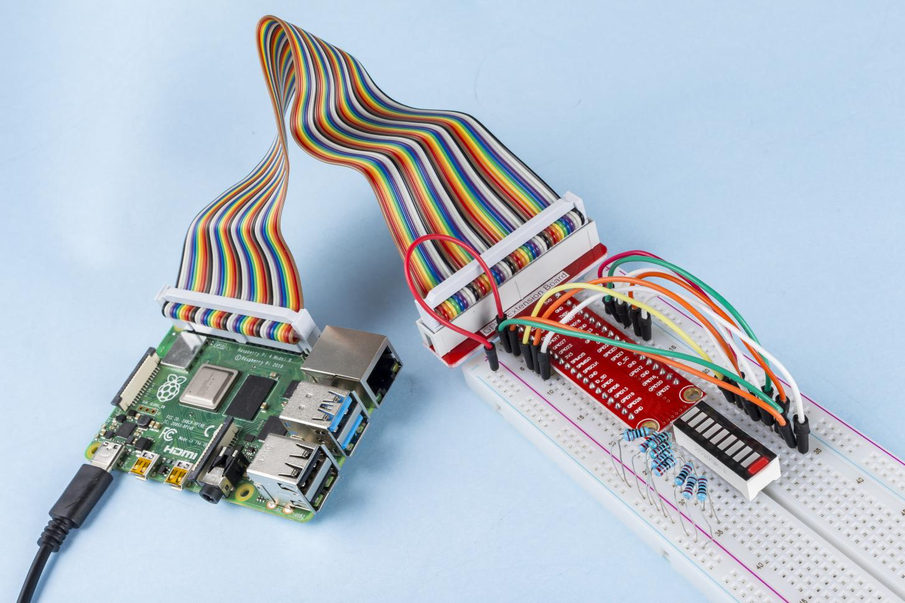

.. note::

    Ciao, benvenuto nella Community SunFounder per gli appassionati di Raspberry Pi, Arduino ed ESP32 su Facebook! Unisciti a noi per approfondire le tue conoscenze su Raspberry Pi, Arduino ed ESP32 insieme ad altri appassionati.

    **Perché unirsi?**

    - **Supporto esperto**: Risolvi problemi post-vendita e sfide tecniche con l'aiuto della nostra community e del nostro team.
    - **Impara e condividi**: Scambia suggerimenti e tutorial per migliorare le tue competenze.
    - **Anteprime esclusive**: Ottieni l'accesso anticipato agli annunci di nuovi prodotti.
    - **Sconti speciali**: Approfitta di sconti esclusivi sui nostri prodotti più recenti.
    - **Promozioni e giveaway**: Partecipa a giveaway e promozioni festive.

    👉 Pronto a esplorare e creare con noi? Clicca [|link_sf_facebook|] e unisciti oggi stesso!

1.1.3 Barra LED
======================

Introduzione
--------------

In questo progetto, illumineremo i LED della barra uno alla volta in modo sequenziale.

Componenti
-----------

.. image:: img/list_led_bar.png

Principio
----------

**Barra LED**

La Barra LED è una matrice di LED, utile per collegarsi a circuiti 
elettronici o microcontrollori. È semplice collegare una barra LED 
al circuito come si farebbe con 10 LED individuali collegati a 10 pin 
di uscita. Le barre LED sono comunemente usate come indicatori di 
livello della batteria, in attrezzature audio e nei pannelli di controllo 
industriale, ma le applicazioni sono molteplici.

.. image:: img/led_bar_sche.png

Schema Elettrico
--------------------

============ ======== ======== ===
T-Board Name physical wiringPi BCM
GPIO17       Pin 11   0        17
GPIO18       Pin 12   1        18
GPIO27       Pin 13   2        27
GPIO22       Pin 15   3        22
GPIO23       Pin 16   4        23
GPIO24       Pin 18   5        24
GPIO25       Pin 22   6        25
SDA1         Pin 3    8        2
SCL1         Pin 5    9        3
SPICE0       Pin 24   10       8
============ ======== ======== ===

.. image:: img/schematic_led_bar.png

Procedura Sperimentale
-------------------------

**Passo 1**: Montare il circuito.

.. image:: img/image66.png
    :width: 800

Per Utenti C
^^^^^^^^^^^^^^^

**Passo 2**: Vai alla cartella del codice.

.. raw:: html

   <run></run>

.. code-block::

    cd ~/davinci-kit-for-raspberry-pi/c/1.1.3/

**Passo 3**: Compilare il codice.

.. raw:: html

   <run></run>

.. code-block::

    gcc 1.1.3_LedBarGraph.c -lwiringPi

**Passo 4:** Esegui il file eseguibile.

.. raw:: html

   <run></run>

.. code-block::

    sudo ./a.out

Dopo l’esecuzione del codice, vedrai i LED della barra LED accendersi e 
spegnersi regolarmente.

.. note::

    Se non funziona o appare un errore tipo: \"wiringPi.h: No such file or directory", consulta :ref:`Il codice C non funziona?`.
    
**Codice**

.. code-block:: c

    #include <wiringPi.h>
    #include <stdio.h>

    int pins[10] = {0,1,2,3,4,5,6,8,9,10};
    void oddLedBarGraph(void){
        for(int i=0;i<5;i++){
            int j=i*2;
            digitalWrite(pins[j],HIGH);
            delay(300);
            digitalWrite(pins[j],LOW);
        }
    }
    void evenLedBarGraph(void){
        for(int i=0;i<5;i++){
            int j=i*2+1;
            digitalWrite(pins[j],HIGH);
            delay(300);
            digitalWrite(pins[j],LOW);
        }
    }
    void allLedBarGraph(void){
        for(int i=0;i<10;i++){
            digitalWrite(pins[i],HIGH);
            delay(300);
            digitalWrite(pins[i],LOW);
        }
    }
    int main(void)
    {
        if(wiringPiSetup() == -1){ // se l’inizializzazione di wiringPi fallisce, stampa il messaggio a schermo
            printf("setup wiringPi failed !");
            return 1;
        }
        for(int i=0;i<10;i++){       // imposta i pin LED come output
            pinMode(pins[i], OUTPUT);
            digitalWrite(pins[i],LOW);
        }
        while(1){
            oddLedBarGraph();
            delay(300);
            evenLedBarGraph();
            delay(300);
            allLedBarGraph();
            delay(300);
        }
        return 0;
    }

**Spiegazione del Codice**

.. code-block:: c

    int pins[10] = {0,1,2,3,4,5,6,8,9,10};

Crea un array e assegnagli il numero di pin corrispondente alla Barra LED 
(0,1,2,3,4,5,6,8,9,10); questo array sarà utilizzato per controllare i LED.

.. code-block:: c

    void oddLedBarGraph(void){
        for(int i=0;i<5;i++){
            int j=i*2;
            digitalWrite(pins[j],HIGH);
            delay(300);
            digitalWrite(pins[j],LOW);
        }
    }

Accende in sequenza i LED sui pin dispari della Barra LED.

.. code-block:: c

    void evenLedBarGraph(void){
        for(int i=0;i<5;i++){
            int j=i*2+1;
            digitalWrite(pins[j],HIGH);
            delay(300);
            digitalWrite(pins[j],LOW);
        }
    }

Accende in sequenza i LED sui pin pari della Barra LED.

.. code-block:: c

    void allLedBarGraph(void){
        for(int i=0;i<10;i++){
            digitalWrite(pins[i],HIGH);
            delay(300);
            digitalWrite(pins[i],LOW);
        }
    }

Accende uno per volta tutti i LED della Barra LED.

Per Utenti Python
^^^^^^^^^^^^^^^^^^^^^^^^^^^^^

**Passo 2:** Vai alla cartella del codice.

.. raw:: html

   <run></run>

.. code-block::

    cd ~/davinci-kit-for-raspberry-pi/python/

**Passo 3**: Esegui il file.

.. raw:: html

   <run></run>

.. code-block::

    sudo python3 1.1.3_LedBarGraph.py

Dopo l’esecuzione del codice, vedrai i LED della barra accendersi e spegnersi 
regolarmente.

**Codice**

.. note::

    Puoi **Modificare/Reimpostare/Copiare/Eseguire/Fermare** il codice qui sotto. Prima di farlo, però, è necessario andare alla posizione del codice sorgente come ``davinci-kit-for-raspberry-pi/python``.
    
.. raw:: html

    <run></run>

.. code-block:: python

    import RPi.GPIO as GPIO
    import time

    ledPins = [11, 12, 13, 15, 16, 18, 22, 3, 5, 24]

    def oddLedBarGraph():
        for i in range(5):
            j = i*2
            GPIO.output(ledPins[j],GPIO.HIGH)
            time.sleep(0.3)
            GPIO.output(ledPins[j],GPIO.LOW)

    def evenLedBarGraph():
        for i in range(5):
            j = i*2+1
            GPIO.output(ledPins[j],GPIO.HIGH)
            time.sleep(0.3)
            GPIO.output(ledPins[j],GPIO.LOW)

    def allLedBarGraph():
        for i in ledPins:
            GPIO.output(i,GPIO.HIGH)
            time.sleep(0.3)
            GPIO.output(i,GPIO.LOW)

    def setup():
        GPIO.setwarnings(False)
        GPIO.setmode(GPIO.BOARD)        # Numerazione dei GPIO per posizione fisica
        for i in ledPins:
            GPIO.setup(i, GPIO.OUT)   # Imposta tutti i ledPins come output
            GPIO.output(i, GPIO.LOW)  # Imposta tutti i ledPins su basso (+3.3V) per spegnere i LED

    def loop():
        while True:
            oddLedBarGraph()
            time.sleep(0.3)
            evenLedBarGraph()
            time.sleep(0.3)
            allLedBarGraph()
            time.sleep(0.3)

    def destroy():
        for pin in ledPins:
            GPIO.output(pin, GPIO.LOW)    # spegne tutti i LED
        GPIO.cleanup()                    # Libera le risorse

    if __name__ == '__main__':     # Il programma inizia qui
        setup()
        try:
            loop()
        except KeyboardInterrupt:  # Quando si preme 'Ctrl+C', il programma eseguirà destroy().
            destroy()
**Spiegazione del Codice**

ledPins = [11, 12, 13, 15, 16, 18, 22, 3, 5, 24]  
Crea un array e assegnagli i numeri di pin corrispondenti alla Barra LED (11, 12, 13, 15, 16, 18, 22, 3, 5, 24); questo array sarà utilizzato per controllare i LED.

.. code-block:: python

    def oddLedBarGraph():
        for i in range(5):
            j = i*2
            GPIO.output(ledPins[j],GPIO.HIGH)
            time.sleep(0.3)
            GPIO.output(ledPins[j],GPIO.LOW)

Accende in sequenza i LED sui pin dispari della Barra LED.

.. code-block:: python

    def evenLedBarGraph():
        for i in range(5):
            j = i*2+1
            GPIO.output(ledPins[j],GPIO.HIGH)
            time.sleep(0.3)
            GPIO.output(ledPins[j],GPIO.LOW)

Accende in sequenza i LED sui pin pari della Barra LED.

.. code-block:: python

    def allLedBarGraph():
        for i in ledPins:
            GPIO.output(i,GPIO.HIGH)
            time.sleep(0.3)
            GPIO.output(i,GPIO.LOW)

Accende uno per volta tutti i LED della Barra LED.

Immagine del Risultato
--------------------------

