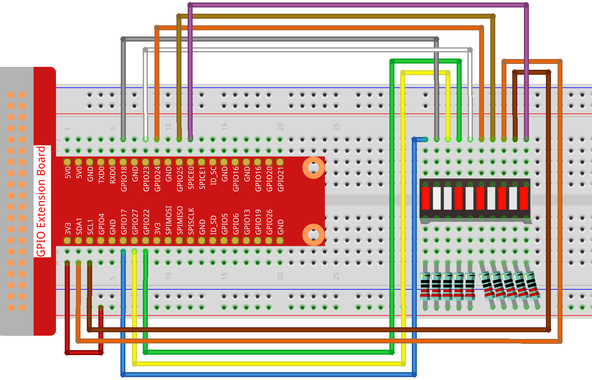

1.1.3 LED棒グラフ
======================

前書き
-------------

このプロジェクトでは、LED棒グラフのライトを順番に点灯させる。

部品
----------------

.. image:: media/list_led_bar.png

原理
--------------

**LED棒グラフ**

LED棒グラフは、電子回路またはマイクロコントローラーとの接続に使用されるLED配列である。10個の個別のLEDを10本の出力ピンに接続するように、LED棒グラフを回路に簡単に接続できる。
通常、LED棒グラフは、バッテリーレベルインジケーター、オーディオ機器、および産業用制御パネルとして使用できる。LED棒グラフには他にも多くの用途がある。

.. image:: media/led_bar_sche.png

回路図
-------------------------

============ ======== ======== ===
T-Board Name physical wiringPi BCM
GPIO17       Pin 11   0        17
GPIO18       Pin 12   1        18
GPIO27       Pin 13   2        27
GPIO22       Pin 15   3        22
GPIO23       Pin 16   4        23
GPIO24       Pin 18   5        24
GPIO25       Pin 22   6        25
SDA1         Pin 3    8        2
SCL1         Pin 5    9        3
SPICE0       Pin 24   10       8
============ ======== ======== ===

.. image:: media/schematic_led_bar.png

実験手順
------------------------------

ステップ1: 回路を作る。

    
C言語ユーザー向け
^^^^^^^^^^^^^^^^^^^^^^^^^

ステップ2: コードのフォルダーに入る。

.. raw:: html

   <run></run>

.. code-block::

    cd ~/davinci-kit-for-raspberry-pi/c/1.1.3/

ステップ3: コードをコンパイルする。

.. raw:: html

   <run></run>

.. code-block::

    gcc 1.1.3_LedBarGraph.c -lwiringPi

ステップ4: EXEファイルを実行する。

.. raw:: html

   <run></run>

.. code-block::

    sudo ./a.out

コードの実行後、LEDバーのLEDが定期的にオン/オフになる。

    
**コード**

.. code-block:: c

    #include <wiringPi.h>
    #include <stdio.h>

    int pins[10] = {0,1,2,3,4,5,6,8,9,10};
    void oddLedBarGraph(void){
        for(int i=0;i<5;i++){
            int j=i*2;
            digitalWrite(pins[j],HIGH);
            delay(300);
            digitalWrite(pins[j],LOW);
        }
    }
    void evenLedBarGraph(void){
        for(int i=0;i<5;i++){
            int j=i*2+1;
            digitalWrite(pins[j],HIGH);
            delay(300);
            digitalWrite(pins[j],LOW);
        }
    }
    void allLedBarGraph(void){
        for(int i=0;i<10;i++){
            digitalWrite(pins[i],HIGH);
            delay(300);
            digitalWrite(pins[i],LOW);
        }
    }
    int main(void)
    {
        if(wiringPiSetup() == -1){ //when initialize wiring failed,print message to screen
            printf("setup wiringPi failed !");
            return 1;
        }
        for(int i=0;i<10;i++){       //make led pins' mode is output
            pinMode(pins[i], OUTPUT);
            digitalWrite(pins[i],LOW);
        }
        while(1){
            oddLedBarGraph();
            delay(300);
            evenLedBarGraph();
            delay(300);
            allLedBarGraph();
            delay(300);
        }
        return 0;
    }

**コードの説明**

.. code-block:: c

    int pins[10] = {0,1,2,3,4,5,6,8,9,10};

配列を作成し、LED棒グラフ（0、1、2、3、4、5、6、8、9、10）に対応するピン番号に割り当て、配列はLEDを制御するために使用される。

.. code-block:: c

    void oddLedBarGraph(void){
        for(int i=0;i<5;i++){
            int j=i*2;
            digitalWrite(pins[j],HIGH);
            delay(300);
            digitalWrite(pins[j],LOW);
        }
    }

LED棒グラフの奇数桁のLEDを順番に点灯させる。

.. code-block:: c

    void evenLedBarGraph(void){
        for(int i=0;i<5;i++){
            int j=i*2+1;
            digitalWrite(pins[j],HIGH);
            delay(300);
            digitalWrite(pins[j],LOW);
        }
    }

LED棒グラフの偶数桁のLEDを順番に点灯させる。

.. code-block:: c

    void allLedBarGraph(void){
        for(int i=0;i<10;i++){
            digitalWrite(pins[i],HIGH);
            delay(300);
            digitalWrite(pins[i],LOW);
        }
    }

LED棒グラフのLEDを1つずつ点灯させる。

Python言語ユーザー向け
^^^^^^^^^^^^^^^^^^^^^^^^^^^^^

ステップ2: コードのフォルダーに入る。

.. raw:: html

   <run></run>

.. code-block::

    cd /home/pi/davinci-kit-for-raspberry-pi/python/

ステップ3: EXEファイルを実行する。

.. raw:: html

   <run></run>

.. code-block::

    sudo python3 1.1.3_LedBarGraph.py

コードの実行後、LEDバーのLEDが定期的にオン/オフになる。

**コード**

.. note::

    以下のコードを **変更/リセット/コピー/実行/停止** できます。 ただし、その前に、 ``davinci-kit-for-raspberry-pi/python`` のようなソースコードパスに移動する必要があります。
   
.. raw:: html

    <run></run>

.. code-block:: python

    import RPi.GPIO as GPIO
    import time

    ledPins = [11, 12, 13, 15, 16, 18, 22, 3, 5, 24]

    def oddLedBarGraph():
        for i in range(5):
            j = i*2
            GPIO.output(ledPins[j],GPIO.HIGH)
            time.sleep(0.3)
            GPIO.output(ledPins[j],GPIO.LOW)

    def evenLedBarGraph():
        for i in range(5):
            j = i*2+1
            GPIO.output(ledPins[j],GPIO.HIGH)
            time.sleep(0.3)
            GPIO.output(ledPins[j],GPIO.LOW)

    def allLedBarGraph():
        for i in ledPins:
            GPIO.output(i,GPIO.HIGH)
            time.sleep(0.3)
            GPIO.output(i,GPIO.LOW)

    def setup():
        GPIO.setwarnings(False)
        GPIO.setmode(GPIO.BOARD)        # Numbers GPIOs by physical location
        for i in ledPins:
            GPIO.setup(i, GPIO.OUT)   # Set all ledPins' mode is output
            GPIO.output(i, GPIO.LOW) # Set all ledPins to high(+3.3V) to off led

    def loop():
        while True:
            oddLedBarGraph()
            time.sleep(0.3)
            evenLedBarGraph()
            time.sleep(0.3)
            allLedBarGraph()
            time.sleep(0.3)

    def destroy():
        for pin in ledPins:
            GPIO.output(pin, GPIO.LOW)    # turn off all leds
        GPIO.cleanup()                     # Release resource

    if __name__ == '__main__':     # Program start from here
        setup()
        try:
            loop()
        except KeyboardInterrupt:  # When 'Ctrl+C' is pressed, the program destroy() will be  executed.
            destroy()

**コードの説明**

``ledPins = [11, 12, 13, 15, 16, 18, 22, 3, 5, 24]`` 
配列を作成し、LED棒グラフ（11、12、13、15、16、18、22、3、5、24）に対応するピン番号に割り当て、配列はLEDを制御するために使用される。

.. code-block:: python

    def oddLedBarGraph():
        for i in range(5):
            j = i*2
            GPIO.output(ledPins[j],GPIO.HIGH)
            time.sleep(0.3)
            GPIO.output(ledPins[j],GPIO.LOW)

LED棒グラフの奇数桁のLEDを順番に点灯させる。

.. code-block:: python

    def evenLedBarGraph():
        for i in range(5):
            j = i*2+1
            GPIO.output(ledPins[j],GPIO.HIGH)
            time.sleep(0.3)
            GPIO.output(ledPins[j],GPIO.LOW)

LED棒グラフの偶数桁のLEDを順番に点灯させる。

.. code-block:: python

    def allLedBarGraph():
        for i in ledPins:
            GPIO.output(i,GPIO.HIGH)
            time.sleep(0.3)
            GPIO.output(i,GPIO.LOW)

LED棒グラフのLEDを1つずつ点灯させる。

現象画像
-----------------------

