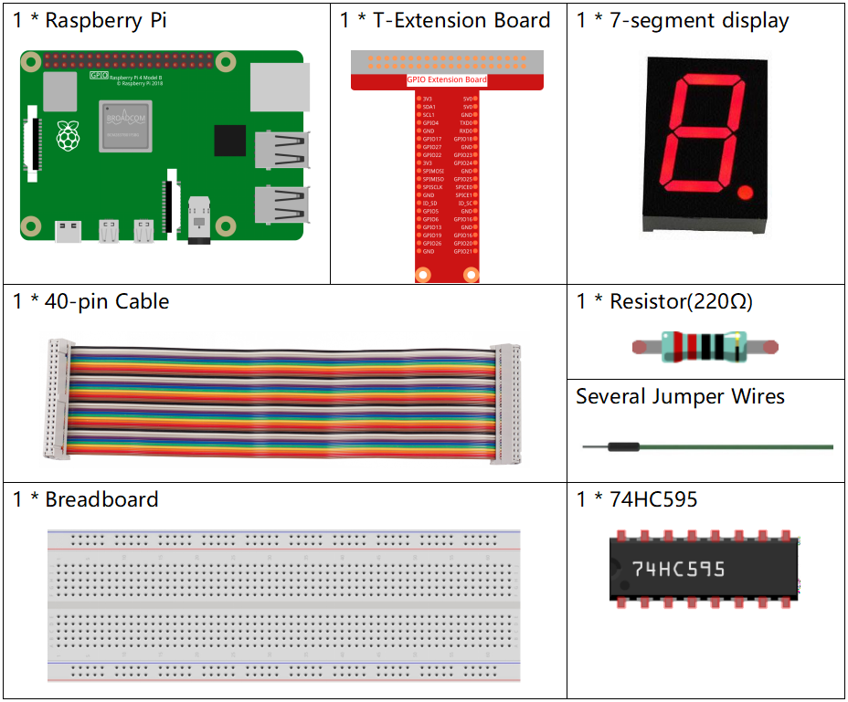
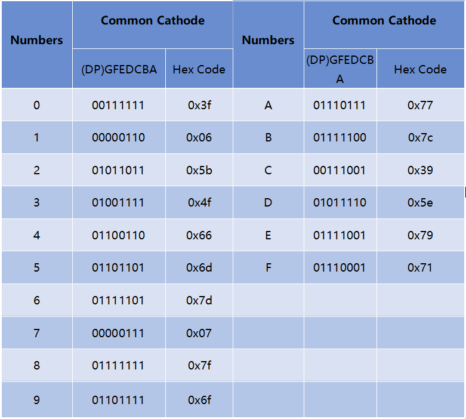
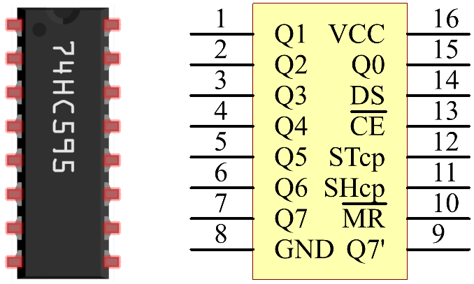
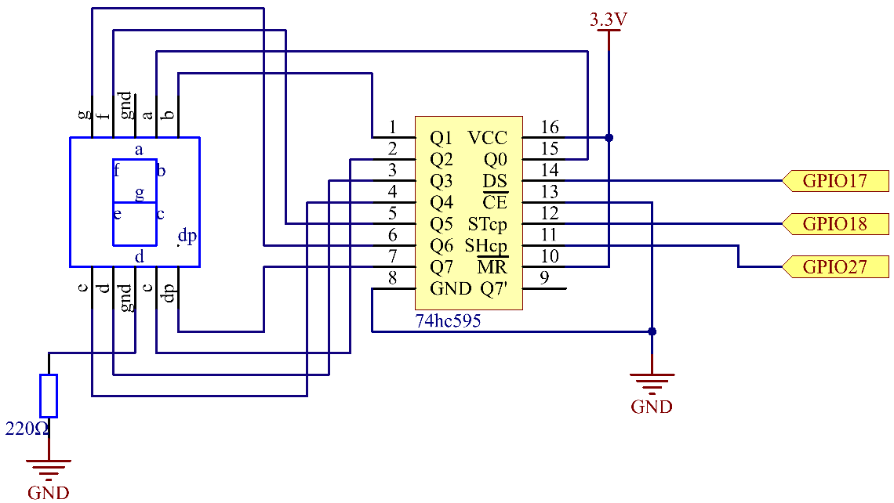
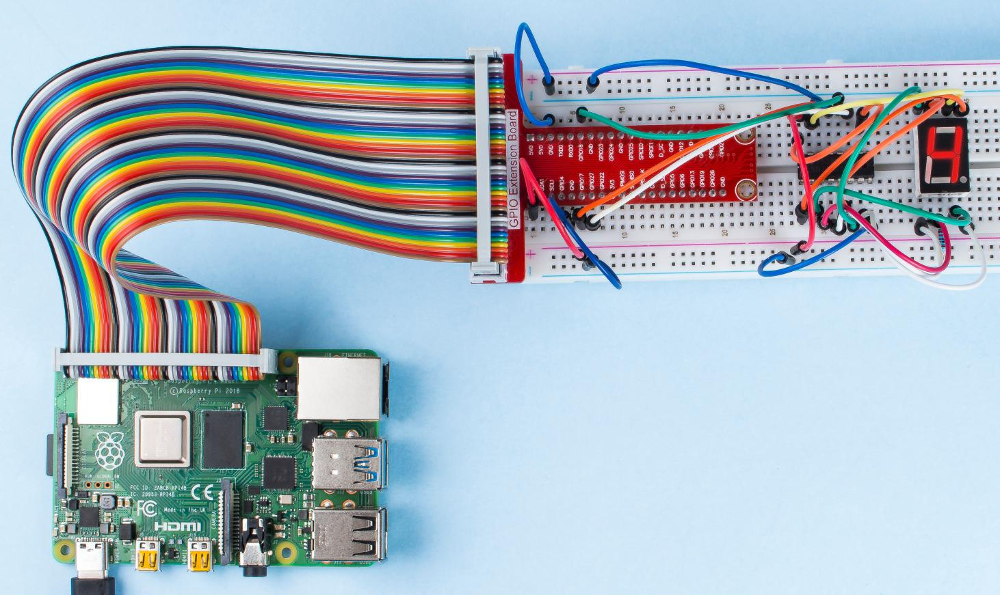

1.1.4 7セグメントディスプレイ
=============================

前書き
-----------------

7セグメントディスプレイを駆動して、0から9およびAからFの数字を表示してみましょう。

部品
----------------

原理
-------------

**7セグメントディスプレイ**

7セグメントディスプレイは、LEDを7個パッケージした8字型の部品である。各LEDはセグメントと呼ばれる-通電されると、1つのセグメントが表示される数字の一部を形成する。

ピン接続には、カソードコモン（CC）とアノードコモン（CA）の2種類がある。名前が示すように、CAディスプレイには7セグメントのアノードがすべて接続されている場合、CCディスプレイには7つのLEDのカソードがすべて接続されている。このキットでは、前者を使用する。

.. image:: media/image70.jpeg
   :width: 3.89514in
   :height: 3.32222in
   :align: center

ディスプレイの各LEDには、長方形のプラスチックパッケージから接続ピンの1つが引き出された位置セグメントがある。
これらのLEDピンには、個々のLEDを表す「a」から「g」までのラベルが付いている。他のLEDピンは一緒に接続され、共通のピンを形成する。
そのため、LEDセグメントの適切なピンを特定の順序で順方向にバイアスすることにより、一部のセグメントが明るくなり、他のセグメントが暗くなり、ディスプレイに対応する文字が表示される。

**表示コード**

7セグメントディスプレイ（カソードコモン）がどのように番号を表示するかを知るために、次の表を作成した。
数字は、7セグメントディスプレイに表示される数字0〜Fである。（DP）GFEDCBAは、0または1に設定された対応するLEDを指す。
たとえば、00111111は、DPとGが0に設定され、他が1に設定されることを意味する。
したがって、7セグメントディスプレイには0が表示され、HEXコードは16進数に対応する。

**74HC595**

74HC595は、8ビットのシフトレジスタと、3段階の並列出力を備えたストレージレジスタで構成されている。MCUのIOポートを節約できるように、シリアル入力を並列出力に変換する。

MR（ピン10）が高レベルで、OE（ピン13）が低レベルの場合、データはSHcpの立ち上がりエッジで入力され、SHcpの立ち上がりエッジを介してメモリレジスタに入力される。
2つのクロックが接続されている場合、シフトレジスタは常にメモリレジスタより1パルス早くなる。
メモリレジスタには、シリアルシフト入力ピン（Ds）、シリアル出力ピン（Q）、非同期リセットボタン（低レベル）がある。
メモリレジスタは並列8ビットで3つの状態のバスを出力します。
OEが有効（低レベル）の場合、メモリレジスタのデータがバスに出力される。

**74HC595のピンとその機能** 

* **Q0-Q7** : 8ビットパラレルデータ出力端子。8個のLEDまたは8個の7セグメントディスプレイを直接制御することができます。

* **Q7'** : 複数の74HC595を直列に接続するために，別の74HC595のDSに接続される直列出力端子。

* **MR** : リセットピン－低レベルで作動;

* **SHcp** : シフトレジスタの時系列入力。 立ち上がりエッジでは、シフトレジスタのデータが1ビット連続して移動します。つまり、Q1のデータがQ2に移動します。 立ち下がりエッジにある間、シフトレジスタのデータは変更されません。

* **STcp** : ストレージレジスタの時系列入力。 立ち上がりエッジで、シフトレジスタのデータがメモリレジスタに移動します。

* **CE** : 出力イネーブルピン、低レベルで作動する。

* **DS** : 直列データ入力ピン

* **VCC** : 正の電源電圧

* **GND** : 接地

回路図
---------------------

74HC595のピンST_CPをRaspberry Pi GPIO18に、SH_CPをGPIO27に、DSをGPIO17に、並列出力ポートをLEDセグメントディスプレイの8つのセグメントに接続する。
SH_CP（シフトレジスタのクロック入力）が立ち上がりエッジにある場合はDSピンのデータをシフトレジスタに入力し、
ST_CP（メモリのクロック入力）が立ち上がりエッジにある場合はそのデータをメモリレジスタに入力する。
次に、Raspberry Pi GPIOを介してSH_CPおよびST_CPの状態を制御し、直列データ入力を並列データ出力に変換して、
Raspberry Pi GPIOを保存したりディスプレイを駆動したりすることはできる。

============ ======== ======== ===
T-Board Name physical wiringPi BCM
GPIO17       Pin 11   0        17
GPIO18       Pin 12   1        18
GPIO27       Pin 13   2        27
============ ======== ======== ===

実験手順
------------------------------

ステップ1: 回路を作る。

.. image:: media/image73.png
    :width: 800

C言語ユーザー向け
^^^^^^^^^^^^^^^^^^^^^^^^^^^

ステップ2：コードのフォルダーに入る。

.. raw:: html

   <run></run>

.. code-block::

    cd /home/pi/davinci-kit-for-raspberry-pi/c/1.1.4/

ステップ3：コンパイルする。

.. raw:: html

   <run></run>

.. code-block::

    gcc 1.1.4_7-Segment.c -lwiringPi

ステップ4：EXEファイルを実行する。

.. raw:: html

   <run></run>

.. code-block::

    sudo ./a.out

コードの実行後、7セグメントディスプレイに0〜9、AFが表示される。

**コード**

.. code-block:: c

    #include <wiringPi.h>
    #include <stdio.h>
    #define   SDI   0   //serial data input
    #define   RCLK  1   //memory clock input(STCP)
    #define   SRCLK 2   //shift register clock input(SHCP)
    unsigned char SegCode[16] = {0x3f,0x06,0x5b,0x4f,0x66,0x6d,0x7d,0x07,0x7f,0x6f,0x77,0x7c,0x39,0x5e,0x79,0x71};

    void init(void){
        pinMode(SDI, OUTPUT); 
        pinMode(RCLK, OUTPUT);
        pinMode(SRCLK, OUTPUT); 
        digitalWrite(SDI, 0);
        digitalWrite(RCLK, 0);
        digitalWrite(SRCLK, 0);
    }

    void hc595_shift(unsigned char dat){
        int i;
        for(i=0;i<8;i++){
            digitalWrite(SDI, 0x80 & (dat << i));
            digitalWrite(SRCLK, 1);
            delay(1);
            digitalWrite(SRCLK, 0);
        }
            digitalWrite(RCLK, 1);
            delay(1);
            digitalWrite(RCLK, 0);
    }

    int main(void){
        int i;
        if(wiringPiSetup() == -1){ //when initialize wiring failed, print messageto screen
            printf("setup wiringPi failed !");
            return 1;
        }
        init();
        while(1){
            for(i=0;i<16;i++){
                printf("Print %1X on Segment\n", i); // %X means hex output
                hc595_shift(SegCode[i]);
                delay(500);
            }
        }
        return 0;
    }

**コードの説明**

``unsigned char SegCode[16] = {0x3f,0x06,0x5b,0x4f,0x66,0x6d,0x7d,0x07,0x7f,0x6f,0x77,0x7c,0x39,0x5e,0x79,0x71};``
16進数（カソードコモン）の0からFまでのセグメントコード配列。

.. code-block:: c

    void init(void){
        pinMode(SDI, OUTPUT); 
        pinMode(RCLK, OUTPUT); 
        pinMode(SRCLK, OUTPUT); 
        digitalWrite(SDI, 0);
        digitalWrite(RCLK, 0);
        digitalWrite(SRCLK, 0);
    }

Set ``ds`` , ``st_cp`` , ``sh_cp`` の3つのピンをOUTPUTに設定し、初期状態を0に設定する。
``void hc595_shift(unsigned char dat){}``
8ビット値を74HC595のシフトレジスタに割り当てる。

.. code-block:: c

    digitalWrite(SDI, 0x80 & (dat << i));

ビットごとにdatデータをSDI（DS）に割り当てる。
ここでは、dat = 0x3f（0011 1111を仮定し、i = 2の場合、0x3fは左（<<）2ビットにシフトする。
1111 1100（0x3f << 2）＆1000 0000（0x80）= 1000 0000、真である。

.. code-block:: c

    digitalWrite(SRCLK, 1);

SRCLKの初期値は元々に0に設定されていたが、ここでは1に設定されている。
これは、立ち上がりエッジパルスを生成し、DSの日付をシフトレジスタにシフトする。

.. code-block:: c
        
		digitalWrite(RCLK, 1);

RCLKの初期値は元々に0に設定されていたが、ここでは1に設定されている。これは、立ち上がりエッジパルスを生成し、データーをシフトレジスタからストレージレジスターにシフトする。

.. code-block:: c

    while(1){
            for(i=0;i<16;i++){
                printf("Print %1X on Segment\n", i); // %X means hex output
                hc595_shift(SegCode[i]);
                delay(500);
            }
        }

このforループでは、iを16進数で出力するために、"%1X" を使用しています。iを適用して ``SegCode[]`` 配列の対応するセグメントコードを求め、 ``hc595_shift()`` で74HC595のシフトレジスターにSegCodeを渡します。

Python言語ユーザー向け
^^^^^^^^^^^^^^^^^^^^^^^^^^^^^^^^

ステップ2：コードのフォルダーに入る。

.. raw:: html

   <run></run>

.. code-block::

    cd /home/pi/davinci-kit-for-raspberry-pi/python/

ステップ3：実行する。

.. raw:: html

   <run></run>

.. code-block::

    sudo python3 1.1.4_7-Segment.py

コードの実行後、7セグメントディスプレイに0〜9、AFが表示される。

**コード**

.. note::

    以下のコードを **変更/リセット/コピー/実行/停止** できます。 ただし、その前に、 ``davinci-kit-for-raspberry-pi/python`` のようなソースコードパスに移動する必要があります。
     
.. raw:: html

    <run></run>

.. code-block:: python

    import RPi.GPIO as GPIO
    import time

    # Set up pins
    SDI   = 17
    RCLK  = 18
    SRCLK = 27

    # Define a segment code from 0 to F in Hexadecimal
    # Common cathode
    segCode = [0x3f,0x06,0x5b,0x4f,0x66,0x6d,0x7d,0x07,0x7f,0x6f,0x77,0x7c,0x39,0x5e,0x79,0x71]

    def setup():
        GPIO.setmode(GPIO.BCM)
        GPIO.setup(SDI, GPIO.OUT, initial=GPIO.LOW)
        GPIO.setup(RCLK, GPIO.OUT, initial=GPIO.LOW)
        GPIO.setup(SRCLK, GPIO.OUT, initial=GPIO.LOW)

    # Shift the data to 74HC595
    def hc595_shift(dat):
        for bit in range(0, 8):	
            GPIO.output(SDI, 0x80 & (dat << bit))
            GPIO.output(SRCLK, GPIO.HIGH)
            time.sleep(0.001)
            GPIO.output(SRCLK, GPIO.LOW)
        GPIO.output(RCLK, GPIO.HIGH)
        time.sleep(0.001)
        GPIO.output(RCLK, GPIO.LOW)

    def main():
        while True:
            # Shift the code one by one from segCode list
            for code in segCode:
                hc595_shift(code)
                print ("segCode[%s]: 0x%02X"%(segCode.index(code), code)) # %02X means double digit HEX to print
                time.sleep(0.5)

    def destroy():
        GPIO.cleanup()

    if __name__ == '__main__':
        setup()
        try:
            main()
        except KeyboardInterrupt:
            destroy()

**コードの説明**

.. code-block:: python

    segCode = [0x3f,0x06,0x5b,0x4f,0x66,0x6d,0x7d,0x07,0x7f,0x6f,0x77,0x7c,0x39,0x5e,0x79,0x71]

16進数（カソードコモン）の0からFまでのセグメントコード配列。

.. code-block:: python

    def setup():
        GPIO.setmode(GPIO.BCM)
        GPIO.setup(SDI, GPIO.OUT, initial=GPIO.LOW)
        GPIO.setup(RCLK, GPIO.OUT, initial=GPIO.LOW)
        GPIO.setup(SRCLK, GPIO.OUT, initial=GPIO.LOW)

Set ``ds``, ``st_cp`` , ``sh_cp`` の3つのピンを出力に設定し、初期状態を低レベルとして設定する。

.. code-block:: python

    GPIO.output(SDI, 0x80 & (dat << bit))

ビットごとにdatデータをSDI（DS）に割り当てる。ここでは、dat = 0x3f（0011 1111、bit = 2を仮定し、0x3fは右（<<）2ビットに切り替える。1111 1100（0x3f << 2）＆1000 0000（0x80）=1000 0000、は真である。

.. code-block:: python

    GPIO.output(SRCLK, GPIO.HIGH)

SRCLKの初期値は元々LOWに設定されていたが、ここでは立ち上がりエッジを生成し、DSデータをシフトレジスタに切り替えるためにHIGHに設定されている。

.. code-block:: python

    GPIO.output(RCLK, GPIO.HIGH)

SRCLKの初期値は元々LOWに設定されていたが、ここでは立ち上がりエッジを生成し、DSデータをシフトレジスタに切り替えるためにHIGHに設定されている。

.. note::
    番号0〜15の16進形式は：(0, 1, 2, 3, 4, 5, 6, 7, 8, 9, A, B, C, D, E, F)。

現象画像
-------------------------

