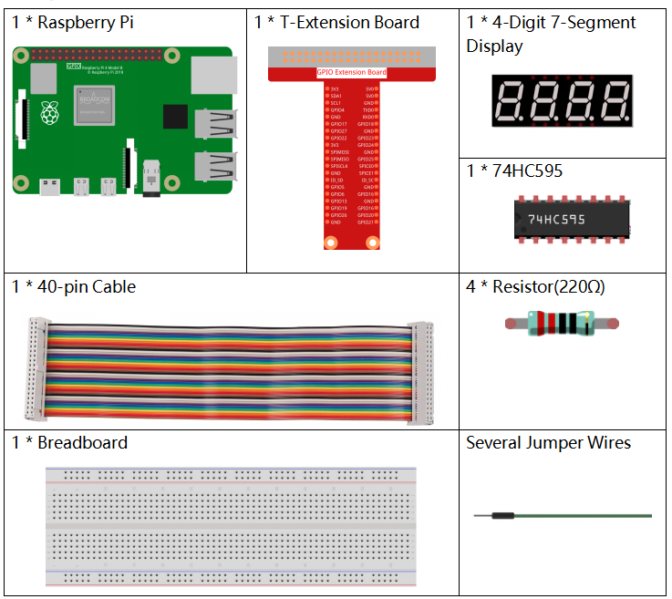
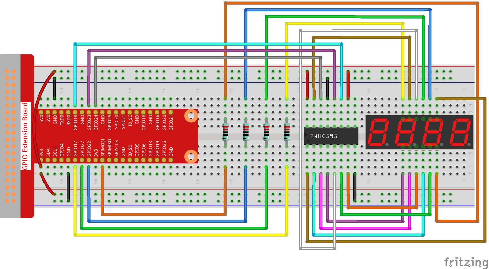
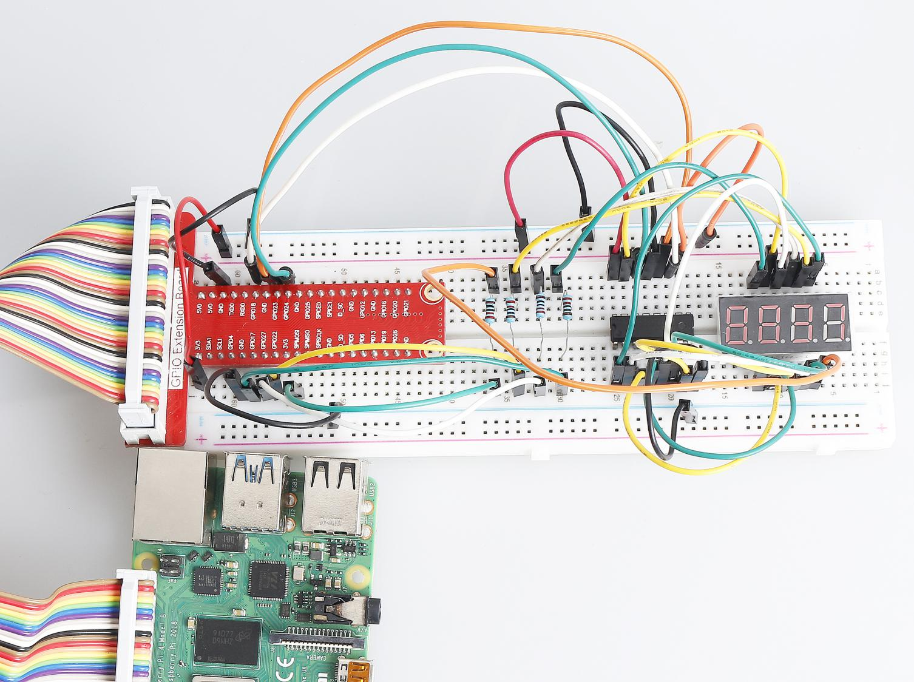

1.1.5 4-Digit 7-Segment Display
====================================

Introduction
-----------------

Next, follow me to try to control the 4-digit 7-segment display.

Components
---------------

Principle
--------------

**4-Digit 7-Segment Display**

4-Digit 7-segment display consists of four 7- segment displays working
together.

.. image:: media/4-digit-sche.png

The 4-digtal 7-segment display works independently. It uses the
principle of human visual persistence to quickly display the characters
of each 7-segment in a loop to form continuous strings.

For example, when "1234" is displayed on the display, "1" is displayed
on the first 7-segment, and "234" is not displayed. After a period of
time, the second 7-segment shows "2", the 1st 3th 4th of 7-segment does
not show, and so on, the four digital display show in turn. This process
is very short (typically 5ms), and because of the optical afterglow
effect and the principle of visual residue, we can see four characters
at the same time.

.. image:: media/image78.png

**Display Codes**

To help you get to know how 7-segment displays(Common Anode) display
Numbers, we have drawn the following table. Numbers are the number 0-F
displayed on the 7-segment display; (DP) GFEDCBA refers to the
corresponding LED set to 0 or 1, For example, 11000000 means that DP and
G are set to 1, while others are set to 0. Therefore, the number 0 is
displayed on the 7-segment display, while HEX Code corresponds to
hexadecimal number.

.. image:: media/common_anode.png

Schematic Diagram
--------------------------

============ ======== ======== ===
T-Board Name physical wiringPi BCM
GPIO17       Pin 11   0        17
GPIO27       Pin 13   2        27
GPIO22       Pin 15   3        22
SPIMOSI      Pin 19   12       10
GPIO18       Pin 12   1        18
GPIO23       Pin 16   4        23
GPIO24       Pin 18   5        24
============ ======== ======== ===

.. image:: media/schmatic_4_digit.png

Experimental Procedures
-----------------------------------

**Step 1**: Build the circuit.

For C Language Users
^^^^^^^^^^^^^^^^^^^^^^^^
Step 2: Go to the folder of the code.

.. raw:: html

   <run></run>

.. code-block::

    cd /home/pi/davinci-kit-for-raspberry-pi/c/1.1.5/

Step 3: Compile the code.

.. raw:: html

   <run></run>

.. code-block::

    gcc 1.1.5_4-Digit.c -lwiringPi

Step 4: Run the executable file.

.. raw:: html

   <run></run>

.. code-block::

    sudo ./a.out

After the code runs, the program takes a count, increasing by 1 per second, and the 4-digit 7-segment display displays the count.

**Code**

.. code-block:: c

    #include <wiringPi.h>
    #include <stdio.h>
    #include <wiringShift.h>
    #include <signal.h>
    #include <unistd.h>

    #define SDI 5
    #define RCLK 4
    #define SRCLK 1

    const int placePin[] = {12, 3, 2, 0};
    unsigned char number[] = {0xc0, 0xf9, 0xa4, 0xb0, 0x99, 0x92, 0x82, 0xf8, 0x80, 0x90};

    int counter = 0;

    void pickDigit(int digit)
    {
        for (int i = 0; i < 4; i++)
        {
            digitalWrite(placePin[i], 0);
        }
        digitalWrite(placePin[digit], 1);
    }

    void hc595_shift(int8_t data)
    {
        int i;
        for (i = 0; i < 8; i++)
        {
            digitalWrite(SDI, 0x80 & (data << i));
            digitalWrite(SRCLK, 1);
            delayMicroseconds(1);
            digitalWrite(SRCLK, 0);
        }
        digitalWrite(RCLK, 1);
        delayMicroseconds(1);
        digitalWrite(RCLK, 0);
    }

    void clearDisplay()
    {
        int i;
        for (i = 0; i < 8; i++)
        {
            digitalWrite(SDI, 1);
            digitalWrite(SRCLK, 1);
            delayMicroseconds(1);
            digitalWrite(SRCLK, 0);
        }
        digitalWrite(RCLK, 1);
        delayMicroseconds(1);
        digitalWrite(RCLK, 0);
    }

    void loop()
    {
        while(1){
        clearDisplay();
        pickDigit(0);
        hc595_shift(number[counter % 10]);

        clearDisplay();
        pickDigit(1);
        hc595_shift(number[counter % 100 / 10]);

        clearDisplay();
        pickDigit(2);
        hc595_shift(number[counter % 1000 / 100]);
    
        clearDisplay();
        pickDigit(3);
        hc595_shift(number[counter % 10000 / 1000]);
        }
    }

    void timer(int timer1)
    { 
        if (timer1 == SIGALRM)
        { 
            counter++;
            alarm(1); 
            printf("%d\n", counter);
        }
    }

    void main(void)
    {
        if (wiringPiSetup() == -1)
        { 
            printf("setup wiringPi failed !");
            return;
        }
        pinMode(SDI, OUTPUT); 
        pinMode(RCLK, OUTPUT);
        pinMode(SRCLK, OUTPUT);
        
        for (int i = 0; i < 4; i++)
        {
            pinMode(placePin[i], OUTPUT);
            digitalWrite(placePin[i], HIGH);
        }
        signal(SIGALRM, timer); 
        alarm(1);               
        loop(); 
    }

**Code Explanation**

.. code-block:: c

    const int placePin[] = {12, 3, 2, 0};

These four pins control the common anode pins of the four-digit 7-segment displays.

.. code-block:: c

    unsigned char number[] = {0xc0, 0xf9, 0xa4, 0xb0, 0x99, 0x92, 0x82, 0xf8, 0x80, 0x90};

A segment code array from 0 to 9 in Hexadecimal (Common anode).

.. code-block:: c

    void pickDigit(int digit)
    {
        for (int i = 0; i < 4; i++)
        {
            digitalWrite(placePin[i], 0);
        }
        digitalWrite(placePin[digit], 1);
    }

Select the place of the value. there is only one place that should be enable each time. The enabled place will be written high.

.. code-block:: c

    void loop()
    {
        while(1){
        clearDisplay();
        pickDigit(0);
        hc595_shift(number[counter % 10]);

        clearDisplay();
        pickDigit(1);
        hc595_shift(number[counter % 100 / 10]);

        clearDisplay();
        pickDigit(2);
        hc595_shift(number[counter % 1000 / 100]);
    
        clearDisplay();
        pickDigit(3);
        hc595_shift(number[counter % 10000 / 1000]);
        }
    }

The functionis used to set the number displayed on the 4-digit 7-segment display.

* ``clearDisplay()``：write in 11111111 to turn off these eight LEDs on 7-segment display so as to clear the displayed content.
* ``pickDigit(0)``：pick the fourth 7-segment display.
* ``hc595_shift(number[counter%10])``：the number in the single digit of counter will display on the forth segment.

.. code-block:: c

    signal(SIGALRM, timer); 

This is a system-provided function, the prototype of code is:

.. code-block:: c

    sig_t signal(int signum,sig_t handler);

After executing the signal(), once the process receives the corresponding signum (in this case SIGALRM), it immediately pauses the existing task and processes the set function (in this case timer(sig)).

.. code-block:: c

    alarm(1);

This is also a system-provided function. The code prototype is:

.. code-block:: c

    unsigned int alarm (unsigned int seconds);

It generates a SIGALRM signal after a certain number of seconds.

.. code-block:: c

    void timer(int timer1)
    { 
        if (timer1 == SIGALRM)
        { 
            counter++;
            alarm(1); 
            printf("%d\n", counter);
        }
    }

We use the functions above to implement the timer function.
After the ``alarm()`` generates the SIGALRM signal, the timer function is called. Add 1 to counter, and the function, ``alarm(1)`` will be repeatedly called after 1 second.

For Python Language Users
^^^^^^^^^^^^^^^^^^^^^^^^^^^^^^^^^^

Step 2: Go to the folder of the code. 

.. raw:: html

   <run></run>

.. code-block::

    cd /home/pi/davinci-kit-for-raspberry-pi/python/

Step 3: Run the executable file.

.. raw:: html

   <run></run>

.. code-block::

    sudo python3 1.1.5_4-Digit.py

After the code runs, the program takes a count, increasing by 1 per second, and the 4 digit display displays the count.

**Code**

.. note::

    You can **Modify/Reset/Copy/Run/Stop** the code below. But before that, you need to go to  source code path like ``davinci-kit-for-raspberry-pi\\python``. 
    
.. raw:: html

    <run></run>

.. code-block:: python

    import RPi.GPIO as GPIO
    import time
    import threading

    SDI = 24
    RCLK = 23
    SRCLK = 18

    placePin = (10, 22, 27, 17)
    number = (0xc0, 0xf9, 0xa4, 0xb0, 0x99, 0x92, 0x82, 0xf8, 0x80, 0x90)

    counter = 0
    timer1 = 0

    def clearDisplay():
        for i in range(8):
            GPIO.output(SDI, 1)
            GPIO.output(SRCLK, GPIO.HIGH)
            GPIO.output(SRCLK, GPIO.LOW)
        GPIO.output(RCLK, GPIO.HIGH)
        GPIO.output(RCLK, GPIO.LOW)    

    def hc595_shift(data): 
        for i in range(8):
            GPIO.output(SDI, 0x80 & (data << i))
            GPIO.output(SRCLK, GPIO.HIGH)
            GPIO.output(SRCLK, GPIO.LOW)
        GPIO.output(RCLK, GPIO.HIGH)
        GPIO.output(RCLK, GPIO.LOW)

    def pickDigit(digit):
        for i in placePin:
            GPIO.output(i,GPIO.LOW)
        GPIO.output(placePin[digit], GPIO.HIGH)

    def timer():  
        global counter
        global timer1
        timer1 = threading.Timer(1.0, timer) 
        timer1.start()  
        counter += 1
        print("%d" % counter)

    def loop():
        global counter                    
        while True:
            clearDisplay() 
            pickDigit(0)  
            hc595_shift(number[counter % 10])
            
            clearDisplay()
            pickDigit(1)
            hc595_shift(number[counter % 100//10])

            clearDisplay()
            pickDigit(2)
            hc595_shift(number[counter % 1000//100])

            clearDisplay()
            pickDigit(3)
            hc595_shift(number[counter % 10000//1000])

    def setup():
        GPIO.setmode(GPIO.BCM)
        GPIO.setup(SDI, GPIO.OUT)
        GPIO.setup(RCLK, GPIO.OUT)
        GPIO.setup(SRCLK, GPIO.OUT)
        for i in placePin:
            GPIO.setup(i, GPIO.OUT)
        global timer1
        timer1 = threading.Timer(1.0, timer)  
        timer1.start()       

    def destroy():   # When "Ctrl+C" is pressed, the function is executed.
        global timer1
        GPIO.cleanup()
        timer1.cancel()  # cancel the timer

    if __name__ == '__main__':  # Program starting from here
        setup()
        try:
            loop()
        except KeyboardInterrupt:
            destroy()

**Code Explanation**

.. code-block:: python

    placePin = (10, 22, 27, 17)

These four pins control the common anode pins of the four-digit 7-segment displays.

.. code-block:: python

    number = (0xc0, 0xf9, 0xa4, 0xb0, 0x99, 0x92, 0x82, 0xf8, 0x80, 0x90)

A segment code array from 0 to 9 in hexadecimal (common anode).

.. code-block:: python

    def clearDisplay():
        for i in range(8):
            GPIO.output(SDI, 1)
            GPIO.output(SRCLK, GPIO.HIGH)
            GPIO.output(SRCLK, GPIO.LOW)
    GPIO.output(RCLK, GPIO.HIGH)
    GPIO.output(RCLK, GPIO.LOW) 

Write "1" for eight times in SDI., so that the eight LEDs on the 7-segment Dispaly will turn off so as to clear the displayed content.

.. code-block:: python

    def pickDigit(digit):
        for i in placePin:
            GPIO.output(i,GPIO.LOW)
        GPIO.output(placePin[digit], GPIO.HIGH)

Select the place of the value. there is only one place that should be enable each time. The enabled place will be written high. 

.. code-block:: python

    def loop():
        global counter                    
        while True:
            clearDisplay() 
            pickDigit(0)  
            hc595_shift(number[counter % 10])

            clearDisplay()
            pickDigit(1)
            hc595_shift(number[counter % 100//10])

            clearDisplay()
            pickDigit(2)
            hc595_shift(number[counter % 1000//100])

            clearDisplay()
            pickDigit(3)
            hc595_shift(number[counter % 10000//1000])

The function is used to set the number displayed on the 4-digit 7-segment Dispaly.

First, start the fourth segment display, write the single-digit number. Then start the third segment display, and type in the tens digit; after that, start the second and the first segment display respectively, and write the hundreds and thousands digits respectively. Because the refreshing speed is very fast, we see a complete four-digit display.

.. code-block:: python

    timer1 = threading.Timer(1.0, timer)  
    timer1.start()  

The module, threading is the common threading module in Python，and Timer is the subclass of it.
The prototype of code is:

.. code-block:: python

    class threading.Timer(interval, function, args=[], kwargs={})

After the interval, the function will be run. Here, the interval is 1.0，and the function is timer().
start () means the Timer will start at this point.

.. code-block:: python

    def timer():  
        global counter
        global timer1
        timer1 = threading.Timer(1.0, timer) 
        timer1.start()  
        counter += 1
        print("%d" % counter)

After Timer reaches 1.0s, the Timer function is called; add 1 to counter, and the Timer is used again to execute itself repeatedly every second.

Phenomenon Picture
-----------------------

