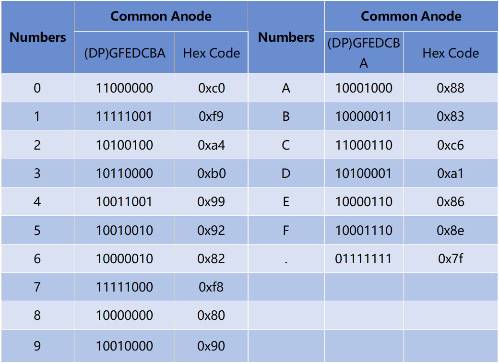

.. note::

    ¡Hola! Bienvenidos a la comunidad de entusiastas de SunFounder para Raspberry Pi, Arduino y ESP32 en Facebook. Sumérgete en el mundo de Raspberry Pi, Arduino y ESP32 junto a otros apasionados.

    **¿Por qué unirse?**

    - **Soporte de Expertos**: Resuelve problemas postventa y desafíos técnicos con la ayuda de nuestra comunidad y equipo.
    - **Aprende y Comparte**: Intercambia consejos y tutoriales para mejorar tus habilidades.
    - **Preestrenos Exclusivos**: Accede anticipadamente a nuevos lanzamientos de productos y adelantos.
    - **Descuentos Especiales**: Disfruta de descuentos exclusivos en nuestros productos más recientes.
    - **Promociones Festivas y Sorteos**: Participa en sorteos y promociones de temporada.

     👉 ¿Listo para explorar y crear con nosotros? Haz clic en [|link_sf_facebook|] y únete hoy mismo.

1.1.5 4-Digit 7-Segment Display
=================================================

Introducción
-----------------

A continuación, te invito a probar el control de una pantalla de 7 segmentos de 4 dígitos.

Componentes
---------------

.. image:: img/list_4_digit.png

Principio
--------------

**Pantalla de 7 Segmentos de 4 Dígitos**

La pantalla de 7 segmentos de 4 dígitos consta de cuatro displays de 7 segmentos que funcionan juntos.

.. image:: img/4-digit-sche.png

Cada display de 7 segmentos funciona de manera independiente, utilizando 
el principio de persistencia visual humana para mostrar rápidamente los 
caracteres en cada segmento de forma secuencial, creando la ilusión de 
una cadena continua.

Por ejemplo, cuando en la pantalla se muestra "1234", primero se visualiza 
el "1" en el primer display, mientras que los demás segmentos no muestran 
nada. Luego, el segundo segmento muestra el "2", y el resto permanece apagado, 
y así sucesivamente. Este proceso ocurre muy rápidamente (aproximadamente cada 
5 ms), y debido al efecto de posimagen óptica y la persistencia visual, percibimos 
los cuatro caracteres simultáneamente.

.. image:: img/image78.png

**Códigos de Visualización**

Para ayudarte a entender cómo las pantallas de 7 segmentos (Ánodo Común) 
muestran números, hemos creado la siguiente tabla. En ella, se muestran 
los números 0-F en la pantalla de 7 segmentos. (DP) GFEDCBA se refiere a 
los LEDs correspondientes configurados en 0 o 1. Por ejemplo, 11000000 
significa que DP y G están en 1, mientras que el resto están en 0. De 
esta forma, el número 0 se visualiza en la pantalla de 7 segmentos, mientras 
que el Código HEX corresponde al número en hexadecimal.

Diagrama de Conexión
--------------------------

============ ======== ======== ===
T-Board Name physical wiringPi BCM
GPIO17       Pin 11   0        17
GPIO27       Pin 13   2        27
GPIO22       Pin 15   3        22
SPIMOSI      Pin 19   12       10
GPIO18       Pin 12   1        18
GPIO23       Pin 16   4        23
GPIO24       Pin 18   5        24
============ ======== ======== ===

.. image:: img/schmatic_4_digit.png

Procedimientos Experimentales
-----------------------------------

**Paso 1**: Constrye el circuito.

.. image:: img/image80.png
    :width: 800

Para Usuarios del Lenguaje C
^^^^^^^^^^^^^^^^^^^^^^^^^^^^^^^
Paso 2: Accede a la carpeta del código.

.. raw:: html

   <run></run>

.. code-block::

    cd ~/davinci-kit-for-raspberry-pi/c/1.1.5/

Paso 3: Compila el código.

.. raw:: html

   <run></run>

.. code-block::

    gcc 1.1.5_4-Digit.c -lwiringPi

Paso 4: Ejecuta el archivo ejecutable.

.. raw:: html

   <run></run>

.. code-block::

    sudo ./a.out

Después de ejecutar el código, el programa realiza un conteo, aumentando en 1 cada segundo, y la pantalla de 7 segmentos de 4 dígitos muestra el conteo.

.. note::

    Si no funciona después de ejecutarlo o aparece un mensaje de error: \"wiringPi.h: No such file or directory\", consulta la referencia :ref:`c code is not working?`.
**Código**

.. code-block:: c

    #include <wiringPi.h>
    #include <stdio.h>
    #include <wiringShift.h>
    #include <signal.h>
    #include <unistd.h>

    #define SDI 5
    #define RCLK 4
    #define SRCLK 1

    const int placePin[] = {12, 3, 2, 0};
    unsigned char number[] = {0xc0, 0xf9, 0xa4, 0xb0, 0x99, 0x92, 0x82, 0xf8, 0x80, 0x90};

    int counter = 0;

    void pickDigit(int digit)
    {
        for (int i = 0; i < 4; i++)
        {
            digitalWrite(placePin[i], 0);
        }
        digitalWrite(placePin[digit], 1);
    }

    void hc595_shift(int8_t data)
    {
        int i;
        for (i = 0; i < 8; i++)
        {
            digitalWrite(SDI, 0x80 & (data << i));
            digitalWrite(SRCLK, 1);
            delayMicroseconds(1);
            digitalWrite(SRCLK, 0);
        }
        digitalWrite(RCLK, 1);
        delayMicroseconds(1);
        digitalWrite(RCLK, 0);
    }

    void clearDisplay()
    {
        int i;
        for (i = 0; i < 8; i++)
        {
            digitalWrite(SDI, 1);
            digitalWrite(SRCLK, 1);
            delayMicroseconds(1);
            digitalWrite(SRCLK, 0);
        }
        digitalWrite(RCLK, 1);
        delayMicroseconds(1);
        digitalWrite(RCLK, 0);
    }

    void loop()
    {
        while(1){
        clearDisplay();
        pickDigit(0);
        hc595_shift(number[counter % 10]);

        clearDisplay();
        pickDigit(1);
        hc595_shift(number[counter % 100 / 10]);

        clearDisplay();
        pickDigit(2);
        hc595_shift(number[counter % 1000 / 100]);
    
        clearDisplay();
        pickDigit(3);
        hc595_shift(number[counter % 10000 / 1000]);
        }
    }

    void timer(int timer1)
    { 
        if (timer1 == SIGALRM)
        { 
            counter++;
            alarm(1); 
            printf("%d\n", counter);
        }
    }

    void main(void)
    {
        if (wiringPiSetup() == -1)
        { 
            printf("setup wiringPi failed !");
            return;
        }
        pinMode(SDI, OUTPUT); 
        pinMode(RCLK, OUTPUT);
        pinMode(SRCLK, OUTPUT);
        
        for (int i = 0; i < 4; i++)
        {
            pinMode(placePin[i], OUTPUT);
            digitalWrite(placePin[i], HIGH);
        }
        signal(SIGALRM, timer); 
        alarm(1);               
        loop(); 
    }

**Explicación del Código**

.. code-block:: c

    const int placePin[] = {12, 3, 2, 0};

Estos cuatro pines controlan los pines de ánodo común de las pantallas de 7 segmentos de cuatro dígitos.

.. code-block:: c

    unsigned char number[] = {0xc0, 0xf9, 0xa4, 0xb0, 0x99, 0x92, 0x82, 0xf8, 0x80, 0x90};

Un arreglo de códigos de segmento de 0 a 9 en hexadecimal (ánodo común).

.. code-block:: c

    void pickDigit(int digit)
    {
        for (int i = 0; i < 4; i++)
        {
            digitalWrite(placePin[i], 0);
        }
        digitalWrite(placePin[digit], 1);
    }

Selecciona el lugar del valor. Cada vez debe activarse un solo lugar. El lugar activado se escribe en alto.

.. code-block:: c

    void loop()
    {
        while(1){
        clearDisplay();
        pickDigit(0);
        hc595_shift(number[counter % 10]);

        clearDisplay();
        pickDigit(1);
        hc595_shift(number[counter % 100 / 10]);

        clearDisplay();
        pickDigit(2);
        hc595_shift(number[counter % 1000 / 100]);
    
        clearDisplay();
        pickDigit(3);
        hc595_shift(number[counter % 10000 / 1000]);
        }
    }

La función se utiliza para configurar el número que se muestra en la pantalla de 7 segmentos de cuatro dígitos.

* ``clearDisplay()``: escribe 11111111 para apagar estos ocho LED en la pantalla de 7 segmentos, limpiando el contenido mostrado.
* ``pickDigit(0)``: selecciona el cuarto display de 7 segmentos.
* ``hc595_shift(number[counter%10])``: el número en la unidad de contador se mostrará en el cuarto segmento.

.. code-block:: c

    signal(SIGALRM, timer); 

Esta es una función proporcionada por el sistema, cuyo prototipo es:

.. code-block:: c

    sig_t signal(int signum,sig_t handler);

Después de ejecutar signal(), una vez que el proceso recibe el signum correspondiente (en este caso SIGALRM), inmediatamente pausa la tarea existente y procesa la función establecida (en este caso timer(sig)).

.. code-block:: c

    alarm(1);

Esta también es una función proporcionada por el sistema. El prototipo del código es:

.. code-block:: c

    unsigned int alarm (unsigned int seconds);

Genera una señal SIGALRM después de un cierto número de segundos.

.. code-block:: c

    void timer(int timer1)
    { 
        if (timer1 == SIGALRM)
        { 
            counter++;
            alarm(1); 
            printf("%d\n", counter);
        }
    }

Usamos las funciones anteriores para implementar la función de temporizador.
Después de que ``alarm()`` genera la señal SIGALRM, se llama a la función timer. Se suma 1 al contador, y la función ``alarm(1)`` se llama repetidamente después de 1 segundo.

Para Usuarios de Python
^^^^^^^^^^^^^^^^^^^^^^^^^^^^^^^^^^

Paso 2: Ir a la carpeta del código. 

.. raw:: html

   <run></run>

.. code-block::

    cd ~/davinci-kit-for-raspberry-pi/python/

Paso 3: Ejecutar el archivo.

.. raw:: html

   <run></run>

.. code-block::

    sudo python3 1.1.5_4-Digit.py

Después de ejecutar el código, el programa empieza a contar, aumentando en 1 cada segundo, y el display de cuatro dígitos muestra el conteo.

**Código**

.. note::

    Puedes **Modificar/Restablecer/Copiar/Ejecutar/Detener** el código de abajo. Pero antes de hacerlo, debes estar en la ruta de código fuente como ``davinci-kit-for-raspberry-pi/python``. 
    
.. raw:: html

    <run></run>

.. code-block:: python

    import RPi.GPIO as GPIO
    import time
    import threading

    SDI = 24
    RCLK = 23
    SRCLK = 18

    placePin = (10, 22, 27, 17)
    number = (0xc0, 0xf9, 0xa4, 0xb0, 0x99, 0x92, 0x82, 0xf8, 0x80, 0x90)

    counter = 0
    timer1 = 0

    def clearDisplay():
        for i in range(8):
            GPIO.output(SDI, 1)
            GPIO.output(SRCLK, GPIO.HIGH)
            GPIO.output(SRCLK, GPIO.LOW)
        GPIO.output(RCLK, GPIO.HIGH)
        GPIO.output(RCLK, GPIO.LOW)    

    def hc595_shift(data): 
        for i in range(8):
            GPIO.output(SDI, 0x80 & (data << i))
            GPIO.output(SRCLK, GPIO.HIGH)
            GPIO.output(SRCLK, GPIO.LOW)
        GPIO.output(RCLK, GPIO.HIGH)
        GPIO.output(RCLK, GPIO.LOW)

    def pickDigit(digit):
        for i in placePin:
            GPIO.output(i,GPIO.LOW)
        GPIO.output(placePin[digit], GPIO.HIGH)

    def timer():  
        global counter
        global timer1
        timer1 = threading.Timer(1.0, timer) 
        timer1.start()  
        counter += 1
        print("%d" % counter)

    def loop():
        global counter                    
        while True:
            clearDisplay() 
            pickDigit(0)  
            hc595_shift(number[counter % 10])
            
            clearDisplay()
            pickDigit(1)
            hc595_shift(number[counter % 100//10])

            clearDisplay()
            pickDigit(2)
            hc595_shift(number[counter % 1000//100])

            clearDisplay()
            pickDigit(3)
            hc595_shift(number[counter % 10000//1000])

    def setup():
        GPIO.setmode(GPIO.BCM)
        GPIO.setup(SDI, GPIO.OUT)
        GPIO.setup(RCLK, GPIO.OUT)
        GPIO.setup(SRCLK, GPIO.OUT)
        for i in placePin:
            GPIO.setup(i, GPIO.OUT)
        global timer1
        timer1 = threading.Timer(1.0, timer)  
        timer1.start()       

    def destroy():   # Cuando se presiona "Ctrl+C", se ejecuta esta función.
        global timer1
        GPIO.cleanup()
        timer1.cancel()  # cancela el temporizador

    if __name__ == '__main__':  # Programa inicia aquí
        setup()
        try:
            loop()
        except KeyboardInterrupt:
            destroy()
**Explicación del Código**

.. code-block:: python

    placePin = (10, 22, 27, 17)

Estos cuatro pines controlan los pines de ánodo común de las pantallas de 7 segmentos de cuatro dígitos.

.. code-block:: python

    number = (0xc0, 0xf9, 0xa4, 0xb0, 0x99, 0x92, 0x82, 0xf8, 0x80, 0x90)

Un arreglo de códigos de segmento de 0 a 9 en hexadecimal (ánodo común).

.. code-block:: python

    def clearDisplay():
        for i in range(8):
            GPIO.output(SDI, 1)
            GPIO.output(SRCLK, GPIO.HIGH)
            GPIO.output(SRCLK, GPIO.LOW)
    GPIO.output(RCLK, GPIO.HIGH)
    GPIO.output(RCLK, GPIO.LOW) 

Escribe "1" ocho veces en SDI, de modo que los ocho LEDs de la pantalla de 7 segmentos se apaguen, limpiando así el contenido mostrado.

.. code-block:: python

    def pickDigit(digit):
        for i in placePin:
            GPIO.output(i,GPIO.LOW)
        GPIO.output(placePin[digit], GPIO.HIGH)

Selecciona la posición del valor. Solo se debe habilitar una posición cada vez. La posición habilitada se establece en alto. 

.. code-block:: python

    def loop():
        global counter                    
        while True:
            clearDisplay() 
            pickDigit(0)  
            hc595_shift(number[counter % 10])

            clearDisplay()
            pickDigit(1)
            hc595_shift(number[counter % 100//10])

            clearDisplay()
            pickDigit(2)
            hc595_shift(number[counter % 1000//100])

            clearDisplay()
            pickDigit(3)
            hc595_shift(number[counter % 10000//1000])

La función se utiliza para configurar el número que se muestra en la pantalla de 7 segmentos de cuatro dígitos.

Primero, activa el cuarto dígito y escribe el número de una sola cifra. Luego activa el tercer dígito y escribe la decena; después, activa el segundo y el primer dígito respectivamente y escribe las centenas y las unidades de mil. Debido a la alta velocidad de actualización, se percibe como una pantalla completa de cuatro dígitos.

.. code-block:: python

    timer1 = threading.Timer(1.0, timer)  
    timer1.start()  

El módulo threading es el módulo común de subprocesos en Python, y Timer es una subclase de este.
El prototipo de código es:

.. code-block:: python

    class threading.Timer(interval, function, args=[], kwargs={})

Después del intervalo, se ejecuta la función. Aquí, el intervalo es 1.0 y la función es timer().
start() indica que el temporizador comenzará en este punto.

.. code-block:: python

    def timer():  
        global counter
        global timer1
        timer1 = threading.Timer(1.0, timer) 
        timer1.start()  
        counter += 1
        print("%d" % counter)

Después de que el temporizador alcanza los 1.0 s, se llama a la función timer; se suma 1 al contador, y el temporizador se usa nuevamente para ejecutarse a sí mismo cada segundo de forma repetida.

Imagen del Fenómeno
-----------------------

.. image:: img/image81.jpeg