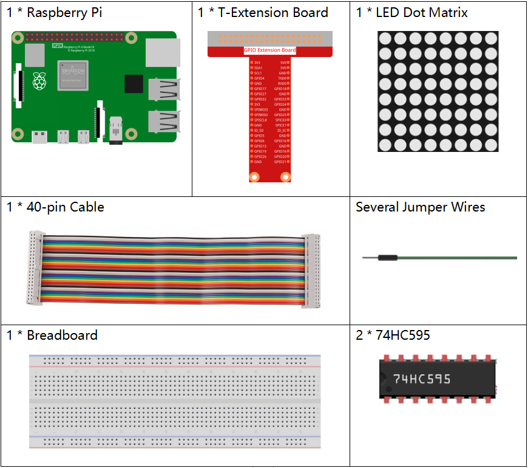
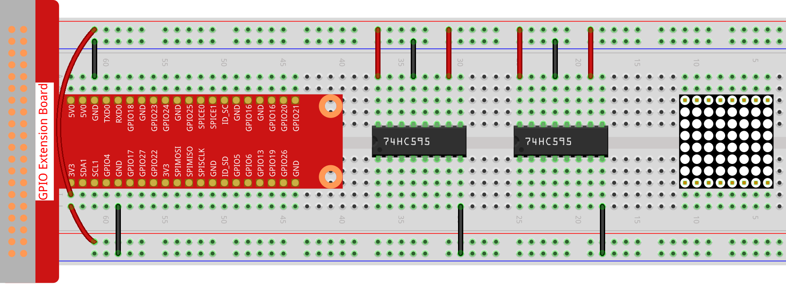
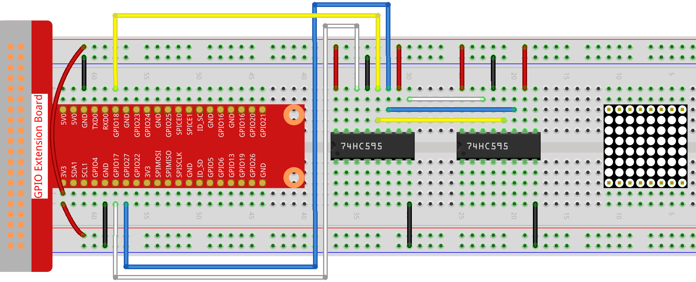
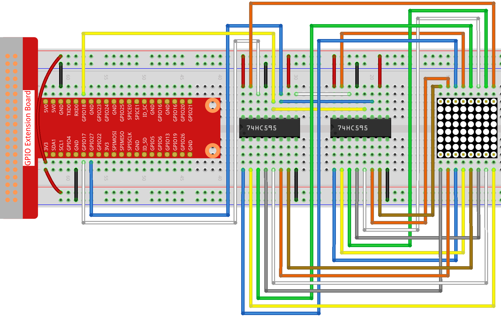
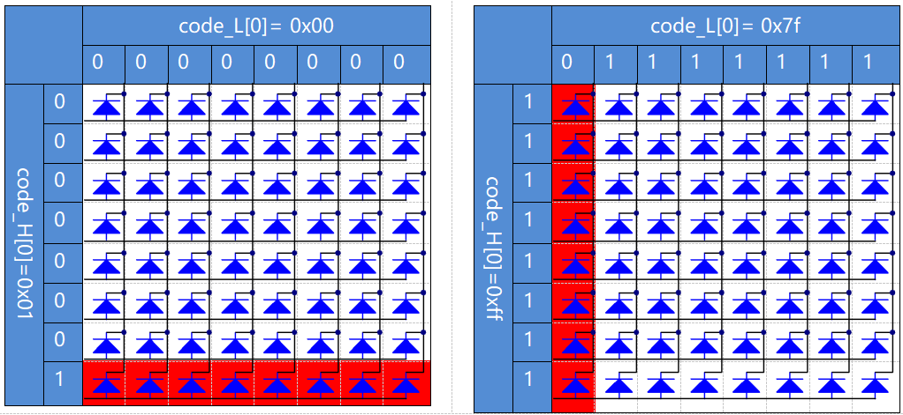
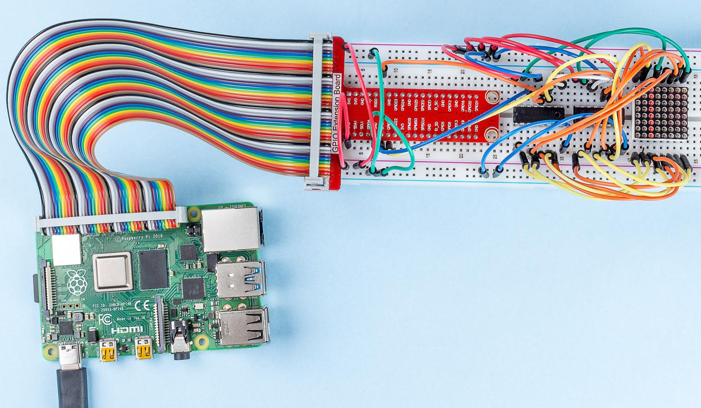

.. note::

    Hallo und willkommen in der SunFounder Raspberry Pi & Arduino & ESP32 Enthusiasten-Gemeinschaft auf Facebook! Tauchen Sie tiefer ein in die Welt von Raspberry Pi, Arduino und ESP32 mit anderen Enthusiasten.

    **Warum beitreten?**

    - **Expertenunterstützung**: Lösen Sie Nachverkaufsprobleme und technische Herausforderungen mit Hilfe unserer Gemeinschaft und unseres Teams.
    - **Lernen & Teilen**: Tauschen Sie Tipps und Anleitungen aus, um Ihre Fähigkeiten zu verbessern.
    - **Exklusive Vorschauen**: Erhalten Sie frühzeitigen Zugang zu neuen Produktankündigungen und exklusiven Einblicken.
    - **Spezialrabatte**: Genießen Sie exklusive Rabatte auf unsere neuesten Produkte.
    - **Festliche Aktionen und Gewinnspiele**: Nehmen Sie an Gewinnspielen und Feiertagsaktionen teil.

    👉 Sind Sie bereit, mit uns zu erkunden und zu erschaffen? Klicken Sie auf [|link_sf_facebook|] und treten Sie heute bei!

.. _py_matrix:

1.1.6 LED-Punktmatrix
=====================

Einführung
--------------------

Wie der Name schon sagt, eine LED-Punktmatrix ist eine Matrix aus LEDs. Das Aufleuchten und Dimmen der LEDs formuliert unterschiedliche Zeichen und Muster.

Komponenten
------------------

Prinzip
----------------

**LED-Punktmatrix**

Im Allgemeinen kann die LED-Punktmatrix in zwei Typen eingeteilt werden: gemeinsame Kathode (CC) und gemeinsame Anode (CA). 
Sie sehen sich sehr ähnlich, aber innerlich liegt der Unterschied. Sie können durch Test erkennen. In diesem Kit wird eine CA verwendet. 
Sie können 788BS an der Seite beschriftet sehen.

Siehe die Abbildung unten. Die Pins sind an den beiden Enden hinten angeordnet. Nehmen Sie die Etikettenseite als Referenz: 
Die Pins an diesem Ende sind Pin 1-8 und die anderen sind Pin 9-16.

Die Außenansicht:

.. image:: media/image84.png

Unten zeigen die Abbildungen ihre interne Struktur. Sie können in einer CA-LED-Punktmatrix sehen, 
dass ROW die Anode der LED darstellt und COL die Kathode ist. es ist das Gegenteil für einen CC. 
Eines ist gemeinsam: Für beide Typen sind Pin 13, 3, 4, 10, 6, 11, 15 und 16 alle COL, wenn Pin 9, 14, 8, 12, 1, 7, 2 und 5 alle COL sind REIHE. 
Wenn Sie die erste LED in der oberen linken Ecke einschalten möchten, 
setzen Sie für eine CA-LED-Punktmatrix einfach Pin 9 als High und Pin 13 als Low und für eine CC-Pin Pin 13 als High und Pin 9 als NIEDRIG . 
Wenn Sie die gesamte erste Spalte für CA aufleuchten möchten, setzen Sie Pin 13 auf Niedrig und REIHE 9, 14, 8, 12, 1, 7, 2 und 5 auf Hoch. 
Wenn Sie für CC Pin 13 auf Hoch und setzen REIHE 9, 14, 8, 12, 1, 7, 2 und 5 als niedrig. Betrachten Sie die folgenden Abbildungen zum besseren Verständnis.

Die interne Ansicht:

.. image:: media/image85.png
   :width: 400
   :align: center

Pin-Nummerierung entsprechend den obigen Zeilen und Spalten:

=========== ====== ====== ===== ====== ===== ====== ====== ======
**MIT DEM** **1**  **2**  **3** **4**  **5** **6**  **7**  **8**
**Pin No.** **13** **3**  **4** **10** **6** **11** **15** **16**
**REIHE**   **1**  **2**  **3** **4**  **5** **6**  **7**  **8**
**Pin No.** **9**  **14** **8** **12** **1** **7**  **2**  **5**
=========== ====== ====== ===== ====== ===== ====== ====== ======

Zusätzlich werden hier zwei 74HC595-Chips verwendet. Eine besteht darin, die Zeilen der LED-Punktmatrix zu steuern, während die andere die Spalten steuert.

Schematische Darstellung
---------------------------

============ ======== ======== ===
T-Karte Name physisch wiringPi BCM
GPIO17       Pin 11   0        17
GPIO18       Pin 12   1        18
GPIO27       Pin 13   2        27
============ ======== ======== ===

.. image:: media/schematic_dot.png
   :width: 800

Experimentelle Verfahren
----------------------------

Schritt 1: Bauen Sie die Schaltung auf. Da die Verkabelung kompliziert ist, machen wir es Schritt für Schritt. Setzen Sie zuerst den T-Cobbler, 
die LED-Punktmatrix und zwei 74HC595-Chips in das Steckbrett ein. Verbinden Sie die 3,
3 V und GND des T-Cobbler mit den Löchern auf den beiden Seiten der Platine und schließen Sie dann Pin 16 und 10 der beiden 74HC595-Chips an VCC, 
Pin 13 und Pin 8 an GND an.

.. note::
   Im Fritzing-Bild oben befindet sich die Seite mit der Beschriftung unten.

Schritt 2: Verbinden Sie Pin 11 der beiden 74HC595 miteinander und dann mit GPIO27. dann Pin 12 der beiden Chips und GPIO18; 
Als nächstes Pin 14 des 74HC595 auf der linken Seite an GPIO17 und Pin 9 an Pin 14 des zweiten 74HC595.

Schritt 3: Der 74HC595 auf der rechten Seite steuert die Spalten der LED-Punktmatrix. 
Die Zuordnung finden Sie in der folgenden Tabelle. 
Daher werden die Q0-Q7-Pins des 74HC595 mit Pin 13, 3, 4, 10, 6, 11, 15 bzw. 16 abgebildet.

+--------------------+--------+--------+--------+--------+--------+--------+--------+--------+
|   74HC595          | **Q0** | **Q1** | **Q2** | **Q3** | **Q4** | **Q5** | **Q6** | **Q7** |
+--------------------+--------+--------+--------+--------+--------+--------+--------+--------+
|  LED-Punktmatrix   | **13** | **3**  | **4**  | **10** | **6**  | **11** | **15** | **16** |
+--------------------+--------+--------+--------+--------+--------+--------+--------+--------+

.. image:: media/image89.png
   :width: 800

Schritt 4: Verbinden Sie nun die REIHEN der LED-Punktmatrix. 
Der 74HC595 auf der linken Seite steuert die REIHE der LED-Punktmatrix. Die Zuordnung finden Sie in der folgenden Tabelle. 
Wir können sehen, dass Q0-Q7 des 74HC595 auf der linken Seite mit Pin 9, 14, 8, 12, 1, 7, 2 bzw. 5 abgebildet sind.

+--------------------+--------+--------+--------+--------+--------+--------+--------+--------+
|   74HC595          | **Q0** | **Q1** | **Q2** | **Q3** | **Q4** | **Q5** | **Q6** | **Q7** |
+--------------------+--------+--------+--------+--------+--------+--------+--------+--------+
|  LED-Punktmatrix   | **9**  | **14** | **8**  | **12** | **1**  | **7**  | **2**  | **5**  |
+--------------------+--------+--------+--------+--------+--------+--------+--------+--------+

   
Für Benutzer in C-Sprache
^^^^^^^^^^^^^^^^^^^^^^^^^^^^^^^

Schritt 5: Wechseln Sie in den Codeordner.

.. raw:: html

   <run></run>

.. code-block::

   cd ~/davinci-kit-for-raspberry-pi/c/1.1.6/

Schritt 6: Kompilieren.

.. raw:: html

   <run></run>

.. code-block::

   gcc 1.1.6_LedMatrix.c -lwiringPi

Schritt 7: Ausführen.

.. raw:: html

   <run></run>

.. code-block::

   sudo ./a.out

Nachdem die Kode ausgeführt wurde, leuchtet die LED-Punktmatrix Zeile für Zeile und Spalte für Spalte auf und aus.

**Code**

.. code-block:: c

   #include <wiringPi.h>
   #include <stdio.h>

   #define   SDI   0   //serial data input
   #define   RCLK  1   //memory clock input(STCP)
   #define   SRCLK 2   //shift register clock input(SHCP)

   unsigned char code_H[20] = {0x01,0xff,0x80,0xff,0x01,0x02,0x04,0x08,0x10,0x20,0x40,0x80,0xff,0xff,0xff,0xff,0xff,0xff,0xff,0xff};
   unsigned char code_L[20] = {0x00,0x7f,0x00,0xfe,0x00,0x00,0x00,0x00,0x00,0x00,0x00,0x00,0xfe,0xfd,0xfb,0xf7,0xef,0xdf,0xbf,0x7f};

   void init(void){
      pinMode(SDI, OUTPUT); 
      pinMode(RCLK, OUTPUT);
      pinMode(SRCLK, OUTPUT);

      digitalWrite(SDI, 0);
      digitalWrite(RCLK, 0);
      digitalWrite(SRCLK, 0);
   }

   void hc595_in(unsigned char dat){
      int i;
      for(i=0;i<8;i++){
         digitalWrite(SDI, 0x80 & (dat << i));
         digitalWrite(SRCLK, 1);
         delay(1);
         digitalWrite(SRCLK, 0);
      }
   }

   void hc595_out(){
      digitalWrite(RCLK, 1);
      delay(1);
      digitalWrite(RCLK, 0);
   }

   int main(void){
      int i;
      if(wiringPiSetup() == -1){ //when initialize wiring failed, print message to screen
         printf("setup wiringPi failed !");
         return 1;
      }
      init();
      while(1){
         for(i=0;i<sizeof(code_H);i++){
               hc595_in(code_L[i]);
               hc595_in(code_H[i]);
               hc595_out();
               delay(100);
         }

         for(i=sizeof(code_H);i>=0;i--){
               hc595_in(code_L[i]);
               hc595_in(code_H[i]);
               hc595_out();
               delay(100);
         }
      }

      return 0;
   }

**Code Erklärung**

.. code-block:: c

   unsigned char code_H[20] = {0x01,0xff,0x80,0xff,0x01,0x02,0x04,0x08,0x10,0x20,0x40,0x80,0xff,0xff,0xff,0xff,0xff,0xff,0xff,0xff};
   unsigned char code_L[20] = {0x00,0x7f,0x00,0xfe,0x00,0x00,0x00,0x00,0x00,0x00,0x00,0x00,0xfe,0xfd,0xfb,0xf7,0xef,0xdf,0xbf,0x7f};

Der Array-Kode_H repräsentiert die Elemente der LED-Punktmatrixzeile, und der Array-Code_L bezieht sich auf die Elemente der Spalte. 
Wenn Zeichen angezeigt werden, werden ein Element in Zeile und eines in Spalte erfasst und den beiden HC595-Chips zugewiesen. 
Somit ist ein Muster auf der LED-Punktmatrix gezeigt. Nehmen Sie als Beispiele die erste Nummer von code_H, 0x01 und die erste Nummer von code_L, 0x00.

0x01 konvertiert in Binär wird 00000001; 0x00 konvertiert in Binär wird 0000 0000.

In diesem Kit wird eine LED-Punktmatrixanzeige mit gemeinsamer Anode verwendet, sodass nur die acht LEDs in der achten Reihe aufleuchten. 
Wenn die Bedingungen, dass Code H 0xff und Code_L 0x7f ist, gleichzeitig erfüllt sind, leuchten diese 8 LEDs in der ersten Spalte.

.. code-block:: c

   void hc595_in(unsigned char dat){
      int i;
      for(i=0;i<8;i++){
         digitalWrite(SDI, 0x80 & (dat << i));
         digitalWrite(SRCLK, 1);
         delay(1);
         digitalWrite(SRCLK, 0);

Schreiben Sie den Wert von dat bitweise auf den Pin SDI des HC595. Der Anfangswert von SRCLK wurde auf 0 gesetzt, und hier ist er auf 1 gesetzt, 
was einen ansteigenden Flankenimpuls erzeugen und dann das pinSDI(DS)-Datum in das Schieberegister verschieben soll.

.. code-block:: c

   void hc595_out(){
      digitalWrite(RCLK, 1);
      delay(1);
      digitalWrite(RCLK, 0);

Der Anfangswert von RCLK wurde auf 0 gesetzt, und hier wird er auf 1 gesetzt, um eine ansteigende Flanke zu erzeugen und dann Daten vom Schieberegister zum Speicherregister zu verschieben.

.. code-block:: c

   while(1){
      for(i=0;i<sizeof(code_H);i++){
         hc595_in(code_L[i]);
         hc595_in(code_H[i]);
         hc595_out();
         delay(100);
      }
   }

In dieser Schleife werden diese 20 Elemente in den beiden Arrays Kode_L und code_H nacheinander auf die beiden 74HC595-Chips hochgeladen. Rufen Sie dann die Funktion hc595_out () auf, um Daten vom Schieberegister zum Speicherregister zu verschieben.

Für Python-Sprachbenutzer
^^^^^^^^^^^^^^^^^^^^^^^^^^^^^^

Schritt 5: Gehen Sie in den Kode-Ordner.

.. raw:: html

   <run></run>

.. code-block::

   cd ~/davinci-kit-for-raspberry-pi/python

Schritt 6: Ausführen.

.. raw:: html

   <run></run>

.. code-block::

   sudo python3 1.1.6_LedMatrix.py

Nachdem die Kode ausgeführt wurde, leuchtet die LED-Punktmatrix Zeile für Zeile und Spalte für Spalte auf und aus.

**Code**

.. note::

   Sie können den folgenden Code **Ändern/Zurücksetzen/Kopieren/Ausführen/Stoppen**. Zuvor müssen Sie jedoch zu einem Quellcodepfad wie ``davinci-kit-for-raspberry-pi/python`` gehen.
   
.. raw:: html

    <run></run>

.. code-block:: python

   import RPi.GPIO as GPIO
   import time

   SDI   = 17
   RCLK  = 18
   SRCLK = 27

   # we use BX matrix, ROW for anode, and COL for cathode
   # ROW  ++++
   code_H = [0x01,0xff,0x80,0xff,0x01,0x02,0x04,0x08,0x10,0x20,0x40,0x80,0xff,0xff,0xff,0xff,0xff,0xff,0xff,0xff]
   # COL  ----
   code_L = [0x00,0x7f,0x00,0xfe,0x00,0x00,0x00,0x00,0x00,0x00,0x00,0x00,0xfe,0xfd,0xfb,0xf7,0xef,0xdf,0xbf,0x7f]

   def setup():
      GPIO.setmode(GPIO.BCM)    # Number GPIOs by its BCM location
      GPIO.setup(SDI, GPIO.OUT)
      GPIO.setup(RCLK, GPIO.OUT)
      GPIO.setup(SRCLK, GPIO.OUT)
      GPIO.output(SDI, GPIO.LOW)
      GPIO.output(RCLK, GPIO.LOW)
      GPIO.output(SRCLK, GPIO.LOW)

   # Shift the data to 74HC595
   def hc595_shift(dat):
      for bit in range(0, 8): 
         GPIO.output(SDI, 0x80 & (dat << bit))
         GPIO.output(SRCLK, GPIO.HIGH)
         time.sleep(0.001)
         GPIO.output(SRCLK, GPIO.LOW)
      GPIO.output(RCLK, GPIO.HIGH)
      time.sleep(0.001)
      GPIO.output(RCLK, GPIO.LOW)

   def main():
      while True:
         for i in range(0, len(code_H)):
               hc595_shift(code_L[i])
               hc595_shift(code_H[i])
               time.sleep(0.1)

         for i in range(len(code_H)-1, -1, -1):
               hc595_shift(code_L[i])
               hc595_shift(code_H[i])
               time.sleep(0.1)

   def destroy():
      GPIO.cleanup()

   if __name__ == '__main__':
      setup()
      try:
         main()
      except KeyboardInterrupt:
         destroy()

**Code Erklärung**

.. code-block:: python

   code_H = [0x01,0xff,0x80,0xff,0x01,0x02,0x04,0x08,0x10,0x20,0x40,0x80,0xff,0xff,0xff,0xff,0xff,0xff,0xff,0xff]
   code_L = [0x00,0x7f,0x00,0xfe,0x00,0x00,0x00,0x00,0x00,0x00,0x00,0x00,0xfe,0xfd,0xfb,0xf7,0xef,0xdf,0xbf,0x7f]

Das Array code_H repräsentiert die Elemente der Matix-Zeile, und das Array code_L bezieht sich auf die Elemente der Spalte. Wenn Zeichen angezeigt werden, werden ein Element in Zeile und eines in Spalte erfasst und den beiden HC595-Chips zugewiesen. Somit ist ein Muster auf der LED-Punktmatrix gezeigt. Nehmen Sie als Beispiele die erste Nummer von code_H, 0x01 und die erste Nummer von code_L, 0x00.

0x01 konvertiert in Binär wird 00000001; 0x00 konvertiert in Binär wird 0000 0000.

In diesem Kit wird eine gemeinsame Anoden-LED-Punktmatrix angewendet, sodass nur die acht LEDs in der achten Reihe aufleuchten. Wenn die Bedingungen, dass Code H 0xff und Code_L 0x7f ist, gleichzeitig erfüllt sind, leuchten diese 8 LEDs in der ersten Spalte.
							

.. code-block:: python

   for i in range(0, len(code_H)):
      hc595_shift(code_L[i])
      hc595_shift(code_H[i])

In dieser Schleife werden diese 20 Elemente in den beiden Arrays Kode_L und Kode_H nacheinander auf den HC595-Chip hochgeladen.

.. note::
   Wenn Sie Zeichen in der LED-Punktmatrix anzeigen möchten, lesen Sie bitte einen Python-Code: https://github.com/sunfounder/SunFounder_Dot_Matrix.

Phänomen Bild
-----------------------

