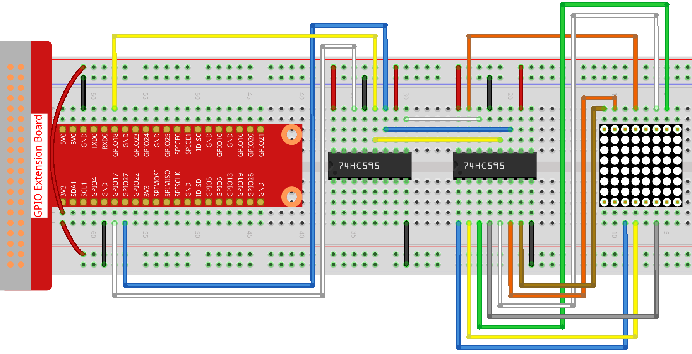

1.1.6 LED Dot Matrix
=====================

Introduction
--------------------

As the name suggests, an LED dot matrix is a matrix composed of LEDs.
The lighting up and dimming of the LEDs formulate different characters
and patterns.

Components
------------------

.. image:: media/list_dot.png

Principle
----------------

**LED Dot Matrix**

Generally, LED dot matrix can be categorized into two types: common
cathode (CC) and common anode (CA). They look much alike, but internally
the difference lies. You can tell by test. A CA one is used in this kit.
You can see 788BS labeled at the side.

See the figure below. The pins are arranged at the two ends at the back.
Take the label side for reference: pins on this end are pin 1-8, and oh
the other are pin 9-16.

The external view:

.. image:: media/image84.png

Below the figures show their internal structure. You can see in a CA LED
dot matrix, ROW represents the anode of the LED, and COL is cathode;
it's contrary for a CC one. One thing in common: for both types, pin 13,
3, 4, 10, 6, 11, 15, and 16 are all COL, when pin 9, 14, 8, 12, 1, 7, 2,
and 5 are all ROW. If you want to turn on the first LED at the top left
corner, for a CA LED dot matrix, just set pin 9 as High and pin 13 as
Low, and for a CC one, set pin 13 as High and pin 9 as Low. If you want
to light up the whole first column, for CA, set pin 13 as Low and ROW 9,
14, 8, 12, 1, 7, 2, and 5 as High, when for CC, set pin 13 as High and
ROW 9, 14, 8, 12, 1, 7, 2, and 5 as Low. Consider the following figures
for better understanding.

The internal view:

.. image:: media/image85.png

Pin numbering corresponding to the above rows and columns:

=========== ====== ====== ===== ====== ===== ====== ====== ======
**COL**     **1**  **2**  **3** **4**  **5** **6**  **7**  **8**
**Pin No.** **13** **3**  **4** **10** **6** **11** **15** **16**
**ROW**     **1**  **2**  **3** **4**  **5** **6**  **7**  **8**
**Pin No.** **9**  **14** **8** **12** **1** **7**  **2**  **5**
=========== ====== ====== ===== ====== ===== ====== ====== ======

In addition, two 74HC595 chips are used here. One is to control the rows
of the LED dot matrix while the other, the columns.

Schematic Diagram
-----------------------

============ ======== ======== ===
T-Board Name physical wiringPi BCM
GPIO17       Pin 11   0        17
GPIO18       Pin 12   1        18
GPIO27       Pin 13   2        27
============ ======== ======== ===

.. image:: media/schematic_dot.png

Experimental Procedures
----------------------------

**Step 1:** Build the circuit. Since the wiring is complicated, let's
make it step by step. First, insert the T-Cobbler, the LED dot matrix
and two 74HC595 chips into breadboard. Connect the 3.3V and GND of the
T-Cobbler to holes on the two sides of the board, then hook up pin16 and
10 of the two 74HC595 chips to VCC, pin 13 and pin 8 to GND.

.. note::
   In the Fritzing image above, the side with label is at the bottom.

.. image:: media/image87.png

**Step 2:** Connect pin 11 of the two 74HC595 together, and then to
GPIO27; then pin 12 of the two chips, and to GPIO18; next, pin 14 of the
74HC595 on the left side to GPIO17 and pin 9 to pin 14 of the second
74HC595.

.. image:: media/image88.png

**Step 3:** The 74HC595 on the right side is to control columns of the
LED dot matrix. See the table below for the mapping. Therefore, Q0-Q7
pins of the 74HC595 are mapped with pin 13, 3, 4, 10, 6, 11, 15, and 16
respectively.

+--------------------+--------+--------+--------+--------+--------+--------+--------+--------+
| **74HC595**        | **Q0** | **Q1** | **Q2** | **Q3** | **Q4** | **Q5** | **Q6** | **Q7** |
+--------------------+--------+--------+--------+--------+--------+--------+--------+--------+
| **LED Dot Matrix** | **13** | **3**  | **4**  | **10** | **6**  | **11** | **15** | **16** |
+--------------------+--------+--------+--------+--------+--------+--------+--------+--------+

**Step 4:** Now connect the ROWs of the LED dot matrix. The 74HC595 on
the left controls ROW of the LED dot matrix. See the table below for the
mapping. We can see, Q0-Q7 of the 74HC595 on the left are mapped with
pin 9, 14, 8, 12, 1, 7, 2, and 5 respectively.

+--------------------+--------+--------+--------+--------+--------+--------+--------+--------+
| **74HC595**        | **Q0** | **Q1** | **Q2** | **Q3** | **Q4** | **Q5** | **Q6** | **Q7** |
+--------------------+--------+--------+--------+--------+--------+--------+--------+--------+
| **LED Dot Matrix** | **9**  | **14** | **8**  | **12** | **1**  | **7**  | **2**  | **5**  |
+--------------------+--------+--------+--------+--------+--------+--------+--------+--------+

For C Language Users
^^^^^^^^^^^^^^^^^^^^^

**Step 5:** Go to the folder of code.

.. code-block::

   cd /home/pi/davinci-kit-for-raspberry-pi/c/1.1.6/

**Step 6:** Compile.

.. code-block::

   gcc 1.1.6_LedMatrix.c -lwiringPi

**Step 7:** Run.

.. code-block::

   sudo ./a.out

After the code runs, the LED dot matrix lights up and out row by row and column by column.

**Code**

.. code-block:: c

   #include <wiringPi.h>
   #include <stdio.h>

   #define   SDI   0   //serial data input
   #define   RCLK  1   //memory clock input(STCP)
   #define   SRCLK 2   //shift register clock input(SHCP)

   unsigned char code_H[20] = {0x01,0xff,0x80,0xff,0x01,0x02,0x04,0x08,0x10,0x20,0x40,0x80,0xff,0xff,0xff,0xff,0xff,0xff,0xff,0xff};
   unsigned char code_L[20] = {0x00,0x7f,0x00,0xfe,0x00,0x00,0x00,0x00,0x00,0x00,0x00,0x00,0xfe,0xfd,0xfb,0xf7,0xef,0xdf,0xbf,0x7f};

   void init(void){
      pinMode(SDI, OUTPUT); 
      pinMode(RCLK, OUTPUT);
      pinMode(SRCLK, OUTPUT);

      digitalWrite(SDI, 0);
      digitalWrite(RCLK, 0);
      digitalWrite(SRCLK, 0);
   }

   void hc595_in(unsigned char dat){
      int i;
      for(i=0;i<8;i++){
         digitalWrite(SDI, 0x80 & (dat << i));
         digitalWrite(SRCLK, 1);
         delay(1);
         digitalWrite(SRCLK, 0);
      }
   }

   void hc595_out(){
      digitalWrite(RCLK, 1);
      delay(1);
      digitalWrite(RCLK, 0);
   }

   int main(void){
      int i;
      if(wiringPiSetup() == -1){ //when initialize wiring failed, print message to screen
         printf("setup wiringPi failed !");
         return 1;
      }
      init();
      while(1){
         for(i=0;i<sizeof(code_H);i++){
               hc595_in(code_L[i]);
               hc595_in(code_H[i]);
               hc595_out();
               delay(100);
         }

         for(i=sizeof(code_H);i>=0;i--){
               hc595_in(code_L[i]);
               hc595_in(code_H[i]);
               hc595_out();
               delay(100);
         }
      }

      return 0;
   }

**Code Explanation**

.. code-block:: c

   unsigned char code_H[20] = {0x01,0xff,0x80,0xff,0x01,0x02,0x04,0x08,0x10,0x20,0x40,0x80,0xff,0xff,0xff,0xff,0xff,0xff,0xff,0xff};
   unsigned char code_L[20] = {0x00,0x7f,0x00,0xfe,0x00,0x00,0x00,0x00,0x00,0x00,0x00,0x00,0xfe,0xfd,0xfb,0xf7,0xef,0xdf,0xbf,0x7f};

The array code_H represents the elements of the LED dot matrix row, and the array code_L refers to the elements of the column. When characters are displayed, an element in row and one in column are acquired and assigned to the two HC595 chips respectively. Thus a pattern is shown on the LED dot matrix.
Take the first number of code_H, 0x01 and the first number of code_L, 0x00 as examples.

0x01 converted to binary becomes 00000001; 0x00 converted to binary becomes 0000 0000.

In this kit, common anode LED dot matrix display is applied, so only the eight LEDs in the eighth row light up. 
When the conditions that code H is 0xff and code_L is 0x7f are met simultaneously, these 8 LEDs in the first column are lit.

.. image:: media/anode_table.png

.. code-block:: c

   void hc595_in(unsigned char dat){
      int i;
      for(i=0;i<8;i++){
         digitalWrite(SDI, 0x80 & (dat << i));
         digitalWrite(SRCLK, 1);
         delay(1);
         digitalWrite(SRCLK, 0);

Write the value of dat to pin SDI of the HC595 bit by bit. SRCLK's initial value was set to 0, and here it's set to 1, which is to generate a rising edge pulse, then shift the pinSDI(DS) date to shift register.
.. code-block:: c

   void hc595_out(){
      digitalWrite(RCLK, 1);
      delay(1);
      digitalWrite(RCLK, 0);

RCLK's initial value was set to 0, and here it's set to 1, which is to generate a rising edge, then shift data from shift register to storage register.       

.. code-block:: c

   while(1){
      for(i=0;i<sizeof(code_H);i++){
         hc595_in(code_L[i]);
         hc595_in(code_H[i]);
         hc595_out();
         delay(100);
      }
   }

In this loop, these 20  elements in the two arrays, code_L and code_H will be uploaded to the two 74HC595 chip one by one. Then call the function, hc595_out() to shift data from shift register to storage register. 

For Python Language Users
^^^^^^^^^^^^^^^^^^^^^^^^^^^^^^

**Step 5:** Get into the folder of code.

.. code-block::

   cd /home/pi/davinci-kit-for-raspberry-pi/python

**Step 6:** Run.

.. code-block::

   sudo python3 1.1.6_LedMatrix.py

After the code runs, the LED dot matrix lights up and out row by row and column by column.

**Code**

.. code-block:: python

   import RPi.GPIO as GPIO
   import time
   SDI   = 17
   RCLK  = 18
   SRCLK = 27

   # we use BX matrix, ROW for anode, and COL for cathode
   # ROW  ++++
   code_H = [0x01,0xff,0x80,0xff,0x01,0x02,0x04,0x08,0x10,0x20,0x40,0x80,0xff,0xff,0xff,0xff,0xff,0xff,0xff,0xff]
   # COL  ----
   code_L = [0x00,0x7f,0x00,0xfe,0x00,0x00,0x00,0x00,0x00,0x00,0x00,0x00,0xfe,0xfd,0xfb,0xf7,0xef,0xdf,0xbf,0x7f]

   def setup():
      GPIO.setmode(GPIO.BCM)    # Number GPIOs by its BCM location
      GPIO.setup(SDI, GPIO.OUT)
      GPIO.setup(RCLK, GPIO.OUT)
      GPIO.setup(SRCLK, GPIO.OUT)
      GPIO.output(SDI, GPIO.LOW)
      GPIO.output(RCLK, GPIO.LOW)
      GPIO.output(SRCLK, GPIO.LOW)

   # Shift the data to 74HC595
   def hc595_shift(dat):
      for bit in range(0, 8):
         GPIO.output(SDI, 0x80 & (dat << bit))
         GPIO.output(SRCLK, GPIO.HIGH)
         time.sleep(0.001)
         GPIO.output(SRCLK, GPIO.LOW)
      GPIO.output(RCLK, GPIO.HIGH)
      time.sleep(0.001)
      GPIO.output(RCLK, GPIO.LOW)

   def main():
      while True:
         for i in range(0, len(code_H)):
            hc595_shift(code_L[i])
            hc595_shift(code_H[i])
            time.sleep(0.1)

         for i in range(len(code_H)-1, -1, -1):
            hc595_shift(code_L[i])
            hc595_shift(code_H[i])
            time.sleep(0.1)

   def destroy():
      GPIO.cleanup()

   if __name__ == '__main__':
      setup()
      try:
         main()
      except KeyboardInterrupt:
         destroy()

**Code Explanation**

.. code-block:: python

   code_H = [0x01,0xff,0x80,0xff,0x01,0x02,0x04,0x08,0x10,0x20,0x40,0x80,0xff,0xff,0xff,0xff,0xff,0xff,0xff,0xff]
   code_L = [0x00,0x7f,0x00,0xfe,0x00,0x00,0x00,0x00,0x00,0x00,0x00,0x00,0xfe,0xfd,0xfb,0xf7,0xef,0xdf,0xbf,0x7f]

The array code_H represents the elements of the matix row, and the array code_L refers to the elements of the column. When characters are displayed, an element in row and one in column are acquired and assigned to the two HC595 chips respectively. Thus a pattern is shown on the LED dot  matrix.
Take the first number of code_H, 0x01 and the first number of code_L, 0x00 as examples.

0x01 converted to binary becomes 00000001; 0x00 converted to binary becomes 0000 0000.

In this kit, common anode LED dot matrix is applied, so only the eight LEDs in the eighth row light up. 
When the conditions that code H is 0xff and code_L is 0x7f are met simultaneously, these 8 LEDs in the first column are lit.
							
.. image:: media/anode_table.png

.. code-block:: python

   for i in range(0, len(code_H)):
      hc595_shift(code_L[i])
      hc595_shift(code_H[i])

In this loop, these 20 elements in the two arrays, code_L and code_H will be uploaded to the HC595 chip one by one. 

.. note::
   If you want to display characters on the LED dot matrix, please refer to a python code: https://github.com/sunfounder/SunFounder_Dot_Matrix

Phenomenon Picture
-----------------------

