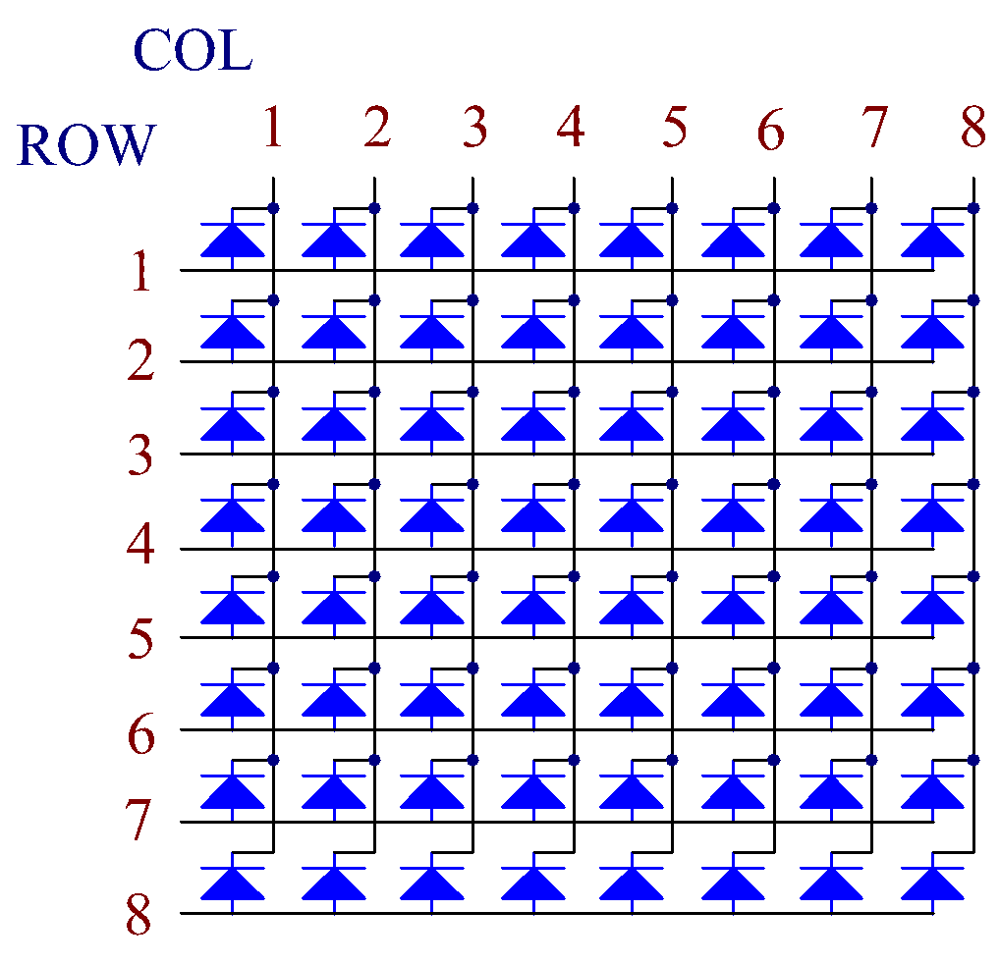

.. note::

    Ciao, benvenuto nella SunFounder Raspberry Pi & Arduino & ESP32 Enthusiasts Community su Facebook! Esplora più a fondo il mondo di Raspberry Pi, Arduino ed ESP32 insieme ad altri appassionati.

    **Perché unirsi?**

    - **Supporto Esperto**: Risolvi problematiche post-vendita e sfide tecniche con l'aiuto della nostra community e del nostro team.
    - **Impara e Condividi**: Scambia consigli e tutorial per migliorare le tue competenze.
    - **Anteprime Esclusive**: Accedi in anteprima agli annunci sui nuovi prodotti.
    - **Sconti Speciali**: Approfitta di sconti esclusivi sui nostri ultimi prodotti.
    - **Promozioni e Giveaway**: Partecipa a promozioni festive e a giveaway.

    👉 Pronto a esplorare e creare con noi? Clicca [|link_sf_facebook|] e unisciti subito!

1.1.6 Matrice di LED
========================

Introduzione
--------------------

Come suggerisce il nome, una matrice di LED è una matrice composta da LED.
L'accensione e lo spegnimento dei LED formano diversi caratteri e motivi.

Componenti
------------------

.. image:: img/list_dot.png

Principio
----------------

**Matrice di LED**

Generalmente, le matrici di LED si suddividono in due tipi: catodo comune 
(CC) e anodo comune (CA). Esteriormente sembrano simili, ma differiscono 
internamente. È possibile verificare il tipo tramite un test. In questo kit, 
utilizziamo una matrice CA, riconoscibile dalla sigla 788BS sul lato.

Vedi l'immagine seguente. I pin sono disposti sui due lati posteriori.
Prendendo come riferimento il lato con l’etichetta, i pin su questo lato sono 
numerati da 1 a 8, mentre sull'altro lato sono da 9 a 16.

Vista esterna:

.. image:: img/image84.png

Di seguito sono riportate le strutture interne. In una matrice di LED CA, le 
RIGHE rappresentano l’anodo del LED e le COLONNE il catodo; è il contrario per 
una CC. Per entrambi i tipi, i pin 13, 3, 4, 10, 6, 11, 15 e 16 sono COL, mentre 
i pin 9, 14, 8, 12, 1, 7, 2 e 5 sono ROW. Per accendere il primo LED nell'angolo 
in alto a sinistra, in una matrice CA, impostare il pin 9 su High e il pin 13 su 
Low; per una matrice CC, impostare il pin 13 su High e il pin 9 su Low. 
Per accendere l'intera prima colonna, in CA impostare il pin 13 su Low e le righe 
9, 14, 8, 12, 1, 7, 2 e 5 su High, mentre per CC impostare il pin 13 su High e le 
righe su Low.

Vista interna:

Numerazione dei pin in base alle righe e colonne:

=========== ====== ====== ===== ====== ===== ====== ====== ======
**COL**     **1**  **2**  **3** **4**  **5** **6**  **7**  **8**
**Pin No.** **13** **3**  **4** **10** **6** **11** **15** **16**
**ROW**     **1**  **2**  **3** **4**  **5** **6**  **7**  **8**
**Pin No.** **9**  **14** **8** **12** **1** **7**  **2**  **5**
=========== ====== ====== ===== ====== ===== ====== ====== ======

Inoltre, vengono utilizzati due chip 74HC595. Uno controlla le righe della 
matrice di LED, mentre l'altro le colonne.

Schema a Blocchi
-----------------------

============ ======== ======== ===
T-Board Name physical wiringPi BCM
GPIO17       Pin 11   0        17
GPIO18       Pin 12   1        18
GPIO27       Pin 13   2        27
============ ======== ======== ===

.. image:: img/schematic_dot.png
   :width: 800

Procedure Sperimentali
----------------------------

**Passo 1:** Costruire il circuito. Poiché il cablaggio è complicato, 
procedere passo dopo passo. Inserire il T-Cobbler, la matrice di LED e 
due chip 74HC595 nella breadboard. Collegare il 3.3V e GND del T-Cobbler 
ai fori sui due lati della board, quindi collegare i pin 16 e 10 dei due 
chip 74HC595 a VCC, i pin 13 e 8 a GND.

.. note::
   Nell'immagine Fritzing sopra, il lato con l'etichetta si trova in basso.

**Passo 2:** Collegare il pin 11 dei due 74HC595 insieme e poi a GPIO27; 
poi il pin 12 dei due chip a GPIO18; infine, collegare il pin 14 del 74HC595 
a sinistra a GPIO17 e il pin 9 al pin 14 del secondo 74HC595.

.. image:: img/image88.png
   :width: 800

**Passo 3:** Il 74HC595 sul lato destro controlla le colonne della matrice 
di LED. La tabella seguente mostra il mapping. I pin Q0-Q7 del 74HC595 
corrispondono rispettivamente ai pin 13, 3, 4, 10, 6, 11, 15 e 16.

+--------------------+--------+--------+--------+--------+--------+--------+--------+--------+
| **74HC595**        | **Q0** | **Q1** | **Q2** | **Q3** | **Q4** | **Q5** | **Q6** | **Q7** |
+--------------------+--------+--------+--------+--------+--------+--------+--------+--------+
| **LED Dot Matrix** | **13** | **3**  | **4**  | **10** | **6**  | **11** | **15** | **16** |
+--------------------+--------+--------+--------+--------+--------+--------+--------+--------+

.. image:: img/image89.png
   :width: 800

**Passo 4:** Ora collegare le RIGHE della matrice di LED. Il 74HC595 a sinistra 
controlla le RIGHE della matrice di LED. La tabella seguente mostra il mapping. 
Q0-Q7 del 74HC595 a sinistra corrispondono rispettivamente ai pin 9, 14, 8, 12, 
1, 7, 2 e 5.

+--------------------+--------+--------+--------+--------+--------+--------+--------+--------+
| **74HC595**        | **Q0** | **Q1** | **Q2** | **Q3** | **Q4** | **Q5** | **Q6** | **Q7** |
+--------------------+--------+--------+--------+--------+--------+--------+--------+--------+
| **LED Dot Matrix** | **9**  | **14** | **8**  | **12** | **1**  | **7**  | **2**  | **5**  |
+--------------------+--------+--------+--------+--------+--------+--------+--------+--------+

.. image:: img/image90.png
   :width: 800
   
Per gli utenti del linguaggio C
^^^^^^^^^^^^^^^^^^^^^^^^^^^^^^^^^^^^

**Passo 5:** Vai nella cartella del codice.

.. raw:: html

   <run></run>

.. code-block::

   cd ~/davinci-kit-for-raspberry-pi/c/1.1.6/

**Passo 6:** Compilare.

.. raw:: html

   <run></run>

.. code-block::

   gcc 1.1.6_LedMatrix.c -lwiringPi

**Passo 7:** Eseguire.

.. raw:: html

   <run></run>

.. code-block::

   sudo ./a.out

Dopo l'esecuzione del codice, la matrice di LED si accenderà e spegnerà riga per riga e colonna per colonna.

.. note::

   Se il codice non funziona o compare il messaggio di errore: "wiringPi.h: No such file or directory", fare riferimento a :ref:`Il codice C non funziona?`.

**Code**

.. code-block:: c

   #include <wiringPi.h>
   #include <stdio.h>

   #define   SDI   0   //serial data input
   #define   RCLK  1   //memory clock input(STCP)
   #define   SRCLK 2   //shift register clock input(SHCP)

   unsigned char code_H[20] = {0x01,0xff,0x80,0xff,0x01,0x02,0x04,0x08,0x10,0x20,0x40,0x80,0xff,0xff,0xff,0xff,0xff,0xff,0xff,0xff};
   unsigned char code_L[20] = {0x00,0x7f,0x00,0xfe,0x00,0x00,0x00,0x00,0x00,0x00,0x00,0x00,0xfe,0xfd,0xfb,0xf7,0xef,0xdf,0xbf,0x7f};

   void init(void){
      pinMode(SDI, OUTPUT); 
      pinMode(RCLK, OUTPUT);
      pinMode(SRCLK, OUTPUT);

      digitalWrite(SDI, 0);
      digitalWrite(RCLK, 0);
      digitalWrite(SRCLK, 0);
   }

   void hc595_in(unsigned char dat){
      int i;
      for(i=0;i<8;i++){
         digitalWrite(SDI, 0x80 & (dat << i));
         digitalWrite(SRCLK, 1);
         delay(1);
         digitalWrite(SRCLK, 0);
      }
   }

   void hc595_out(){
      digitalWrite(RCLK, 1);
      delay(1);
      digitalWrite(RCLK, 0);
   }

   int main(void){
      int i;
      if(wiringPiSetup() == -1){ //when initialize wiring failed, print message to screen
         printf("setup wiringPi failed !");
         return 1;
      }
      init();
      while(1){
         for(i=0;i<sizeof(code_H);i++){
               hc595_in(code_L[i]);
               hc595_in(code_H[i]);
               hc595_out();
               delay(100);
         }

         for(i=sizeof(code_H);i>=0;i--){
               hc595_in(code_L[i]);
               hc595_in(code_H[i]);
               hc595_out();
               delay(100);
         }
      }

      return 0;
   }
**Spiegazione del Codice**

.. code-block:: c

   unsigned char code_H[20] = {0x01,0xff,0x80,0xff,0x01,0x02,0x04,0x08,0x10,0x20,0x40,0x80,0xff,0xff,0xff,0xff,0xff,0xff,0xff,0xff};
   unsigned char code_L[20] = {0x00,0x7f,0x00,0xfe,0x00,0x00,0x00,0x00,0x00,0x00,0x00,0x00,0xfe,0xfd,0xfb,0xf7,0xef,0xdf,0xbf,0x7f};

L'array `code_H` rappresenta gli elementi della riga della matrice di LED, mentre l'array `code_L` si riferisce agli elementi della colonna. Durante la visualizzazione dei caratteri, un elemento della riga e uno della colonna vengono acquisiti e assegnati ai due chip HC595 rispettivamente. In questo modo, un motivo viene mostrato sulla matrice di LED.
Prendiamo come esempio il primo numero di `code_H`, 0x01, e il primo numero di `code_L`, 0x00.

0x01 convertito in binario diventa 00000001; 0x00 convertito in binario diventa 00000000.

In questo kit, viene utilizzato un display a matrice di LED ad anodo comune, quindi si accendono solo gli otto LED dell'ottava riga.
Quando `code_H` è 0xff e `code_L` è 0x7f, le 8 colonne della matrice si accendono.

.. image:: img/anode_table.png

.. code-block:: c

   void hc595_in(unsigned char dat){
      int i;
      for(i=0;i<8;i++){
         digitalWrite(SDI, 0x80 & (dat << i));
         digitalWrite(SRCLK, 1);
         delay(1);
         digitalWrite(SRCLK, 0);

Scrive il valore di `dat` al pin SDI dell'HC595 bit per bit. Il valore iniziale di `SRCLK` è impostato su 0 e qui viene impostato su 1 per generare un impulso di salita, quindi sposta i dati dal pin SDI (DS) al registro di scorrimento.

.. code-block:: c

   void hc595_out(){
      digitalWrite(RCLK, 1);
      delay(1);
      digitalWrite(RCLK, 0);

Il valore iniziale di `RCLK` è impostato su 0 e qui viene impostato su 1 per generare un impulso di salita, quindi trasferisce i dati dal registro di scorrimento al registro di memoria.

.. code-block:: c

   while(1){
      for(i=0;i<sizeof(code_H);i++){
         hc595_in(code_L[i]);
         hc595_in(code_H[i]);
         hc595_out();
         delay(100);
      }
   }

In questo ciclo, i 20 elementi contenuti nei due array `code_L` e `code_H` vengono caricati uno alla volta sui due chip 74HC595. Successivamente, viene chiamata la funzione `hc595_out()` per trasferire i dati dal registro di scorrimento al registro di memoria.

Per Utenti del Linguaggio Python
^^^^^^^^^^^^^^^^^^^^^^^^^^^^^^^^^^^

**Passo 5:** Entra nella cartella del codice.

.. raw:: html

   <run></run>

.. code-block::

   cd ~/davinci-kit-for-raspberry-pi/python

**Passo 6:** Esegui.

.. raw:: html

   <run></run>

.. code-block::

   sudo python3 1.1.6_LedMatrix.py

Dopo l'esecuzione del codice, la matrice di LED si illumina e si spegne riga per riga e colonna per colonna.

**Codice**

.. note::

   Puoi **Modificare/Resettare/Copiare/Eseguire/Interrompere** il codice qui sotto. Ma prima, devi andare al percorso del codice sorgente, come ``davinci-kit-for-raspberry-pi/python``. 

.. raw:: html

    <run></run>

.. code-block:: python

   import RPi.GPIO as GPIO
   import time

   SDI   = 17
   RCLK  = 18
   SRCLK = 27

   # Utilizziamo una matrice BX, ROW per anodo e COL per catodo
   # ROW  ++++
   code_H = [0x01,0xff,0x80,0xff,0x01,0x02,0x04,0x08,0x10,0x20,0x40,0x80,0xff,0xff,0xff,0xff,0xff,0xff,0xff,0xff]
   # COL  ----
   code_L = [0x00,0x7f,0x00,0xfe,0x00,0x00,0x00,0x00,0x00,0x00,0x00,0x00,0xfe,0xfd,0xfb,0xf7,0xef,0xdf,0xbf,0x7f]

   def setup():
      GPIO.setmode(GPIO.BCM)    # Numeri GPIO in base alla posizione BCM
      GPIO.setup(SDI, GPIO.OUT)
      GPIO.setup(RCLK, GPIO.OUT)
      GPIO.setup(SRCLK, GPIO.OUT)
      GPIO.output(SDI, GPIO.LOW)
      GPIO.output(RCLK, GPIO.LOW)
      GPIO.output(SRCLK, GPIO.LOW)

   # Invia i dati a 74HC595
   def hc595_shift(dat):
      for bit in range(0, 8): 
         GPIO.output(SDI, 0x80 & (dat << bit))
         GPIO.output(SRCLK, GPIO.HIGH)
         time.sleep(0.001)
         GPIO.output(SRCLK, GPIO.LOW)
      GPIO.output(RCLK, GPIO.HIGH)
      time.sleep(0.001)
      GPIO.output(RCLK, GPIO.LOW)

   def main():
      while True:
         for i in range(0, len(code_H)):
               hc595_shift(code_L[i])
               hc595_shift(code_H[i])
               time.sleep(0.1)

         for i in range(len(code_H)-1, -1, -1):
               hc595_shift(code_L[i])
               hc595_shift(code_H[i])
               time.sleep(0.1)

   def destroy():
      GPIO.cleanup()

   if __name__ == '__main__':
      setup()
      try:
         main()
      except KeyboardInterrupt:
         destroy()

**Spiegazione del Codice**

.. code-block:: python

   code_H = [0x01,0xff,0x80,0xff,0x01,0x02,0x04,0x08,0x10,0x20,0x40,0x80,0xff,0xff,0xff,0xff,0xff,0xff,0xff,0xff]
   code_L = [0x00,0x7f,0x00,0xfe,0x00,0x00,0x00,0x00,0x00,0x00,0x00,0x00,0xfe,0xfd,0xfb,0xf7,0xef,0xdf,0xbf,0x7f]

L'array `code_H` rappresenta gli elementi della riga della matrice, mentre l'array `code_L` si riferisce agli elementi della colonna. Durante la visualizzazione dei caratteri, un elemento della riga e uno della colonna vengono acquisiti e assegnati ai due chip HC595 rispettivamente. In questo modo, un motivo viene mostrato sulla matrice di LED.
Prendiamo come esempio il primo numero di `code_H`, 0x01, e il primo numero di `code_L`, 0x00.

0x01 convertito in binario diventa 00000001; 0x00 convertito in binario diventa 00000000.

In questo kit, viene utilizzata una matrice di LED ad anodo comune, quindi solo gli otto LED dell'ottava riga si accendono.
Quando `code_H` è 0xff e `code_L` è 0x7f, le 8 colonne della matrice si accendono.

.. image:: img/anode_table.png

.. code-block:: python

   for i in range(0, len(code_H)):
      hc595_shift(code_L[i])
      hc595_shift(code_H[i])

In questo ciclo, questi 20 elementi contenuti nei due array `code_L` e `code_H` vengono caricati uno alla volta sul chip HC595. 

.. note::
   Se vuoi visualizzare caratteri sulla matrice di LED, consulta il codice Python: https://github.com/sunfounder/SunFounder_Dot_Matrix.

Immagine del Fenomeno
---------------------------

.. image:: img/image91.jpeg
