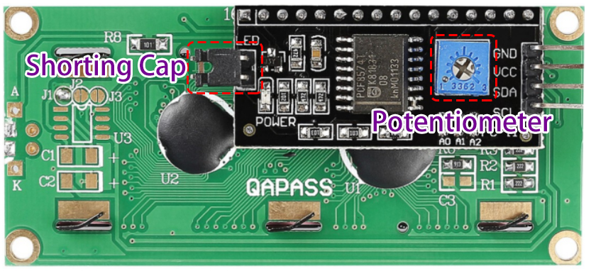

.. note:: 

    Ciao, benvenuto nella community di SunFounder Raspberry Pi & Arduino & ESP32 Enthusiasts su Facebook! Approfondisci Raspberry Pi, Arduino e ESP32 insieme ad altri appassionati.

    **Perché unirsi?**

    - **Supporto esperto**: Risolvi i problemi post-vendita e le sfide tecniche con l’aiuto della nostra community e del nostro team.
    - **Impara e condividi**: Scambia suggerimenti e tutorial per migliorare le tue competenze.
    - **Anteprime esclusive**: Ottieni accesso anticipato a nuovi annunci di prodotti e anteprime.
    - **Sconti speciali**: Approfitta di sconti esclusivi sui nostri prodotti più recenti.
    - **Promozioni e omaggi festivi**: Partecipa a omaggi e promozioni in occasione delle festività.

    👉 Pronto a esplorare e creare con noi? Clicca [|link_sf_facebook|] e unisciti oggi!

1.1.7 LCD1602 I2C
======================

Introduzione
------------------

LCD1602 è un display a cristalli liquidi di tipo carattere, che può 
visualizzare 32 caratteri (16*2) contemporaneamente.

Componenti
-------------------

.. image:: img/list_i2c_lcd.png

Principio
-----------

**LCD1602 I2C**

.. image:: img/i2c_lcd1602.png
    :width: 800

* **GND**: Terra
* **VCC**: Alimentazione, 5V.
* **SDA**: Linea dati seriale. Connettere al VCC tramite una resistenza di pull-up.
* **SCL**: Linea di clock seriale. Connettere al VCC tramite una resistenza di pull-up.

Come è noto, sebbene gli LCD e altri display arricchiscano notevolmente l'interazione uomo-macchina, presentano un punto debole comune. Quando vengono collegati a un controller, occupano molti pin IO, riducendo le porte esterne disponibili e limitando altre funzioni del controller. 

L'LCD1602 con modulo I2C è stato sviluppato per risolvere questo problema. Il modulo I2C ha un chip I2C PCF8574 integrato, che converte i dati seriali I2C in dati paralleli per il display LCD.        

* `PCF8574 Datasheet <https://www.ti.com/lit/ds/symlink/pcf8574.pdf?ts=1627006546204&ref_url=https%253A%252F%252Fwww.google.com%252F>`_

**Indirizzo I2C**

L'indirizzo predefinito è generalmente 0x27, ma in alcuni casi potrebbe essere 0x3F.

Prendendo come esempio l'indirizzo predefinito 0x27, l'indirizzo del dispositivo può essere modificato cortocircuitando i pad A0/A1/A2; nello stato predefinito, A0/A1/A2 è impostato su 1, mentre cortocircuitando il pad, A0/A1/A2 è impostato su 0.

.. image:: img/i2c_address.jpg
    :width: 600

**Retroilluminazione/Contrasto**

La retroilluminazione può essere abilitata tramite un ponticello; rimuovere il ponticello per disattivare la retroilluminazione. Il potenziometro blu sul retro serve per regolare il contrasto (il rapporto tra la luminosità del bianco più chiaro e del nero più scuro).

* **Ponticello**: La retroilluminazione può essere abilitata tramite questo ponticello; rimuovere il ponticello per disabilitare la retroilluminazione.
* **Potenziometro**: Viene utilizzato per regolare il contrasto (la nitidezza del testo visualizzato); aumenta in senso orario e diminuisce in senso antiorario.

Schema del Circuito
---------------------

============ ========
T-Board Name physical
SDA1         Pin 3
SCL1         Pin 5
============ ========

.. image:: img/schematic_i2c_lcd.png

Procedura Sperimentale
-----------------------------

**Passo 1:** Costruisci il circuito.

.. image:: img/image96.png
    :width: 800

**Passo 2**: Configura I2C (vedi :ref:`i2c_config`. Se hai già configurato I2C, salta questo passaggio.)

Per Utenti del Linguaggio C
^^^^^^^^^^^^^^^^^^^^^^^^^^^^^^^^^^^^^^^

**Passo 3:** Cambia la directory.

.. raw:: html

   <run></run>

.. code-block::

    cd ~/davinci-kit-for-raspberry-pi/c/1.1.7/

**Passo 4:** Compila.

.. raw:: html

   <run></run>

.. code-block::

    gcc 1.1.7_Lcd1602.c -lwiringPi

**Passo 5:** Esegui.

.. raw:: html

   <run></run>

.. code-block::

    sudo ./a.out

Dopo l'esecuzione del codice, vedrai visualizzati sul display LCD i messaggi \"Greetings\" e \"From SunFounder\".

.. note::

    * Se appare un errore ``wiringPi.h: No such file or directory``, fai riferimento a :ref:`install_wiringpi`.
    * Se ricevi l'errore ``Unable to open I2C device: No such file or directory``, devi fare riferimento a :ref:`i2c_config` per abilitare l'I2C e controllare se i collegamenti sono corretti.
    * Se il codice e i collegamenti sono corretti, ma l'LCD non visualizza ancora contenuti, puoi ruotare il potenziometro sul retro per aumentare il contrasto.

**Codice**

.. code-block:: c

    #include <stdio.h>
    #include <wiringPi.h>
    #include <wiringPiI2C.h>
    #include <string.h>

    int LCDAddr = 0x27;
    int BLEN = 1;
    int fd;

    void write_word(int data){
        int temp = data;
        if ( BLEN == 1 )
            temp |= 0x08;
        else
            temp &= 0xF7;
        wiringPiI2CWrite(fd, temp);
    }

    void send_command(int comm){
        int buf;
        // Invia prima i bit da 7 a 4
        buf = comm & 0xF0;
        buf |= 0x04;			// RS = 0, RW = 0, EN = 1
        write_word(buf);
        delay(2);
        buf &= 0xFB;			// Imposta EN = 0
        write_word(buf);

        // Invia i bit da 3 a 0 successivamente
        buf = (comm & 0x0F) << 4;
        buf |= 0x04;			// RS = 0, RW = 0, EN = 1
        write_word(buf);
        delay(2);
        buf &= 0xFB;			// Imposta EN = 0
        write_word(buf);
    }

    void send_data(int data){
        int buf;
        // Invia prima i bit da 7 a 4
        buf = data & 0xF0;
        buf |= 0x05;			// RS = 1, RW = 0, EN = 1
        write_word(buf);
        delay(2);
        buf &= 0xFB;			// Imposta EN = 0
        write_word(buf);

        // Invia i bit da 3 a 0 successivamente
        buf = (data & 0x0F) << 4;
        buf |= 0x05;			// RS = 1, RW = 0, EN = 1
        write_word(buf);
        delay(2);
        buf &= 0xFB;			// Imposta EN = 0
        write_word(buf);
    }

    void init(){
        send_command(0x33);	// Inizializzazione alla modalità 8-linee
        delay(5);
        send_command(0x32);	// Inizializzazione alla modalità 4-linee
        delay(5);
        send_command(0x28);	// 2 Linee & punti 5*7
        delay(5);
        send_command(0x0C);	// Attiva display senza cursore
        delay(5);
        send_command(0x01);	// Pulisci schermo
        wiringPiI2CWrite(fd, 0x08);
    }

    void clear(){
        send_command(0x01);	// Pulisci schermo
    }

    void write(int x, int y, char data[]){
        int addr, i;
        int tmp;
        if (x < 0)  x = 0;
        if (x > 15) x = 15;
        if (y < 0)  y = 0;
        if (y > 1)  y = 1;

        // Sposta il cursore
        addr = 0x80 + 0x40 * y + x;
        send_command(addr);
        
        tmp = strlen(data);
        for (i = 0; i < tmp; i++){
            send_data(data[i]);
        }
    }

    void main(){
        fd = wiringPiI2CSetup(LCDAddr);
        init();
        write(0, 0, "Greetings!");
        write(1, 1, "From SunFounder");
    }

**Spiegazione del Codice**

.. code-block::

    void write_word(int data){……}
    void send_command(int comm){……}
    void send_data(int data){……}
    void init(){……}
    void clear(){……}
    void write(int x, int y, char data[]){……}

Queste funzioni servono per controllare il codice open source dell’I2C LCD1602. Consentono di utilizzare facilmente l’I2C LCD1602.
Tra queste funzioni, init() è utilizzata per l’inizializzazione, clear() per pulire lo schermo, write() per scrivere ciò che verrà visualizzato, mentre le altre funzioni supportano queste operazioni.

.. code-block:: c

    fd = wiringPiI2CSetup(LCDAddr);

Questa funzione inizializza il sistema I2C con il dispositivo specificato. Il prototipo della funzione è:

.. code-block:: c

    int wiringPiI2CSetup(int devId);

Il parametro devId è l’indirizzo del dispositivo I2C, ottenibile tramite il comando i2cdetect (vedi Appendice); l’indirizzo devId dell’I2C LCD1602 è generalmente 0x27.

.. code-block:: c

    void write(int x, int y, char data[]){}

In questa funzione, data[] è la stringa di caratteri da stampare sull’LCD, e i parametri x e y determinano la posizione di stampa (la riga y+1, colonna x+1 è il punto iniziale dei caratteri da visualizzare).

Per Utenti del Linguaggio Python
^^^^^^^^^^^^^^^^^^^^^^^^^^^^^^^^^^^^

**Passo 3:** Cambia la directory.

.. raw:: html

   <run></run>

.. code-block::

    cd ~/davinci-kit-for-raspberry-pi/python/

**Passo 4:** Esegui.

.. raw:: html

   <run></run>

.. code-block::

    sudo python3 1.1.7_Lcd1602.py

Dopo l'esecuzione del codice, vedrai "Greetings" e "From SunFounder" visualizzati sul display LCD.

.. note::

    * Se ricevi l'errore ``FileNotFoundError: [Errno 2] No such file or directory: '/dev/i2c-1'``, devi fare riferimento a :ref:`i2c_config` per abilitare l'I2C.

    * Se ricevi l'errore ``ModuleNotFoundError: No module named 'smbus2'``, esegui ``sudo pip3 install smbus2``.

    * Se appare l'errore ``OSError: [Errno 121] Remote I/O``, significa che il modulo è cablato in modo errato o è danneggiato.

    * Puoi provare a regolare il potenziometro sul retro se il codice e il cablaggio sono corretti, ma l'LCD non mostra ancora il contenuto.

**Codice**

.. note::

    Puoi **Modificare/Reimpostare/Copiare/Eseguire/Interrompere** il codice seguente. Ma prima, devi andare al percorso del codice sorgente come ``davinci-kit-for-raspberry-pi/python``.

.. raw:: html

    <run></run>

.. code-block:: python

    import LCD1602
    import time

    def setup():
        LCD1602.init(0x27, 1)	# init(slave address, background light)
        LCD1602.write(0, 0, 'Greetings!!')
        LCD1602.write(1, 1, 'from SunFounder')
        time.sleep(2)

    def destroy():
        LCD1602.clear()

    if __name__ == "__main__":
        try:
            setup()
        except KeyboardInterrupt:
            destroy()

**Spiegazione del Codice**

.. code-block:: python

    import LCD1602

Questo file è un codice open source per controllare l'I2C LCD1602. Ci permette di utilizzare facilmente l'I2C LCD1602.

.. code-block:: python

    LCD1602.init(0x27, 1)

La funzione inizializza il sistema I2C con il dispositivo designato. Il primo parametro è l'indirizzo del dispositivo I2C, che può essere rilevato tramite il comando i2cdetect (vedi Appendice per i dettagli). L'indirizzo dell'I2C LCD1602 è generalmente 0x27.

.. code-block:: python

    LCD1602.write(0, 0, 'Greetings!!')

In questa funzione, 'Greetings!!' è il testo da stampare sulla riga 1, colonna 1 dell'LCD.

Ora puoi vedere "Greetings! From SunFounder" visualizzato sul display LCD.

Immagine del Risultato
--------------------------

.. image:: img/image97.jpeg
