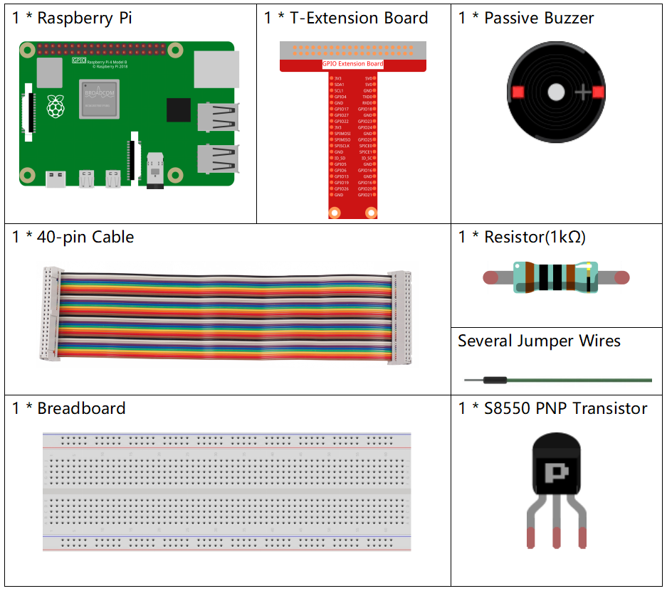
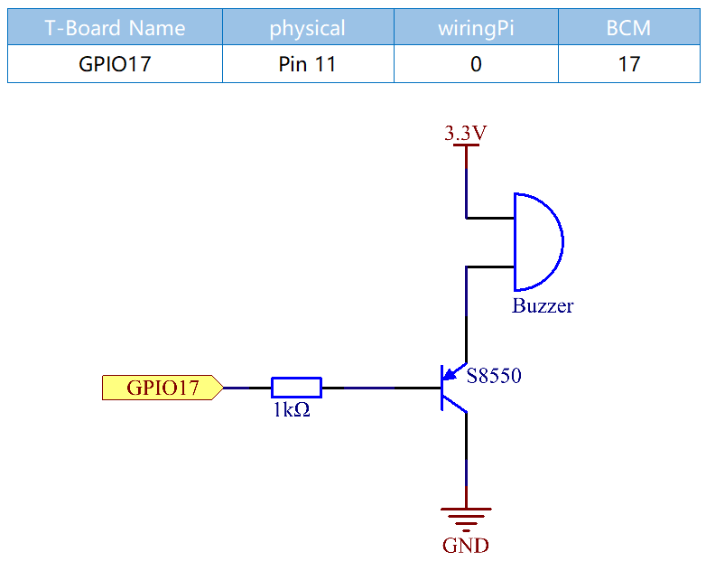
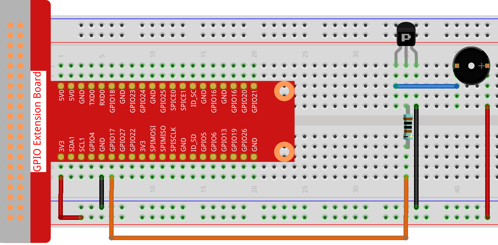
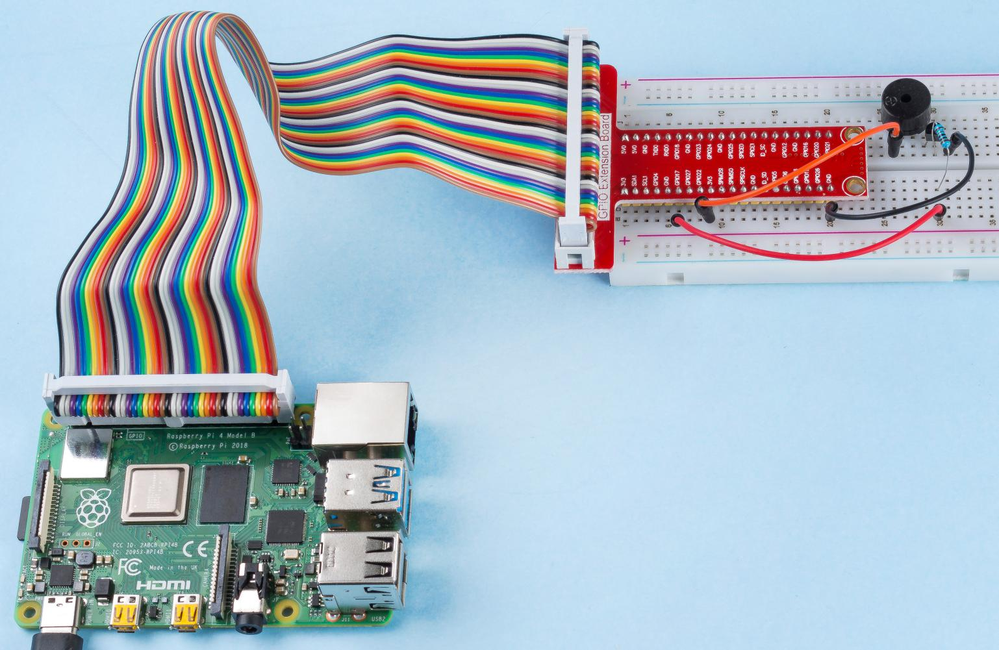

.. note:: 

    Ciao, benvenuto nella community SunFounder Raspberry Pi & Arduino & ESP32 Enthusiasts su Facebook! Approfondisci Raspberry Pi, Arduino ed ESP32 insieme ad altri appassionati.

    **Perché unirsi?**

    - **Supporto Esperti**: Risolvi problematiche tecniche e post-vendita con l’aiuto della nostra community e del nostro team.
    - **Impara e Condividi**: Scambia suggerimenti e tutorial per migliorare le tue abilità.
    - **Anteprime Esclusive**: Ottieni l’accesso anticipato ai nuovi annunci di prodotto.
    - **Sconti Speciali**: Approfitta di sconti esclusivi sui nostri prodotti più recenti.
    - **Promozioni e Concorsi**: Partecipa a promozioni festive e a concorsi.

    👉 Sei pronto a esplorare e creare con noi? Clicca [|link_sf_facebook|] e unisciti oggi stesso!

1.2.2 Buzzer Passivo
========================

Introduzione
---------------

In questa lezione, impareremo come far suonare un buzzer passivo riproducendo musica.

Componenti
-------------

Schema Elettrico
---------------------

In questo esperimento, vengono utilizzati un buzzer passivo, un transistor 
PNP e una resistenza da 1kΩ tra la base del transistor e il GPIO per proteggere 
il transistor.

Quando a GPIO17 vengono applicate frequenze diverse, il buzzer passivo emetterà 
suoni differenti; in questo modo, il buzzer riproduce la musica.

Procedure Sperimentali
--------------------------

**Passo 1**: Costruisci il circuito.

Per Utenti del Linguaggio C
^^^^^^^^^^^^^^^^^^^^^^^^^^^^^^

**Passo 2**: Cambia directory.

.. raw:: html

   <run></run>

.. code-block::

    cd ~/davinci-kit-for-raspberry-pi/c/1.2.2/

**Passo 3**: Compila.

.. raw:: html

   <run></run>

.. code-block::

    gcc 1.2.2_PassiveBuzzer.c -lwiringPi

**Passo 4**: Esegui.

.. raw:: html

   <run></run>

.. code-block::

    sudo ./a.out

Eseguito il codice, il buzzer riproduce un pezzo musicale.

.. note::

    Se, dopo l’esecuzione, non funziona o compare un messaggio di errore come: \"wiringPi.h: No such file or directory\", fai riferimento a :ref:`Il codice C non funziona?`.

**Codice**

.. code-block:: c

    #include <wiringPi.h>
    #include <softTone.h>
    #include <stdio.h>

    #define BuzPin    0

    #define  CL1  131
    #define  CL2  147
    #define  CL3  165
    #define  CL4  175
    #define  CL5  196
    #define  CL6  221
    #define  CL7  248

    #define  CM1  262
    #define  CM2  294
    #define  CM3  330
    #define  CM4  350
    #define  CM5  393
    #define  CM6  441
    #define  CM7  495

    #define  CH1  525
    #define  CH2  589
    #define  CH3  661
    #define  CH4  700
    #define  CH5  786
    #define  CH6  882
    #define  CH7  990

    int song_1[] = {CM3,CM5,CM6,CM3,CM2,CM3,CM5,CM6,CH1,CM6,CM5,CM1,CM3,CM2,
                    CM2,CM3,CM5,CM2,CM3,CM3,CL6,CL6,CL6,CM1,CM2,CM3,CM2,CL7,
                    CL6,CM1,CL5};

    int beat_1[] = {1,1,3,1,1,3,1,1,1,1,1,1,1,1,3,1,1,3,1,1,1,1,1,1,1,2,1,1,
                    1,1,1,1,1,1,3};

    int song_2[] = {CM1,CM1,CM1,CL5,CM3,CM3,CM3,CM1,CM1,CM3,CM5,CM5,CM4,CM3,CM2,
                    CM2,CM3,CM4,CM4,CM3,CM2,CM3,CM1,CM1,CM3,CM2,CL5,CL7,CM2,CM1
                    };

    int beat_2[] = {1,1,1,3,1,1,1,3,1,1,1,1,1,1,3,1,1,1,2,1,1,1,3,1,1,1,3,3,2,3};

    int main(void)
    {
        int i, j;
        if(wiringPiSetup() == -1){ //se l'inizializzazione di wiring fallisce, stampa il messaggio
            printf("setup wiringPi failed !");
            return 1;
        }

        if(softToneCreate(BuzPin) == -1){
            printf("setup softTone failed !");
            return 1;
        }

        while(1){
            printf("music is being played...\n");
            delay(100);
            for(i=0;i<sizeof(song_1)/4;i++){
                softToneWrite(BuzPin, song_1[i]);   
                delay(beat_1[i] * 500);
            }

            for(i=0;i<sizeof(song_2)/4;i++){
                softToneWrite(BuzPin, song_2[i]);   
                delay(beat_2[i] * 500);
            }   
        }

        return 0;
    }
**Spiegazione del Codice** 

.. code-block:: c

    #define  CL1  131
    #define  CL2  147
    #define  CL3  165
    #define  CL4  175
    #define  CL5  196
    #define  CL6  221
    #define  CL7  248

    #define  CM1  262
    #define  CM2  294

Le frequenze di ciascuna nota sono come mostrato. CL indica le note basse, 
CM le note medie e CH le note alte; 1-7 corrispondono rispettivamente alle 
note C, D, E, F, G, A, B.

.. code-block:: c

    int song_1[] = {CM3,CM5,CM6,CM3,CM2,CM3,CM5,CM6,CH1,CM6,CM5,CM1,CM3,CM2,
                    CM2,CM3,CM5,CM2,CM3,CM3,CL6,CL6,CL6,CM1,CM2,CM3,CM2,CL7,
                    CL6,CM1,CL5};
    int beat_1[] = {1,1,3,1,1,3,1,1,1,1,1,1,1,1,3,1,1,3,1,1,1,1,1,1,1,2,1,1,
                    1,1,1,1,1,1,3};

L’array song_1[] memorizza una partitura musicale di una canzone, mentre beat_1[] 
indica il ritmo di ogni nota della canzone (0,5 s per ciascun battito).

.. code-block:: c

    if(softToneCreate(BuzPin) == -1){
            printf("setup softTone failed !");
            return 1;

Questo crea un pin di tono controllato tramite software. Puoi utilizzare 
qualsiasi pin GPIO, e la numerazione dei pin sarà quella della funzione 
wiringPiSetup() usata. Il valore di ritorno è 0 in caso di successo. 
Diversamente, è necessario verificare la variabile globale errno per 
capire l’errore.

.. code-block:: c

    for(i=0;i<sizeof(song_1)/4;i++){
        softToneWrite(BuzPin, song_1[i]);   
        delay(beat_1[i] * 500);
    }

Usa una dichiarazione for per riprodurre song_1.

Nella condizione di giudizio, **i<sizeof(song_1)/4**, la "divisione 
per 4" è necessaria perché l’array song_1[] è di tipo integer, e ogni 
elemento occupa quattro byte.

Il numero di elementi in song_1 (il numero di note musicali) è calcolato 
dividendo sizeof(song_4) per 4.

Per fare in modo che ogni nota suoni per beat \* 500 ms, viene chiamata la funzione delay(beat_1[i] \* 500).

Il prototipo di softToneWrite(BuzPin, song_1[i]) è:

.. code-block:: c

    void softToneWrite (int pin, int freq);

Questo aggiorna la frequenza del tono sul pin dato. Il tono non smette di 
suonare fino a quando la frequenza non viene impostata a 0.

Per Utenti del Linguaggio Python
^^^^^^^^^^^^^^^^^^^^^^^^^^^^^^^^^^^^^^

**Passo 2: Cambia directory.**

.. raw:: html

   <run></run>

.. code-block::

    cd ~/davinci-kit-for-raspberry-pi/python/

**Passo 3: Esegui.**

.. raw:: html

   <run></run>

.. code-block::

    sudo python3 1.2.2_PassiveBuzzer.py

Eseguito il codice, il buzzer riproduce un pezzo musicale.

**Codice**

.. note::

    Puoi **Modificare/Reimpostare/Copiare/Eseguire/Arrestare** il codice qui sotto. Ma prima di procedere, è necessario accedere al percorso del codice sorgente come ``davinci-kit-for-raspberry-pi/python``. 
    
.. raw:: html

    <run></run>

.. code-block:: python

    import RPi.GPIO as GPIO
    import time

    Buzzer = 11

    CL = [0, 131, 147, 165, 175, 196, 211, 248]        # Frequenze delle note basse in Do maggiore

    CM = [0, 262, 294, 330, 350, 393, 441, 495]        # Frequenze delle note medie in Do maggiore

    CH = [0, 525, 589, 661, 700, 786, 882, 990]        # Frequenze delle note alte in Do maggiore

    song_1 = [   CM[3], CM[5], CM[6], CM[3], CM[2], CM[3], CM[5], CM[6], # Note della canzone 1
                CH[1], CM[6], CM[5], CM[1], CM[3], CM[2], CM[2], CM[3], 
                CM[5], CM[2], CM[3], CM[3], CL[6], CL[6], CL[6], CM[1],
                CM[2], CM[3], CM[2], CL[7], CL[6], CM[1], CL[5] ]

    beat_1 = [   1, 1, 3, 1, 1, 3, 1, 1,             # Ritmi della canzone 1, 1 significa 1/8 di battito                
                 1, 1, 1, 1, 1, 1, 3, 1,                 
                 1, 3, 1, 1, 1, 1, 1, 1,                 
                 1, 2, 1, 1, 1, 1, 1, 1,                 
                 1, 1, 3 ]

    song_2 = [   CM[1], CM[1], CM[1], CL[5], CM[3], CM[3], CM[3], CM[1], # Note della canzone 2
                CM[1], CM[3], CM[5], CM[5], CM[4], CM[3], CM[2], CM[2], 
                CM[3], CM[4], CM[4], CM[3], CM[2], CM[3], CM[1], CM[1], 
                CM[3], CM[2], CL[5], CL[7], CM[2], CM[1]	]

    beat_2 = [   1, 1, 2, 2, 1, 1, 2, 2,             # Ritmi della canzone 2, 1 significa 1/8 di battito                
                 1, 1, 2, 2, 1, 1, 3, 1,                 
                 1, 2, 2, 1, 1, 2, 2, 1,                 
                 1, 2, 2, 1, 1, 3 ]

    def setup():

        GPIO.setmode(GPIO.BOARD)        # Numerazione dei GPIO in base alla posizione fisica
        GPIO.setup(Buzzer, GPIO.OUT)    # Imposta i pin come output
        global Buzz                     # Assegna una variabile globale per sostituire GPIO.PWM 
        Buzz = GPIO.PWM(Buzzer, 440)    # 440 è la frequenza iniziale.
        Buzz.start(50)                  # Avvia il pin del Buzzer con un ciclo di lavoro al 50%

    def loop():
        while True:
            print ('\n    Playing song 1...')
            for i in range(1, len(song_1)):         # Riproduce la canzone 1
                Buzz.ChangeFrequency(song_1[i])     # Cambia la frequenza in base alla nota della canzone
                time.sleep(beat_1[i] * 0.5)         # Ritarda una nota per beat * 0,5 s
            time.sleep(1)                           # Attendi un secondo per la prossima canzone.

            print ('\n\n    Playing song 2...')
            for i in range(1, len(song_2)):         # Riproduce la canzone 2
                Buzz.ChangeFrequency(song_2[i])     # Cambia la frequenza in base alla nota della canzone
                time.sleep(beat_2[i] * 0.5)         # Ritarda una nota per beat * 0,5 s

    def destroy():
        Buzz.stop()                 # Ferma il buzzer
        GPIO.output(Buzzer, 1)      # Imposta il pin del Buzzer su High
        GPIO.cleanup()              # Rilascia le risorse

    if __name__ == '__main__':      # Il programma inizia da qui
        setup()
        try:
            loop()
        except KeyboardInterrupt:   # Quando viene premuto 'Ctrl+C', viene eseguita destroy().
            destroy()

**Spiegazione del Codice** 

.. code-block:: python

    CL = [0, 131, 147, 165, 175, 196, 211, 248]     # Frequenza dei toni bassi in Do maggiore
    CM = [0, 262, 294, 330, 350, 393, 441, 495]     # Frequenza dei toni medi in Do maggiore
    CH = [0, 525, 589, 661, 700, 786, 882, 990]     # Frequenza dei toni alti in Do maggiore     

Queste sono le frequenze di ciascuna nota. Il primo valore 0 è per 
saltare CL[0] affinché i numeri 1-7 corrispondano a CDEFGAB della scala.

.. code-block:: python

    song_1 = [  CM[3], CM[5], CM[6], CM[3], CM[2], CM[3], CM[5], CM[6], 
                CH[1], CM[6], CM[5], CM[1], CM[3], CM[2], CM[2], CM[3],
                CM[5], CM[2], CM[3], CM[3], CL[6], CL[6], CL[6], CM[1],
                CM[2], CM[3], CM[2], CL[7], CL[6], CM[1], CL[5] ]

Questi array rappresentano le note di una canzone.

.. code-block:: python

    beat_1 = [  1, 1, 3, 1, 1, 3, 1, 1, 1, 1, 1, 1, 1, 1, 3, 1,                1, 3, 1, 1, 1, 1, 1, 1, 1, 2, 1, 1, 1, 1, 1, 1,                1, 1, 3 ]

Ogni numero nel ritmo (beat) rappresenta ⅛ di battito, cioè 0,5 s.

.. code-block:: python

    Buzz = GPIO.PWM(Buzzer, 440)
    Buzz.start(50)  

Definisci il pin Buzzer come pin PWM, imposta la sua frequenza a 440 e 
Buzz.start(50) serve per avviare il PWM. Inoltre, imposta il ciclo di lavoro al 50%.

.. code-block:: python

    for i in range(1, len(song_1)): 
                Buzz.ChangeFrequency(song_1[i]) 
                time.sleep(beat_1[i] * 0.5)  

Esegui un ciclo for, e il buzzer riprodurrà le note nell’array song_1[] 
con i tempi indicati nell’array beat_1[].

Ora puoi ascoltare il buzzer passivo che riproduce la musica.

Immagine del Fenomeno
------------------------

