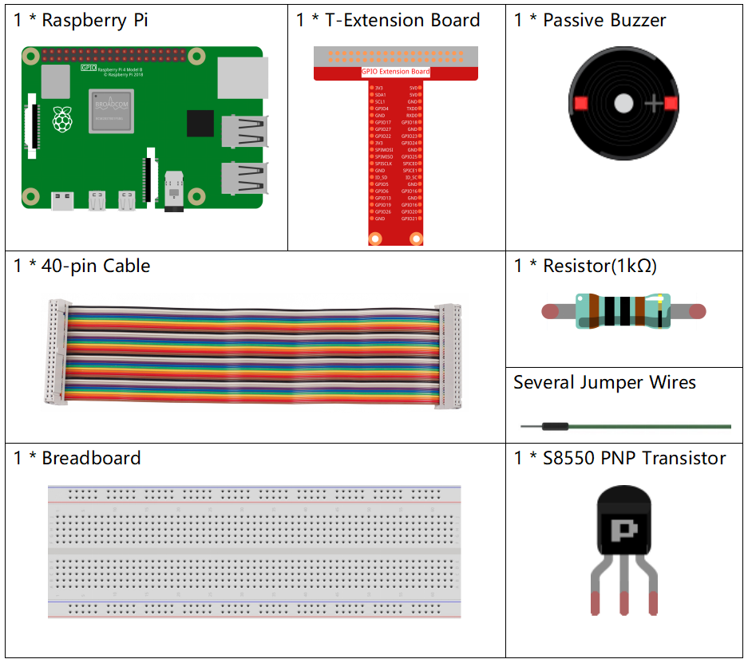

1.2.2 パッシブブザー
=====================

前書き
------------

このレッスンでは、パッシブブザーで音楽を再生する方法を学習する。

部品
----------

回路図
-----------------

この実験では、トランジスタを保護するために、トランジスタのベースとGPIOの間にパッシブブザー、PNPトランジスタ、および1k抵抗器を使用する。

GPIO17に異なる周波数が与えられると、パッシブブザーは異なる音を出す。このようにして、ブザーは音楽を再生する。

.. image:: media/image333.png

実験手順
-----------------------

ステップ1： 回路を作る。

.. image:: media/image106.png
    :width: 800

C言語ユーザー向け
^^^^^^^^^^^^^^^^^^^^

ステップ2： ディレクトリを変更する。

.. raw:: html

   <run></run>

.. code-block::

    cd /home/pi/davinci-kit-for-raspberry-pi/c/1.2.2/

ステップ3： コードをコンパイルする。

.. raw:: html

   <run></run>

.. code-block::

    gcc 1.2.2_PassiveBuzzer.c -lwiringPi

ステップ4： 実行。

.. raw:: html

   <run></run>

.. code-block::

    sudo ./a.out

コードが実行されると、ブザーが音楽を再生する。

**コード**

.. code-block:: c

    #include <wiringPi.h>
    #include <softTone.h>
    #include <stdio.h>

    #define BuzPin    0

    #define  CL1  131
    #define  CL2  147
    #define  CL3  165
    #define  CL4  175
    #define  CL5  196
    #define  CL6  221
    #define  CL7  248

    #define  CM1  262
    #define  CM2  294
    #define  CM3  330
    #define  CM4  350
    #define  CM5  393
    #define  CM6  441
    #define  CM7  495

    #define  CH1  525
    #define  CH2  589
    #define  CH3  661
    #define  CH4  700
    #define  CH5  786
    #define  CH6  882
    #define  CH7  990

    int song_1[] = {CM3,CM5,CM6,CM3,CM2,CM3,CM5,CM6,CH1,CM6,CM5,CM1,CM3,CM2,
                    CM2,CM3,CM5,CM2,CM3,CM3,CL6,CL6,CL6,CM1,CM2,CM3,CM2,CL7,
                    CL6,CM1,CL5};

    int beat_1[] = {1,1,3,1,1,3,1,1,1,1,1,1,1,1,3,1,1,3,1,1,1,1,1,1,1,2,1,1,
                    1,1,1,1,1,1,3};

    int song_2[] = {CM1,CM1,CM1,CL5,CM3,CM3,CM3,CM1,CM1,CM3,CM5,CM5,CM4,CM3,CM2,
                    CM2,CM3,CM4,CM4,CM3,CM2,CM3,CM1,CM1,CM3,CM2,CL5,CL7,CM2,CM1
                    };

    int beat_2[] = {1,1,1,3,1,1,1,3,1,1,1,1,1,1,3,1,1,1,2,1,1,1,3,1,1,1,3,3,2,3};

    int main(void)
    {
        int i, j;
        if(wiringPiSetup() == -1){ //when initialize wiring failed,print message to screen
            printf("setup wiringPi failed !");
            return 1;
        }

        if(softToneCreate(BuzPin) == -1){
            printf("setup softTone failed !");
            return 1;
        }

        while(1){
            printf("music is being played...\n");
            delay(100);
            for(i=0;i<sizeof(song_1)/4;i++){
                softToneWrite(BuzPin, song_1[i]);   
                delay(beat_1[i] * 500);
            }

            for(i=0;i<sizeof(song_2)/4;i++){
                softToneWrite(BuzPin, song_2[i]);   
                delay(beat_2[i] * 500);
            }   
        }

        return 0;
    }

**コードの説明**

.. code-block:: c

    #define  CL1  131
    #define  CL2  147
    #define  CL3  165
    #define  CL4  175
    #define  CL5  196
    #define  CL6  221
    #define  CL7  248

    #define  CM1  262
    #define  CM2  294

各音の周波数は以下のように示している。CL－低音、CM－中音、CH－高音、1～7は音C、D、E、F、G、A、Bに対応する。

.. code-block:: c

    int song_1[] = {CM3,CM5,CM6,CM3,CM2,CM3,CM5,CM6,CH1,CM6,CM5,CM1,CM3,CM2,
                    CM2,CM3,CM5,CM2,CM3,CM3,CL6,CL6,CL6,CM1,CM2,CM3,CM2,CL7,
                    CL6,CM1,CL5};
    int beat_1[] = {1,1,3,1,1,3,1,1,1,1,1,1,1,1,3,1,1,3,1,1,1,1,1,1,1,2,1,1,
                    1,1,1,1,1,1,3};

配列 ``song_1[]`` は曲の楽譜を保存する。 ``beat_1[]`` は曲の各音符の拍を表す（1拍ごとに0.5秒）。

.. code-block:: c

    if(softToneCreate(BuzPin) == -1){
            printf("setup softTone failed !");
            return 1;
        
これにより、ソフトウェア制御のトーンピンが作成される。
任意のGPIOピンを使用でき、ピンの番号は使用した ``wiringPiSetup()`` 関数の番号になる。成功した場合の戻り値は0である。
それ以外の場合は、グローバル変数errnoをチェックして、何が問題なのかを確認する必要がある。

.. code-block:: c

    for(i=0;i<sizeof(song_1)/4;i++){
        softToneWrite(BuzPin, song_1[i]);   
        delay(beat_1[i] * 500);
    }

``song_1`` を再生するために ``for statement`` を使用する。

判断条件 ``i<sizeof(song_1)/4`` では、 配列 ``song_1[]`` は整数のデータ型の配列であり、各要素は 4 ビートを取るため、4 で除算します。

song_1の要素の数（音符の数）は、 ``sizeof(song_4)`` を4で割ることによって得られる。

各音符を拍* 500msで再生できるようにするには、関数 ``delay(beat_1[i]*500)`` が呼び出される。

``softToneWrite(BuzPin、song_1[i])`` のプロトタイプ：

.. code-block:: c

    void softToneWrite (int pin, int freq);

これにより、指定されたピンのトーン周波数値が更新される。周波数を0に設定するまで、トーンの再生は停止しない。

Python言語ユーザー向け
^^^^^^^^^^^^^^^^^^^^^^^^^

ステップ2：ディレクトリを変更する。

.. raw:: html

   <run></run>

.. code-block::

    cd /home/pi/davinci-kit-for-raspberry-pi/python/

ステップ3：実行する。

.. raw:: html

   <run></run>

.. code-block::

    sudo python3 1.2.2_PassiveBuzzer.py

コードが実行されると、ブザーが音楽を再生する。

**コード**

.. note::

   以下のコードを **変更/リセット/コピー/実行/停止** できます。 ただし、その前に、 ``davinci-kit-for-raspberry-pi/python`` のようなソースコードパスに移動する必要があります。 
   
.. raw:: html

    <run></run>

.. code-block:: python

    import RPi.GPIO as GPIO
    import time

    Buzzer = 11

    CL = [0, 131, 147, 165, 175, 196, 211, 248]		# Frequency of Bass tone in C major

    CM = [0, 262, 294, 330, 350, 393, 441, 495]		# Frequency of Midrange tone in C major

    CH = [0, 525, 589, 661, 700, 786, 882, 990]		# Frequency of Treble tone in C major

    song_1 = [	CM[3], CM[5], CM[6], CM[3], CM[2], CM[3], CM[5], CM[6], # Notes of song1
                CH[1], CM[6], CM[5], CM[1], CM[3], CM[2], CM[2], CM[3], 
                CM[5], CM[2], CM[3], CM[3], CL[6], CL[6], CL[6], CM[1],
                CM[2], CM[3], CM[2], CL[7], CL[6], CM[1], CL[5]	]

    beat_1 = [	1, 1, 3, 1, 1, 3, 1, 1, 			# Beats of song 1, 1 means 1/8 beat
                1, 1, 1, 1, 1, 1, 3, 1, 
                1, 3, 1, 1, 1, 1, 1, 1, 
                1, 2, 1, 1, 1, 1, 1, 1, 
                1, 1, 3	]

    song_2 = [	CM[1], CM[1], CM[1], CL[5], CM[3], CM[3], CM[3], CM[1], # Notes of song2
                CM[1], CM[3], CM[5], CM[5], CM[4], CM[3], CM[2], CM[2], 
                CM[3], CM[4], CM[4], CM[3], CM[2], CM[3], CM[1], CM[1], 
                CM[3], CM[2], CL[5], CL[7], CM[2], CM[1]	]

    beat_2 = [	1, 1, 2, 2, 1, 1, 2, 2, 			# Beats of song 2, 1 means 1/8 beat
                1, 1, 2, 2, 1, 1, 3, 1, 
                1, 2, 2, 1, 1, 2, 2, 1, 
                1, 2, 2, 1, 1, 3 ]

    def setup():

        GPIO.setmode(GPIO.BOARD)		# Numbers GPIOs by physical location
        GPIO.setup(Buzzer, GPIO.OUT)	# Set pins' mode is output
        global Buzz						# Assign a global variable to replace GPIO.PWM 
        Buzz = GPIO.PWM(Buzzer, 440)	# 440 is initial frequency.
        Buzz.start(50)					# Start Buzzer pin with 50% duty cycle

    def loop():
        while True:
            print ('\n    Playing song 1...')
            for i in range(1, len(song_1)):		# Play song 1
                Buzz.ChangeFrequency(song_1[i])	# Change the frequency along the song note
                time.sleep(beat_1[i] * 0.5)		# delay a note for beat * 0.5s
            time.sleep(1)						# Wait a second for next song.

            print ('\n\n    Playing song 2...')
            for i in range(1, len(song_2)):     # Play song 1
                Buzz.ChangeFrequency(song_2[i]) # Change the frequency along the song note
                time.sleep(beat_2[i] * 0.5)     # delay a note for beat * 0.5s

    def destory():
        Buzz.stop()                 # Stop the buzzer
        GPIO.output(Buzzer, 1)      # Set Buzzer pin to High
        GPIO.cleanup()				# Release resource

    if __name__ == '__main__':		# Program start from here
        setup()
        try:
            loop()
        except KeyboardInterrupt:  	# When 'Ctrl+C' is pressed, the program destroy() will be executed.
            destory()

**コードの説明**

.. code-block:: python

    CL = [0, 131, 147, 165, 175, 196, 211, 248]     # Frequency of Bass tone in C major
    CM = [0, 262, 294, 330, 350, 393, 441, 495]     # Frequency of Midrange tone in C major
    CH = [0, 525, 589, 661, 700, 786, 882, 990]     # Frequency of Treble tone in C major     

これらは各音符の周波数である。番号1〜7が音色のCDEFGABに対応するように、最初の0は ``CL[0]`` をスキップする。

.. code-block:: python

    song_1 = [  CM[3], CM[5], CM[6], CM[3], CM[2], CM[3], CM[5], CM[6], 
                CH[1], CM[6], CM[5], CM[1], CM[3], CM[2], CM[2], CM[3],
                CM[5], CM[2], CM[3], CM[3], CL[6], CL[6], CL[6], CM[1],
                CM[2], CM[3], CM[2], CL[7], CL[6], CM[1], CL[5] ]

これらの配列は歌の音符である。

.. code-block:: python

    beat_1 = [  1, 1, 3, 1, 1, 3, 1, 1, 1, 1, 1, 1, 1, 1, 3, 1,
                1, 3, 1, 1, 1, 1, 1, 1, 1, 2, 1, 1, 1, 1, 1, 1,
                1, 1, 3 ]

すべての音符の拍（各番号）は、⅛拍で、つまり0.5秒を表す。

.. code-block:: python

    Buzz = GPIO.PWM(Buzzer, 440)
    Buzz.start(50)  

ピンブザーをPWMピンとして定義し、その周波数を440に設定し、 ``Buzz.start(50)`` を使用してPWMを実行する。
さらに、デューティサイクルを50％に設定する。

.. code-block:: python

    for i in range(1, len(song_1)): 
                Buzz.ChangeFrequency(song_1[i]) 
                time.sleep(beat_1[i] * 0.5)  

for 文を実行すると、ブザーは配列 ``song_1[]`` の音符を ``beat_1[]`` 配列の拍で再生する。

これで、パッシブブザーが音楽を再生していることが聞こえる。

現象画像
------------------

.. image:: media/image107.jpeg