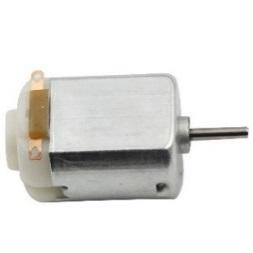
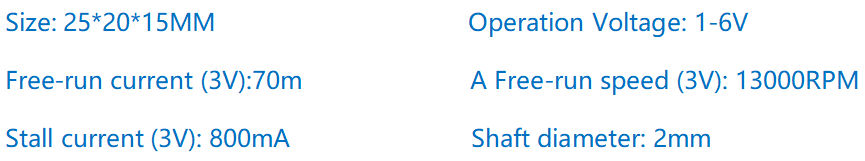
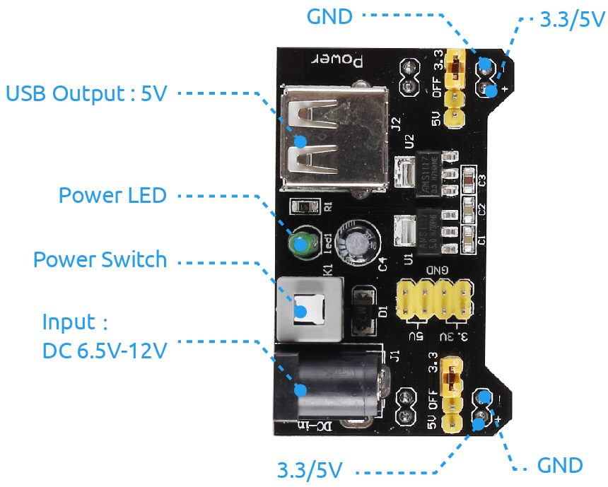

1.3.1 Motor
=============

Introduction
-----------------

In this lesson, we will learn to how to use L293D to drive a DC motor
and make it rotate clockwise and counterclockwise. Since the DC Motor
needs a larger current, for safety purpose, here we use the Power Supply
Module to supply motors.

Components
-----------

.. image:: img/list_1.3.1.png

Principle
---------

**L293D**

L293D is a 4-channel motor driver integrated by chip with high voltage
and high current. It's designed to connect to standard DTL, TTL logic
level, and drive inductive loads (such as relay coils, DC, Stepper
Motors) and power switching transistors etc. DC Motors are devices that
turn DC electrical energy into mechanical energy. They are widely used
in electrical drive for their superior speed regulation performance.

See the figure of pins below. L293D has two pins (Vcc1 and Vcc2) for
power supply. Vcc2 is used to supply power for the motor, while Vcc1 to
supply for the chip. Since a small-sized DC motor is used here, connect
both pins to +5V.

.. image:: img/image111.png

The following is the internal structure of L293D. Pin EN is an enable
pin and only works with high level; A stands for input and Y for output.
You can see the relationship among them at the right bottom. When pin EN
is High level, if A is High, Y outputs high level; if A is Low, Y
outputs Low level. When pin EN is Low level, the L293D does not work.

.. image:: img/image334.png

**DC Motor**

This is a 5V DC motor. It will rotate when you give the two terminals of
the copper sheet one high and one low level. For convenience, you can
weld the pins to it.

**Power Supply Module**

In this experiment, it needs large currents to drive the motor
especially when it starts and stops, which will severely interfere with
the normal work of Raspberry Pi. Therefore, we separately supply power
for the motor by this module to make it run safely and steadily.

You can just plug it in the breadboard to supply power. It provides a
voltage of 3.3V and 5V, and you can connect either via a jumper cap
included.

Schematic Diagram
------------------

Plug the power supply module in breadboard, and insert the jumper cap to
pin of 5V, then it will output voltage of 5V. Connect pin 1 of L293D to
GPIO22, and set it as high level. Connect pin2 to GPIO27, and pin7 to
GPIO17, then set one pin high, while the other low. Thus you can change
the motor’s rotation direction.

.. image:: img/image336.png

Experimental Procedures
--------------------------

**Step 1:** Build the circuit.

.. image:: img/image117.png
    :width: 800

.. note::
    The power module can apply a 9V battery with the 9V Battery
    Buckle in the kit. Insert the jumper cap of the power module into the 5V
    bus strips of the breadboard.

.. image:: img/image118.jpeg

For C Language Users
^^^^^^^^^^^^^^^^^^^^^

**Step 2**: Get into the folder of the code.

.. raw:: html

    <run></run>
    
.. code-block::

    cd ~/davinci-kit-for-raspberry-pi/c/1.3.1/

**Step 3**: Compile.

.. raw:: html

   <run></run>

.. code-block::

    gcc 1.3.1_Motor.c -lwiringPi

**Step 4**: Run the executable file above.

.. raw:: html

   <run></run>

.. code-block::

    sudo ./a.out

As the code runs, the motor first rotates clockwise for 5s then stops for 5s, 
after that, it rotates anticlockwise for 5s; subsequently, the motor stops 
for 5s. This series of actions will be executed repeatedly.  

.. note::

    If it does not work after running, or there is an error prompt: \"wiringPi.h: No such file or directory\", please refer to :ref:`C code is not working?`.

**Code**

.. code-block:: c

    #include <wiringPi.h>
    #include <stdio.h>

    #define MotorPin1       0
    #define MotorPin2       2
    #define MotorEnable     3

    int main(void){
        int i;
        if(wiringPiSetup() == -1){ //when initialize wiring failed, print messageto screen
            printf("setup wiringPi failed !");
            return 1;
        }
        
        pinMode(MotorPin1, OUTPUT);
        pinMode(MotorPin2, OUTPUT);
        pinMode(MotorEnable, OUTPUT);
        while(1){
            printf("Clockwise\n");
            delay(100);
            digitalWrite(MotorEnable, HIGH);
            digitalWrite(MotorPin1, HIGH);
            digitalWrite(MotorPin2, LOW);
            for(i=0;i<3;i++){
                delay(1000);
            }

            printf("Stop\n");
            delay(100);
            digitalWrite(MotorEnable, LOW);
            for(i=0;i<3;i++){
                delay(1000);
            }

            printf("Anti-clockwise\n");
            delay(100);
            digitalWrite(MotorEnable, HIGH);
            digitalWrite(MotorPin1, LOW);
            digitalWrite(MotorPin2, HIGH);
            for(i=0;i<3;i++){
                delay(1000);
            }

            printf("Stop\n");
            delay(100);
            digitalWrite(MotorEnable, LOW);
            for(i=0;i<3;i++){
                delay(1000);
            }
        }
        return 0;
    }

**Code Explanation**

.. code-block:: c

    digitalWrite(MotorEnable, HIGH);

Enable the L239D.

.. code-block:: c

    digitalWrite(MotorPin1, HIGH);
    digitalWrite(MotorPin2, LOW);

Set a high level for 2A(pin 7); since 1,2EN(pin 1) is in 
high level, 2Y will output high level.

Set a low level for 1A, then 1Y will output low level, and 
the motor will rotate.

.. code-block:: c

    for(i=0;i<3;i++){
    delay(1000);
    }

this loop is to delay for 3*1000ms.

.. code-block:: c

    digitalWrite(MotorEnable, LOW)

If 1,2EN (pin1) is in low level, L293D does not work. Motor stops rotating.

.. code-block:: c

    digitalWrite(MotorPin1, LOW)
    digitalWrite(MotorPin2, HIGH)

Reverse the current flow of the motor, then the motor will rotate reversely.

For Python Language Users
^^^^^^^^^^^^^^^^^^^^^^^^^^^

**Step 2**: Get into the folder of the code.

.. raw:: html

   <run></run>

.. code-block::

    cd ~/davinci-kit-for-raspberry-pi/python

**Step 3**: Run.

.. raw:: html

   <run></run>

.. code-block::

    sudo python3 1.3.1_Motor.py

As the code runs, the motor first rotates clockwise for 5s then stops for 5s,
after that, it rotates anticlockwise for 5s; subsequently, the motor stops 
for 5s. This series of actions will be executed repeatedly.  

**Code**

.. note::

    You can **Modify/Reset/Copy/Run/Stop** the code below. But before that, you need to go to  source code path like ``davinci-kit-for-raspberry-pi/python``. 
    
.. raw:: html

    <run></run>

.. code-block:: python

    #!/usr/bin/env python3

    import RPi.GPIO as GPIO
    import time
    
    # Set up pins
    MotorPin1   = 17
    MotorPin2   = 27
    MotorEnable = 22
    
    def setup():
    	# Set the GPIO modes to BCM Numbering
    	GPIO.setmode(GPIO.BCM)
    	# Set pins to output
    	GPIO.setup(MotorPin1, GPIO.OUT)
    	GPIO.setup(MotorPin2, GPIO.OUT)
    	GPIO.setup(MotorEnable, GPIO.OUT, initial=GPIO.LOW)
    
    # Define a motor function to spin the motor
    # direction should be 
    # 1(clockwise), 0(stop), -1(counterclockwise)
    def motor(direction):
    	# Clockwise
    	if direction == 1:
    		# Set direction
    		GPIO.output(MotorPin1, GPIO.HIGH)
    		GPIO.output(MotorPin2, GPIO.LOW)
    		# Enable the motor
    		GPIO.output(MotorEnable, GPIO.HIGH)
    		print ("Clockwise")
    	# Counterclockwise
    	if direction == -1:
    		# Set direction
    		GPIO.output(MotorPin1, GPIO.LOW)
    		GPIO.output(MotorPin2, GPIO.HIGH)
    		# Enable the motor
    		GPIO.output(MotorEnable, GPIO.HIGH)
    		print ("Counterclockwise")
    	# Stop
    	if direction == 0:
    		# Disable the motor
    		GPIO.output(MotorEnable, GPIO.LOW)
    		print ("Stop")
    
    def main():
    
    	# Define a dictionary to make the script more readable
    	# CW as clockwise, CCW as counterclockwise, STOP as stop
    	directions = {'CW': 1, 'CCW': -1, 'STOP': 0}
    	while True:
    		# Clockwise
    		motor(directions['CW'])
    		time.sleep(5)
    		# Stop
    		motor(directions['STOP'])
    		time.sleep(5)
    		# Anticlockwise
    		motor(directions['CCW'])
    		time.sleep(5)
    		# Stop
    		motor(directions['STOP'])
    		time.sleep(5)
    
    def destroy():
    	# Stop the motor
    	GPIO.output(MotorEnable, GPIO.LOW)
    	# Release resource
    	GPIO.cleanup()    
    
    # If run this script directly, do:
    if __name__ == '__main__':
    	setup()
    	try:
    		main()
    	# When 'Ctrl+C' is pressed, the program 
    	# destroy() will be executed.
    	except KeyboardInterrupt:
    		destroy()

**Code Explanation**

.. code-block:: python

    def motor(direction):
        # Clockwise
        if direction == 1:
            # Set direction
            GPIO.output(MotorPin1, GPIO.HIGH)
            GPIO.output(MotorPin2, GPIO.LOW)
            # Enable the motor
            GPIO.output(MotorEnable, GPIO.HIGH)
            print ("Clockwise")
    ...

Create a function, **motor()** whose variable is direction. As the
condition that direction=1 is met, the motor rotates clockwise; when
direction=-1, the motor rotates anticlockwise; and under the condition
that direction=0, it stops rotating.

.. code-block:: python

    def main():
        # Define a dictionary to make the script more readable
        # CW as clockwise, CCW as counterclockwise, STOP as stop
        directions = {'CW': 1, 'CCW': -1, 'STOP': 0}
        while True:
            # Clockwise
            motor(directions['CW'])
            time.sleep(5)
            # Stop
            motor(directions['STOP'])
            time.sleep(5)
            # Anticlockwise
            motor(directions['CCW'])
            time.sleep(5)
            # Stop
            motor(directions['STOP'])
            time.sleep(5)
        
In the main（）function, create an array, directions[], in which CW is
equal to 1, the value of CCW is -1, and the number 0 refers to Stop.

As the code runs, the motor first rotates clockwise for 5s then stop for
5s, after that, it rotates anticlockwise for 5s; subsequently, the motor
stops for 5s. This series of actions will be executed repeatedly.

Now, you should see the motor blade rotating.

Phenomenon Picture
------------------

.. image:: img/image119.jpeg
