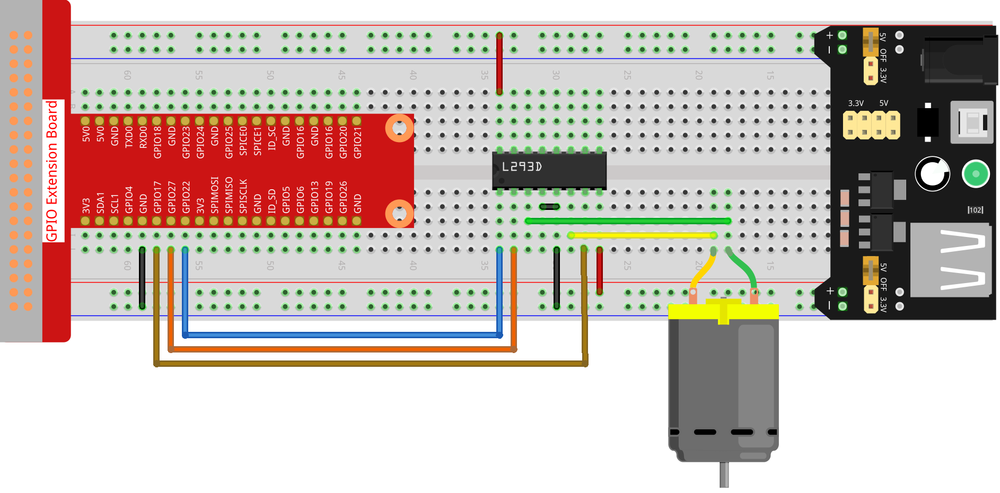

.. note::

    こんにちは、SunFounderのRaspberry Pi & Arduino & ESP32愛好家コミュニティへようこそ！Facebook上でRaspberry Pi、Arduino、ESP32についてもっと深く掘り下げ、他の愛好家と交流しましょう。

    **参加する理由は？**

    - **エキスパートサポート**：コミュニティやチームの助けを借りて、販売後の問題や技術的な課題を解決します。
    - **学び＆共有**：ヒントやチュートリアルを交換してスキルを向上させましょう。
    - **独占的なプレビュー**：新製品の発表や先行プレビューに早期アクセスしましょう。
    - **特別割引**：最新製品の独占割引をお楽しみください。
    - **祭りのプロモーションとギフト**：ギフトや祝日のプロモーションに参加しましょう。

    👉 私たちと一緒に探索し、創造する準備はできていますか？[|link_sf_facebook|]をクリックして今すぐ参加しましょう！

1.3.1 モーター
===============

前書き
-----------------

このレッスンでは、L293Dを使用してDCモーターを駆動し、時計回りと反時計回りに回転させる方法を学習する。
安全上の理由で、DCモーターは大電流を必要とするため、ここでは電源モジュールを使用してモーターに電力を供給する。

部品
-----------

.. image:: media/list_1.3.1.png

原理
---------

**L293D**

L293Dは、高電圧と高電流のチップで統合された4チャネルモータードライバーである。
標準のDTL、TTLロジックレベルに接続し、誘導負荷（リレーコイル、DC、ステッピングモーターなど）およびパワースイッチングトランジスタなどを駆動するように設計される。
DCモーターは、DC電気エネルギーを機械エネルギーに変換するデバイスである。それらは、優れた速度調整性能の利点により、電気駆動装置で広く使用されている。

ピンの図については、以下の図を参照してください。L293Dには、電源用の2つのピン（Vcc1とVcc2）がある。Vcc2はモーターに電力を供給し、Vcc1はチップに電力を供給するために使用される。
ここでは小型のDCモーターが使用されているため、両方のピンを+ 5Vに接続してください。

.. image:: media/image111.png

以下はL293Dの内部構造である。ピンENはイネーブルピンであり、高レベルでのみ機能する。Aは入力を表し、Yは出力を表す。それらの間の関係は右下に見ることができる。
ピンENがHighレベルのとき、AがHighの場合、YはHighレベルを出力する。AがLowの場合、YはLowレベルを出力する。ピンENがLowレベルの場合、L293Dは機能しない。

.. image:: media/image334.png

**DCモーター**

.. image:: media/image114.jpeg

これは5V DCモーターである。銅板の2つの端子に1つの高レベルと1つの低レベルを与えると回転する。便宜上、ピンを溶接することができる。

.. image:: media/image335.png

**電源モジュール**

この実験では、特に起動時と停止時にモーターを駆動するために大きな電流が必要である。
これは、Raspberry Piの通常の動作を大幅に妨害する可能性がある。そのため、このモジュールによってモーターに個別に電力を供給し、安全かつ着実に動作させる。

ブレッドボードに差し込むだけで電力を供給できる。3.3Vと5Vの電圧を提供し、付属のジャンパーキャップを介してどちらでも接続できる。

.. image:: media/image115.png

回路図
------------------

電源モジュールをブレッドボードに差し込み、ジャンパーキャップを5Vのピンに挿入すると、5Vの電圧が出力される。L293Dのピン1をGPIO22に接続し、それを高レベルに設定する。
ピン2をGPIO27に、ピン7をGPIO17に接続し、一方のピンをhighに、もう一方のピンをhighに設定する。したがって、モーターの回転方向を変更できる。

.. image:: media/image336.png

実験手順
--------------------------

ステップ1： 回路を作る。

.. note::
    電源モジュールはキットの9Vバッテリーバックルで9Vバッテリーを適用できる。電源モジュールのジャンパキャップをブレッドボードの5Vバスストリップに挿入する。

.. image:: media/image118.jpeg

C言語ユーザー向け
^^^^^^^^^^^^^^^^^^^^^

ステップ2： コードのフォルダーに入る。

.. raw:: html

    <run></run>
    
.. code-block::

    cd /home/pi/davinci-kit-for-raspberry-pi/c/1.3.1/

ステップ3： コンパイルする。

.. raw:: html

   <run></run>

.. code-block::

    gcc 1.3.1_Motor.c -lwiringPi

ステップ4： EXEファイルを実行する。

.. raw:: html

   <run></run>

.. code-block::

    sudo ./a.out

コードが実行されると、モーターは最初に5秒間時計回りに回転し、それから5秒間停止し、その後5秒間反時計回りに回転してから5秒間停止する。この一連の動作は繰り返し実行される。

**コード**

.. code-block:: c

    #include <wiringPi.h>
    #include <stdio.h>

    #define MotorPin1       0
    #define MotorPin2       2
    #define MotorEnable     3

    int main(void){
        int i;
        if(wiringPiSetup() == -1){ //when initialize wiring failed, print messageto screen
            printf("setup wiringPi failed !");
            return 1;
        }
        
        pinMode(MotorPin1, OUTPUT);
        pinMode(MotorPin2, OUTPUT);
        pinMode(MotorEnable, OUTPUT);
        while(1){
            printf("Clockwise\n");
            delay(100);
            digitalWrite(MotorEnable, HIGH);
            digitalWrite(MotorPin1, HIGH);
            digitalWrite(MotorPin2, LOW);
            for(i=0;i<3;i++){
                delay(1000);
            }

            printf("Stop\n");
            delay(100);
            digitalWrite(MotorEnable, LOW);
            for(i=0;i<3;i++){
                delay(1000);
            }

            printf("Anti-clockwise\n");
            delay(100);
            digitalWrite(MotorEnable, HIGH);
            digitalWrite(MotorPin1, LOW);
            digitalWrite(MotorPin2, HIGH);
            for(i=0;i<3;i++){
                delay(1000);
            }

            printf("Stop\n");
            delay(100);
            digitalWrite(MotorEnable, LOW);
            for(i=0;i<3;i++){
                delay(1000);
            }
        }
        return 0;
    }

**コードの説明**

.. code-block:: c

    digitalWrite(MotorEnable, HIGH);

L239Dを有効にする。

.. code-block:: c

    digitalWrite(MotorPin1, HIGH);
    digitalWrite(MotorPin2, LOW);

2A（ピン7）に高レベルを設定する。1,2EN（ピン1）は高レベルなので、2Yは高レベルを出力する。

1Aに低レベルを設定すると、1Yが低レベルを出力し、モーターが回転する。

.. code-block:: c

    for(i=0;i<3;i++){
    delay(1000);
    }

このループは3 * 1000ms遅延する。

.. code-block:: c

    digitalWrite(MotorEnable, LOW)

1,2EN（ピン1）が低レベルの場合、L293Dは機能しない。モーターが回転を停止する。

.. code-block:: c

    digitalWrite(MotorPin1, LOW)
    digitalWrite(MotorPin2, HIGH)

モーターの電流を逆にすると、モーターが逆回転する。

Python言語ユーザー向け
^^^^^^^^^^^^^^^^^^^^^^^^^^^

ステップ2： コードのフォルダーに入る。

.. raw:: html

   <run></run>

.. code-block::

    cd /home/pi/davinci-kit-for-raspberry-pi/python

ステップ3： 実行する。

.. raw:: html

   <run></run>

.. code-block::

    sudo python3 1.3.1_Motor.py

コードが実行されると、モーターは最初に5秒間時計回りに回転し、それから5秒間停止し、その後5秒間反時計回りに回転してから5秒間停止する。この一連の動作は繰り返し実行される。

**コード**

.. note::

   以下のコードを **変更/リセット/コピー/実行/停止** できます。 ただし、その前に、 ``davinci-kit-for-raspberry-pi/python`` のようなソースコードパスに移動する必要があります。 
   
.. raw:: html

    <run></run>

.. code-block:: python

    import RPi.GPIO as GPIO
    import time

    dhtPin = 17

    GPIO.setmode(GPIO.BCM)

    MAX_UNCHANGE_COUNT = 100

    STATE_INIT_PULL_DOWN = 1
    STATE_INIT_PULL_UP = 2
    STATE_DATA_FIRST_PULL_DOWN = 3
    STATE_DATA_PULL_UP = 4
    STATE_DATA_PULL_DOWN = 5

    def readDht11():
        GPIO.setup(dhtPin, GPIO.OUT)
        GPIO.output(dhtPin, GPIO.HIGH)
        time.sleep(0.05)
        GPIO.output(dhtPin, GPIO.LOW)
        time.sleep(0.02)
        GPIO.setup(dhtPin, GPIO.IN, GPIO.PUD_UP)

        unchanged_count = 0
        last = -1
        data = []
        while True:
            current = GPIO.input(dhtPin)
            data.append(current)
            if last != current:
                unchanged_count = 0
                last = current
            else:
                unchanged_count += 1
                if unchanged_count > MAX_UNCHANGE_COUNT:
                    break

        state = STATE_INIT_PULL_DOWN

        lengths = []
        current_length = 0

        for current in data:
            current_length += 1

            if state == STATE_INIT_PULL_DOWN:
                if current == GPIO.LOW:
                    state = STATE_INIT_PULL_UP
                else:
                    continue
            if state == STATE_INIT_PULL_UP:
                if current == GPIO.HIGH:
                    state = STATE_DATA_FIRST_PULL_DOWN
                else:
                    continue
            if state == STATE_DATA_FIRST_PULL_DOWN:
                if current == GPIO.LOW:
                    state = STATE_DATA_PULL_UP
                else:
                    continue
            if state == STATE_DATA_PULL_UP:
                if current == GPIO.HIGH:
                    current_length = 0
                    state = STATE_DATA_PULL_DOWN
                else:
                    continue
            if state == STATE_DATA_PULL_DOWN:
                if current == GPIO.LOW:
                    lengths.append(current_length)
                    state = STATE_DATA_PULL_UP
                else:
                    continue
        if len(lengths) != 40:
            #print ("Data not good, skip")
            return False

        shortest_pull_up = min(lengths)
        longest_pull_up = max(lengths)
        halfway = (longest_pull_up + shortest_pull_up) / 2
        bits = []
        the_bytes = []
        byte = 0

        for length in lengths:
            bit = 0
            if length > halfway:
                bit = 1
            bits.append(bit)
        #print ("bits: %s, length: %d" % (bits, len(bits)))
        for i in range(0, len(bits)):
            byte = byte << 1
            if (bits[i]):
                byte = byte | 1
            else:
                byte = byte | 0
            if ((i + 1) % 8 == 0):
                the_bytes.append(byte)
                byte = 0
        #print (the_bytes)
        checksum = (the_bytes[0] + the_bytes[1] + the_bytes[2] + the_bytes[3]) & 0xFF
        if the_bytes[4] != checksum:
            #print ("Data not good, skip")
            return False

        return the_bytes[0], the_bytes[2]

    def main():

        while True:
            result = readDht11()
            if result:
                humidity, temperature = result
                print ("humidity: %s %%,  Temperature: %s C`" % (humidity, temperature))
            time.sleep(1)

    def destroy():
        GPIO.cleanup()

    if __name__ == '__main__':
        try:
            main()
        except KeyboardInterrupt:
            destroy() 

**コードの説明**

.. code-block:: python

    def motor(direction):
        # Clockwise
        if direction == 1:
            # Set direction
            GPIO.output(MotorPin1, GPIO.HIGH)
            GPIO.output(MotorPin2, GPIO.LOW)
            # Enable the motor
            GPIO.output(MotorEnable, GPIO.HIGH)
            print ("Clockwise")
    ...

変数が ``direction`` である関数 ``motor()`` を作成する。
``direction = 1`` の条件が満たされると、モーターは時計回りに回転する。
``direction = -1`` の場合、モーターは反時計回りに回転する。
そして、 ``direction = 0`` の条件下では、回転を停止する。

.. code-block:: python

    def main():
        # Define a dictionary to make the script more readable
        # CW as clockwise, CCW as counterclockwise, STOP as stop
        directions = {'CW': 1, 'CCW': -1, 'STOP': 0}
        while True:
            # Clockwise
            motor(directions['CW'])
            time.sleep(5)
            # Stop
            motor(directions['STOP'])
            time.sleep(5)
            # Anticlockwise
            motor(directions['CCW'])
            time.sleep(5)
            # Stop
            motor(directions['STOP'])
            time.sleep(5)
        
``main()`` 関数で、CWが1、CCWの値が-1、0がStopを指す配列 ``directions[]`` を作成する。

コードが実行されると、モーターは最初に5秒間時計回りに回転し、それから5秒間停止し、その後5秒間反時計回りに回転してから5秒間停止する。この一連の動作は繰り返し実行される。

これで、モーターブレードが回転していることが分かる。

現象画像
------------------

.. image:: media/image119.jpeg