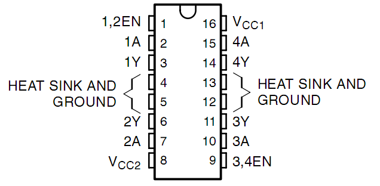

1.3.1 Motor
=============

Einführung
-----------------

In dieser Lektion lernen wir, 
mit L293D einen Gleichstrommotor antreiben und ihn im und gegen den Uhrzeigersinn drehen. 
Da der Gleichstrommotor aus Sicherheitsgründen einen größeren Strom benötigt, 
verwenden wir hier das Stromversorgungsmodul zur Versorgung der Motoren.

Komponenten
-----------------

.. image:: media/list_1.3.1.png

Prinzip
---------

**L293D**

L293D ist ein 4-Kanal-Motortreiber, der durch einen Chip mit hoher Spannung und hohem Strom integriert ist. Es ist für den Anschluss an Standard-DTL-, TTL-Logikniveau und ansteuerungsinduktive Lasten (wie Relaisspulen, Gleichstrom-, Schrittmotoren) sowie Leistungsschalttransistoren usw. ausgelegt. Gleichstrommotoren sind Geräte, die elektrische Gleichstromenergie in mechanische Energie umwandeln. Sie werden im elektrischen Antrieb wegen ihrer überlegenen Geschwindigkeitsregelungsleistung häufig verwendet.

Siehe die Abbildung der Pins unten. Der L293D verfügt über zwei Pins (Vcc1 und Vcc2) für die Stromversorgung. Vcc2 wird verwendet, um den Motor mit Strom zu versorgen, während Vcc1 dient, um den Chip zu versorgen. Da hier ein kleiner Gleichstrommotor verwendet wird, verbinden Sie beide Pins mit + 5V.

Das Folgende ist die interne Struktur von L293D. Pin EN ist ein Freigabepin und funktioniert nur mit hohem Niveau. A steht für Eingabe und Y für Ausgabe. Sie können die Beziehung zwischen ihnen unten rechts sehen. Wenn Pin EN auf Hohe Niveau steht und A auf High steht, gibt Y Hohe Niveau aus. Wenn A niedrig ist, gibt Y einen niedrigen Niveau aus. Wenn Pin EN auf niedgrigen Niveau steht, funktioniert der L293D nicht.

.. image:: media/image334.png

**Gleichspannungs Motor**

.. image:: media/image114.jpeg

Dies ist ein 5V Gleichstrommotor. Es dreht sich, wenn Sie den beiden Anschlüssen des Kupferblechs einen hohen und einen niedrigen Niveau geben. Der Einfachheit halber können Sie die Pin daran schweißen.

.. image:: media/image335.png

**Energieversorgung Modul**

In diesem Experiment werden große Ströme benötigt, um den Motor anzutreiben, insbesondere wenn er startet und stoppt, was die normale Arbeit von Raspberry Pi stark beeinträchtigt. Da versorgen wir diesen Motor separat mit Strom, damit er sicher und gleichmäßig läuft.

Sie können es einfach in das Steckbrett einstecken, um Strom zu liefern. Es liefert eine Spannung von 3,3V und 5V, und Sie können entweder über eine mitgelieferte Überbrückungskappe anschließen.

.. image:: media/image115.png

Schematische Darstellung
----------------------------

Stecken Sie das Netzteilmodul in das Steckbrett und setzen Sie die Überbrückungskappe auf 5V, dann wird eine Spannung von 5V ausgegeben. Verbinden Sie Pin 1 des L293D mit GPIO22 und stellen Sie ihn auf Hohe Niveau ein. Verbinden Sie Pin2 mit GPIO27 und Pin7 mit GPIO17 und setzen Sie dann einen Pin hoch, während der andere niedrig ist. So können Sie die Drehrichtung des Motors ändern.

.. image:: media/image336.png

Experimentelle Verfahren
--------------------------

Schritt 1: Bauen Sie die Schaltung auf.

.. image:: media/image117.png
    :width: 800

.. note::
    Das Leistungsmodul kann eine 9-V-Batterie mit der im Kit enthaltenen 9V-Batterieschnalle anlegen. 
    Setzen Sie die Überbrückungskappe des Leistungsmoduls in die 5V-Busleisten des Steckbretts ein.

.. image:: media/image118.jpeg

Für Benutzer in C-Sprache
^^^^^^^^^^^^^^^^^^^^^^^^^^^^^^^

Schritt 2: Gehen Sie in den Ordner der Kode.

.. raw:: html

    <run></run>
    
.. code-block::

    cd /home/pi/davinci-kit-for-raspberry-pi/c/1.3.1/

Schritt 3: Kompilieren.

.. raw:: html

   <run></run>

.. code-block::

    gcc 1.3.1_Motor.c -lwiringPi

Schritt 4: Führen Sie die obige ausführbare Datei aus.

.. raw:: html

   <run></run>

.. code-block::

    sudo ./a.out

Während die Kode läuft, dreht sich der Motor zuerst 5 Sekunden lang im Uhrzeigersinn und stoppt dann 5 Sekunden lang. Danach dreht er sich 5 Sekunden lang gegen den Uhrzeigersinn. Anschließend stoppt der Motor für 5S. Diese Reihe von Aktionen wird wiederholt ausgeführt.

**Code**

.. code-block:: c

    #include <wiringPi.h>
    #include <stdio.h>

    #define MotorPin1       0
    #define MotorPin2       2
    #define MotorEnable     3

    int main(void){
        int i;
        if(wiringPiSetup() == -1){ //when initialize wiring failed, print messageto screen
            printf("setup wiringPi failed !");
            return 1;
        }
        
        pinMode(MotorPin1, OUTPUT);
        pinMode(MotorPin2, OUTPUT);
        pinMode(MotorEnable, OUTPUT);
        while(1){
            printf("Clockwise\n");
            delay(100);
            digitalWrite(MotorEnable, HIGH);
            digitalWrite(MotorPin1, HIGH);
            digitalWrite(MotorPin2, LOW);
            for(i=0;i<3;i++){
                delay(1000);
            }

            printf("Stop\n");
            delay(100);
            digitalWrite(MotorEnable, LOW);
            for(i=0;i<3;i++){
                delay(1000);
            }

            printf("Anti-clockwise\n");
            delay(100);
            digitalWrite(MotorEnable, HIGH);
            digitalWrite(MotorPin1, LOW);
            digitalWrite(MotorPin2, HIGH);
            for(i=0;i<3;i++){
                delay(1000);
            }

            printf("Stop\n");
            delay(100);
            digitalWrite(MotorEnable, LOW);
            for(i=0;i<3;i++){
                delay(1000);
            }
        }
        return 0;
    }

**Code Erklärung**

.. code-block:: c

    digitalWrite(MotorEnable, HIGH);

Aktivieren Sie den L239D.

.. code-block:: c

    digitalWrite(MotorPin1, HIGH);
    digitalWrite(MotorPin2, LOW);

Stellen Sie einen hohen Niveau für 2A ein (Pin 7); Da sich 1,2EN (Pin 1) auf einem hohen Niveau befindet, gibt 2Y einen hohen Niveau aus.

Stellen Sie einen niedrigen Niveau für 1A ein, dann gibt 1Y einen niedrigen Niveau aus und der Motor dreht sich.

.. code-block:: c

    for(i=0;i<3;i++){
    delay(1000);
    }

Diese Schleife soll 3*1000ms verzögern.

.. code-block:: c

    digitalWrite(MotorEnable, LOW)

Wenn sich 1,2EN (Pin1) auf einem niedrigen Niveau befindet, funktioniert L293D nicht. Motor stoppt sich zu drehen.

.. code-block:: c

    digitalWrite(MotorPin1, LOW)
    digitalWrite(MotorPin2, HIGH)

Den Stromfluss des Motors umkehren, dann dreht sich der Motor umgekehrt.

Für Python-Sprachbenutzer
^^^^^^^^^^^^^^^^^^^^^^^^^^^

Schritt 2: Gehen Sie in den Ordner der Kode.

.. raw:: html

   <run></run>

.. code-block::

    cd /home/pi/davinci-kit-for-raspberry-pi/python

Schritt 3: Ausführen.

.. raw:: html

   <run></run>

.. code-block::

    sudo python3 1.3.1_Motor.py

Während die Kode läuft, dreht sich der Motor zuerst 5 Sekunden lang im Uhrzeigersinn und stoppt dann 5 Sekunden lang. Danach dreht er sich 5 Sekunden lang gegen den Uhrzeigersinn. Anschließend stoppt der Motor für 5S. Diese Reihe von Aktionen wird wiederholt ausgeführt.

**Code**

.. note::

    Sie können den folgenden Code **Ändern/Zurücksetzen/Kopieren/Ausführen/Stoppen** . Zuvor müssen Sie jedoch zu einem Quellcodepfad wie ``davinci-kit-for-raspberry-pi/python`` gehen.
     
.. raw:: html

    <run></run>

.. code-block:: python

    import RPi.GPIO as GPIO
    import time

    dhtPin = 17

    GPIO.setmode(GPIO.BCM)

    MAX_UNCHANGE_COUNT = 100

    STATE_INIT_PULL_DOWN = 1
    STATE_INIT_PULL_UP = 2
    STATE_DATA_FIRST_PULL_DOWN = 3
    STATE_DATA_PULL_UP = 4
    STATE_DATA_PULL_DOWN = 5

    def readDht11():
        GPIO.setup(dhtPin, GPIO.OUT)
        GPIO.output(dhtPin, GPIO.HIGH)
        time.sleep(0.05)
        GPIO.output(dhtPin, GPIO.LOW)
        time.sleep(0.02)
        GPIO.setup(dhtPin, GPIO.IN, GPIO.PUD_UP)

        unchanged_count = 0
        last = -1
        data = []
        while True:
            current = GPIO.input(dhtPin)
            data.append(current)
            if last != current:
                unchanged_count = 0
                last = current
            else:
                unchanged_count += 1
                if unchanged_count > MAX_UNCHANGE_COUNT:
                    break

        state = STATE_INIT_PULL_DOWN

        lengths = []
        current_length = 0

        for current in data:
            current_length += 1

            if state == STATE_INIT_PULL_DOWN:
                if current == GPIO.LOW:
                    state = STATE_INIT_PULL_UP
                else:
                    continue
            if state == STATE_INIT_PULL_UP:
                if current == GPIO.HIGH:
                    state = STATE_DATA_FIRST_PULL_DOWN
                else:
                    continue
            if state == STATE_DATA_FIRST_PULL_DOWN:
                if current == GPIO.LOW:
                    state = STATE_DATA_PULL_UP
                else:
                    continue
            if state == STATE_DATA_PULL_UP:
                if current == GPIO.HIGH:
                    current_length = 0
                    state = STATE_DATA_PULL_DOWN
                else:
                    continue
            if state == STATE_DATA_PULL_DOWN:
                if current == GPIO.LOW:
                    lengths.append(current_length)
                    state = STATE_DATA_PULL_UP
                else:
                    continue
        if len(lengths) != 40:
            #print ("Data not good, skip")
            return False

        shortest_pull_up = min(lengths)
        longest_pull_up = max(lengths)
        halfway = (longest_pull_up + shortest_pull_up) / 2
        bits = []
        the_bytes = []
        byte = 0

        for length in lengths:
            bit = 0
            if length > halfway:
                bit = 1
            bits.append(bit)
        #print ("bits: %s, length: %d" % (bits, len(bits)))
        for i in range(0, len(bits)):
            byte = byte << 1
            if (bits[i]):
                byte = byte | 1
            else:
                byte = byte | 0
            if ((i + 1) % 8 == 0):
                the_bytes.append(byte)
                byte = 0
        #print (the_bytes)
        checksum = (the_bytes[0] + the_bytes[1] + the_bytes[2] + the_bytes[3]) & 0xFF
        if the_bytes[4] != checksum:
            #print ("Data not good, skip")
            return False

        return the_bytes[0], the_bytes[2]

    def main():

        while True:
            result = readDht11()
            if result:
                humidity, temperature = result
                print ("humidity: %s %%,  Temperature: %s C`" % (humidity, temperature))
            time.sleep(1)

    def destroy():
        GPIO.cleanup()

    if __name__ == '__main__':
        try:
            main()
        except KeyboardInterrupt:
            destroy() 

**Code Erklärung**

.. code-block:: python

    def motor(direction):
        # Clockwise
        if direction == 1:
            # Set direction
            GPIO.output(MotorPin1, GPIO.HIGH)
            GPIO.output(MotorPin2, GPIO.LOW)
            # Enable the motor
            GPIO.output(MotorEnable, GPIO.HIGH)
            print ("Clockwise")
    ...

Erstellen Sie eine Funktion, ``motor()`` , 
deren Variable die Richtung ist. Wenn die Bedingung erfüllt ist, 
dass ``direction = 1`` erfüllt ist, dreht sich der Motor im Uhrzeigersinn. 
Wenn die ``direction = -1`` ist, dreht sich der Motor gegen den Uhrzeigersinn. 
und unter der Bedingung, dass ``direction = 0`` ist, hört es auf, sich zu drehen.

.. code-block:: python

    def main():
        # Define a dictionary to make the script more readable
        # CW as clockwise, CCW as counterclockwise, STOP as stop
        directions = {'CW': 1, 'CCW': -1, 'STOP': 0}
        while True:
            # Clockwise
            motor(directions['CW'])
            time.sleep(5)
            # Stop
            motor(directions['STOP'])
            time.sleep(5)
            # Anticlockwise
            motor(directions['CCW'])
            time.sleep(5)
            # Stop
            motor(directions['STOP'])
            time.sleep(5)
        

In der ``main()`` -erstellen Sie ein Array, ``directions[]`` , in dem CW gleich 1 ist, der Wert von CCW -1 ist und die Nummer 0 auf Stop verweist.

Während die Kode läuft, dreht sich der Motor zuerst 5 Sekunden lang im Uhrzeigersinn und stoppt dann 5 Sekunden lang. Danach dreht er sich 5 Sekunden lang gegen den Uhrzeigersinn. Anschließend stoppt der Motor für 5s. Diese Reihe von Aktionen wird wiederholt ausgeführt.

Jetzt sollte sich das Motorblatt drehen.

Phänomen Bild
------------------

