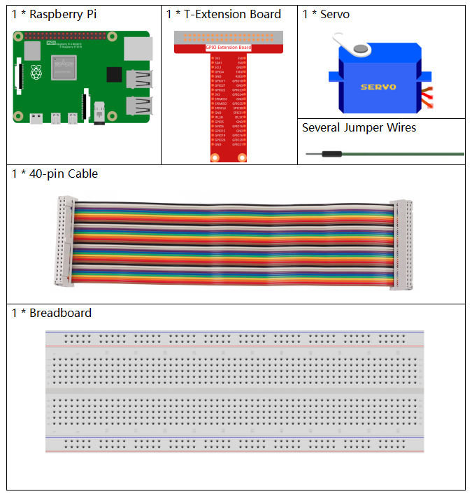
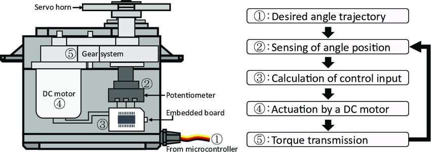
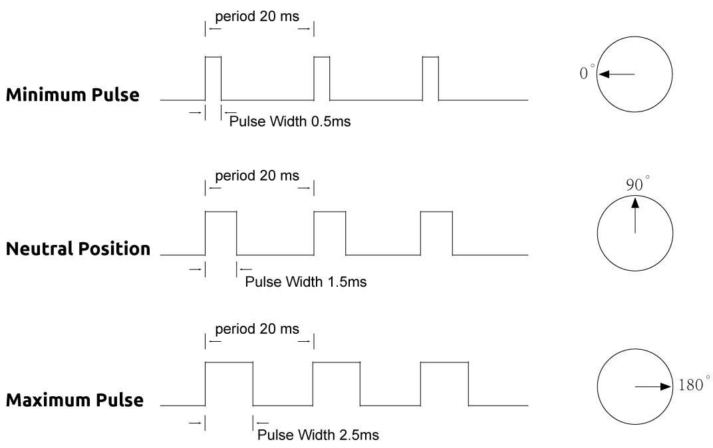
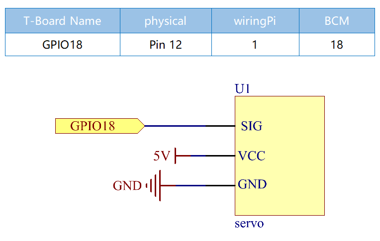
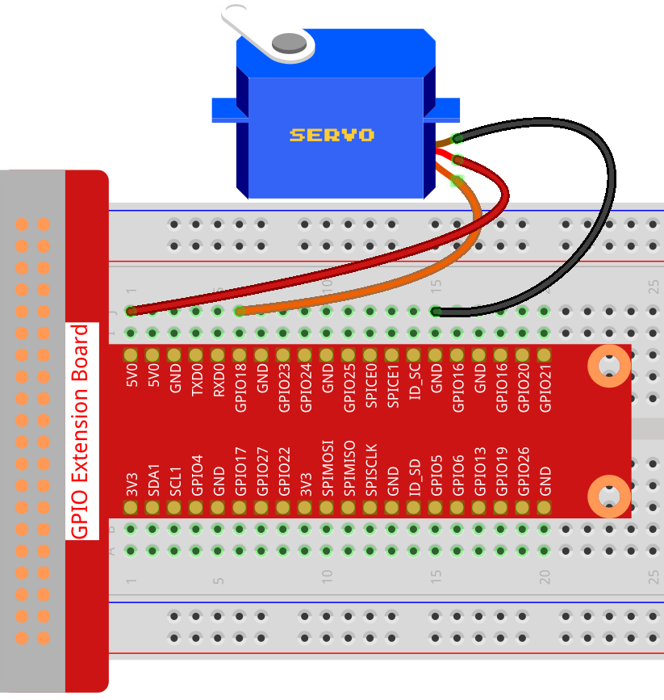
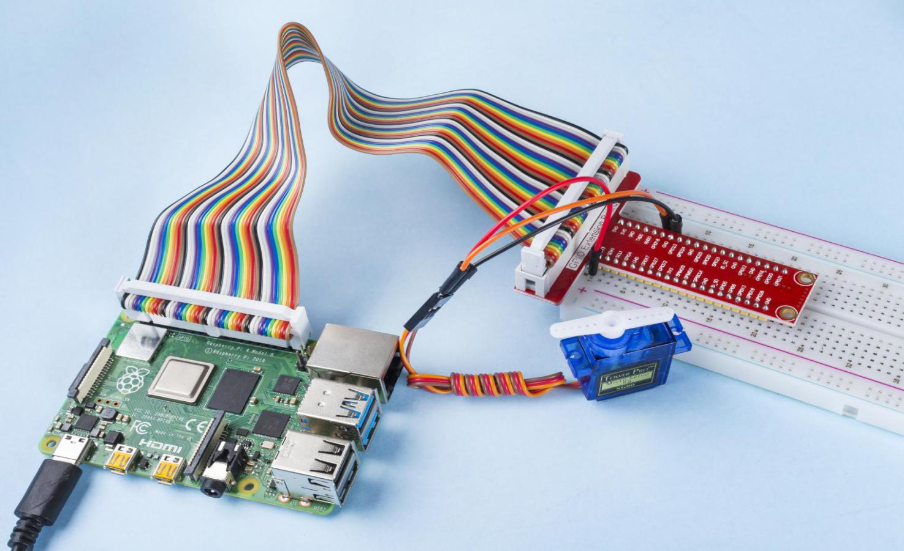

1.3.2 Servo
============

Introduction
--------------

In this lesson, we will learn how to make the servo rotate.

Components
----------

Principle
---------

**Servo**

A servo is generally composed of the following parts: case, shaft, gear
system, potentiometer, DC motor, and embedded board.

.. image:: img/image121.png

It works like this: The microcontroller sends out PWM signals to the
servo, and then the embedded board in the servo receives the signals
through the signal pin and controls the motor inside to turn. As a
result, the motor drives the gear system and then motivates the shaft
after deceleration. The shaft and potentiometer of the servo are
connected together. When the shaft rotates, it drives the potentiometer,
so the potentiometer outputs a voltage signal to the embedded board.
Then the board determines the direction and speed of rotation based on
the current position, so it can stop exactly at the right position as
defined and hold there.

The angle is determined by the duration of a pulse that is applied to
the control wire. This is called Pulse width Modulation. The servo
expects to see a pulse every 20 ms. The length of the pulse will
determine how far the motor turns. For example, a 1.5ms pulse will make
the motor turn to the 90 degree position (neutral position).

When a pulse is sent to a servo that is less than 1.5 ms, the servo
rotates to a position and holds its output shaft some number of degrees
counterclockwise from the neutral point. When the pulse is wider than
1.5 ms the opposite occurs. The minimal width and the maximum width of
pulse that will command the servo to turn to a valid position are
functions of each servo. Generally the minimum pulse will be about 0.5
ms wide and the maximum pulse will be 2.5 ms wide.

Schematic Diagram
-----------------

Experimental Procedures
-----------------------

**Step 1:** Build the circuit.

For C Language Users
^^^^^^^^^^^^^^^^^^^^^

**Step 2**: Go to the folder of the code.

.. raw:: html

   <run></run>

.. code-block::

    cd ~/davinci-kit-for-raspberry-pi/c/1.3.2

**Step 3**: Compile the code.

.. raw:: html

   <run></run>

.. code-block::

    gcc 1.3.2_Servo.c -lwiringPi

**Step 4**: Run the executable file.

.. raw:: html

   <run></run>

.. code-block::

    sudo ./a.out

After the program is executed, the servo will rotate from 
0 degrees to 180 degrees, and then from 180 degrees to 0 degrees, circularly.

.. note::

    If it does not work after running, or there is an error prompt: \"wiringPi.h: No such file or directory\", please refer to :ref:`C code is not working?`.

**Code**

.. code-block:: c

    #include <wiringPi.h>
    #include <softPwm.h>
    #include <stdio.h>

    #define ServoPin    1       //define the servo to GPIO1
    long Map(long value,long fromLow,long fromHigh,long toLow,long toHigh){
        return (toHigh-toLow)*(value-fromLow) / (fromHigh-fromLow) + toLow;
    }
    void setAngle(int pin, int angle){    //Create a funtion to control the angle of the servo.
        if(angle < 0)
            angle = 0;
        if(angle > 180)
            angle = 180;
        softPwmWrite(pin,Map(angle, 0, 180, 5, 25));   
    } 

    int main(void)
    {
        int i;
        if(wiringPiSetup() == -1){ //when initialize wiring failed,print message to screen
            printf("setup wiringPi failed !");
            return 1; 
        }
        softPwmCreate(ServoPin, 0, 200);       //initialize PMW pin of servo
        while(1){
            for(i=0;i<181;i++){     // Let servo rotate from 0 to 180.            	setAngle(ServoPin,i);
                delay(2);
            }
            delay(1000);
            for(i=181;i>-1;i--){        // Let servo rotate from 180 to 0.            	setAngle(ServoPin,i);
                delay(2);
            }
            delay(1000);
        }
        return 0;
    }

**Code Explanation**

.. code-block:: c

    long Map(long value,long fromLow,long fromHigh,long toLow,long toHigh){
        return (toHigh-toLow)*(value-fromLow) / (fromHigh-fromLow) + toLow;
    }

Create a Map() function to map value in the following code.

.. code-block:: c

    void setAngle(int pin, int angle){    //Create a funtion to control the angle of the servo.
        if(angle < 0)
            angle = 0;
        if(angle > 180)
            angle = 180;
        softPwmWrite(pin,Map(angle, 0, 180, 5, 25));   
    } 

Create a funtion, setAngle() to write angle to the servo.

.. code-block:: c

    softPwmWrite(pin,Map(angle,0,180,5,25));  

This function can change the duty cycle of the PWM.

To make the servo rotate to 0 ~ 180 °, the pulse width should change
within the range of 0.5ms ~ 2.5ms when the period is 20ms; in the
function, softPwmCreate(), we have set that the period is
200x100us=20ms, thus we need to map 0 ~ 180 to 5x100us ~ 25x100us.

The prototype of this function is shown below.

.. code-block:: 

    int softPwmCreate（int pin，int initialValue，int pwmRange）;

**Parameter pin:** Any GPIO pin of Raspberry Pi can be set as PWM pin.

**Parameter initialValue:** The initial pulse width is that initialValue
times 100us.

**Parameter pwmRange:** the period of PWM is that pwmRange times 100us.

For Python Language Users
^^^^^^^^^^^^^^^^^^^^^^^^^

**Step 2**: Go to the folder of the code.

.. raw:: html

   <run></run>

.. code-block::

    cd ~/davinci-kit-for-raspberry-pi/python/

**Step 3**: Run the executable file.

.. raw:: html

   <run></run>

.. code-block::

    sudo python3 1.3.2_Servo.py

After the program is executed, the servo will rotate from 0 degrees 
to 180 degrees, and then from 180 degrees to 0 degrees, circularly.

**Code**

.. note::

    You can **Modify/Reset/Copy/Run/Stop** the code below. But before that, you need to go to  source code path like ``davinci-kit-for-raspberry-pi/python``. 
    
.. raw:: html

    <run></run>

.. code-block:: python

    import RPi.GPIO as GPIO
    import time

    SERVO_MIN_PULSE = 500
    SERVO_MAX_PULSE = 2500

    ServoPin = 18

    def map(value, inMin, inMax, outMin, outMax):
        return (outMax - outMin) * (value - inMin) / (inMax - inMin) + outMin

    def setup():
        global p
        GPIO.setmode(GPIO.BCM)       # Numbers GPIOs by BCM
        GPIO.setup(ServoPin, GPIO.OUT)   # Set ServoPin's mode is output
        GPIO.output(ServoPin, GPIO.LOW)  # Set ServoPin to low
        p = GPIO.PWM(ServoPin, 50)     # set Frequecy to 50Hz
        p.start(0)                     # Duty Cycle = 0
        
    def setAngle(angle):      # make the servo rotate to specific angle (0-180 degrees) 
        angle = max(0, min(180, angle))
        pulse_width = map(angle, 0, 180, SERVO_MIN_PULSE, SERVO_MAX_PULSE)
        pwm = map(pulse_width, 0, 20000, 0, 100)
        p.ChangeDutyCycle(pwm)#map the angle to duty cycle and output it
        
    def loop():
        while True:
            for i in range(0, 181, 5):   #make servo rotate from 0 to 180 deg
                setAngle(i)     # Write to servo
                time.sleep(0.002)
            time.sleep(1)
            for i in range(180, -1, -5): #make servo rotate from 180 to 0 deg
                setAngle(i)
                time.sleep(0.001)
            time.sleep(1)

    def destroy():
        p.stop()
        GPIO.cleanup()

    if __name__ == '__main__':     #Program start from here
        setup()
        try:
            loop()
        except KeyboardInterrupt:  # When 'Ctrl+C' is pressed, the program destroy() will be executed.
            destroy()
        

**Code Explanation**

.. code-block:: python

    p = GPIO.PWM(ServoPin, 50)     # set Frequecy to 50Hz
    p.start(0)                     # Duty Cycle = 0

Set the servoPin to PWM pin, then the frequency to 50hz, and the period to 20ms.

p.start(0): Run the PWM function，and set the initial value to 0.

.. code-block:: python

    def setAngle(angle):      # make the servo rotate to specific angle (0-180 degrees) 
        angle = max(0, min(180, angle))
        pulse_width = map(angle, 0, 180, SERVO_MIN_PULSE, SERVO_MAX_PULSE)
        pwm = map(pulse_width, 0, 20000, 0, 100)
        p.ChangeDutyCycle(pwm)#map the angle to duty cycle and output it
    
Create a function, setAngle() to write angle that ranges from 0 to 180 into the servo.

.. code-block:: python

    angle = max(0, min(180, angle))

This code is used to limit the angle within the range 0-180°.

The min() function returns the minimum of the input values. 
If 180<angle, then return 180,if not, return angle.

The max() method returns the maximum element in an iterable or largest of 
two or more parameters. If 0>angle, then return 0, if not, return angle.

.. code-block:: python

    pulse_width = map(angle, 0, 180, SERVO_MIN_PULSE, SERVO_MAX_PULSE)
    pwm = map(pulse_width, 0, 20000, 0, 100)
    p.ChangeDutyCycle(pwm)

To render a range 0 ~ 180 ° to the servo, the pulse width of the servo
is set to 0.5ms(500us)-2.5ms(2500us).

The period of PWM is 20ms(20000us), thus the duty cycle of PWM is
(500/20000)%-(2500/20000)%, and the range 0 ~ 180 is mapped to 2.5 ~
12.5.

Phenomenon Picture
------------------

