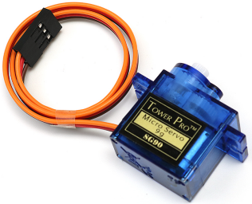

.. note::

    こんにちは、SunFounderのRaspberry Pi & Arduino & ESP32愛好家コミュニティへようこそ！Facebook上でRaspberry Pi、Arduino、ESP32についてもっと深く掘り下げ、他の愛好家と交流しましょう。

    **参加する理由は？**

    - **エキスパートサポート**：コミュニティやチームの助けを借りて、販売後の問題や技術的な課題を解決します。
    - **学び＆共有**：ヒントやチュートリアルを交換してスキルを向上させましょう。
    - **独占的なプレビュー**：新製品の発表や先行プレビューに早期アクセスしましょう。
    - **特別割引**：最新製品の独占割引をお楽しみください。
    - **祭りのプロモーションとギフト**：ギフトや祝日のプロモーションに参加しましょう。

    👉 私たちと一緒に探索し、創造する準備はできていますか？[|link_sf_facebook|]をクリックして今すぐ参加しましょう！

1.3.2 サーボ
============

前書き
--------------

このレッスンでは、サーボを回転させる方法を学ぶ。

部品
----------

.. image:: media/list_1.3.2.png

原理
---------

**サーボ**

サーボは一般に、ケース、シャフト、ギアシステム、ポテンショメーター、DCモーター、および内蔵式ボードで構成されている。

これは次のように動作する：マイクロコントローラーはPWM信号をサーボに送信し、サーボの内蔵式ボードは信号ピンを介して信号を受信し、内部のモーターを制御して回転させる。その結果、モーターはギアシステムを駆動し、減速後にシャフトを駆動する。サーボのシャフトとポテンショメーターは接続されている。シャフトが回転する時、ポテンショメーターが駆動されるため、ポテンショメーターは電圧信号を内蔵式ボードに出力する。
その後、ボードは現在の位置に基づいて回転の方向と速度を決めるため、定義された位置で正確に停止してそのまま保持する。

.. image:: media/image122.png

角度は制御ワイヤに適用されるパルスの持続時間によって決まる。これはパルス幅変調と呼ばれる。
サーボは20ミリ秒ごとに1パルスを期待している。パルスの長さにより、モーターの回転距離が決まる。
たとえば、1.5msパルスは、モーターを90度の位置（ニュートラル位置）に回転させる。

1.5 ms未満のパルスがサーボに送信されると、サーボはある位置まで回転し、出力軸をニュートラル位置から反時計回りにある程度保持する。
パルスが1.5ミリ秒を上回る場合、逆のことが起こる。
有効な位置にサーボを回転させるように命令するパルスの最小幅と最大幅は、各サーボの機能である。
通常、パルスの最小幅は約0.5 msで、最大幅は2.5 msである。

.. image:: media/image123.jpeg

回路図
-----------------

.. image:: img/image337.png

実験手順
-----------------------

ステップ1： 回路を作る。

.. image:: img/image125.png
    :width: 800

C言語ユーザー向け
^^^^^^^^^^^^^^^^^^^^^

ステップ2： コードのフォルダーに入る。

.. raw:: html

   <run></run>

.. code-block::

    cd /home/pi/davinci-kit-for-raspberry-pi/c/1.3.2

ステップ3： コードをコンパイルする。

.. raw:: html

   <run></run>

.. code-block::

    gcc 1.3.2_Servo.c -lwiringPi

ステップ4： EXEファイルを実行する。

.. raw:: html

   <run></run>

.. code-block::

    sudo ./a.out

プログラムが実行されると、サーボは0度から180度まで回転し、それから180度から0度まで循環的に回転する。

**コード**

.. code-block:: c

    #include <wiringPi.h>
    #include <softPwm.h>
    #include <stdio.h>

    #define ServoPin    1       //define the servo to GPIO1
    long Map(long value,long fromLow,long fromHigh,long toLow,long toHigh){
        return (toHigh-toLow)*(value-fromLow) / (fromHigh-fromLow) + toLow;
    }
    void setAngle(int pin, int angle){    //Create a funtion to control the angle of the servo.
        if(angle < 0)
            angle = 0;
        if(angle > 180)
            angle = 180;
        softPwmWrite(pin,Map(angle, 0, 180, 5, 25));   
    } 

    int main(void)
    {
        int i;
        if(wiringPiSetup() == -1){ //when initialize wiring failed,print message to screen
            printf("setup wiringPi failed !");
            return 1; 
        }
        softPwmCreate(ServoPin, 0, 200);       //initialize PMW pin of servo
        while(1){
            for(i=0;i<181;i++){     // Let servo rotate from 0 to 180.            	setAngle(ServoPin,i);
                delay(2);
            }
            delay(1000);
            for(i=181;i>-1;i--){        // Let servo rotate from 180 to 0.            	setAngle(ServoPin,i);
                delay(2);
            }
            delay(1000);
        }
        return 0;
    }

**コードの説明**

.. code-block:: c

    long Map(long value,long fromLow,long fromHigh,long toLow,long toHigh){
        return (toHigh-toLow)*(value-fromLow) / (fromHigh-fromLow) + toLow;
    }

次のコードで値をマップする ``Map()`` 関数を作成する。

.. code-block:: c

    void setAngle(int pin, int angle){    //Create a funtion to control the angle of the servo.
        if(angle < 0)
            angle = 0;
        if(angle > 180)
            angle = 180;
        softPwmWrite(pin,Map(angle, 0, 180, 5, 25));   
    } 

角度をサーボに書き込むために、関数 ``setAngle()`` を作成する。

.. code-block:: c

    softPwmWrite(pin,Map(angle,0,180,5,25));  

この関数はPWMのデューティサイクルを変更できる。

サーボを0〜180°に回転させるために、周期が20msのときにパルス幅を0.5ms〜2.5msの範囲内で変更してください。
関数 ``softPwmCreate()`` では、周期が200x100us = 20msに設定されているため、0〜180を5x100us〜25x100usにマッピングする必要がある。

この関数のプロトタイプを以下に示す。

.. code-block:: 

    int softPwmCreate（int pin，int initialValue，int pwmRange）;

**pin:** Raspberry PiのGPIOピンはPWMピンとして設定できる。

**initialValue:** 初期パルス幅は、initialValueに100usを掛けたものである。

**pwmRange:** PWMの周期は、pwmRangeに100usを掛けたものである。

Python言語ユーザー向け
^^^^^^^^^^^^^^^^^^^^^^^^^

ステップ2： コードのフォルダーに入る。

.. raw:: html

   <run></run>

.. code-block::

    cd /home/pi/davinci-kit-for-raspberry-pi/python/

ステップ3： EXEファイルを実行する。

.. raw:: html

   <run></run>

.. code-block::

    sudo python3 1.3.2_Servo.py

プログラムが実行されると、サーボは0度から180度まで回転し、それから180度から0度まで循環的に回転する。

**コード**

.. note::

   以下のコードを **変更/リセット/コピー/実行/停止** できます。 ただし、その前に、 ``davinci-kit-for-raspberry-pi/python`` のようなソースコードパスに移動する必要があります。 
      
.. raw:: html

    <run></run>

.. code-block:: python

    import RPi.GPIO as GPIO
    import time

    SERVO_MIN_PULSE = 500
    SERVO_MAX_PULSE = 2500

    ServoPin = 18

    def map(value, inMin, inMax, outMin, outMax):
        return (outMax - outMin) * (value - inMin) / (inMax - inMin) + outMin

    def setup():
        global p
        GPIO.setmode(GPIO.BCM)       # Numbers GPIOs by BCM
        GPIO.setup(ServoPin, GPIO.OUT)   # Set ServoPin's mode is output
        GPIO.output(ServoPin, GPIO.LOW)  # Set ServoPin to low
        p = GPIO.PWM(ServoPin, 50)     # set Frequecy to 50Hz
        p.start(0)                     # Duty Cycle = 0
        
    def setAngle(angle):      # make the servo rotate to specific angle (0-180 degrees) 
        angle = max(0, min(180, angle))
        pulse_width = map(angle, 0, 180, SERVO_MIN_PULSE, SERVO_MAX_PULSE)
        pwm = map(pulse_width, 0, 20000, 0, 100)
        p.ChangeDutyCycle(pwm)#map the angle to duty cycle and output it
        
    def loop():
        while True:
            for i in range(0, 181, 5):   #make servo rotate from 0 to 180 deg
                setAngle(i)     # Write to servo
                time.sleep(0.002)
            time.sleep(1)
            for i in range(180, -1, -5): #make servo rotate from 180 to 0 deg
                setAngle(i)
                time.sleep(0.001)
            time.sleep(1)

    def destroy():
        p.stop()
        GPIO.cleanup()

    if __name__ == '__main__':     #Program start from here
        setup()
        try:
            loop()
        except KeyboardInterrupt:  # When 'Ctrl+C' is pressed, the program destroy() will be executed.
            destroy()
        

**コードの説明**

.. code-block:: python

    p = GPIO.PWM(ServoPin, 50)     # set Frequecy to 50Hz
    p.start(0)                     # Duty Cycle = 0

``servoPin`` をPWMピンに設定し、次に周波数を50hzに、周期を20msに設定する。

``p.start(0)`` : PWM関数を実行し、初期値を0に設定する。

.. code-block:: python

    def setAngle(angle):      # make the servo rotate to specific angle (0-180 degrees) 
        angle = max(0, min(180, angle))
        pulse_width = map(angle, 0, 180, SERVO_MIN_PULSE, SERVO_MAX_PULSE)
        pwm = map(pulse_width, 0, 20000, 0, 100)
        p.ChangeDutyCycle(pwm)#map the angle to duty cycle and output it
    
関数 ``setAngle()`` を作成して、0〜180の範囲の角度をサーボに書き込む。

.. code-block:: python

    angle = max(0, min(180, angle))

このコードは角度を0〜180°の範囲に制限するために使用される。

``min()`` 関数は入力値の最小値を返す。角度が180以下の場合、180を返す。そうではない場合、角度を返す。

``max()`` メソッドは、反復可能または最大の2つ以上のパラメーターで最大要素を返す。角度が0以上の場合は0を返し、そうでない場合は角度を返す。

.. code-block:: python

    pulse_width = map(angle, 0, 180, SERVO_MIN_PULSE, SERVO_MAX_PULSE)
    pwm = map(pulse_width, 0, 20000, 0, 100)
    p.ChangeDutyCycle(pwm)

0〜180°の範囲をサーボにレンダリングすると、サーボのパルス幅は0.5ms（500us）〜2.5ms（2500us）に設定される。

PWMの周期は20ms（20000us）であるため、PWMのデューティサイクルは（500/20000）％-（2500/20000）％であり、0〜180の範囲は2.5〜12.5にマッピングされる。

現象画像
------------------

.. image:: media/image126.jpeg

