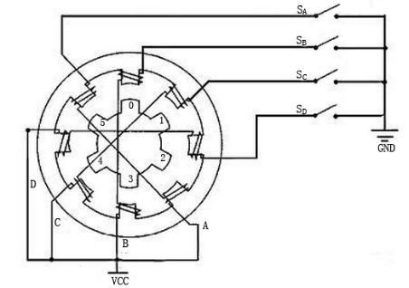
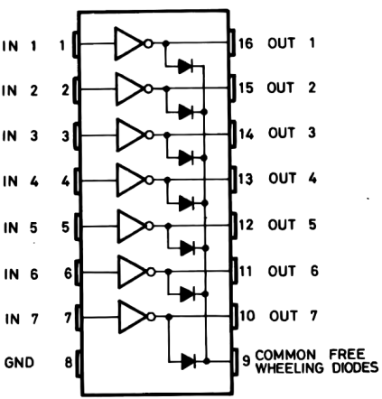
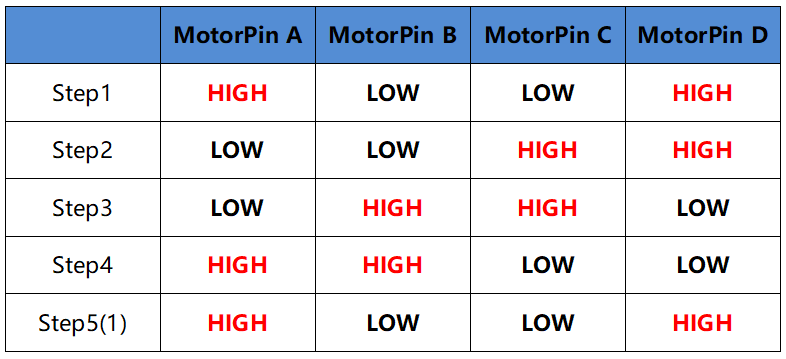
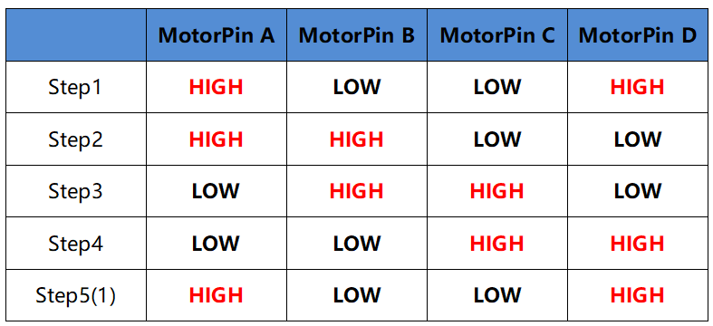
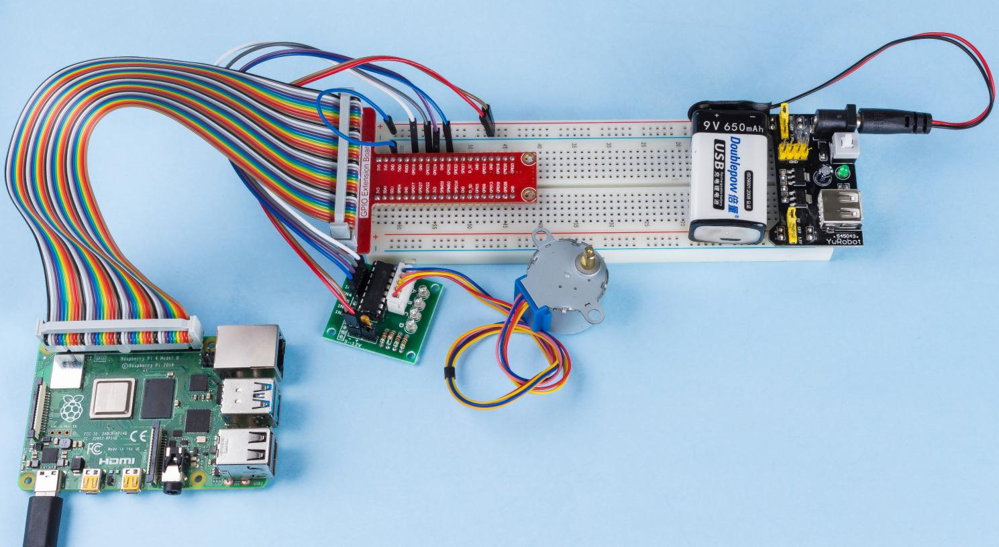

1.3.3 ステッピングモーター
==========================

前書き
------------

独自の設計により、ステッピングモーターはフィードバックメカニズムなしで高度な精度で制御できる。一連の磁石が取り付けられたステッパーのシャフトは、特定のシーケンスで正と負に帯電する一連の電磁コイルによって制御され、小さな「ステップ」で前後に正確に移動する。

部品
----------

.. image:: media/list_1.3.3.png

原理
---------

**ステッピングモーター**

ステッパーには、ユニポーラーとバイポーラーの2つのタイプがあり、使用しているタイプを知ることが非常に重要である。
この実験では、ユニポーラステッパーを使用する。

ステッピングモーターは単相DC電源を使用する4相モーターである。
適切な時系列でモーターのすべての相巻線に通電する限り、一歩一歩に回転させることができる。
4相リアクティブステッピングモーターの概略図：

.. image:: media/image129.png

図では、モーターの中央にローター-歯車状の永久磁石がある。ローターの周りの0〜5は歯である。
さらに外側には、8つの磁極があり、それぞれ反対側の2つの磁極がコイル巻線で接続されている。
そのため、AからDまでの4つのペアを形成し、相と呼ばれる。スイッチSA、SB、SC、SDに接続するリード線が4本ある。
したがって、回路では4つの相が並列になっており、1つの相の2つの磁極は直列になっている。

**4相ステッピングモーターの動作原理は次の通りである:**

スイッチSBの電源がオンになると、スイッチSA、SC、およびSDの電源がオフになり、B相の磁極がローターの歯0と3と整列する。
同時に、歯1と4は、C相とD相の極を持つ互い違いに配列した歯を生成する。
歯2と5は、D相とA相の極を持つ互い違いに配列した歯を生成する。
スイッチSCの電源がオン、スイッチSB、SA、およびSDの電源がオフの場合、ローターはC相巻線の磁場と歯1と4の間の磁場の下で回転する。
次に、歯1と4がC相巻線の磁極と整列する。
一方、歯0と3はA相とB相の極を持つ互い違いに配列した歯を生成し、歯2と5はA相とD相の極を持つ互い違いに配列した歯を生成する。
同様の状況が続いていく。
A、B、C、D相に順番に通電すると、ローターはA、B、C、Dの順に回転する。

4相ステッピングモーターには、3つの動作モードがある：シングル4ステップ、ダブル4ステップ、および8ステップ。
シングル4ステップとダブル4ステップのステップ角は同じであるが、シングル4ステップの駆動トルクは小さくなる。
8ステップのステップ角は、シングル4ステップおよびダブル4ステップの半分である。
したがって、8ステップの動作モードは、高い駆動トルクを維持し、制御精度を向上させることができる。

使用するステッピングモーターのステータには32個の磁極があるため、円には32ステップが必要である。
ステッピングモーターの出力軸は減速装置セットに接続され、減速比は1/64である。
ですから、最終出力シャフトは32 * 64 = 2048ステップを必要とする円を回転させる。

**ULN2003**

モーターを円に適用するには、ドライバーボードを使用する必要があります。
ステッパーモータードライバ-ULN2003は7チャネルインバータサークルです。
つまり、入力ピンが高レベルの場合、ULN2003の出力ピンは低レベルであり、その逆も同様です。
IN1 に高レベルを供給し、IN2、IN3、IN4 に低レベルを供給すると、出力端 OUT1 は低レベルであり、他のすべての出力端は高レベルになります。
チップの内部構造を以下に示します。

ULN2003チップと4つのLEDで構成されるステッピングモータードライバーを以下に示す。
ボードでは、IN1、IN2、IN3、IN4が入力として機能し、4つのLED、A、B、C、Dは入力ピンの指示器である。
さらに、OUT1、OUT2、OUT3、およびOUT4はそれぞれ、ステッピングモータードライバーのSA、SB、SC、およびSDに接続されている。
IN1の値が高レベルに設定されると、Aが点灯し、スイッチSAの電源がオンになり、ステッピングモーターが1ステップで回転する。
同様のケースが何度も繰り返される。したがって、ステッピングモーターに特定の時系列を与えるだけで、ステップごとに回転する。
ステッピングモーターに特定の時系列を提供するために、ここでULN2003を使用する。

.. image:: media/image132.png

回路図
-----------------

.. image:: media/image339.png

実験手順
-----------------------

ステップ1： 回路を作る。

.. image:: media/image134.png
    :width: 800

C言語ユーザー向け
^^^^^^^^^^^^^^^^^^^^

ステップ2： コードのフォルダーに入る。

.. raw:: html

   <run></run>

.. code-block::

    cd /home/pi/davinci-kit-for-raspberry-pi/c/1.3.3/

ステップ3： コードをコンパイルする。

.. raw:: html

   <run></run>

.. code-block::

    gcc 1.3.3_StepperMotor.c -lwiringPi

ステップ4： EXEファイルを実行する。

.. raw:: html

   <run></run>

.. code-block::

    sudo ./a.out

コードが実行されると、入力「a」または「c」に応じてステッピングモーターが時計回りまたは反時計回りに回転する。

**コード**

.. code-block:: c

    #include <stdio.h>
    #include <wiringPi.h>

    const int motorPin[] = {1, 4, 5, 6};
    int rolePerMinute = 15;
    int stepsPerRevolution = 2048;
    int stepSpeed = 0;

    void rotary(char direction){
        if(direction == 'c'){
            for(int j=0;j<4;j++){
                for(int i=0;i<4;i++)
                    {digitalWrite(motorPin[i],0x99>>j & (0x08>>i));}
                delayMicroseconds(stepSpeed);
            }        
        }
        else if(direction =='a'){
            for(int j=0;j<4;j++){
                for(int i=0;i<4;i++)
                    {digitalWrite(motorPin[i],0x99<<j & (0x80>>i));}
                delayMicroseconds(stepSpeed);
            }   
        }
    }

    void loop()
    {
        char direction = '0';
        while (1)
        {       
            printf("select motor direction a=anticlockwise, c=clockwise: ");
            delay(100);
            direction=getchar();
            if (direction == 'c')
            {
                printf("motor running clockwise\n");
                delay(100);
                break;
            }
            else if (direction == 'a')
            {
                printf("motor running anti-clockwise\n");
                delay(100);
                break;
            }
            else
            {
                printf("input error, please try again!\n");
                delay(100);
            }
        }
        while(1)
        {
            rotary(direction);
        }
    }

    void main(void)
    {
        if (wiringPiSetup() == -1)
        {
            printf("setup wiringPi failed !");
            return;
        }
        for (int i = 0; i < 4; i++)
        {
            pinMode(motorPin[i], OUTPUT);
        }
        stepSpeed = (60000000 / rolePerMinute) / stepsPerRevolution;
        loop();
    }

**コードの説明**

.. code-block:: c

    int rolePerMinute = 15;
    int stepsPerRevolution = 2048;
    int stepSpeed = 0;

**rolePerMinute:** 1分あたりの回転数。このキットで使用されるステッピングモーターのRPMは0〜17である。

**stepPerRevolution:** 1ターンのステップ数、およびこのキットで使用されるステッピングモーターには、1回転あたり2048ステップが必要である。

**stepSpeed:** 各ステップに使用される時間、 ``main()`` では、それらに値を割り当てる。 ``(60000000/rolePerMinute)/stepsPerRevolution`` （60,000,000 us = 1分）

.. code-block:: c

    void loop()
    {
        char direction = '0';
        while (1)
        {       
            printf("select motor direction a=anticlockwise, c=clockwise: ");
            direction=getchar();
            if (direction == 'c')
            {
                printf("motor running clockwise\n");
                break;
            }
            else if (direction == 'a')
            {
                printf("motor running anti-clockwise\n");
                break;
            }
            else
            {
                printf("input error, please try again!\n");
            }
        }
        while(1)
        {
            rotary(direction);
        }
    }

``loop()`` 関数は、2つの部分（2つの ``while(1)`` の間にある）に大まかに分けられている：

最初の部分の目的は、key valueを取得することである。「a」または「c」が取得されたら、ループを終了して入力を停止してください。

2番目の部分は ``rotary(direction)`` を呼び出して、ステッピングモーターを動作させる。

.. code-block:: c

    void rotary(char direction){
        if(direction == 'c'){
            for(int j=0;j<4;j++){
                for(int i=0;i<4;i++)
                    {digitalWrite(motorPin[i],0x99>>j & (0x08>>i));}
                delayMicroseconds(stepSpeed);
            }        
        }
        else if(direction =='a'){
            for(int j=0;j<4;j++){
                for(int i=0;i<4;i++)
                    {digitalWrite(motorPin[i],0x99<<j & (0x80>>i));}
                delayMicroseconds(stepSpeed);
            }   
        }
    }

ステッピングモーターを **時計回りに回転させる** ために、motorPinのレベルス状態要求は以下の通りである：

.. image:: media/image340.png

したがって、2層のfor文を使用してMotorPinの潜在的な書き込みを実装する。

Step1では、j=0、i=0〜4。

``motorPin[0]`` は高レベル (10011001 & 00001000 = 1) で書き込まれる

``motorPin[1]`` は低レベル (10011001 & 00000100 = 0) で書き込まれる

``motorPin[2]`` は低レベル (10011001 & 00000010 = 0) で書き込まれる

``motorPin[3]`` は高レベル (10011001 & 00000001 = 1) で書き込まれる

Step2では、j=1、i= 0〜4。

``motorPin[0]`` は高レベル (01001100 & 00001000 = 1) で書き込まれる

``motorPin[1]`` は低レベル (01001100 & 00000100 = 1) などで書き込

まれる。

また、ステッピングモーターを **反時計回り** に回転させるために、motorPinのレベルステータスを次の表に示す。

Step1では、j=0、i=0〜4。

``motorPin[0]`` は高レベル (10011001 & 10000000 = 1)で書き込まれる

``motorPin[1]`` は低レベル (10011001 & 01000000 = 0)で書き込まれる

ステップ2では、j=1、i=0〜4。

``motorPin[0]`` は高レベル (00110010 & 10000000 = 0)で書き込まれる

``motorPin[1]`` は低レベル (00110010 & 01000000 = 0)で書き込まれる

まれる。

Python言語ユーザー向け
^^^^^^^^^^^^^^^^^^^^^^^^^

ステップ2： コードのフォルダーに入る。

.. raw:: html

   <run></run>

.. code-block::

    cd /home/pi/davinci-kit-for-raspberry-pi/python/

ステップ3： EXEファイルを実行する。

.. raw:: html

   <run></run>

.. code-block::

    sudo python3 1.3.3_StepperMotor.py

コードが実行されると、入力「a」または「c」に応じて、ステッピングモーターが時計回りまたは反時計回りに回転する。

**コード**

.. note::

   以下のコードを **変更/リセット/コピー/実行/停止** できます。 ただし、その前に、 ``davinci-kit-for-raspberry-pi/python`` のようなソースコードパスに移動する必要があります。 
   
.. raw:: html

    <run></run>

.. code-block:: python

    import RPi.GPIO as GPIO
    from time import sleep

    motorPin = (18,23,24,25) 
    rolePerMinute =15
    stepsPerRevolution = 2048
    stepSpeed = (60/rolePerMinute)/stepsPerRevolution

    def setup():
        GPIO.setwarnings(False)
        GPIO.setmode(GPIO.BCM)
        for i in motorPin:
            GPIO.setup(i, GPIO.OUT)

    def rotary(direction):
        if(direction == 'c'):   
            for j in range(4):
                for i in range(4):
                    GPIO.output(motorPin[i],0x99>>j & (0x08>>i))
                sleep(stepSpeed)

        elif(direction == 'a'):
            for j in range(4):
                for i in range(4):
                    GPIO.output(motorPin[i],0x99<<j & (0x80>>i))
                sleep(stepSpeed)

    def loop():
        while True:
            direction = input('select motor direction a=anticlockwise, c=clockwise: ')
            if(direction == 'c'):
                print('motor running clockwise\n')
                break
            elif(direction == 'a'):
                print('motor running anti-clockwise\n')
                break
            else:
                print('input error, please try again!')
        while True:
            rotary(direction)

    def destroy():
        GPIO.cleanup()   

    if __name__ == '__main__':    
        setup()
        try:
            loop()        
        except KeyboardInterrupt:
            destroy()

**コードの説明**

.. code-block:: python

    rolePerMinute =15
    stepsPerRevolution = 2048
    stepSpeed = (60/rolePerMinute)/stepsPerRevolution

**rolePerMinute:** 1分あたりの回転数。このキットで使用されるステッピングモーターのRPMは0〜17である。

**stepPerRevolution:** 1ターンのステップ数、およびこのキットで使用されるステッピングモーターには、1回転あたり2048ステップが必要である。

**stepSpeed:** 各ステップに使用される時間。それらに値を割り当てる： ``(60/rolePerMinute)/stepsPerRevolution`` （60s = 1分）。

.. code-block:: python

    def loop():
        while True:
            direction = input('select motor direction a=anticlockwise, c=clockwise: ')
            if(direction == 'c'):
                print('motor running clockwise\n')
                break
            elif(direction == 'a'):
                print('motor running anti-clockwise\n')
                break
            else:
                print('input error, please try again!')
        while True:
            rotary(direction)

``loop()`` 関数は、大きく分けて2つの部分に分かれている（2つの ``while(1)`` にある）：

最初の部分の目的は、key valueを取得することである。「a」または「c」が取得されたら、ループを終了して入力を停止してください。

2番目の部分は ``rotary(direction)`` を呼び出して、ステッピングモーターを動作させる。

.. code-block:: python

    def rotary(direction):
        if(direction == 'c'):   
            for j in range(4):
                for i in range(4):
                    GPIO.output(motorPin[i],0x99>>j & (0x08>>i))
                sleep(stepSpeed)

        elif(direction == 'a'):
            for j in range(4):
                for i in range(4):
                    GPIO.output(motorPin[i],0x99<<j & (0x80>>i))
                sleep(stepSpeed)

ステッピングモーターを時計回りに回転させるために、motorPinのレベルステータスを次の表に示す：

したがって、2層のfor文を使用してMotorPinの潜在的な書き込みを実装する。

Step1では、j=0、i=0〜4。

``motorPin[0]`` は高レベル (10011001 & 00001000 = 1) で書き込まれる

``motorPin[1]`` は低レベル (10011001 & 00000100 = 0) で書き込まれる

``motorPin[2]`` は低レベル (10011001 & 00000010 = 0) で書き込まれる

``motorPin[3]`` は高レベル (10011001 & 00000001 = 1) で書き込まれる

Step2では、j=1、i= 0〜4。

``motorPin[0]`` は高レベル (01001100 & 00001000 = 1) で書き込まれる

``motorPin[1]`` は低レベル (01001100 & 00000100 = 1) などで書き込

まれる。

また、ステッピングモーターを **反時計回り** に回転させるために、motorPinのレベルステータスを次の表に示す。

.. image:: media/image343.png

Step1では、j=0、i=0〜4。

``motorPin[0]`` は高レベル (10011001 & 10000000 = 1)で書き込まれる

``motorPin[1]`` は低レベル (10011001 & 01000000 = 0)で書き込まれる

ステップ2では、j=1、i=0〜4。

``motorPin[0]`` は高レベル (00110010 & 10000000 = 0)で書き込まれる

``motorPin[1]`` は低レベル (00110010 & 01000000 = 0)で書き込まれる

まれる。

現象画像
------------------

