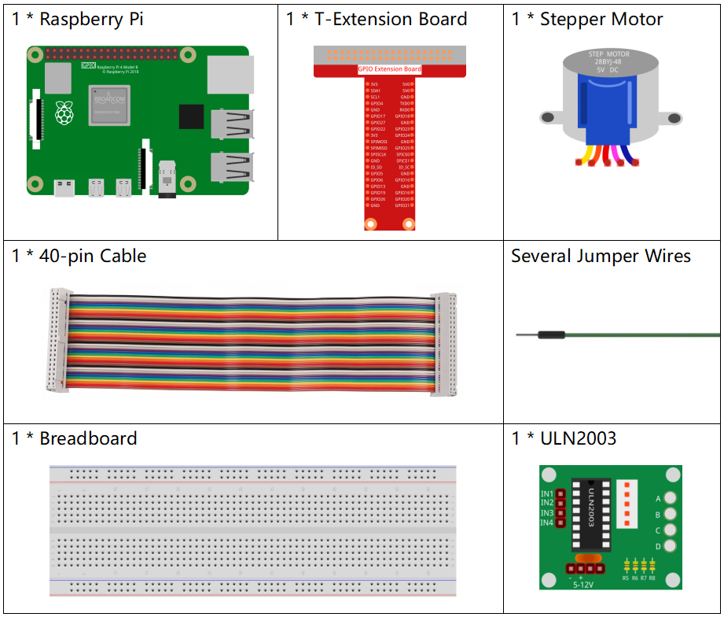
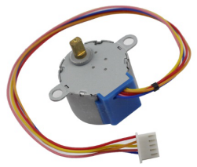
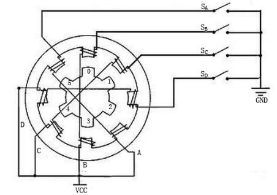
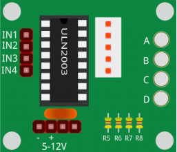
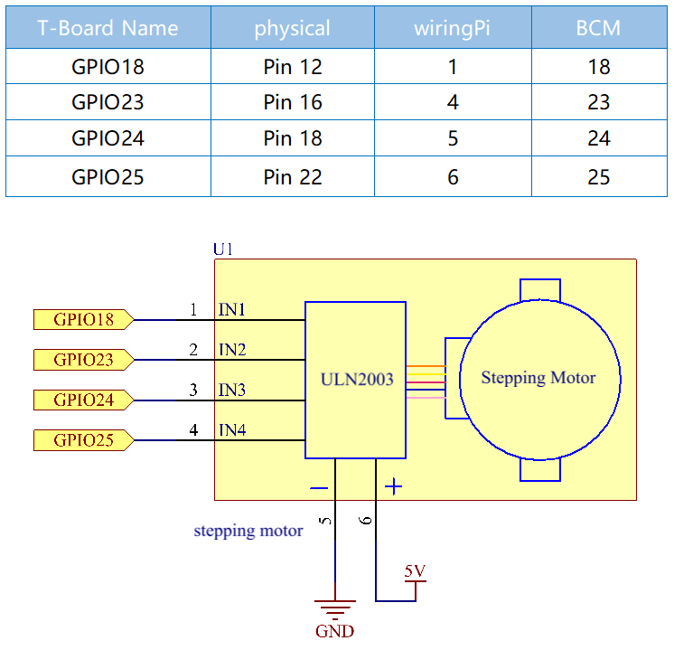
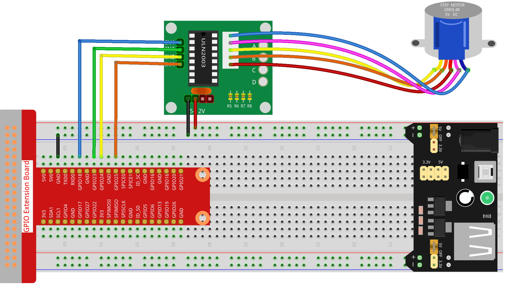
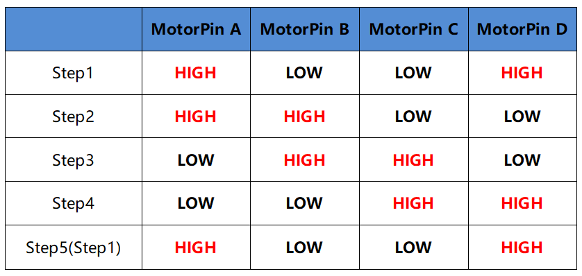
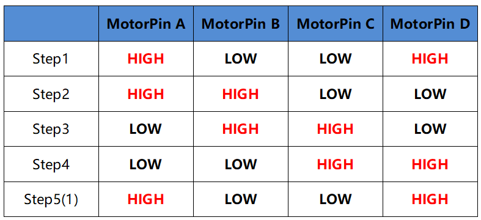
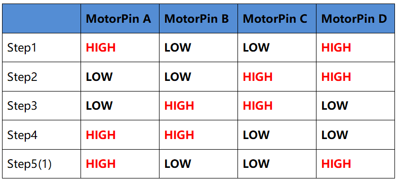
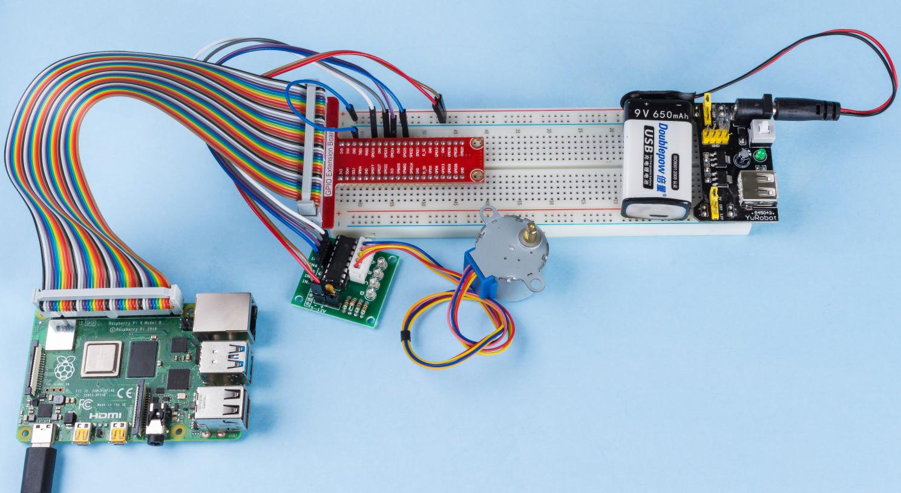

.. note::

    ¡Hola! Bienvenido a la comunidad de entusiastas de SunFounder para Raspberry Pi, Arduino y ESP32 en Facebook. Únete para profundizar en Raspberry Pi, Arduino y ESP32 junto a otros apasionados.

    **¿Por qué unirse?**

    - **Soporte de expertos**: Soluciona problemas postventa y desafíos técnicos con la ayuda de nuestra comunidad y equipo.
    - **Aprender y compartir**: Intercambia consejos y tutoriales para mejorar tus habilidades.
    - **Acceso exclusivo**: Obtén primicias sobre nuevos productos y adelantos.
    - **Descuentos especiales**: Disfruta de descuentos exclusivos en nuestros productos más recientes.
    - **Promociones festivas y sorteos**: Participa en sorteos y promociones de temporada.

    👉 ¿Listo para explorar y crear con nosotros? Haz clic en [|link_sf_facebook|] y únete hoy mismo.

1.3.3 Stepper Motor
=======================

Introducción
--------------

Los motores paso a paso, debido a su diseño único, pueden ser controlados 
con gran precisión sin necesidad de mecanismos de retroalimentación. El eje 
de un motor paso a paso, equipado con una serie de imanes, es controlado 
mediante una secuencia específica de carga positiva y negativa en una serie 
de bobinas electromagnéticas, moviéndolo hacia adelante o hacia atrás en pequeños “pasos”.

Componentes
--------------

Principio
-------------

**Motor Paso a Paso**

Existen dos tipos de motores paso a paso: unipolares y bipolares, y es muy 
importante saber con cuál tipo se está trabajando. En este experimento, 
usaremos un motor paso a paso unipolar.

El motor paso a paso de este proyecto es de cuatro fases y utiliza una fuente 
de alimentación de corriente continua unipolar. Al aplicar una secuencia de 
activación adecuada en cada fase del motor, este puede rotar paso a paso. El 
diagrama esquemático de un motor paso a paso reactivo de cuatro fases:

En la imagen, en el centro del motor se encuentra el rotor, un imán permanente 
en forma de engranaje. Alrededor del rotor, hay dientes numerados de 0 a 5. Más 
hacia el exterior, encontramos 8 polos magnéticos, con cada par de polos opuestos 
conectados por un devanado de bobina, formando así cuatro pares de la A a la D, 
que conforman una fase. Este motor tiene cuatro cables de conexión para ser 
enlazados con los interruptores SA, SB, SC y SD, por lo que las cuatro fases 
están en paralelo en el circuito y los dos polos magnéticos de una fase están en serie.

**Funcionamiento de un motor paso a paso de 4 fases:**

Cuando el interruptor SB está activado y los interruptores SA, SC y SD están 
desactivados, los polos magnéticos de la fase B se alinean con los dientes 0 
y 3 del rotor. Al mismo tiempo, los dientes 1 y 4 están desfasados con los polos 
de las fases C y D, y los dientes 2 y 5 están desfasados con los polos de las 
fases D y A. Cuando el interruptor SC se activa y los interruptores SB, SA y SD 
se desactivan, el rotor gira bajo el campo magnético del devanado de la fase C y 
se alinea con los dientes 1 y 4. Al mismo tiempo, los dientes 0 y 3 están 
desfasados con los polos de las fases A y B, y los dientes 2 y 5 con los polos 
de las fases A y D. Este proceso continúa de la misma manera. Al activar las 
fases A, B, C y D en secuencia, el rotor girará en el orden A, B, C y D.

El motor paso a paso de cuatro fases tiene tres modos de operación: cuatro 
pasos simples, cuatro pasos dobles y ocho pasos. El ángulo de paso en el modo 
de cuatro pasos simples y cuatro pasos dobles es el mismo, pero el par de torsión 
es menor en el modo de cuatro pasos simples. El ángulo de paso en el modo de ocho 
pasos es la mitad que en los modos de cuatro pasos, lo que permite un mayor par 
de torsión y mejora la precisión de control.

El estator del motor paso a paso que usamos tiene 32 polos magnéticos, por lo que 
un giro completo requiere 32 pasos. El eje de salida del motor paso a paso está 
conectado a un conjunto de engranajes reductores, con una relación de reducción 
de 1/64. Así, el eje de salida final requiere 32*64=2048 pasos para completar una 
vuelta completa.

**ULN2003**

Para aplicar el motor en el circuito, es necesario utilizar una placa de control. 
El controlador de motor paso a paso ULN2003 es un circuito inversor de 7 canales. 
Es decir, cuando el pin de entrada está en nivel alto, el pin de salida de ULN2003 
está en nivel bajo, y viceversa. Si aplicamos nivel alto en IN1 y bajo en IN2, 
IN3 e IN4, entonces el extremo de salida OUT1 estará en nivel bajo, y todos los demás 
extremos de salida estarán en nivel alto. La estructura interna del chip se muestra a continuación.

.. image:: img/image338.png

El controlador del motor paso a paso constituido por el chip ULN2003 y 4 LEDs se 
muestra a continuación. En la placa, IN1, IN2, IN3 e IN4 funcionan como entradas 
y los cuatro LEDs, A, B, C y D, son los indicadores del pin de entrada. Además, 
OUT1, OUT2, OUT3 y OUT4 están conectados a SA, SB, SC y SD en el controlador del 
motor paso a paso. Cuando el valor de IN1 se establece en nivel alto, A se 
enciende; el interruptor SA se activa y el motor paso a paso rota un paso. 
Este ciclo se repite en la secuencia adecuada para que el motor gire paso a paso. 
El ULN2003 se utiliza aquí para proporcionar las secuencias de tiempo específicas 
para el motor paso a paso.

Diagrama Esquemático
-----------------------

Procedimientos Experimentales
----------------------------------

**Paso 1:** Construye el circuito.

Para Usuarios de Lenguaje C
^^^^^^^^^^^^^^^^^^^^^^^^^^^^^^

**Paso 2**: Dirígete a la carpeta del código.

.. raw:: html

   <run></run>

.. code-block::

    cd ~/davinci-kit-for-raspberry-pi/c/1.3.3/

**Paso 3**: Compila el código.

.. raw:: html

   <run></run>

.. code-block::

    gcc 1.3.3_StepperMotor.c -lwiringPi

**Paso 4**: Ejecuta el archivo compilado.

.. raw:: html

   <run></run>

.. code-block::

    sudo ./a.out

Al ejecutar el código, el motor paso a paso girará en el sentido de las agujas 
del reloj o en sentido contrario, según la entrada que proporciones, \'a\' o \'c\'.

.. note::

    Si no funciona después de ejecutarlo, o aparece un mensaje de error: \"wiringPi.h: No such file or directory\", consulta :ref:`C code is not working?`.

**Código**

.. code-block:: c

    #include <stdio.h>
    #include <wiringPi.h>

    const int motorPin[] = {1, 4, 5, 6};
    int rolePerMinute = 15;
    int stepsPerRevolution = 2048;
    int stepSpeed = 0;

    void rotary(char direction){
        if(direction == 'c'){
            for(int j=0;j<4;j++){
                for(int i=0;i<4;i++)
                    {digitalWrite(motorPin[i],0x99>>j & (0x08>>i));}
                delayMicroseconds(stepSpeed);
            }        
        }
        else if(direction =='a'){
            for(int j=0;j<4;j++){
                for(int i=0;i<4;i++)
                    {digitalWrite(motorPin[i],0x99<<j & (0x80>>i));}
                delayMicroseconds(stepSpeed);
            }   
        }
    }

    void loop()
    {
        char direction = '0';
        while (1)
        {       
            printf("select motor direction a=anticlockwise, c=clockwise: ");
            delay(100);
            direction=getchar();
            if (direction == 'c')
            {
                printf("motor running clockwise\n");
                delay(100);
                break;
            }
            else if (direction == 'a')
            {
                printf("motor running anti-clockwise\n");
                delay(100);
                break;
            }
            else
            {
                printf("input error, please try again!\n");
                delay(100);
            }
        }
        while(1)
        {
            rotary(direction);
        }
    }

    void main(void)
    {
        if (wiringPiSetup() == -1)
        {
            printf("setup wiringPi failed !");
            return;
        }
        for (int i = 0; i < 4; i++)
        {
            pinMode(motorPin[i], OUTPUT);
        }
        stepSpeed = (60000000 / rolePerMinute) / stepsPerRevolution;
        loop();
    }

**Explicación del Código**

.. code-block:: c

    int rolePerMinute = 15;
    int stepsPerRevolution = 2048;
    int stepSpeed = 0;

**rolePerMinute:** revoluciones por minuto, el RPM del motor paso a paso
usado en este kit debería estar entre 0 y 17.

**stepsPerRevolution:** número de pasos por vuelta; el motor paso a paso
de este kit necesita 2048 pasos por revolución.

**stepSpeed:** tiempo empleado en cada paso, y en main(), asignamos el
valor a esta variable:「(60000000 / rolePerMinute) / stepsPerRevolution」(60,000,000 us = 1 minuto).

.. code-block:: c

    void loop()
    {
        char direction = '0';
        while (1)
        {       
            printf("select motor direction a=anticlockwise, c=clockwise: ");
            direction=getchar();
            if (direction == 'c')
            {
                printf("motor running clockwise\n");
                break;
            }
            else if (direction == 'a')
            {
                printf("motor running anti-clockwise\n");
                break;
            }
            else
            {
                printf("input error, please try again!\n");
            }
        }
        while(1)
        {
            rotary(direction);
        }
    }

La función loop() se divide en dos partes (ubicadas entre dos while(1)):

La primera parte obtiene el valor de la tecla. Cuando se obtiene \'a\' o \'c\', se sale del bucle y se detiene la entrada.

La segunda parte llama a rotary(direction) para hacer funcionar el motor paso a paso.

.. code-block:: c

    void rotary(char direction){
        if(direction == 'c'){
            for(int j=0;j<4;j++){
                for(int i=0;i<4;i++)
                    {digitalWrite(motorPin[i],0x99>>j & (0x08>>i));}
                delayMicroseconds(stepSpeed);
            }        
        }
        else if(direction =='a'){
            for(int j=0;j<4;j++){
                for(int i=0;i<4;i++)
                    {digitalWrite(motorPin[i],0x99<<j & (0x80>>i));}
                delayMicroseconds(stepSpeed);
            }   
        }
    }

Para hacer que el motor paso a paso **gire en sentido horario**, el estado de 
nivel de motorPin es como se muestra en la tabla a continuación:

Por lo tanto, la escritura de potencial de MotorPin se implementa usando un 
bucle for de dos capas.

En el Paso 1, j=0, i=0~4.

motorPin[0] se establecerá en alto nivel (10011001&00001000=1)

motorPin[1] se establecerá en bajo nivel (10011001&00000100=0)

motorPin[2] se establecerá en bajo nivel (10011001&00000010=0)

motorPin[3] se establecerá en alto nivel (10011001&00000001=1)

En el Paso 2, j=1, i=0~4.

motorPin[0] se establecerá en alto nivel (01001100&00001000=1)

motorPin[1] se establecerá en bajo nivel (01001100&00000100=1)

y así sucesivamente.

Para hacer que el motor paso a paso gire **en sentido antihorario**, 
el estado de nivel de motorPin es como se muestra en la siguiente tabla.

.. image:: img/image341.png

En el Paso 1, j=0, i=0~4.

motorPin[0] se establecerá en alto nivel (10011001 & 10000000 = 1)

motorPin[1] se establecerá en bajo nivel (10011001 & 01000000 = 0)

En el Paso 2, j=1, i=0~4.

motorPin[0] se establecerá en alto nivel (00110010 & 10000000 = 0)

motorPin[1] se establecerá en bajo nivel (00110010 & 01000000 = 0)

y así sucesivamente.

Para Usuarios de Lenguaje Python
^^^^^^^^^^^^^^^^^^^^^^^^^^^^^^^^^^^^

**Paso 2**: Dirígete a la carpeta del código.

.. raw:: html

   <run></run>

.. code-block::

    cd ~/davinci-kit-for-raspberry-pi/python/

**Paso 3**: Ejecuta el archivo.

.. raw:: html

   <run></run>

.. code-block::

    sudo python3 1.3.3_StepperMotor.py

Al ejecutar el código, el motor paso a paso girará en el sentido de las 
agujas del reloj o en sentido contrario, según la entrada que proporciones, \'a\' o \'c\'.

**Código**

.. note::

    Puedes **Modificar/Restablecer/Copiar/Ejecutar/Detener** el código a 
    continuación. Antes de eso, necesitas dirigirte a la ruta del código 
    fuente como ``davinci-kit-for-raspberry-pi/python``.
    
.. raw:: html

    <run></run>

.. code-block:: python

    import RPi.GPIO as GPIO
    from time import sleep

    motorPin = (18,23,24,25) 
    rolePerMinute =15
    stepsPerRevolution = 2048
    stepSpeed = (60/rolePerMinute)/stepsPerRevolution

    def setup():
        GPIO.setwarnings(False)
        GPIO.setmode(GPIO.BCM)
        for i in motorPin:
            GPIO.setup(i, GPIO.OUT)

    def rotary(direction):
        if(direction == 'c'):   
            for j in range(4):
                for i in range(4):
                    GPIO.output(motorPin[i],0x99>>j & (0x08>>i))
                sleep(stepSpeed)

        elif(direction == 'a'):
            for j in range(4):
                for i in range(4):
                    GPIO.output(motorPin[i],0x99<<j & (0x80>>i))
                sleep(stepSpeed)

    def loop():
        while True:
            direction = input('select motor direction a=anticlockwise, c=clockwise: ')
            if(direction == 'c'):
                print('motor running clockwise\n')
                break
            elif(direction == 'a'):
                print('motor running anti-clockwise\n')
                break
            else:
                print('input error, please try again!')
        while True:
            rotary(direction)

    def destroy():
        GPIO.cleanup()   

    if __name__ == '__main__':    
        setup()
        try:
            loop()        
        except KeyboardInterrupt:
            destroy()

**Explicación del Código**

.. code-block:: python

    rolePerMinute = 15
    stepsPerRevolution = 2048
    stepSpeed = (60 / rolePerMinute) / stepsPerRevolution

**rolePerMinute:** revoluciones por minuto, el RPM del motor paso a paso
utilizado en este kit debería estar entre 0 y 17.

**stepsPerRevolution:** número de pasos por vuelta; el motor paso a paso
de este kit necesita 2048 pasos para una revolución completa.

**stepSpeed:** tiempo empleado en cada paso; asignamos el valor de esta
variable mediante la fórmula:「(60 / rolePerMinute) / stepsPerRevolution」(60s=1 minuto).

.. code-block:: python

    def loop():
        while True:
            direction = input('select motor direction a=anticlockwise, c=clockwise: ')
            if(direction == 'c'):
                print('motor running clockwise\n')
                break
            elif(direction == 'a'):
                print('motor running anti-clockwise\n')
                break
            else:
                print('input error, please try again!')
        while True:
            rotary(direction)

La función loop() se divide aproximadamente en dos partes (ubicadas entre dos
while(1)):

La primera parte obtiene el valor de la tecla. Cuando se obtiene \'a\' o \'c\',
se sale del bucle y se detiene la entrada.

La segunda parte llama a rotary(direction) para que el motor paso a paso funcione.

.. code-block:: python

    def rotary(direction):
        if(direction == 'c'):   
            for j in range(4):
                for i in range(4):
                    GPIO.output(motorPin[i],0x99>>j & (0x08>>i))
                sleep(stepSpeed)

        elif(direction == 'a'):
            for j in range(4):
                for i in range(4):
                    GPIO.output(motorPin[i],0x99<<j & (0x80>>i))
                sleep(stepSpeed)

Para hacer que el motor paso a paso gire en sentido horario, el estado de nivel de motorPin
se muestra en la siguiente tabla:

Por lo tanto, la escritura de potencial de MotorPin se implementa utilizando un
bucle for de dos capas.

En el Paso 1, j=0, i=0~4.

motorPin[0] se establecerá en alto nivel (10011001 & 00001000 = 1)

motorPin[1] se establecerá en bajo nivel (10011001 & 00000100 = 0)

motorPin[2] se establecerá en bajo nivel (10011001 & 00000010 = 0)

motorPin[3] se establecerá en alto nivel (10011001 & 00000001 = 1)

En el Paso 2, j=1, i=0~4.

motorPin[0] se establecerá en alto nivel (01001100 & 00001000 = 1)

motorPin[1] se establecerá en bajo nivel (01001100 & 00000100 = 1)

y así sucesivamente.

Para hacer que el motor paso a paso gire en sentido antihorario, el estado de nivel de motorPin
se muestra en la siguiente tabla:

En el Paso 1, j=0, i=0~4.

motorPin[0] se establecerá en alto nivel (10011001 & 10000000 = 1)

motorPin[1] se establecerá en bajo nivel (10011001 & 01000000 = 0)

En el Paso 2, j=1, i=0~4.

motorPin[0] se establecerá en alto nivel (00110010 & 10000000 = 0)

motorPin[1] se establecerá en bajo nivel (00110010 & 01000000 = 0)

y así sucesivamente.

Imagen del Fenómeno
------------------------

