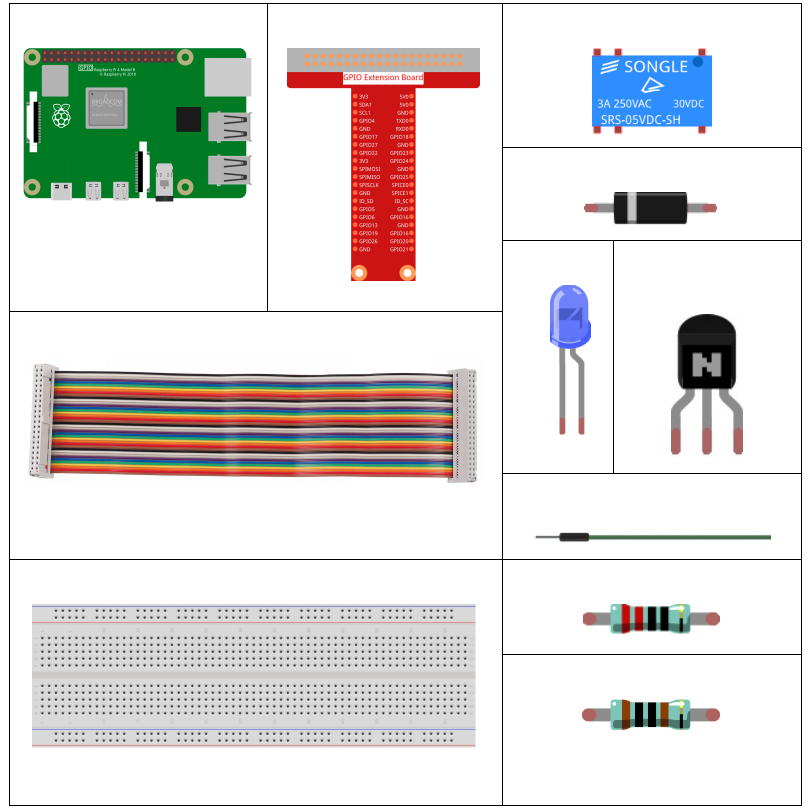
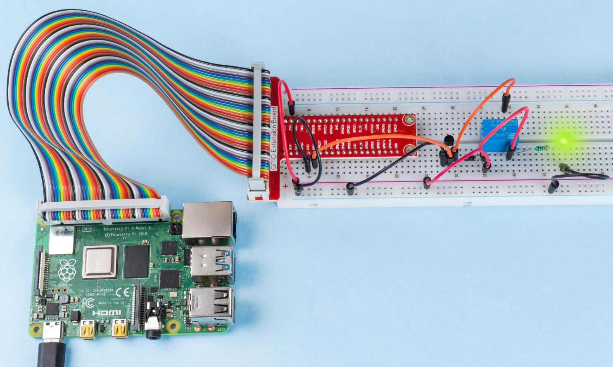

1.3.4 Relay
===========

Introduction
------------

In this lesson, we will learn to use a relay. It is one of the commonly
used components in automatic control system. When the voltage, current,
temperature, pressure, etc., reaches, exceeds or is lower than the
predetermined value, the relay will connect or interrupt the circuit, to
control and protect the equipment.

Components
----------

Principle
---------

**Diode**

A diode is a two-terminal component in electronics with a unidirectional
flow of current. It offers low resistance in the direction of current
flow and offers high resistance in the opposite direction. Diodes are
mostly used to prevent damage to components, especially due to
electromotive force in circuits which are usually polarized.

.. image:: media/image344.png

The two terminals of a diode are polarized, with the positive end called
anode and the negative end called cathode. The cathode is usually made
of silver or has a color band. Controlling the direction of current flow
is one of the key features of diodes — the current in a diode flows from
anode to cathode. The behavior of a diode is similar to the behavior of
a check valve. One of the most important characteristics of a diode is
the non-linear current voltage. If higher voltage is connected to the
anode, then current flows from anode to cathode, and the process is
known as forward bias. However, if the higher voltage is connected to
the cathode, then the diode does not conduct electricity, and the
process is called reverse bias.

**Relay**

As we may know, relay is a device which is used to provide connection
between two or more points or devices in response to the input signal
applied. In other words, relays provide isolation between the controller
and the device as devices may work on AC as well as on DC. However, they
receive signals from a microcontroller which works on DC hence requiring
a relay to bridge the gap. Relay is extremely useful when you need to
control a large amount of current or voltage with small electrical
signal.

There are 5 parts in every relay:

**Electromagnet** - It consists of an iron core wounded by coil of
wires. When electricity is passed through, it becomes magnetic.
Therefore, it is called electromagnet.

**Armature** - The movable magnetic strip is known as armature. When
current flows through them, the coil is it energized thus producing a
magnetic field which is used to make or break the normally open (N/O) or
normally close (N/C) points. And the armature can be moved with direct
current (DC) as well as alternating current (AC).

**Spring** - When no currents flow through the coil on the
electromagnet, the spring pulls the armature away so the circuit cannot
be completed.

Set of electrical **contacts** - There are two contact points:

-  Normally open - connected when the relay is activated, and disconnected when it is inactive.

-  Normally close - not connected when the relay is activated, and connected when it is inactive.

**Molded frame** - Relays are covered with plastic for protection.

**Working of Relay**

The working principle of relay is simple. When power is supplied to the
relay, currents start flowing through the control coil; as a result, the
electromagnet starts energizing. Then the armature is attracted to the
coil, pulling down the moving contact together thus connecting with the
normally open contacts. So the circuit with the load is energized. Then
breaking the circuit would a similar case, as the moving contact will be
pulled up to the normally closed contacts under the force of the spring.
In this way, the switching on and off of the relay can control the state
of a load circuit.

.. image:: media/image142.jpeg

Schematic Diagram
-----------------

.. image:: media/image345.png

Experimental Procedures
-----------------------

**Step 1:** Build the circuit.

.. image:: media/image144.png

For C Language Users
^^^^^^^^^^^^^^^^^^^^

**Step 2**: Open the code file.

.. raw:: html

   <run></run>

.. code-block::

    cd /home/pi/davinci-kit-for-raspberry-pi/c/1.3.4

**Step 3:** Compile the code.

.. raw:: html

   <run></run>

.. code-block::

    gcc 1.3.4_Relay.c -lwiringPi

**Step 4:** Run the executable file.

.. raw:: html

   <run></run>

.. code-block::

    sudo ./a.out

After the code runs, the LED will light up. In addition, you can
hear a ticktock caused by breaking normally close contact and 
closing normally open contact.

**Code**

.. code-block:: c

    #include <wiringPi.h>
    #include <stdio.h>
    #define RelayPin 0

    int main(void){
        if(wiringPiSetup() == -1){ //when initialize wiring failed, print message to screen
            printf("setup wiringPi failed !");
            return 1;
        }
        pinMode(RelayPin, OUTPUT);   //set GPIO17(GPIO0) output
        while(1){
            // Tick
            printf("Relay Open......\n");
            digitalWrite(RelayPin, LOW);
            delay(1000);
            // Tock
            printf("......Relay Close\n");
            digitalWrite(RelayPin, HIGH);
            delay(1000);
        }

        return 0;
    }

**Code Explanation**

.. code-block:: c

    digitalWrite(RelayPin, LOW);

Set the I/O port as low level (0V), thus the transistor is not energized
and the coil is not powered. There is no electromagnetic force, so the
relay opens, LED does not turn on.

.. code-block:: c

    digitalWrite(RelayPin, HIGH);

set the I/O port as high level (5V) to energize the transistor. The coil
of the relay is powered and generate electromagnetic force, and the
relay closes, LED lights up.

For Python Language Users
^^^^^^^^^^^^^^^^^^^^^^^^^

**Step 2:** Open the code file.

.. raw:: html

   <run></run>

.. code-block::

    cd /home/pi/davinci-kit-for-raspberry-pi/python

**Step 3:** Run.

.. raw:: html

   <run></run>

.. code-block::

    sudo python3 1.3.4_Relay.py

While the code is running, the LED lights up. In addition, you can hear
a ticktock caused by breaking normally close contact and closing
normally open contact.

**Code**

.. note::

    You can **Modify/Reset/Copy/Run/Stop** the code below. But before that, you need to go to  source code path like ``davinci-kit-for-raspberry-pi\\python``. 
    
.. raw:: html

    <run></run>

.. code-block:: python

    import RPi.GPIO as GPIO
    import time

    # Set GPIO17 as control pin
    relayPin = 17

    # Define a setup function for some setup
    def setup():
        # Set the GPIO modes to BCM Numbering
        GPIO.setmode(GPIO.BCM)
        # Set relayPin's mode to output,
        # and initial level to High(3.3v)
        GPIO.setup(relayPin, GPIO.OUT, initial=GPIO.HIGH)

    # Define a main function for main process
    def main():
        while True:
            print ('Relay open...')
            # Tick
            GPIO.output(relayPin, GPIO.LOW)
            time.sleep(1)
            print ('...Relay close')
            # Tock
            GPIO.output(relayPin, GPIO.HIGH)
            time.sleep(1)

    # Define a destroy function for clean up everything after
    # the script finished
    def destroy():
        # Turn off LED
        GPIO.output(relayPin, GPIO.HIGH)
        # Release resource
        GPIO.cleanup()                    

    # If run this script directly, do:
    if __name__ == '__main__':
        setup()
        try:
            main()
        # When 'Ctrl+C' is pressed, the child program
        # destroy() will be  executed.
        except KeyboardInterrupt:
            destroy()

**Code Explanation**

.. code-block:: python

    GPIO.output(relayPin, GPIO.LOW)

Set the pins of transistor as low level to let the relay open, LED does not turn on.

.. code-block:: python

    time.sleep(1)

wait for 1 second. 

.. code-block:: python

    GPIO.output(relayPin, GPIO.HIGH)

Set the pins of the transistor as low level to actuate the relay, LED
lights up.

Phenomenon Picture
------------------

