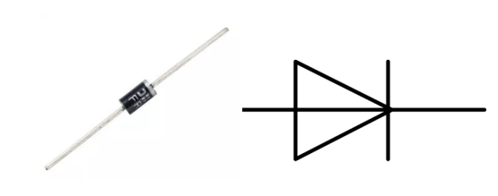

.. note::

    Ciao, benvenuto nella Community di SunFounder Raspberry Pi, Arduino e ESP32 Enthusiasts su Facebook! Approfondisci Raspberry Pi, Arduino ed ESP32 con altri appassionati.

    **Perché unirti a noi?**

    - **Supporto Esperto**: Risolvi problemi post-vendita e sfide tecniche con l'aiuto della nostra community e del nostro team.
    - **Impara e Condividi**: Scambia suggerimenti e tutorial per migliorare le tue competenze.
    - **Anteprime Esclusive**: Ottieni accesso anticipato agli annunci di nuovi prodotti e alle anteprime.
    - **Sconti Speciali**: Approfitta di sconti esclusivi sui nostri prodotti più recenti.
    - **Promozioni e Giveaway Festivi**: Partecipa a omaggi e promozioni in occasione delle festività.

    👉 Pronto a esplorare e creare con noi? Clicca [|link_sf_facebook|] e unisciti oggi stesso!

1.3.4 Relè
===============

Introduzione
--------------

In questa lezione, impareremo a usare un relè, uno dei componenti più 
comuni nei sistemi di controllo automatico. Quando la tensione, la corrente, 
la temperatura o la pressione raggiungono, superano o scendono sotto un valore 
prestabilito, il relè può connettere o interrompere il circuito, permettendo 
di controllare e proteggere l'apparecchiatura.

Componenti
--------------

.. image:: img/list_1.3.4.png

Principio
---------

**Diodo**

Il diodo è un componente elettronico a due terminali con un flusso di corrente 
unidirezionale. Offre bassa resistenza nella direzione del flusso di corrente 
e alta resistenza nella direzione opposta. I diodi vengono principalmente 
utilizzati per prevenire danni ai componenti, in particolare causati dalla forza 
elettromotrice in circuiti polarizzati.

I terminali di un diodo sono polarizzati, con l’estremità positiva chiamata 
anodo e quella negativa chiamata catodo. Il catodo è solitamente argentato o 
dotato di una banda colorata. Il controllo della direzione del flusso di 
corrente è una delle caratteristiche principali dei diodi: la corrente fluisce 
dall’anodo al catodo. Il comportamento di un diodo è simile a una valvola di 
non ritorno. Una delle caratteristiche più importanti è la tensione di corrente 
non lineare. Se la tensione maggiore è collegata all’anodo, la corrente fluisce 
dall’anodo al catodo in "polarizzazione diretta"; se invece è collegata al 
catodo, il diodo non conduce e si ha una "polarizzazione inversa".

**Relè**

Come sappiamo, il relè è un dispositivo che fornisce connessione tra due o più 
punti o dispositivi in risposta a un segnale di ingresso. In altre parole, il 
relè offre isolamento tra il controller e il dispositivo che può funzionare sia 
in corrente alternata (AC) sia in corrente continua (DC). Riceve segnali da un 
microcontrollore che funziona in DC e quindi necessita di un relè per creare 
una connessione. Il relè è estremamente utile quando è necessario controllare 
grandi quantità di corrente o tensione con un piccolo segnale elettrico.

Ogni relè è composto da 5 parti:

**Elettromagnete** - Consiste in un nucleo di ferro avvolto da una bobina. 
Quando passa corrente, diventa magnetico, quindi è chiamato elettromagnete.

**Armatura** - La striscia magnetica mobile è nota come armatura. Quando 
la corrente scorre, la bobina si energizza creando un campo magnetico che 
attiva o disattiva i punti "normalmente aperti" (NO) o "normalmente chiusi" 
(NC). L'armatura può essere azionata sia con corrente continua (DC) sia 
alternata (AC).

**Molla** - Quando non scorre corrente attraverso la bobina dell'elettromagnete, 
la molla tira l'armatura lontano, impedendo la chiusura del circuito.

Set di **contatti elettrici** - Ci sono due punti di contatto:

- Normalmente aperto - collegato quando il relè è attivato, disconnesso quando è inattivo.
- Normalmente chiuso - scollegato quando il relè è attivato, collegato quando è inattivo.

**Cornice stampata** - I relè sono rivestiti in plastica per protezione.

**Funzionamento del Relè**

Il principio di funzionamento di un relè è semplice. Quando il relè viene 
alimentato, la corrente inizia a scorrere attraverso la bobina di controllo; 
di conseguenza, l’elettromagnete si energizza. L'armatura viene così attratta 
verso la bobina, portando il contatto mobile a unirsi ai contatti "normalmente 
aperti". In questo modo, il circuito con il carico viene energizzato. Per 
interrompere il circuito, si verifica il caso opposto: il contatto mobile 
viene spostato verso i contatti "normalmente chiusi" sotto la forza della molla. 
In questo modo, l'attivazione e la disattivazione del relè controllano lo stato 
di un circuito di carico.

.. image:: img/image142.jpeg

Schema Elettrico
---------------------

.. image:: img/image345.png

Procedure Sperimentali
--------------------------

**Passo 1:** Costruisci il circuito.

.. image:: img/image144.png
    :width: 800

    

Per Utenti del Linguaggio C
^^^^^^^^^^^^^^^^^^^^^^^^^^^^^^^^^

**Passo 2**: Apri il file del codice.

.. raw:: html

   <run></run>

.. code-block::

    cd ~/davinci-kit-for-raspberry-pi/c/1.3.4

**Passo 3:** Compila il codice.

.. raw:: html

   <run></run>

.. code-block::

    gcc 1.3.4_Relay.c -lwiringPi

**Passo 4:** Esegui il file eseguibile.

.. raw:: html

   <run></run>

.. code-block::

    sudo ./a.out

Dopo l'esecuzione del codice, il LED si accenderà. Inoltre, potrai
sentire un ticchettio causato dall'apertura del contatto normalmente chiuso e 
dalla chiusura del contatto normalmente aperto.

.. note::

    Se, dopo l'esecuzione, il programma non funziona o appare il messaggio di errore: \"wiringPi.h: No such file or directory\", fai riferimento a :ref:`Il codice C non funziona?`.

**Codice**

.. code-block:: c

    #include <wiringPi.h>
    #include <stdio.h>
    #define RelayPin 0

    int main(void){
        if(wiringPiSetup() == -1){ //se l'inizializzazione di wiring fallisce, stampa un messaggio sullo schermo
            printf("setup wiringPi failed !");
            return 1;
        }
        pinMode(RelayPin, OUTPUT);   //imposta GPIO17(GPIO0) come output
        while(1){
            // Tic
            printf("Relay Open......\n");
            delay(100);
            digitalWrite(RelayPin, LOW);
            delay(1000);
            // Tac
            printf("......Relay Close\n");
            delay(100);
            digitalWrite(RelayPin, HIGH);
            delay(1000);
        }

        return 0;
    }
**Spiegazione del Codice**

.. code-block:: c

    digitalWrite(RelayPin, LOW);

Imposta la porta I/O a livello basso (0V), quindi il transistor non è 
alimentato e la bobina del relè è disattivata. Non si genera forza 
elettromagnetica, per cui il relè si apre e il LED rimane spento.

.. code-block:: c

    digitalWrite(RelayPin, HIGH);

Imposta la porta I/O a livello alto (5V) per alimentare il transistor. 
La bobina del relè riceve corrente, genera una forza elettromagnetica e 
il relè si chiude, accendendo il LED.

Per Utenti del Linguaggio Python
^^^^^^^^^^^^^^^^^^^^^^^^^^^^^^^^^^^

**Passo 2:** Apri il file del codice.

.. raw:: html

   <run></run>

.. code-block::

    cd ~/davinci-kit-for-raspberry-pi/python

**Passo 3:** Esegui il codice.

.. raw:: html

   <run></run>

.. code-block::

    sudo python3 1.3.4_Relay.py

Durante l'esecuzione del codice, il LED si accenderà. Inoltre, 
sentirai un ticchettio causato dall’apertura del contatto normalmente 
chiuso e dalla chiusura del contatto normalmente aperto.

**Codice**

.. note::

    Puoi **Modificare/Reimpostare/Copiare/Eseguire/Interrompere** il codice seguente. Prima di farlo, però, devi accedere al percorso del codice sorgente come ``davinci-kit-for-raspberry-pi/python``.
    
.. raw:: html

    <run></run>

.. code-block:: python

    import RPi.GPIO as GPIO
    import time

    # Imposta GPIO17 come pin di controllo
    relayPin = 17

    # Funzione di setup per configurazioni iniziali
    def setup():
        # Imposta la numerazione GPIO in modalità BCM
        GPIO.setmode(GPIO.BCM)
        # Configura relayPin come output,
        # con livello iniziale Alto (3.3V)
        GPIO.setup(relayPin, GPIO.OUT, initial=GPIO.HIGH)

    # Funzione principale per il processo di controllo
    def main():
        while True:
            print ('Relay open...')
            # Tick
            GPIO.output(relayPin, GPIO.LOW)
            time.sleep(1)
            print ('...Relay close')
            # Tock
            GPIO.output(relayPin, GPIO.HIGH)
            time.sleep(1)

    # Funzione di pulizia per liberare le risorse al termine
    def destroy():
        # Spegne il LED
        GPIO.output(relayPin, GPIO.HIGH)
        # Rilascia le risorse
        GPIO.cleanup()                    

    # Se il codice viene eseguito direttamente:
    if __name__ == '__main__':
        setup()
        try:
            main()
        # Quando viene premuto 'Ctrl+C', il programma
        # eseguirà la funzione destroy()
        except KeyboardInterrupt:
            destroy()

**Spiegazione del Codice**

.. code-block:: python

    GPIO.output(relayPin, GPIO.LOW)

Imposta il pin del transistor a livello basso per aprire il relè, lasciando il LED spento.

.. code-block:: python

    time.sleep(1)

Attende per 1 secondo. 

.. code-block:: python

    GPIO.output(relayPin, GPIO.HIGH)

Imposta il pin del transistor a livello alto per attivare il relè e 
accendere il LED.

Immagine del Fenomeno
--------------------------

.. image:: img/image145.jpeg