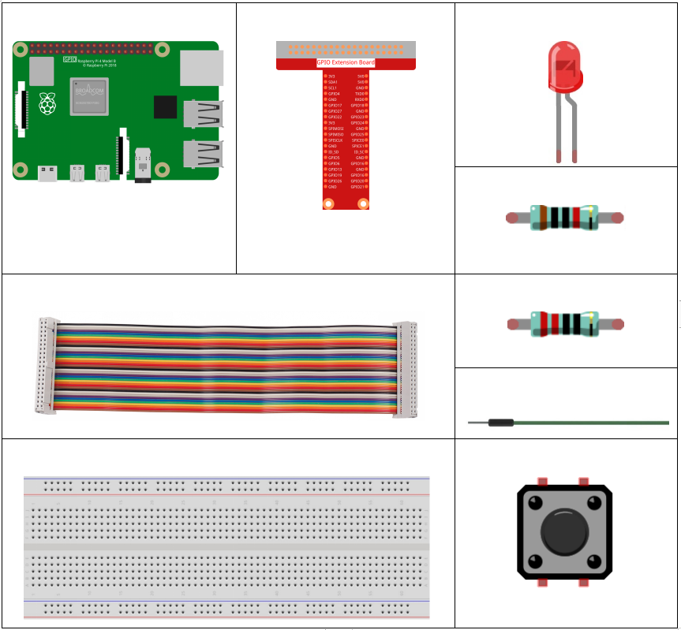
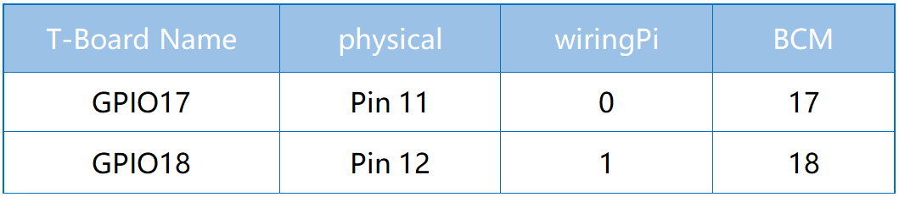
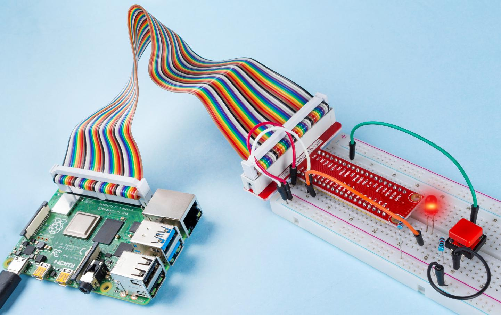

2.1.1 ボタン
============

前書き
-----------------

このレッスンでは、LEDをボタンでオンまたはオフにする方法を学習する。

部品
---------------

原理
-------------

**ボタン**

ボタンは電子デバイスを制御するために使用される一般的な部品である。通常、回路を接続または遮断するためのスイッチとして使用される。ボタンにはさまざまなサイズと形状があるが、ここで使用するものは、次の図に示すように6mmのミニボタンである。

左側の2つのピンが接続されており、右側の方は左側と同じである。以下を参照してください：

.. image:: media/image148.png
    :width: 400
    :align: center

以下に示す記号は、通常、回路内のボタンを表すために使用される。

.. image:: media/image301.png
    :width: 400
    :align: center

ボタンを押すと、4つのピンが接続され、回路が閉じる。

回路図
---------------------

Raspberry Piの入力として常開ボタンを使用し、接続は下の概略図に示されている。
ボタンを押すと、GPIO18は低レベル（0V）に変わる。
プログラミングによってGPIO18の状態を検出できる。
つまり、GPIO18が低レベルになった場合、ボタンが押されたことを意味する。
ボタンが押されたときに対応するコードを実行すると、LEDが点灯する。

.. image:: media/image303.png
    :width: 400
    :align: center

実験手順
---------------------------

ステップ1： 回路を作る。

.. image:: media/image152.png
    :width: 800

C言語ユーザー向け
^^^^^^^^^^^^^^^^^^^^

ステップ2： コードファイルを開く。

.. raw:: html

   <run></run>

.. code-block::

    cd /home/pi/davinci-kit-for-raspberry-pi/c/2.1.1/

.. note::
    cd を使用して、この実験のコードのパスにディレクトリを変更する。

ステップ3： コードをコンパイルする。

.. raw:: html

   <run></run>

.. code-block::

    gcc 2.1.1_Button.c -lwiringPi

ステップ4： EXEファイルを実行する。

.. raw:: html

   <run></run>

.. code-block::

    sudo ./a.out

コードの実行後、ボタンを押すと、LEDが点灯する。それ以外の場合は消灯する。

**コード**

.. code-block:: c

    #include <wiringPi.h>
    #include <stdio.h>

    #define LedPin      0
    #define ButtonPin   1

    int main(void){
        // When initialize wiring failed, print message to screen
        if(wiringPiSetup() == -1){
            printf("setup wiringPi failed !");
            return 1;
        }
        
        pinMode(LedPin, OUTPUT);
        pinMode(ButtonPin, INPUT);
        digitalWrite(LedPin, HIGH);
        
        while(1){
            // Indicate that button has pressed down
            if(digitalRead(ButtonPin) == 0){
                // Led on
                digitalWrite(LedPin, LOW);
            //  printf("...LED on\n");
            }
            else{
                // Led off
                digitalWrite(LedPin, HIGH);
            //  printf("LED off...\n");
            }
        }
        return 0;
    }

**コードの説明**

.. code-block:: 

    #define LedPin      0

T_ExtensionボードのGPIO17ピンは、wiringPiのGPIO0と同じである。

.. code-block:: 

    #define ButtonPin   1

ButtonPinはGPIO1に接続されている。

.. code-block:: 

    pinMode(LedPin, OUTPUT);

LedPinを出力として設定し、値を割り当てる。

.. code-block:: 

    pinMode(ButtonPin, INPUT);

ButtonPinを入力として設定し、ButtonPinの値を読み取る。

.. code-block:: C

    while(1){
            // Indicate that button has pressed down
            if(digitalRead(ButtonPin) == 0){
                // Led on
                digitalWrite(LedPin, LOW);
            //  printf("...LED on\n");
            }
            else{
                // Led off
                digitalWrite(LedPin, HIGH);
            //  printf("LED off...\n");
            }
        }

``if(digitalRead(ButtonPin))== 0:`` ボタンが押されたかどうかを確認してください。
ボタンを押してLEDを点灯させると、 ``digitalWrite(LedPin、LOW)`` を実行してください。

Python言語ユーザー向け
^^^^^^^^^^^^^^^^^^^^^^^^^

ステップ2： コードファイルを開く。

.. raw:: html

   <run></run>

.. code-block:: 

    cd /home/pi/davinci-kit-for-raspberry-pi/python

ステップ3： コードを実行する。

.. raw:: html

   <run></run>

.. code-block:: 

    sudo python3 2.1.1_Button.py

それから、ボタンを押すと、LEDが点灯する。もう一度ボタンを押すと、LEDが消灯する。同時に、LEDの状態が画面にプリントされる。

**コード**

.. note::

   以下のコードを **変更/リセット/コピー/実行/停止** できます。 ただし、その前に、 ``davinci-kit-for-raspberry-pi/python`` のようなソースコードパスに移動する必要があります。 
    
.. raw:: html

    <run></run>

.. code-block:: python

    import RPi.GPIO as GPIO
    import time

    LedPin = 17 # Set GPIO17 as LED pin
    BtnPin = 18 # Set GPIO18 as button pin

    Led_status = True # Set Led status to True(OFF)

    # Define a setup function for some setup
    def setup():
        # Set the GPIO modes to BCM Numbering
        GPIO.setmode(GPIO.BCM)
        GPIO.setup(LedPin, GPIO.OUT, initial=GPIO.HIGH)  # Set LedPin's mode to output, and initial level to high (3.3v)
        GPIO.setup(BtnPin, GPIO.IN) # Set BtnPin's mode to input.

    # Define a callback function for button callback
    def swLed(ev=None):
        global Led_status
        # Switch led status(on-->off; off-->on)
        Led_status = not Led_status
        GPIO.output(LedPin, Led_status)
        if Led_status:
            print ('LED OFF...')
        else:
            print ('...LED ON')

    # Define a main function for main process
    def main():
        # Set up a falling detect on BtnPin, 
        # and callback function to swLed
        GPIO.add_event_detect(BtnPin, GPIO.FALLING, callback=swLed)
        while True:
            # Don't do anything.
            time.sleep(1)

    # Define a destroy function for clean up everything after
    # the script finished 
    def destroy():
        # Turn off LED
        GPIO.output(LedPin, GPIO.HIGH)
        # Release resource
        GPIO.cleanup()

    # If run this script directly, do:
    if __name__ == '__main__':
        setup()
        try:
            main()
        # When 'Ctrl+C' is pressed, the program 
        # destroy() will be  executed.
        except KeyboardInterrupt:
            destroy()

**コードの説明**

.. code-block:: python

    LedPin = 17

GPIO17をLEDピンとして設定する。

.. code-block:: python

    BtnPin = 18

GPIO18をボタンピンとして設定する。

.. code-block:: python

    GPIO.add_event_detect(BtnPin, GPIO.FALLING, callback=swLed)

BtnPinで立ち下がり検出を設定してから、BtnPinの値が高レベルから低レベルに変わると、
ボタンが押されたことを意味する。次のステップは、関数swledを呼び出す。

.. code-block:: python

    def swLed(ev=None):
    global Led_status
    # Switch led status(on-->off; off-->on)
    Led_status = not Led_status
    GPIO.output(LedPin, Led_status)

ボタンコールバックとしてコールバック関数を定義する。
ボタンが初めて押され、 ``not Led_status`` 条件がfalseの場合、
``GPIO.output()`` 関数を呼び出してLEDを点灯させる。
ボタンをもう一度押すと、LEDの状態が ``false`` から ``true`` に変換され、LEDが消灯する。

現象画像
------------------------

