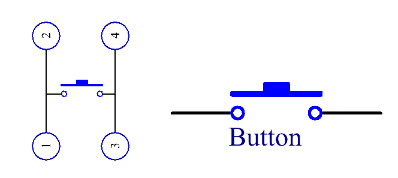

.. note::

    ¡Hola! Bienvenido a la comunidad de entusiastas de SunFounder para Raspberry Pi, Arduino y ESP32 en Facebook. Únete para profundizar en Raspberry Pi, Arduino y ESP32 junto a otros apasionados.

    **¿Por qué unirse?**

    - **Soporte de expertos**: Resuelve problemas postventa y desafíos técnicos con la ayuda de nuestra comunidad y equipo.
    - **Aprender y compartir**: Intercambia consejos y tutoriales para mejorar tus habilidades.
    - **Acceso exclusivo**: Obtén primicias sobre nuevos productos y adelantos.
    - **Descuentos especiales**: Disfruta de descuentos exclusivos en nuestros productos más recientes.
    - **Promociones festivas y sorteos**: Participa en sorteos y promociones de temporada.

     👉 ¿Listo para explorar y crear con nosotros? Haz clic en [|link_sf_facebook|] y únete hoy mismo.

2.1.1 Botón
==============

Introducción
------------------

En esta lección, aprenderemos cómo encender o apagar un LED usando un
botón.

Componentes
----------------

.. image:: img/list_2.1.1_Button.png

Principio
--------------

**Botón**

El botón es un componente común utilizado para controlar dispositivos electrónicos. 
Se usa normalmente como interruptor para conectar o desconectar circuitos. Aunque 
los botones vienen en diversos tamaños y formas, el que utilizamos aquí es un 
mini-botón de 6 mm, como se muestra en las siguientes imágenes.

Los dos pines de la izquierda están conectados entre sí, y el de la derecha es 
similar al de la izquierda, como se muestra a continuación:

.. image:: img/image148.png
    :width: 400
    :align: center

El símbolo que se muestra a continuación es el que se usa habitualmente para 
representar un botón en los circuitos.

Cuando se presiona el botón, los 4 pines se conectan, cerrando el
circuito.

Diagrama Esquemático
-------------------------

Utiliza un botón normalmente abierto como entrada para la Raspberry Pi. 
La conexión se muestra en el diagrama esquemático a continuación. Cuando 
se presiona el botón, el GPIO18 pasará a nivel bajo (0V). Podemos detectar 
el estado del GPIO18 mediante programación. Es decir, si el GPIO18 cambia 
a nivel bajo, significa que el botón ha sido presionado. Puedes ejecutar 
el código correspondiente cuando se presiona el botón y el LED se encenderá.

.. note::
    La pata más larga del LED es el ánodo y la más corta es el
    cátodo.

.. image:: img/image302.png
    :width: 600
    :align: center

.. image:: img/image303.png
    :width: 400
    :align: center

Procedimientos Experimentales
---------------------------------

**Paso 1**: Construye el circuito.

.. image:: img/image152.png
    :width: 800

Para Usuarios de Lenguaje C
^^^^^^^^^^^^^^^^^^^^^^^^^^^^^^

**Paso 2**: Abre el archivo de código.

.. raw:: html

   <run></run>

.. code-block::

    cd ~/davinci-kit-for-raspberry-pi/c/2.1.1/

.. note::
    Cambia el directorio a la ruta del código de este experimento usando **cd**.

**Paso 3**: Compila el código.

.. raw:: html

   <run></run>

.. code-block::

    gcc 2.1.1_Button.c -lwiringPi

**Paso 4**: Ejecuta el archivo compilado.

.. raw:: html

   <run></run>

.. code-block::

    sudo ./a.out

Después de ejecutar el código, al presionar el botón, el LED se encenderá; 
de lo contrario, se apagará.

.. note::

    Si no funciona después de ejecutarlo, o aparece un mensaje de error: \"wiringPi.h: No such file or directory", consulta :ref:`C code is not working?`.

**Código**

.. code-block:: c

    #include <wiringPi.h>
    #include <stdio.h>

    #define LedPin      0
    #define ButtonPin   1

    int main(void){
        // Si la inicialización de wiring falla, imprime un mensaje en pantalla
        if(wiringPiSetup() == -1){
            printf("setup wiringPi failed !");
            return 1;
        }
        
        pinMode(LedPin, OUTPUT);
        pinMode(ButtonPin, INPUT);
        digitalWrite(LedPin, HIGH);
        
        while(1){
            // Indica que el botón ha sido presionado
            if(digitalRead(ButtonPin) == 0){
                // Enciende el LED
                digitalWrite(LedPin, LOW);
            //  printf("...LED encendido\n");
            }
            else{
                // Apaga el LED
                digitalWrite(LedPin, HIGH);
            //  printf("LED apagado...\n");
            }
        }
        return 0;
    }

**Explicación del Código**

.. code-block:: 

    #define LedPin      0

El pin GPIO17 en la placa T_Extension es equivalente al GPIO0 en wiringPi.

.. code-block:: 

    #define ButtonPin   1

ButtonPin está conectado al GPIO1.

.. code-block:: 

    pinMode(LedPin, OUTPUT);

Configura LedPin como salida para asignarle un valor.

.. code-block:: 

    pinMode(ButtonPin, INPUT);

Configura ButtonPin como entrada para leer su valor.

.. code-block:: C

    while(1){
            // Indica que el botón ha sido presionado
            if(digitalRead(ButtonPin) == 0){
                // Enciende el LED
                digitalWrite(LedPin, LOW);
            //  printf("...LED encendido\n");
            }
            else{
                // Apaga el LED
                digitalWrite(LedPin, HIGH);
            //  printf("LED apagado...\n");
            }
        }

if (digitalRead(ButtonPin) == 0): verifica si el botón ha sido presionado. 
Ejecuta digitalWrite(LedPin, LOW) cuando el botón es presionado para encender 
el LED.

Para Usuarios de Lenguaje Python
^^^^^^^^^^^^^^^^^^^^^^^^^^^^^^^^^^^^^

**Paso 2**: Abre el archivo de código.

.. raw:: html

   <run></run>

.. code-block:: 

    cd ~/davinci-kit-for-raspberry-pi/python

**Paso 3**: Ejecuta el código.

.. raw:: html

   <run></run>

.. code-block:: 

    sudo python3 2.1.1_Button.py

Ahora, presiona el botón y el LED se encenderá; presiona el botón 
nuevamente y el LED se apagará. Al mismo tiempo, el estado del LED 
se mostrará en la pantalla.

**Código**

.. note::

    Puedes **Modificar/Restablecer/Copiar/Ejecutar/Detener** el código a continuación. Antes de eso, necesitas dirigirte a la ruta del código fuente como ``davinci-kit-for-raspberry-pi/python``.
    
.. raw:: html

    <run></run>

.. code-block:: python

    import RPi.GPIO as GPIO
    import time

    LedPin = 17 # Configura GPIO17 como el pin del LED
    BtnPin = 18 # Configura GPIO18 como el pin del botón

    Led_status = True # Configura el estado inicial del LED como True (APAGADO)

    # Define una función de configuración inicial
    def setup(): 
        # Configura los modos GPIO al sistema de numeración BCM
        GPIO.setmode(GPIO.BCM) 
        GPIO.setup(LedPin, GPIO.OUT, initial=GPIO.HIGH)  # Configura LedPin como salida y el nivel inicial como alto (3.3V)
        GPIO.setup(BtnPin, GPIO.IN) # Configura BtnPin como entrada.

    # Define una función de callback para el botón
    def swLed(ev=None): 
        global Led_status 
        # Cambia el estado del LED (encendido-->apagado; apagado-->encendido)
        Led_status = not Led_status 
        GPIO.output(LedPin, Led_status) 
        if Led_status: 
            print ('LED OFF...')
        else: 
            print ('...LED ON')

    # Define la función principal del proceso
    def main(): 
        # Configura una detección de caída en BtnPin,  
        # y la función de callback swLed
        GPIO.add_event_detect(BtnPin, GPIO.FALLING, callback=swLed) 
        while True: 
            # No realizar ninguna acción
            time.sleep(1) 

    # Define una función destroy para limpiar todo después de
    # que el script termine
    def destroy(): 
        # Apaga el LED
        GPIO.output(LedPin, GPIO.HIGH) 
        # Libera los recursos
        GPIO.cleanup() 

    # Si ejecutas este script directamente, haz:
    if __name__ == '__main__': 
        setup() 
        try: 
            main() 
        # Cuando se presiona 'Ctrl+C', se ejecutará la función
        # destroy()
        except KeyboardInterrupt: 
            destroy() 

**Explicación del Código**

.. code-block:: python

    LedPin = 17 

Configura GPIO17 como el pin del LED.

.. code-block:: python

    BtnPin = 18 

Configura GPIO18 como el pin del botón.

.. code-block:: python

    GPIO.add_event_detect(BtnPin, GPIO.FALLING, callback=swLed) 

Configura una detección de caída en BtnPin, de manera que cuando el 
valor de BtnPin cambie de alto a bajo, esto indica que el botón fue 
presionado. El siguiente paso es llamar a la función swLed.

.. code-block:: python

    def swLed(ev=None): 
    global Led_status 
    # Cambia el estado del LED (encendido-->apagado; apagado-->encendido)
    Led_status = not Led_status 
    GPIO.output(LedPin, Led_status) 

Define una función de callback para el botón. Cuando se presiona el botón 
por primera vez, y la condición `not Led_status` es falsa, la función GPIO.
output() se llama para encender el LED. Al presionar el botón nuevamente, el 
estado del LED se convierte de falso a verdadero, y el LED se apagará.

Imagen del Fenómeno
------------------------

.. image:: img/image153.jpeg

