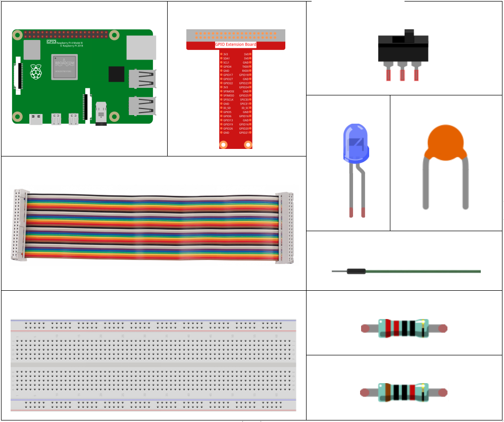
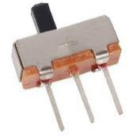
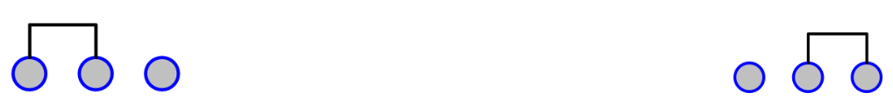
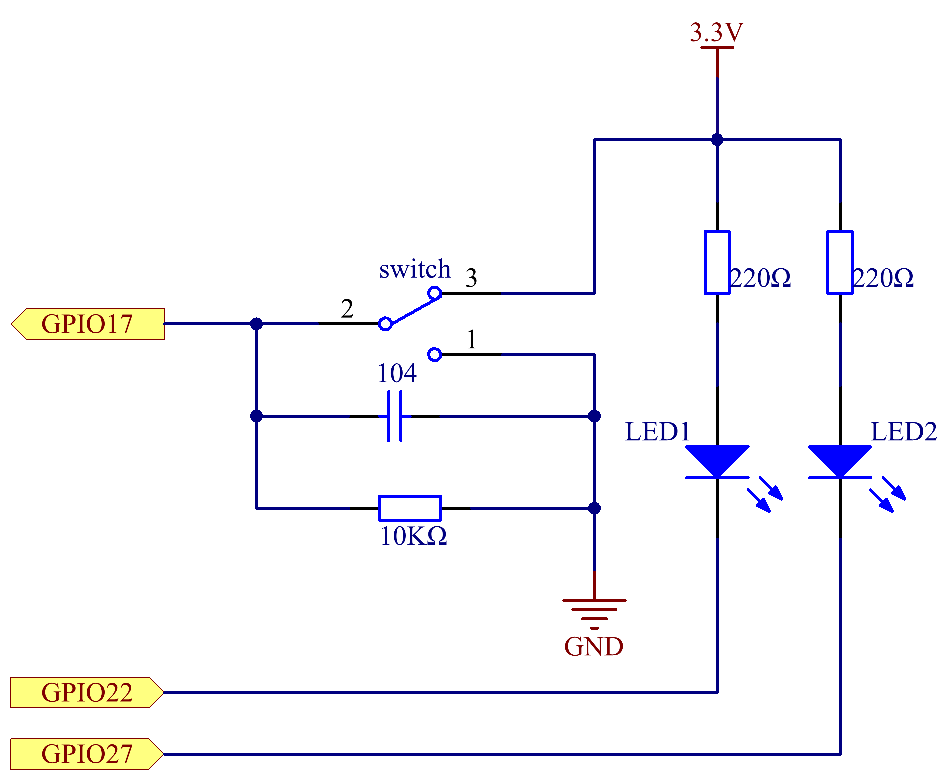
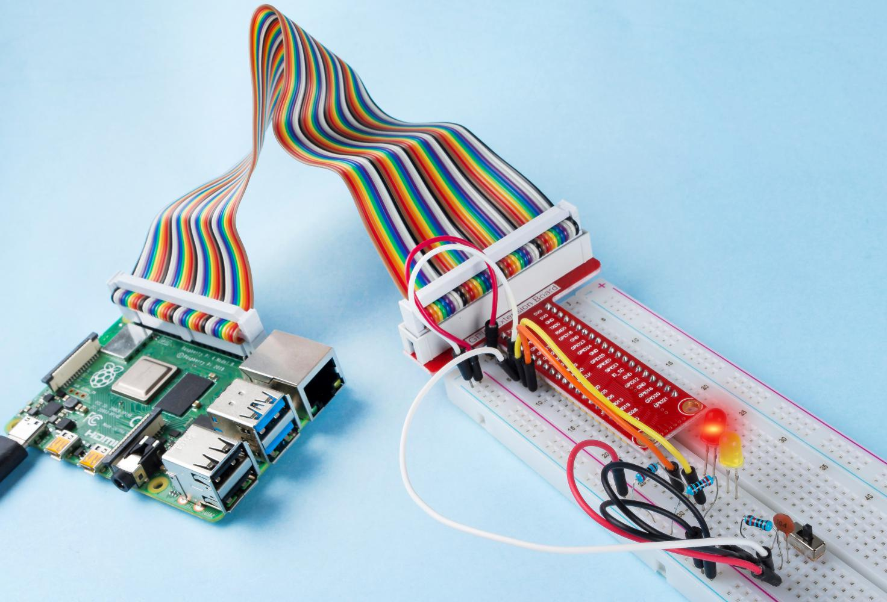

.. note::

    Hallo und willkommen in der SunFounder Raspberry Pi & Arduino & ESP32 Enthusiasten-Gemeinschaft auf Facebook! Tauchen Sie tiefer ein in die Welt von Raspberry Pi, Arduino und ESP32 mit anderen Enthusiasten.

    **Warum beitreten?**

    - **Expertenunterstützung**: Lösen Sie Nachverkaufsprobleme und technische Herausforderungen mit Hilfe unserer Gemeinschaft und unseres Teams.
    - **Lernen & Teilen**: Tauschen Sie Tipps und Anleitungen aus, um Ihre Fähigkeiten zu verbessern.
    - **Exklusive Vorschauen**: Erhalten Sie frühzeitigen Zugang zu neuen Produktankündigungen und exklusiven Einblicken.
    - **Spezialrabatte**: Genießen Sie exklusive Rabatte auf unsere neuesten Produkte.
    - **Festliche Aktionen und Gewinnspiele**: Nehmen Sie an Gewinnspielen und Feiertagsaktionen teil.

    👉 Sind Sie bereit, mit uns zu erkunden und zu erschaffen? Klicken Sie auf [|link_sf_facebook|] und treten Sie heute bei!

2.1.2 Schiebeschalter
=======================

Einführung
------------

In dieser Lektion lernen wir, wie man einen Schiebeschalter benutzt. Normalerweise wird der Schiebeschalter als Netzschalter auf die Leiterplatte gelötet, aber hier müssen wir ihn in das Steckbrett einsetzen, damit er möglicherweise nicht festgezogen wird. Und wir verwenden es auf dem Steckbrett, um seine Funktion zu zeigen.

Komponenten
--------------------

Prinzip
---------

**Schiebeschalter**

Ein Schiebeschalter dient, wie der Name schon sagt, dazu, die Schaltleiste zu schieben, um den Stromkreis anzuschließen oder zu unterbrechen, und weitere Schaltkreise. Die am häufigsten verwendeten Typen sind SPDT, SPTT, DPDT, DPTT usw. Der Schiebeschalter wird üblicherweise in Niederspannungsschaltungen verwendet. Es hat die Merkmale Flexibilität und Stabilität und ist in elektrischen Instrumenten und elektrischem Spielzeug weit verbreitet.

So funktioniert es: Stellen Sie den mittleren Pin als festen Pin ein. Wenn Sie den Schieber nach links ziehen, sind die beiden Pins links verbunden. Wenn Sie es nach rechts ziehen, sind die beiden Pins rechts verbunden. Somit funktioniert es als Schalter, der Schaltkreise verbindet oder trennt. Siehe die folgende Abbildung:

Das Schaltungssymbol des Schiebeschalters ist wie folgt dargestellt. Der Pin2 in der Abbildung bezieht sich auf den mittleren Pin.

.. image:: media/image159.png

**Kondensator**

Der Kondensator ist eine Komponente, die Energie in Form von elektrischer Ladung speichern oder eine Potentialdifferenz (statische Spannung) zwischen ihren Platten erzeugen kann, ähnlich wie eine kleine wiederaufladbare Batterie.

Standardkapazitätseinheiten

Microfarad (μF) 1μF = 1/1,000,000 = 0.000001 = :math:`10^{- 6}` F

Nanofarad (nF) 1nF = 1/1,000,000,000 = 0.000000001 = :math:`10^{- 9}`\ F

Picofarad (pF) 1pF = 1/1,000,000,000,000 = 0.000000000001 =
:math:`10^{- 12}`\ F

.. note::
    Hier verwenden wir **104 Kondensatoren (10 x 10\ 4\ PF)**. 
    Genau wie beim Widerstandsring helfen die Nummer auf den Kondensatoren beim Ablesen der Werte, 
    die auf der Platine montiert wurden. Die ersten beiden Ziffern stellen den Wert dar und die letzte Ziffer der Nummer bedeutet den Multiplikator. 
    Somit repräsentiert 104 eine Potenz von 10 x 10 zu 4 (in pF) gleich wie 100 nF.

Schematische Darstellung
-------------------------------------------

Verbinden Sie den mittleren Pin des Schiebeschalters mit GPIO17 und zwei LEDs mit Pin GPIO22 bzw. GPIO27. 
Wenn Sie dann an der Folie ziehen, leuchten die beiden LEDs abwechselnd auf.

.. image:: media/image305.png

Experimentelle Verfahren
-----------------------------------

Schritt 1: Bauen Sie die Schaltung auf.

.. image:: media/image161.png
    :width: 800

Für Benutzer in C-Sprache
^^^^^^^^^^^^^^^^^^^^^^^^^^^^^^^^^^^^^^^^^^^^^^^^

Schritt 2: Gehen Sie zum Ordner der Kode.

.. raw:: html

   <run></run>

.. code-block::

    cd /home/pi/davinci-kit-for-raspberry-pi/c/2.1.2

Schritt 3: Kompilieren.

.. raw:: html

   <run></run>

.. code-block::

    gcc 2.1.2_Slider.c -lwiringPi 

Schritt 4: Führen Sie die obige ausführbare Datei aus.

.. raw:: html

   <run></run>

.. code-block::

    sudo ./a.out

Während der Code ausgeführt wird, schalten Sie den Schalter links ein, und die gelbe LED leuchtet auf. rechts leuchtet das rote Licht auf.

**Code**

.. code-block:: c

    #include <wiringPi.h>
    #include <stdio.h>
    #define slidePin        0
    #define led1            3
    #define led2            2

    int main(void)
    {
        // When initialize wiring failed, print message to screen
        if(wiringPiSetup() == -1){
            printf("setup wiringPi failed !");
            return 1;
        }
        pinMode(slidePin, INPUT);
        pinMode(led1, OUTPUT);
        pinMode(led2, OUTPUT);
        while(1){
            // slide switch high, led1 on
            if(digitalRead(slidePin) == 1){
                digitalWrite(led1, LOW);
                digitalWrite(led2, HIGH);
                printf("LED1 on\n");
                delay(100);
            }
            // slide switch low, led2 on
            if(digitalRead(slidePin) == 0){
                digitalWrite(led2, LOW);
                digitalWrite(led1, HIGH);
                printf(".....LED2 on\n");
                delay(100);
            }
        }
        return 0;
    }

**Code Erklärung**

.. code-block:: c

    if(digitalRead(slidePin) == 1){
                digitalWrite(led1, LOW);
                digitalWrite(led2, HIGH);
                printf("LED1 on\n");
        }

Wenn der Schieber nach rechts gezogen wird, sind der mittlere und der rechte Stift verbunden. Der Raspberry Pi liest einen hohen Niveau am mittleren Pin, sodass die LED1 an und die LED2 aus ist.

.. code-block:: c

    if(digitalRead(slidePin) == 0){
                digitalWrite(led2, LOW);
                digitalWrite(led1, HIGH);
                printf(".....LED2 on\n");
            }

Wenn der Schieber nach links gezogen wird, sind der mittlere und der linke Pins verbunden. Der Raspberry Pi zeigt einen niedrigen Wert an, sodass die LED2 leuchtet und die LED1 aus ist

Für Python-Sprachbenutzer
^^^^^^^^^^^^^^^^^^^^^^^^^^^^^^^^^^^^^^^^^^

Schritt 2: Gehen Sie in den Ordner der Kode.

.. raw:: html

   <run></run>

.. code-block::

    cd /home/pi/davinci-kit-for-raspberry-pi/python

Schritt 3: Ausführen.

.. raw:: html

   <run></run>

.. code-block::

    sudo python3 2.1.2_Slider.py

Während der Code ausgeführt wird, schalten Sie den Schalter links ein, und die gelbe LED leuchtet auf. rechts leuchtet das rote Licht auf.

**Code**

.. note::

    Sie können den folgenden Code **Ändern/Zurücksetzen/Kopieren/Ausführen/Stoppen** . Zuvor müssen Sie jedoch zu einem Quellcodepfad wie ``davinci-kit-for-raspberry-pi/python`` gehen.
   
.. raw:: html

    <run></run>

.. code-block:: python

    import RPi.GPIO as GPIO
    import time

    # Set #17 as slide switch pin, #22 as led1 pin, #27 as led2 pin
    slidePin = 17
    led1Pin = 22
    led2Pin = 27

    # Define a setup function for some setup
    def setup():
        # Set the GPIO modes to BCM Numbering
        GPIO.setmode(GPIO.BCM)
        # Set slidePin input
        # Set ledPin output, 
        # and initial level to High(3.3v)
        GPIO.setup(slidePin, GPIO.IN)
        GPIO.setup(led1Pin, GPIO.OUT, initial=GPIO.HIGH)
        GPIO.setup(led2Pin, GPIO.OUT, initial=GPIO.HIGH)

    # Define a main function for main process
    def main():
        while True:
            # slide switch high, led1 on
            if GPIO.input(slidePin) == 1:
                print ('LED1 ON')
                GPIO.output(led1Pin, GPIO.LOW)
                GPIO.output(led2Pin, GPIO.HIGH)

            # slide switch low, led2 on
            if GPIO.input(slidePin) == 0:
                print ('    LED2 ON')
                GPIO.output(led2Pin, GPIO.LOW)
                GPIO.output(led1Pin, GPIO.HIGH)

            time.sleep(0.5)
    # Define a destroy function for clean up everything after
    # the script finished 
    def destroy():
        # Turn off LED
        GPIO.output(led1Pin, GPIO.HIGH)
        GPIO.output(led2Pin, GPIO.HIGH)
        # Release resource
        GPIO.cleanup()                     

    # If run this script directly, do:
    if __name__ == '__main__':
        setup()
        try:
            main()
        # When 'Ctrl+C' is pressed, the program 
        # destroy() will be  executed.
        except KeyboardInterrupt:
            destroy()	

**Code Erklärung**

.. code-block:: python

    if GPIO.input(slidePin) == 1:
        GPIO.output(led1Pin, GPIO.LOW)
        GPIO.output(led2Pin, GPIO.HIGH)

Wenn der Schieber nach rechts gezogen wird, 
sind der mittlere und der rechte Pins verbunden. Der Raspberry Pi liest einen hohen Niveau am mittleren Pin, 
sodass die LED1 an und die LED2 aus ist.

.. code-block:: python

    if GPIO.input(slidePin) == 0:
        GPIO.output(led2Pin, GPIO.LOW)
        GPIO.output(led1Pin, GPIO.HIGH)

Wenn der Schieber nach links gezogen wird, sind der mittlere und der linke Pins verbunden. 
Der Raspberry Pi zeigt einen niedrigen Wert an, sodass die LED2 leuchtet und die LED1 aus ist.

Phänomen Bild
------------------

