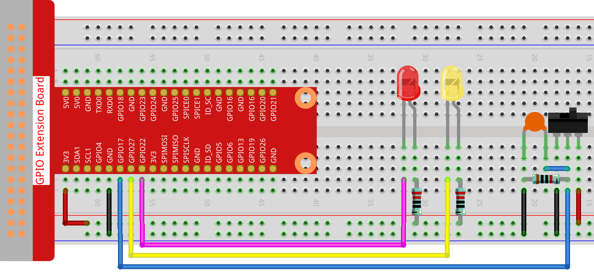

2.1.2 Slide Switch
==================

Introduction
------------

In this lesson, we will learn how to use a slide switch. Usually,the
slide switch is soldered on PCB as a power switch, but here we need to
insert it into the breadboard, thus it may not be tightened. And we use
it on the breadboard to show its function.

Components
----------

.. image:: media/list_2.1.2_slide_switch.png

Principle
---------

**Slide Switch**

.. image:: media/image156.jpeg

A slide switch, just as its name implies, is to slide the switch bar to
connect or break the circuit, and further switch circuits. The
common-used types are SPDT, SPTT, DPDT, DPTT etc. The slide switch is
commonly used in low-voltage circuit. It has the features of flexibility
and stability, and applies in electric instruments and electric toys
widely.

How it works: Set the middle pin as the fixed one. When you pull the
slide to the left, the two pins on the left are connected; when you pull
it to the right, the two pins on the right are connected. Thus, it works
as a switch connecting or disconnecting circuits. See the figure below:

.. image:: media/image304.png

The circuit symbol of the slide switch is shown as below. The pin2 in
the figure refers to the middle pin.

.. image:: media/image159.png

**Capacitor**

The capacitor is a component that has the capacity to store energy in
the form of electrical charge or to produce a potential difference
(Static Voltage) between its plates, much like a small rechargeable
battery.

Standard Units of Capacitance

Microfarad (μF) 1μF = 1/1,000,000 = 0.000001 = :math:`10^{- 6}` F

Nanofarad (nF) 1nF = 1/1,000,000,000 = 0.000000001 = :math:`10^{- 9}`\ F

Picofarad (pF) 1pF = 1/1,000,000,000,000 = 0.000000000001 =
:math:`10^{- 12}`\ F

.. note::
    Here we use **104 capacitor(10 x 10\ 4\ PF)**. Just like the
    ring of resistors, the numbers on the capacitors help to read the values
    once assembled onto the board. The first two digits represent the value
    and the last digit of the number means the multiplier. Thus 104
    represents a power of 10 x 10 to 4 (in pF) equal to 100 nF.

Schematic Diagram
-----------------

Connect the middle pin of the Slide Switch to GPIO17, and two LEDs to
pin GPIO22 and GPIO27 respectively. Then when you pull the slide, you
can see the two LEDs light up alternately.

.. image:: media/image305.png

.. image:: media/image306.png

Experimental Procedures
-----------------------

**Step 1:** Build the circuit.

For C Language Users
^^^^^^^^^^^^^^^^^^^^

**Step 2**: Go to the folder of the code.

.. raw:: html

   <run></run>

.. code-block::

    cd /home/pi/davinci-kit-for-raspberry-pi/c/2.1.2

**Step 3**: Compile.

.. raw:: html

   <run></run>

.. code-block::

    gcc 2.1.2_Slider.c -lwiringPi 

**Step 4**: Run the executable file above.

.. raw:: html

   <run></run>

.. code-block::

    sudo ./a.out

While the code is running, get the switch connected to the left, then
the yellow LED lights up; to the right, the red light turns on.

.. note::

    If it does not work after running, please refer to :ref:`C code is not working?`

**Code**

.. code-block:: c

    #include <wiringPi.h>
    #include <stdio.h>
    #define slidePin        0
    #define led1            3
    #define led2            2

    int main(void)
    {
        // When initialize wiring failed, print message to screen
        if(wiringPiSetup() == -1){
            printf("setup wiringPi failed !");
            return 1;
        }
        pinMode(slidePin, INPUT);
        pinMode(led1, OUTPUT);
        pinMode(led2, OUTPUT);
        while(1){
            // slide switch high, led1 on
            if(digitalRead(slidePin) == 1){
                digitalWrite(led1, LOW);
                digitalWrite(led2, HIGH);
                printf("LED1 on\n");
                delay(100);
            }
            // slide switch low, led2 on
            if(digitalRead(slidePin) == 0){
                digitalWrite(led2, LOW);
                digitalWrite(led1, HIGH);
                printf(".....LED2 on\n");
                delay(100);
            }
        }
        return 0;
    }

**Code Explanation**

.. code-block:: c

    if(digitalRead(slidePin) == 1){
                digitalWrite(led1, LOW);
                digitalWrite(led2, HIGH);
                printf("LED1 on\n");
        }

When the slide is pulled to the right, the middle pin and right one are
connected; the Raspberry Pi reads a high level at the middle pin, so the
LED1 is on and LED2 off

.. code-block:: c

    if(digitalRead(slidePin) == 0){
                digitalWrite(led2, LOW);
                digitalWrite(led1, HIGH);
                printf(".....LED2 on\n");
            }

When the slide is pulled to the left, the middle pin and left one are
connected; the Raspberry Pi reads a low, so the LED2 is on and LED1 off

For Python Language Users
^^^^^^^^^^^^^^^^^^^^^^^^^

**Step 2**: Get into the folder of the code.

.. raw:: html

   <run></run>

.. code-block::

    cd /home/pi/davinci-kit-for-raspberry-pi/python

**Step 3**: Run.

.. raw:: html

   <run></run>

.. code-block::

    sudo python3 2.1.2_Slider.py

While the code is running, get the switch connected to the left, then
the yellow LED lights up; to the right, the red light turns on.

**Code**

.. note::

    You can **Modify/Reset/Copy/Run/Stop** the code below. But before that, you need to go to  source code path like ``davinci-kit-for-raspberry-pi\\python``. 
    
.. raw:: html

    <run></run>

.. code-block:: python

    import RPi.GPIO as GPIO
    import time

    # Set #17 as slide switch pin, #22 as led1 pin, #27 as led2 pin
    slidePin = 17
    led1Pin = 22
    led2Pin = 27

    # Define a setup function for some setup
    def setup():
        # Set the GPIO modes to BCM Numbering
        GPIO.setmode(GPIO.BCM)
        # Set slidePin input
        # Set ledPin output, 
        # and initial level to High(3.3v)
        GPIO.setup(slidePin, GPIO.IN)
        GPIO.setup(led1Pin, GPIO.OUT, initial=GPIO.HIGH)
        GPIO.setup(led2Pin, GPIO.OUT, initial=GPIO.HIGH)

    # Define a main function for main process
    def main():
        while True:
            # slide switch high, led1 on
            if GPIO.input(slidePin) == 1:
                print ('LED1 ON')
                GPIO.output(led1Pin, GPIO.LOW)
                GPIO.output(led2Pin, GPIO.HIGH)

            # slide switch low, led2 on
            if GPIO.input(slidePin) == 0:
                print ('    LED2 ON')
                GPIO.output(led2Pin, GPIO.LOW)
                GPIO.output(led1Pin, GPIO.HIGH)

            time.sleep(0.5)
    # Define a destroy function for clean up everything after
    # the script finished 
    def destroy():
        # Turn off LED
        GPIO.output(led1Pin, GPIO.HIGH)
        GPIO.output(led2Pin, GPIO.HIGH)
        # Release resource
        GPIO.cleanup()                     

    # If run this script directly, do:
    if __name__ == '__main__':
        setup()
        try:
            main()
        # When 'Ctrl+C' is pressed, the program 
        # destroy() will be  executed.
        except KeyboardInterrupt:
            destroy()	

**Code Explanation**

.. code-block:: python

    if GPIO.input(slidePin) == 1:
        GPIO.output(led1Pin, GPIO.LOW)
        GPIO.output(led2Pin, GPIO.HIGH)

When the slide is pulled to the right, the middle pin and right one are
connected; the Raspberry Pi reads a high level at the middle pin, so the
LED1 is on and LED2 off.

.. code-block:: python

    if GPIO.input(slidePin) == 0:
        GPIO.output(led2Pin, GPIO.LOW)
        GPIO.output(led1Pin, GPIO.HIGH)

When the slide is pulled to the left, the middle pin and left one are
connected; the Raspberry Pi reads a low, so the LED2 is on and LED1 off.

Phenomenon Picture
------------------

.. image:: media/image162.jpeg

