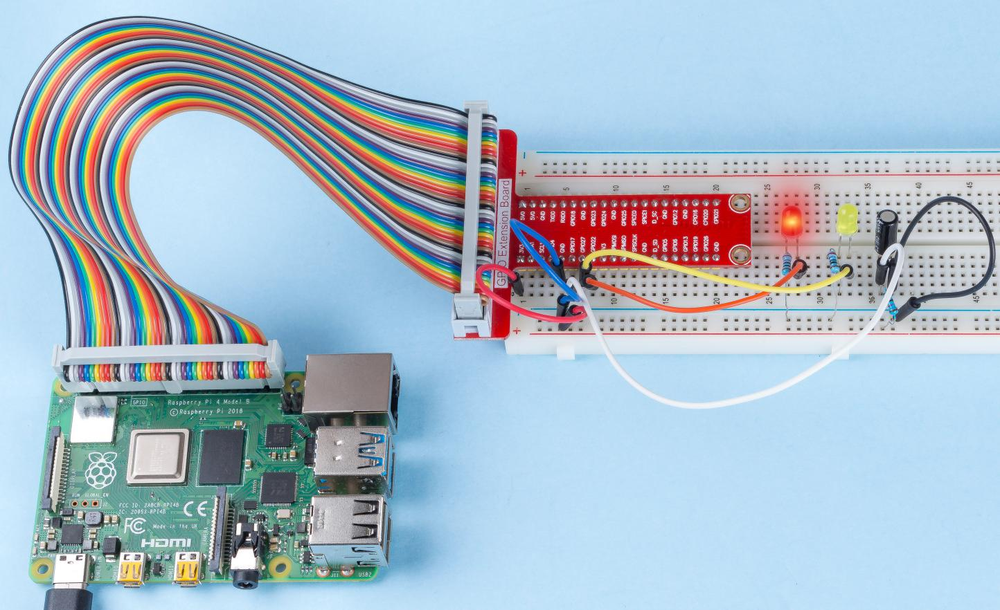

.. note::

    Hello, welcome to the SunFounder Raspberry Pi & Arduino & ESP32 Enthusiasts Community on Facebook! Dive deeper into Raspberry Pi, Arduino, and ESP32 with fellow enthusiasts.

    **Why Join?**

    - **Expert Support**: Solve post-sale issues and technical challenges with help from our community and team.
    - **Learn & Share**: Exchange tips and tutorials to enhance your skills.
    - **Exclusive Previews**: Get early access to new product announcements and sneak peeks.
    - **Special Discounts**: Enjoy exclusive discounts on our newest products.
    - **Festive Promotions and Giveaways**: Take part in giveaways and holiday promotions.

    👉 Ready to explore and create with us? Click [|link_sf_facebook|] and join today!

2.1.3 Tilt Switch
=================

Introduction
------------

This is a ball tilt-switch with a metal ball inside. It is used to
detect inclinations of a small angle.

Components
----------

.. image:: img/list_2.1.3_tilt_switch.png

Principle
---------

**Tilt**

The principle is very simple. When the switch is tilted in a certain
angle, the ball inside rolls down and touches the two contacts connected
to the pins outside, thus triggering circuits. Otherwise the ball will
stay away from the contacts, thus breaking the circuits.

.. image:: img/image167.png

Schematic Diagram
-----------------

.. image:: img/image307.png

.. image:: img/image308.png

Experimental Procedures
-----------------------

**Step 1:** Build the circuit.

.. image:: img/image169.png
    :width: 800

For C Language Users
^^^^^^^^^^^^^^^^^^^^

**Step 2:** Change directory.

.. raw:: html

   <run></run>

.. code-block::

    cd ~/davinci-kit-for-raspberry-pi/c/2.1.3/

**Step 3:** Compile.

.. raw:: html

   <run></run>

.. code-block::

    gcc 2.1.3_Tilt.c -lwiringPi

**Step 4:** Run.

.. raw:: html

   <run></run>

.. code-block::

    sudo ./a.out

Place the tilt horizontally, and the green LED will turns on. If you
tilt it, \"Tilt!\" will be printed on the screen and the red LED will
lights on. Place it horizontally again, and the green LED will turns on
again.

.. note::

    If it does not work after running, or there is an error prompt: \"wiringPi.h: No such file or directory\", please refer to :ref:`C code is not working?`.

**Code**

.. code-block:: c

    #include <wiringPi.h>
    #include <stdio.h>

    #define TiltPin     0
    #define Gpin        2
    #define Rpin        3

    void LED(char* color)
    {
        pinMode(Gpin, OUTPUT);
        pinMode(Rpin, OUTPUT);
        if (color == "RED")
        {
            digitalWrite(Rpin, HIGH);
            digitalWrite(Gpin, LOW);
        }
        else if (color == "GREEN")
        {
            digitalWrite(Rpin, LOW);
            digitalWrite(Gpin, HIGH);
        }
        else
            printf("LED Error");
    }

    int main(void)
    {
        if(wiringPiSetup() == -1){ //when initialize wiring failed,print message to screen
            printf("setup wiringPi failed !");
            return 1;
        }

        pinMode(TiltPin, INPUT);
        LED("GREEN");
        
        while(1){
            if(0 == digitalRead(TiltPin)){
                delay(10);
                if(0 == digitalRead(TiltPin)){
                    LED("RED");
                    printf("Tilt!\n");
                    delay(100);
                }
            }
            else if(1 == digitalRead(TiltPin)){
                delay(10);
                if(1 == digitalRead(TiltPin)){
                    LED("GREEN");
                }
            }
        }
        return 0;
    }

**Code Explanation**

.. code-block:: c

    void LED(char* color)
    {
        pinMode(Gpin, OUTPUT);
        pinMode(Rpin, OUTPUT);
        if (color == "RED")
        {
            digitalWrite(Rpin, HIGH);
            digitalWrite(Gpin, LOW);
        }
        else if (color == "GREEN")
        {
            digitalWrite(Rpin, LOW);
            digitalWrite(Gpin, HIGH);
        }
        else
            printf("LED Error");
    }

Define a function LED() to turn the two LEDs on or off. If the parameter
color is RED, the red LED lights up; similarly, if the parameter color
is GREEN, the green LED will turns on.

.. code-block:: c

    while(1){
            if(0 == digitalRead(TiltPin)){
                delay(10);
                if(0 == digitalRead(TiltPin)){
                    LED("RED");
                    printf("Tilt!\n");
                }
            }
            else if(1 == digitalRead(TiltPin)){
                delay(10);
                if(1 == digitalRead(TiltPin)){
                    LED("GREEN");
                }
            }
        }

If the read value of tilt switch is 0, it means that the tilt switch is
tilted then you write the parameter \"RED\" into function LED to get the
red LED lighten up; otherwise, the green LED will lit.

For Python Language Users
^^^^^^^^^^^^^^^^^^^^^^^^^

**Step 2:** Change directory.

.. raw:: html

   <run></run>

.. code-block:: 

    cd ~/davinci-kit-for-raspberry-pi/python/

**Step 3:** Run.

.. raw:: html

   <run></run>

.. code-block:: 

    sudo python3 2.1.3_Tilt.py

Place the tilt horizontally, and the green LED will turns on. If you
tilt it, \"Tilt!\" will be printed on the screen and the red LED will
turns on. Place it horizontally again, and the green LED will lights on.

**Code**

.. note::

    You can **Modify/Reset/Copy/Run/Stop** the code below. But before that, you need to go to  source code path like ``davinci-kit-for-raspberry-pi/python``. 
    
.. raw:: html

    <run></run>

.. code-block:: python

    import RPi.GPIO as GPIO
    import time

    dhtPin = 17

    GPIO.setmode(GPIO.BCM)

    MAX_UNCHANGE_COUNT = 100

    STATE_INIT_PULL_DOWN = 1
    STATE_INIT_PULL_UP = 2
    STATE_DATA_FIRST_PULL_DOWN = 3
    STATE_DATA_PULL_UP = 4
    STATE_DATA_PULL_DOWN = 5

    def readDht11():
        GPIO.setup(dhtPin, GPIO.OUT)
        GPIO.output(dhtPin, GPIO.HIGH)
        time.sleep(0.05)
        GPIO.output(dhtPin, GPIO.LOW)
        time.sleep(0.02)
        GPIO.setup(dhtPin, GPIO.IN, GPIO.PUD_UP)

        unchanged_count = 0
        last = -1
        data = []
        while True:
            current = GPIO.input(dhtPin)
            data.append(current)
            if last != current:
                unchanged_count = 0
                last = current
            else:
                unchanged_count += 1
                if unchanged_count > MAX_UNCHANGE_COUNT:
                    break

        state = STATE_INIT_PULL_DOWN

        lengths = []
        current_length = 0

        for current in data:
            current_length += 1

            if state == STATE_INIT_PULL_DOWN:
                if current == GPIO.LOW:
                    state = STATE_INIT_PULL_UP
                else:
                    continue
            if state == STATE_INIT_PULL_UP:
                if current == GPIO.HIGH:
                    state = STATE_DATA_FIRST_PULL_DOWN
                else:
                    continue
            if state == STATE_DATA_FIRST_PULL_DOWN:
                if current == GPIO.LOW:
                    state = STATE_DATA_PULL_UP
                else:
                    continue
            if state == STATE_DATA_PULL_UP:
                if current == GPIO.HIGH:
                    current_length = 0
                    state = STATE_DATA_PULL_DOWN
                else:
                    continue
            if state == STATE_DATA_PULL_DOWN:
                if current == GPIO.LOW:
                    lengths.append(current_length)
                    state = STATE_DATA_PULL_UP
                else:
                    continue
        if len(lengths) != 40:
            #print ("Data not good, skip")
            return False

        shortest_pull_up = min(lengths)
        longest_pull_up = max(lengths)
        halfway = (longest_pull_up + shortest_pull_up) / 2
        bits = []
        the_bytes = []
        byte = 0

        for length in lengths:
            bit = 0
            if length > halfway:
                bit = 1
            bits.append(bit)
        #print ("bits: %s, length: %d" % (bits, len(bits)))
        for i in range(0, len(bits)):
            byte = byte << 1
            if (bits[i]):
                byte = byte | 1
            else:
                byte = byte | 0
            if ((i + 1) % 8 == 0):
                the_bytes.append(byte)
                byte = 0
        #print (the_bytes)
        checksum = (the_bytes[0] + the_bytes[1] + the_bytes[2] + the_bytes[3]) & 0xFF
        if the_bytes[4] != checksum:
            #print ("Data not good, skip")
            return False

        return the_bytes[0], the_bytes[2]

    def main():

        while True:
            result = readDht11()
            if result:
                humidity, temperature = result
                print ("humidity: %s %%,  Temperature: %s C`" % (humidity, temperature))
            time.sleep(1)

    def destroy():
        GPIO.cleanup()

    if __name__ == '__main__':
        try:
            main()
        except KeyboardInterrupt:
            destroy() 

**Code Explanation**

.. code-block:: python

    GPIO.add_event_detect(TiltPin, GPIO.BOTH, callback=detect, bouncetime=200)

Set up a detect on TiltPin, and callback function to detect.

.. code-block:: python

    def Led(x):
        if x == 0:
            GPIO.output(Rpin, 1)
            GPIO.output(Gpin, 0)
        if x == 1:
            GPIO.output(Rpin, 0)
            GPIO.output(Gpin, 1)

Define a function Led() to turn the two LEDs on or off. If x=0, the red
LED lights up; otherwise, the green LED will be lit.

.. code-block:: python

    def Print(x):
        if x == 0:
            print ('    *************')
            print ('    *   Tilt!   *')
            print ('    *************')

Create a function, Print() to print the characters above on the screen.

.. code-block:: python

    def detect(chn):
        Led(GPIO.input(TiltPin))
        Print(GPIO.input(TiltPin))

Define a callback function for tilt callback. Get the read value of the
tilt switch then the function Led（） controls the turning on or off of
the two LEDs that is depended on the read value of the tilt switch.

Phenomenon Picture
------------------

