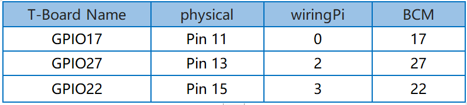

.. note::

    ¡Hola! Bienvenido a la comunidad de entusiastas de SunFounder para Raspberry Pi, Arduino y ESP32 en Facebook. Únete para profundizar en Raspberry Pi, Arduino y ESP32 junto a otros apasionados.

    **¿Por qué unirse?**

    - **Soporte de expertos**: Resuelve problemas postventa y desafíos técnicos con la ayuda de nuestra comunidad y equipo.
    - **Aprender y compartir**: Intercambia consejos y tutoriales para mejorar tus habilidades.
    - **Acceso exclusivo**: Obtén primicias sobre nuevos productos y adelantos.
    - **Descuentos especiales**: Disfruta de descuentos exclusivos en nuestros productos más recientes.
    - **Promociones festivas y sorteos**: Participa en sorteos y promociones de temporada.

     👉 ¿Listo para explorar y crear con nosotros? Haz clic en [|link_sf_facebook|] y únete hoy mismo.

2.1.3 Interruptor de Inclinación
========================================

Introducción
---------------

Este es un interruptor de inclinación con una bola metálica en su interior. 
Se utiliza para detectar inclinaciones de un ángulo pequeño.

Componentes
--------------

.. image:: img/list_2.1.3_tilt_switch.png

Principio
--------------

**Inclinación**

El principio es muy sencillo. Cuando el interruptor se inclina en cierto 
ángulo, la bola en su interior rueda y toca los dos contactos conectados 
a los pines externos, activando el circuito. De lo contrario, la bola 
permanece alejada de los contactos, interrumpiendo el circuito.

.. image:: img/image167.png

Diagrama Esquemático
------------------------

.. image:: img/image308.png

Procedimientos Experimentales
---------------------------------

**Paso 1:** Construye el circuito.

.. image:: img/image169.png
    :width: 800

Para Usuarios de Lenguaje C
^^^^^^^^^^^^^^^^^^^^^^^^^^^^^

**Paso 2:** Cambia de directorio.

.. raw:: html

   <run></run>

.. code-block::

    cd ~/davinci-kit-for-raspberry-pi/c/2.1.3/

**Paso 3:** Compila.

.. raw:: html

   <run></run>

.. code-block::

    gcc 2.1.3_Tilt.c -lwiringPi

**Paso 4:** Ejecuta.

.. raw:: html

   <run></run>

.. code-block::

    sudo ./a.out

Coloca el interruptor de inclinación en posición horizontal, y el 
LED verde se encenderá. Si lo inclinas, aparecerá el mensaje "¡Inclinación!" 
en la pantalla y el LED rojo se encenderá. Vuelve a colocarlo en posición 
horizontal y el LED verde se encenderá nuevamente.

.. note::

    Si no funciona después de ejecutarlo, o aparece un mensaje de error: \"wiringPi.h: No such file or directory", consulta :ref:`C code is not working?`.

**Código**

.. code-block:: c

    #include <wiringPi.h>
    #include <stdio.h>

    #define TiltPin     0
    #define Gpin        2
    #define Rpin        3

    void LED(char* color)
    {
        pinMode(Gpin, OUTPUT);
        pinMode(Rpin, OUTPUT);
        if (color == "RED")
        {
            digitalWrite(Rpin, HIGH);
            digitalWrite(Gpin, LOW);
        }
        else if (color == "GREEN")
        {
            digitalWrite(Rpin, LOW);
            digitalWrite(Gpin, HIGH);
        }
        else
            printf("LED Error");
    }

    int main(void)
    {
        if(wiringPiSetup() == -1){ // Si la inicialización de wiring falla, imprime mensaje en pantalla
            printf("setup wiringPi failed !");
            return 1;
        }

        pinMode(TiltPin, INPUT);
        LED("GREEN");
        
        while(1){
            if(0 == digitalRead(TiltPin)){
                delay(10);
                if(0 == digitalRead(TiltPin)){
                    LED("RED");
                    printf("Tilt!\n");
                    delay(100);
                }
            }
            else if(1 == digitalRead(TiltPin)){
                delay(10);
                if(1 == digitalRead(TiltPin)){
                    LED("GREEN");
                }
            }
        }
        return 0;
    }

**Explicación del Código**

.. code-block:: c

    void LED(char* color)
    {
        pinMode(Gpin, OUTPUT);
        pinMode(Rpin, OUTPUT);
        if (color == "RED")
        {
            digitalWrite(Rpin, HIGH);
            digitalWrite(Gpin, LOW);
        }
        else if (color == "GREEN")
        {
            digitalWrite(Rpin, LOW);
            digitalWrite(Gpin, HIGH);
        }
        else
            printf("LED Error");
    }

Define una función LED() para encender o apagar los dos LEDs. Si el 
parámetro color es RED, el LED rojo se enciende; de manera similar, 
si el parámetro color es GREEN, el LED verde se encenderá.

.. code-block:: c

    while(1){
            if(0 == digitalRead(TiltPin)){
                delay(10);
                if(0 == digitalRead(TiltPin)){
                    LED("RED");
                    printf("Tilt!\n");
                }
            }
            else if(1 == digitalRead(TiltPin)){
                delay(10);
                if(1 == digitalRead(TiltPin)){
                    LED("GREEN");
                }
            }
        }

Si el valor leído del interruptor de inclinación es 0, significa que el 
interruptor está inclinado, entonces escribes el parámetro "RED" en la 
función LED para que el LED rojo se encienda; de lo contrario, el LED verde se encenderá.

Para Usuarios de Lenguaje Python
^^^^^^^^^^^^^^^^^^^^^^^^^^^^^^^^^^^

**Paso 2:** Cambia de directorio.

.. raw:: html

   <run></run>

.. code-block:: 

    cd ~/davinci-kit-for-raspberry-pi/python/

**Paso 3:** Ejecuta.

.. raw:: html

   <run></run>

.. code-block:: 

    sudo python3 2.1.3_Tilt.py

Coloca el interruptor de inclinación en posición horizontal y el LED 
verde se encenderá. Si lo inclinas, aparecerá el mensaje "¡Inclinación!" 
en la pantalla y el LED rojo se encenderá. Vuelve a colocarlo en posición 
horizontal y el LED verde se encenderá nuevamente.

**Código**

.. note::

    Puedes **Modificar/Restablecer/Copiar/Ejecutar/Detener** el código a continuación. Antes de eso, necesitas dirigirte a la ruta del código fuente como ``davinci-kit-for-raspberry-pi/python``.
    
.. raw:: html

    <run></run>

.. code-block:: python

    import RPi.GPIO as GPIO
    import time

    dhtPin = 17

    GPIO.setmode(GPIO.BCM)

    MAX_UNCHANGE_COUNT = 100

    STATE_INIT_PULL_DOWN = 1
    STATE_INIT_PULL_UP = 2
    STATE_DATA_FIRST_PULL_DOWN = 3
    STATE_DATA_PULL_UP = 4
    STATE_DATA_PULL_DOWN = 5

    def readDht11():
        GPIO.setup(dhtPin, GPIO.OUT)
        GPIO.output(dhtPin, GPIO.HIGH)
        time.sleep(0.05)
        GPIO.output(dhtPin, GPIO.LOW)
        time.sleep(0.02)
        GPIO.setup(dhtPin, GPIO.IN, GPIO.PUD_UP)

        unchanged_count = 0
        last = -1
        data = []
        while True:
            current = GPIO.input(dhtPin)
            data.append(current)
            if last != current:
                unchanged_count = 0
                last = current
            else:
                unchanged_count += 1
                if unchanged_count > MAX_UNCHANGE_COUNT:
                    break

        state = STATE_INIT_PULL_DOWN

        lengths = []
        current_length = 0

        for current in data:
            current_length += 1

            if state == STATE_INIT_PULL_DOWN:
                if current == GPIO.LOW:
                    state = STATE_INIT_PULL_UP
                else:
                    continue
            if state == STATE_INIT_PULL_UP:
                if current == GPIO.HIGH:
                    state = STATE_DATA_FIRST_PULL_DOWN
                else:
                    continue
            if state == STATE_DATA_FIRST_PULL_DOWN:
                if current == GPIO.LOW:
                    state = STATE_DATA_PULL_UP
                else:
                    continue
            if state == STATE_DATA_PULL_UP:
                if current == GPIO.HIGH:
                    current_length = 0
                    state = STATE_DATA_PULL_DOWN
                else:
                    continue
            if state == STATE_DATA_PULL_DOWN:
                if current == GPIO.LOW:
                    lengths.append(current_length)
                    state = STATE_DATA_PULL_UP
                else:
                    continue
        if len(lengths) != 40:
            #print ("Data not good, skip")
            return False

        shortest_pull_up = min(lengths)
        longest_pull_up = max(lengths)
        halfway = (longest_pull_up + shortest_pull_up) / 2
        bits = []
        the_bytes = []
        byte = 0

        for length in lengths:
            bit = 0
            if length > halfway:
                bit = 1
            bits.append(bit)
        #print ("bits: %s, length: %d" % (bits, len(bits)))
        for i in range(0, len(bits)):
            byte = byte << 1
            if (bits[i]):
                byte = byte | 1
            else:
                byte = byte | 0
            if ((i + 1) % 8 == 0):
                the_bytes.append(byte)
                byte = 0
        #print (the_bytes)
        checksum = (the_bytes[0] + the_bytes[1] + the_bytes[2] + the_bytes[3]) & 0xFF
        if the_bytes[4] != checksum:
            #print ("Data not good, skip")
            return False

        return the_bytes[0], the_bytes[2]

    def main():

        while True:
            result = readDht11()
            if result:
                humidity, temperature = result
                print ("humidity: %s %%,  Temperature: %s C`" % (humidity, temperature))
            time.sleep(1)

    def destroy():
        GPIO.cleanup()

    if __name__ == '__main__':
        try:
            main()
        except KeyboardInterrupt:
            destroy() 

**Explicación del Código**

.. code-block:: python

    GPIO.add_event_detect(TiltPin, GPIO.BOTH, callback=detect, bouncetime=200)

Configura una detección en TiltPin y la función de callback detect.

.. code-block:: python

    def Led(x):
        if x == 0:
            GPIO.output(Rpin, 1)
            GPIO.output(Gpin, 0)
        if x == 1:
            GPIO.output(Rpin, 0)
            GPIO.output(Gpin, 1)

Define una función Led() para encender o apagar los dos LEDs. Si x=0, el LED 
rojo se enciende; de lo contrario, el LED verde se encenderá.

.. code-block:: python

    def Print(x):
        if x == 0:
            print ('    *************')
            print ('    *   Tilt!   *')
            print ('    *************')

Crea una función Print() para mostrar los caracteres anteriores en pantalla.

.. code-block:: python

    def detect(chn):
        Led(GPIO.input(TiltPin))
        Print(GPIO.input(TiltPin))

Define una función de callback para la inclinación. Lee el valor del 
interruptor de inclinación, luego la función Led() controla el encendido 
o apagado de los dos LEDs según el valor leído del interruptor.

Imagen del Fenómeno
-------------------------

.. image:: img/image170.jpeg
