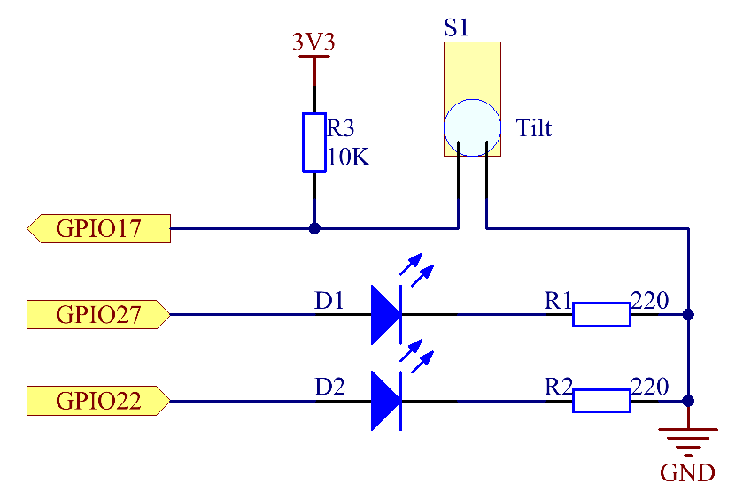

2.1.3 Tilt Switch
=================

Introduction
------------

This is a ball tilt-switch with a metal ball inside. It is used to
detect inclinations of a small angle.

Components
----------

.. image:: media/list_2.1.3_tilt_switch.png

Principle
---------

**Tilt**

The principle is very simple. When the switch is tilted in a certain
angle, the ball inside rolls down and touches the two contacts connected
to the pins outside, thus triggering circuits. Otherwise the ball will
stay away from the contacts, thus breaking the circuits.

.. image:: media/image167.png

Schematic Diagram
-----------------

.. image:: media/image307.png

Experimental Procedures
-----------------------

**Step 1:** Build the circuit.

.. image:: media/image169.png

For C Language Users
^^^^^^^^^^^^^^^^^^^^

**Step 2:** Change directory.

.. raw:: html

   <run></run>

.. code-block::

    cd /home/pi/davinci-kit-for-raspberry-pi/c/2.1.3/

**Step 3:** Compile.

.. raw:: html

   <run></run>

.. code-block::

    gcc 2.1.3_Tilt.c -lwiringPi

**Step 4:** Run.

.. raw:: html

   <run></run>

.. code-block::

    sudo ./a.out

Place the tilt horizontally, and the green LED will turns on. If you
tilt it, "Tilt!" will be printed on the screen and the red LED will
lights on. Place it horizontally again, and the green LED will turns on
again.

**Code**

.. code-block:: c

    #include <wiringPi.h>
    #include <stdio.h>

    #define TiltPin     0
    #define Gpin        2
    #define Rpin        3

    void LED(char* color)
    {
        pinMode(Gpin, OUTPUT);
        pinMode(Rpin, OUTPUT);
        if (color == "RED")
        {
            digitalWrite(Rpin, HIGH);
            digitalWrite(Gpin, LOW);
        }
        else if (color == "GREEN")
        {
            digitalWrite(Rpin, LOW);
            digitalWrite(Gpin, HIGH);
        }
        else
            printf("LED Error");
    }

    int main(void)
    {
        if(wiringPiSetup() == -1){ //when initialize wiring failed,print message to screen
            printf("setup wiringPi failed !");
            return 1;
        }

        pinMode(TiltPin, INPUT);
        LED("GREEN");
        
        while(1){
            if(0 == digitalRead(TiltPin)){
                delay(10);
                if(0 == digitalRead(TiltPin)){
                    LED("RED");
                    printf("Tilt!\n");
                }
            }
            else if(1 == digitalRead(TiltPin)){
                delay(10);
                if(1 == digitalRead(TiltPin)){
                    LED("GREEN");
                }
            }
        }
        return 0;
    }

**Code Explanation**

.. code-block:: c

    void LED(char* color)
    {
        pinMode(Gpin, OUTPUT);
        pinMode(Rpin, OUTPUT);
        if (color == "RED")
        {
            digitalWrite(Rpin, HIGH);
            digitalWrite(Gpin, LOW);
        }
        else if (color == "GREEN")
        {
            digitalWrite(Rpin, LOW);
            digitalWrite(Gpin, HIGH);
        }
        else
            printf("LED Error");
    }

Define a function LED() to turn the two LEDs on or off. If the parameter
color is RED, the red LED lights up; similarly, if the parameter color
is GREEN, the green LED will turns on.

.. code-block:: c

    while(1){
            if(0 == digitalRead(TiltPin)){
                delay(10);
                if(0 == digitalRead(TiltPin)){
                    LED("RED");
                    printf("Tilt!\n");
                }
            }
            else if(1 == digitalRead(TiltPin)){
                delay(10);
                if(1 == digitalRead(TiltPin)){
                    LED("GREEN");
                }
            }
        }

If the read value of tilt switch is 0, it means that the tilt switch is
tilted then you write the parameter ”RED” into function LED to get the
red LED lighten up; otherwise, the green LED will lit.

For Python Language Users
^^^^^^^^^^^^^^^^^^^^^^^^^

**Step 2:** Change directory.

.. raw:: html

   <run></run>

.. code-block:: 

    cd /home/pi/davinci-kit-for-raspberry-pi/python/

**Step 3:** Run.

.. raw:: html

   <run></run>

.. code-block:: 

    sudo python3 2.1.3_Tilt.py

Place the tilt horizontally, and the green LED will turns on. If you
tilt it, "Tilt!" will be printed on the screen and the red LED will
turns on. Place it horizontally again, and the green LED will lights on.

**Code**

.. code-block:: python

    import RPi.GPIO as GPIO

    TiltPin = 11
    Gpin   = 13
    Rpin   = 15

    def setup():
        GPIO.setmode(GPIO.BOARD)       # Numbers GPIOs by physical location
        GPIO.setup(Gpin, GPIO.OUT)     # Set Green Led Pin mode to output
        GPIO.setup(Rpin, GPIO.OUT)     # Set Red Led Pin mode to output
        GPIO.setup(TiltPin, GPIO.IN, pull_up_down=GPIO.PUD_UP)    # Set BtnPin's mode is input, and pull up to high level(3.3V)
        GPIO.add_event_detect(TiltPin, GPIO.BOTH, callback=detect, bouncetime=200)

    def Led(x):
        if x == 0:
            GPIO.output(Rpin, 1)
            GPIO.output(Gpin, 0)
        if x == 1:
            GPIO.output(Rpin, 0)
            GPIO.output(Gpin, 1)

    def Print(x):
        if x == 0:
            print ('    *************')
            print ('    *   Tilt!   *')
            print ('    *************')

    def detect(chn):
        Led(GPIO.input(TiltPin))
        Print(GPIO.input(TiltPin))

    def loop():
        while True:
            pass

    def destroy():
        GPIO.output(Gpin, GPIO.HIGH)       # Green led off
        GPIO.output(Rpin, GPIO.HIGH)       # Red led off
        GPIO.cleanup()                     # Release resource

    if __name__ == '__main__':     # Program start from here
        setup()
        try:
            loop()
        except KeyboardInterrupt:  # When 'Ctrl+C' is pressed, the program destroy() will be  executed.
            destroy()

**Code Explanation**

.. code-block:: python

    GPIO.add_event_detect(TiltPin, GPIO.BOTH, callback=detect, bouncetime=200)

Set up a detect on TiltPin, and callback function to detect.

.. code-block:: python

    def Led(x):
        if x == 0:
            GPIO.output(Rpin, 1)
            GPIO.output(Gpin, 0)
        if x == 1:
            GPIO.output(Rpin, 0)
            GPIO.output(Gpin, 1)

Define a function Led() to turn the two LEDs on or off. If x=0, the red
LED lights up; otherwise, the green LED will be lit.

.. code-block:: python

    def Print(x):
        if x == 0:
            print ('    *************')
            print ('    *   Tilt!   *')
            print ('    *************')

Create a function, Print() to print the characters above on the screen.

.. code-block:: python

    def detect(chn):
        Led(GPIO.input(TiltPin))
        Print(GPIO.input(TiltPin))

Define a callback function for tilt callback. Get the read value of the
tilt switch then the function Led（） controls the turning on or off of
the two LEDs that is depended on the read value of the tilt switch.

Phenomenon Picture
------------------

.. image:: media/image170.jpeg

