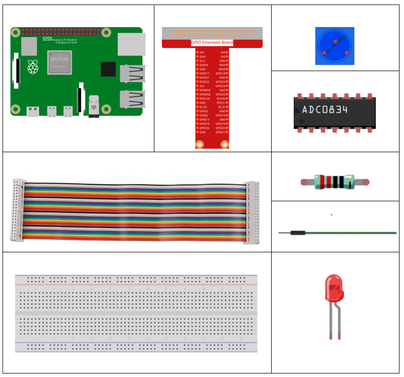
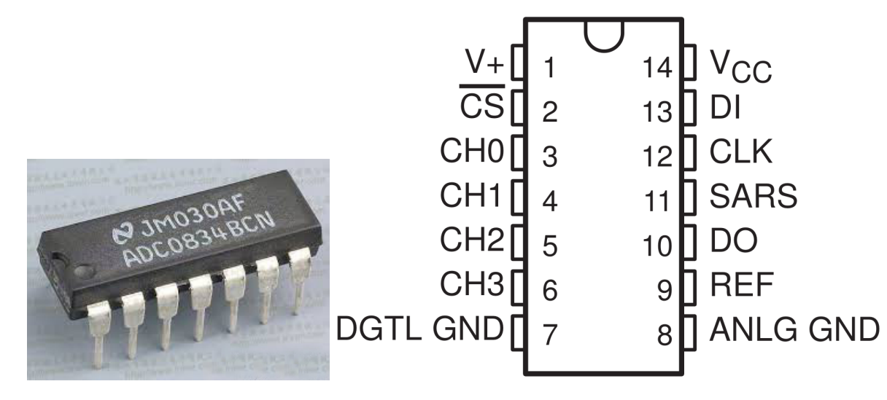
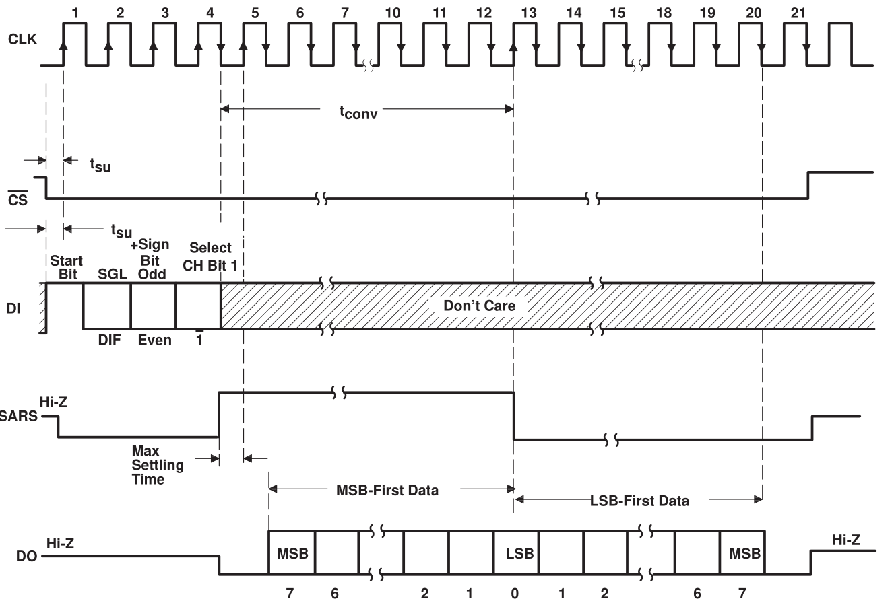
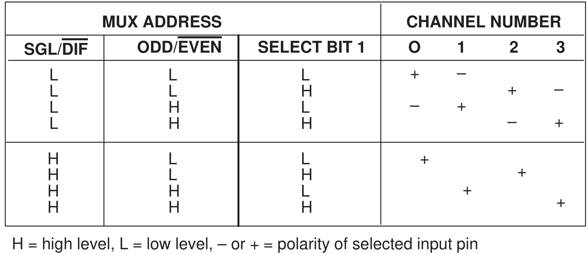

.. note::

    こんにちは、SunFounderのRaspberry Pi & Arduino & ESP32愛好家コミュニティへようこそ！Facebook上でRaspberry Pi、Arduino、ESP32についてもっと深く掘り下げ、他の愛好家と交流しましょう。

    **参加する理由は？**

    - **エキスパートサポート**：コミュニティやチームの助けを借りて、販売後の問題や技術的な課題を解決します。
    - **学び＆共有**：ヒントやチュートリアルを交換してスキルを向上させましょう。
    - **独占的なプレビュー**：新製品の発表や先行プレビューに早期アクセスしましょう。
    - **特別割引**：最新製品の独占割引をお楽しみください。
    - **祭りのプロモーションとギフト**：ギフトや祝日のプロモーションに参加しましょう。

    👉 私たちと一緒に探索し、創造する準備はできていますか？[|link_sf_facebook|]をクリックして今すぐ参加しましょう！

2.1.4 ポテンショメータ
======================

前書き
------------

ADC機能を使用してアナログ信号をデジタル信号に変換でき、この実験では、
ADC0834を使用してADCに関する関数を取得する。
ここでは、ポテンショメータを使用してこのプロセスを実装する。
ポテンショメーターはADC機能によって変換される物理量-電圧を変更する。

部品
----------

原理
---------

**ADC0834**

ADC0834 は、入力構成可能なマルチチャンネル マルチプレクサとシリアル入出力を備えた 8 ビットの逐次比較型 A/D コンバータです。
シリアル入出力は、標準的なシフトレジスターやマイクロプロセッサーとのインターフェースとして構成されています。

**操作の順序**

変換はCSをlowに設定することで開始され、
論理回路がすべて有効になる。
変換プロセスを完了するには、CSをlowに保持する必要がある。
次に、プロセッサからクロック入力を受信する。
クロック入力のLowからHighへの遷移ごとに、
DI上のデータがマルチプレクサーアドレスシフトレジスタに入力される。
入力の最初のロジックhighはスタートビットである。スタートビットの後に、
3〜4ビットの割り当てワードが続く。クロック入力のLowからHighへの遷移ごとに、
スタートビットと割り当てワードがシフトレジスターにシフトする。
スタートビットがマルチプレクサレジスタの開始位置にシフトされると、
入力チャネルが選択され、変換が開始される。SAR Statu出力（SARS）は、
変換が進行中であることを示すために高レベルになり、
マルチプレクサーシフトレジスタへのDIは変換中は無効になる。

1クロック周期の間隔が自動的に挿入されて、
選択されたマルチプレックスチャネルの安定化を実現する。
データ出力DOは高インピーダンス状態から出て、
マルチプレクサの整定時間のこの1クロック期間に先行するLowを提供する。
SARコンパレータは、抵抗ラダーからの連続出力を入力アナログ信号と比較する。
コンパレータ出力は、アナログ入力が抵抗ラダー出力より大きいか小さいかを示す。
変換が進むと、変換データがDO出力ピンから同時に出力され、最上位ビット（MSB）が最初になる。

8クロック周期後、変換が完了し、SARS出力がLOWになる。
最後に、MSBファーストデータストリームの後に最下位ビットファーストデータを出力する。

**ADC0834 MUXアドレス制御論理表**

**ポテンショメータ**

ポテンショメーターも3つの端子を持つ抵抗部品であり、その抵抗値は定期的な変動に応じて調整できる。
ポテンショメータは通常、抵抗器と可動ブラシで構成されている。
ブラシが抵抗に沿って移動しているとき、変位に応じて特定の抵抗または電圧出力が生成される。

.. image:: media/image310.png
    :width: 300
    :align: center

回路内のポテンショメータの機能は次のとおりである：

1. 分圧器として機能する

ポテンショメータは連続的に調整可能な抵抗器である。
ポテンショメータのシャフトまたはスライドハンドルを調整すると、
可動接点が抵抗器上でスライドする。この時点で、ポテンショメータに印加される電圧と、
可動アームが回転した角度または移動距離に応じて、電圧を出力できる。

回路図
-----------------

.. image:: media/image311.png

.. image:: media/image312.png

実験手順
-----------------------

ステップ1： 回路を作る。

.. image:: media/image180.png
    :width: 800

.. note::
    写真に示されている対応する位置を参照して、チップを配置してください。配置するときにチップの溝は左側にあることに注意してください。

C言語ユーザー向け
^^^^^^^^^^^^^^^^^^^^

ステップ2： コードファイルを開く。

.. raw:: html

   <run></run>

.. code-block::

    cd /home/pi/davinci-kit-for-raspberry-pi/c/2.1.4/

ステップ3： コードをコンパイルする。

.. raw:: html

   <run></run>

.. code-block::

    gcc 2.1.4_Potentiometer.c -lwiringPi

ステップ4： 実行する。

.. raw:: html

   <run></run>

.. code-block::

    sudo ./a.out

コードの実行後、ポテンショメーターのノブを回すと、それに応じてLEDの輝度が変化する。

**コード**

.. code-block:: c

    #include <wiringPi.h>
    #include <stdio.h>
    #include <softPwm.h>

    typedef unsigned char uchar;
    typedef unsigned int uint;

    #define     ADC_CS    0
    #define     ADC_CLK   1
    #define     ADC_DIO   2
    #define     LedPin    3

    uchar get_ADC_Result(uint channel)
    {
        uchar i;
        uchar dat1=0, dat2=0;
        int sel = channel > 1 & 1;
        int odd = channel & 1;

        pinMode(ADC_DIO, OUTPUT);
        digitalWrite(ADC_CS, 0);
        // Start bit
        digitalWrite(ADC_CLK,0);
        digitalWrite(ADC_DIO,1);    delayMicroseconds(2);
        digitalWrite(ADC_CLK,1);    delayMicroseconds(2);
    //Single End mode
        digitalWrite(ADC_CLK,0);
        digitalWrite(ADC_DIO,1);    delayMicroseconds(2);
        digitalWrite(ADC_CLK,1);    delayMicroseconds(2);
        // ODD
        digitalWrite(ADC_CLK,0);
        digitalWrite(ADC_DIO,odd);  delayMicroseconds(2);
        digitalWrite(ADC_CLK,1);    delayMicroseconds(2);
        //Select
        digitalWrite(ADC_CLK,0);
        digitalWrite(ADC_DIO,sel);    delayMicroseconds(2);
        digitalWrite(ADC_CLK,1);

        digitalWrite(ADC_DIO,1);    delayMicroseconds(2);
        digitalWrite(ADC_CLK,0);
        digitalWrite(ADC_DIO,1);    delayMicroseconds(2);

        for(i=0;i<8;i++)
        {
            digitalWrite(ADC_CLK,1);    delayMicroseconds(2);
            digitalWrite(ADC_CLK,0);    delayMicroseconds(2);

            pinMode(ADC_DIO, INPUT);
            dat1=dat1<<1 | digitalRead(ADC_DIO);
        }

        for(i=0;i<8;i++)
        {
            dat2 = dat2 | ((uchar)(digitalRead(ADC_DIO))<<i);
            digitalWrite(ADC_CLK,1);    delayMicroseconds(2);
            digitalWrite(ADC_CLK,0);    delayMicroseconds(2);
        }

        digitalWrite(ADC_CS,1);
        pinMode(ADC_DIO, OUTPUT);
        return(dat1==dat2) ? dat1 : 0;
    }

    int main(void)
    {
        uchar analogVal;
        if(wiringPiSetup() == -1){ //when initialize wiring failed,print messageto screen
            printf("setup wiringPi failed !");
            return 1;
        }
        softPwmCreate(LedPin,  0, 100);
        pinMode(ADC_CS,  OUTPUT);
        pinMode(ADC_CLK, OUTPUT);

        while(1){
            analogVal = get_ADC_Result(0);
            printf("Current analogVal : %d\n", analogVal);
            delay(100);
            softPwmWrite(LedPin, analogVal);
            delay(100);
        }
        return 0;
    }

**コードの説明**

.. code-block:: c

    #define     ADC_CS    0
    #define     ADC_CLK   1
    #define     ADC_DIO   2
    #define     LedPin    3

ADC0834のCS、CLK、DIOを定義し、それぞれGPIO0、GPIO1、GPIO2に接続する。それから、GPIO3にLEDを取り付ける。

.. code-block:: c

    uchar get_ADC_Result(uint channel)
    {
        uchar i;
        uchar dat1=0, dat2=0;
        int sel = channel > 1 & 1;
        int odd = channel & 1;

        pinMode(ADC_DIO, OUTPUT);
        digitalWrite(ADC_CS, 0);
        // Start bit
        digitalWrite(ADC_CLK,0);
        digitalWrite(ADC_DIO,1);    delayMicroseconds(2);
        digitalWrite(ADC_CLK,1);    delayMicroseconds(2);
    //Single End mode
        digitalWrite(ADC_CLK,0);
        digitalWrite(ADC_DIO,1);    delayMicroseconds(2);
        digitalWrite(ADC_CLK,1);    delayMicroseconds(2);
        // ODD
        digitalWrite(ADC_CLK,0);
        digitalWrite(ADC_DIO,odd);  delayMicroseconds(2);
        digitalWrite(ADC_CLK,1);    delayMicroseconds(2);
        //Select
        digitalWrite(ADC_CLK,0);
        digitalWrite(ADC_DIO,sel);    delayMicroseconds(2);
        digitalWrite(ADC_CLK,1);

        digitalWrite(ADC_DIO,1);    delayMicroseconds(2);
        digitalWrite(ADC_CLK,0);
        digitalWrite(ADC_DIO,1);    delayMicroseconds(2);
        for(i=0;i<8;i++)
        {
            digitalWrite(ADC_CLK,1);    delayMicroseconds(2);
            digitalWrite(ADC_CLK,0);    delayMicroseconds(2);

            pinMode(ADC_DIO, INPUT);
            dat1=dat1<<1 | digitalRead(ADC_DIO);
        }

        for(i=0;i<8;i++)
        {
            dat2 = dat2 | ((uchar)(digitalRead(ADC_DIO))<<i);
            digitalWrite(ADC_CLK,1);    delayMicroseconds(2);
            digitalWrite(ADC_CLK,0);    delayMicroseconds(2);
        }

        digitalWrite(ADC_CS,1);
        pinMode(ADC_DIO, OUTPUT);
        return(dat1==dat2) ? dat1 : 0;
    }

ADC0834 には、アナログからデジタルへの変換を行う機能がある。特定の ワークフローは次のとおりです：

.. code-block:: c

    digitalWrite(ADC_CS, 0);

CSを低レベルに設定し、AD変換の有効化を開始する。

.. code-block:: c

    // Start bit
    digitalWrite(ADC_CLK,0);
    digitalWrite(ADC_DIO,1);    delayMicroseconds(2);
    digitalWrite(ADC_CLK,1);    delayMicroseconds(2);

クロック入力の lowからhighへの遷移が最初に発生したとき、 スタートビットとしてDIOを 1に設定する。次の三つのステップには 、割り当て単語が3つある 。

.. code-block:: c

    //Single End mode
    digitalWrite(ADC_CLK,0);
    igitalWrite(ADC_DIO,1);    delayMicroseconds(2);
    gitalWrite(ADC_CLK,1);    delayMicroseconds(2);

クロック入力のlowからhighへの遷移が二回発生したらすぐに、DIOを1に設定し、SGLモードを選択する。

.. code-block:: c

    // ODD
    digitalWrite(ADC_CLK,0);
    digitalWrite(ADC_DIO,odd);  delayMicroseconds(2);
    digitalWrite(ADC_CLK,1);    delayMicroseconds(2);

三回目に発生すると、DIOの値は変数 odd によって制御される。

.. code-block:: c

    //Select
    digitalWrite(ADC_CLK,0);
    digitalWrite(ADC_DIO,sel);    delayMicroseconds(2);
    digitalWrite(ADC_CLK,1);

CLKのパルスが4番目に低レベルから高レベルに変換されると、DIOの値は変数 sel によって制御される。

channel = 0、sel = 0、odd = 0の条件下では、 sel および odd に関する演算式は次のとおりである：

.. code-block:: c

    int sel = channel > 1 & 1;
    int odd = channel & 1;

channel = 1、sel = 0、odd = 1という条件が満たされている場合、
次のアドレス制御ロジックテーブルを参照してください。ここで、
CH1が選択され、開始ビットがマルチプレクサレジスタの開始位置にシフトされ、変換が開始される。

.. image:: media/image313.png

.. code-block:: c

    digitalWrite(ADC_DIO,1);    delayMicroseconds(2);
    digitalWrite(ADC_CLK,0);
    digitalWrite(ADC_DIO,1);    delayMicroseconds(2);

ここでは、DIOを1に二回設定し、それを無視してください。

.. code-block:: c

    for(i=0;i<8;i++)
        {
            digitalWrite(ADC_CLK,1);    delayMicroseconds(2);
            digitalWrite(ADC_CLK,0);    delayMicroseconds(2);

            pinMode(ADC_DIO, INPUT);
            dat1=dat1<<1 | digitalRead(ADC_DIO);
        }

最初の ``for() statement`` で、CLKの五番目のパルスがHighレベルから低レベルに変換したらすぐに、
DIOを入力モードに設定してください。
それから、変換が開始され、変換された値が変数dat1に保存される。8クロック周期後、変換が完了する。

.. code-block:: c

    for(i=0;i<8;i++)
        {
            dat2 = dat2 | ((uchar)(digitalRead(ADC_DIO))<<i);
            digitalWrite(ADC_CLK,1);    delayMicroseconds(2);
            digitalWrite(ADC_CLK,0);    delayMicroseconds(2);
        }

2番目最初の ``for()statement`` では、
他の最初の8つの後にDOを介して値を変換を出力し、変数dat2に保存する。

.. code-block:: c

    digitalWrite(ADC_CS,1);
    pinMode(ADC_DIO, OUTPUT);
    return(dat1==dat2) ? dat1 : 0;

``return(dat1 == dat2)? dat1:0;`` は、変換中に得られた値と出力値を比較するために使用される。
それらが互いに等しい場合、変換値dat1を出力する。
それ以外の場合は、0を出力する。これで、ADC0834の処理が完了した。

.. code-block:: c

    softPwmCreate(LedPin,  0, 100);

この機能はソフトウェアを使用してPWMピンLedPinを作成し、
初期パルス幅を0に設定し、PWMの周期を100 x 100usにするために使用される。

.. code-block:: c

    while(1){
            analogVal = get_ADC_Result(0);
            printf("Current analogVal : %d\n", analogVal);
            softPwmWrite(LedPin, analogVal);
            delay(100);
        }

メイ プログラムで、 ポテンショメーターに最初接続されているチャンネル0 0 の値 を 読み取る 。
そして、最初値を最初変数analogValに保存してから LedPinに書き込む。 
これで、ポテンショメータの値によってLEDの輝度が変化することを見ることができる。

Pythonユーザー向け
^^^^^^^^^^^^^^^^^^

ステップ2： コードファイルを開く

.. raw:: html

   <run></run>

.. code-block::

    cd /home/pi/davinci-kit-for-raspberry-pi/python/

ステップ3： 実行する。

.. raw:: html

   <run></run>

.. code-block::

    sudo python3 2.1.4_Potentiometer.py

コードの実行後、ポテンショメーターのノブを回すと、それに応じてLEDの輝度が変化する。

**コード**

.. note::

   以下のコードを **変更/リセット/コピー/実行/停止** できます。 ただし、その前に、 ``davinci-kit-for-raspberry-pi/python`` のようなソースコードパスに移動する必要があります。 
   

.. raw:: html

    <run></run>

.. code-block:: python

    import RPi.GPIO as GPIO
    import ADC0834
    import time

    LedPin = 22

    def setup():
        global led_val
        # Set the GPIO modes to BCM Numbering
        GPIO.setmode(GPIO.BCM)
        # Set all LedPin's mode to output and initial level to High(3.3v)
        GPIO.setup(LedPin, GPIO.OUT, initial=GPIO.HIGH)
        ADC0834.setup()
        # Set led as pwm channel and frequece to 2KHz
        led_val = GPIO.PWM(LedPin, 2000)
        # Set all begin with value 0
        led_val.start(0)

    def destroy():
        # Stop all pwm channel
        led_val.stop()
        # Release resource
        GPIO.cleanup()
    def loop():
        while True:
            analogVal = ADC0834.getResult()
            print ('analog value = %d' % analogVal)
            led_val.ChangeDutyCycle(analogVal*100/255)
            time.sleep(0.2)
    if __name__ == '__main__':
        setup()
        try:
            loop()
        except KeyboardInterrupt: # When 'Ctrl+C' is pressed, the program destroy() will be executed.
            destroy()

**コードの説明**

.. code-block:: python

    import ADC0834

ADC0834ライブラリをインポートする。コマンド ``nano ADC0834.py`` を呼び出して、ライブラリの内容を確認できる。

.. code-block:: python

    def setup():
        global led_val
        # Set the GPIO modes to BCM Numbering
        GPIO.setmode(GPIO.BCM)
        # Set all LedPin's mode to output and initial level to High(3.3v)
        GPIO.setup(LedPin, GPIO.OUT, initial=GPIO.HIGH)
        ADC0834.setup()
        # Set led as pwm channel and frequece to 2KHz
        led_val = GPIO.PWM(LedPin, 2000)

        # Set all begin with value 0
        led_val.start(0)

``setup()`` で、命名方法をBCMとして定義し、LedPinをPWMチャネルとして設定し、2Khzの周波数にレンダリングする。

``ADC0834.setup():`` ADC0834を初期化し、ADC0834の定義されたCS、CLK、DIOをそれぞれGPIO17、GPIO18、GPIO27に接続する。

.. code-block:: python

    def loop():
        while True:
            res = ADC0834.getResult()
            print ('res = %d' % res)
            R_val = MAP(res, 0, 255, 0, 100)
            led_val.ChangeDutyCycle(R_val)
            time.sleep(0.2)

関数 ``getResult()`` はADC0834の4つのチャンネルのアナログ値を読み取るために使用される。
デフォルトでは、関数はCH0の値を読み取り、
他のチャネルを読み取りたい場合は、() にチャネル番号を入力してください(例えば ``getResult(1)`` )。

関数 ``loop()`` は最初にCH0の値を読み取り、それから変数resに値を割り当てる。
その後、関数MAPを呼び出して、ポテンショメーターの読み取り値を0〜100にマッピングする。
このステップはLedPinのデューティサイクルを制御するために使用される。
これで、ポテンショメータの値によってLEDの輝度が変化していることがわかる。

現象画像
------------------

.. image:: media/image181.jpeg

