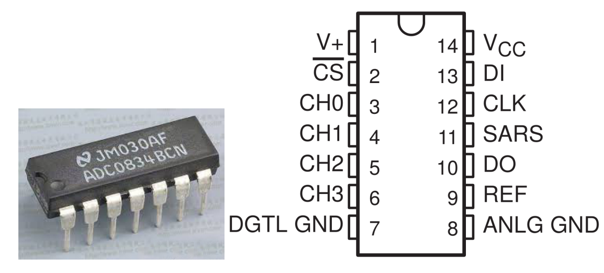
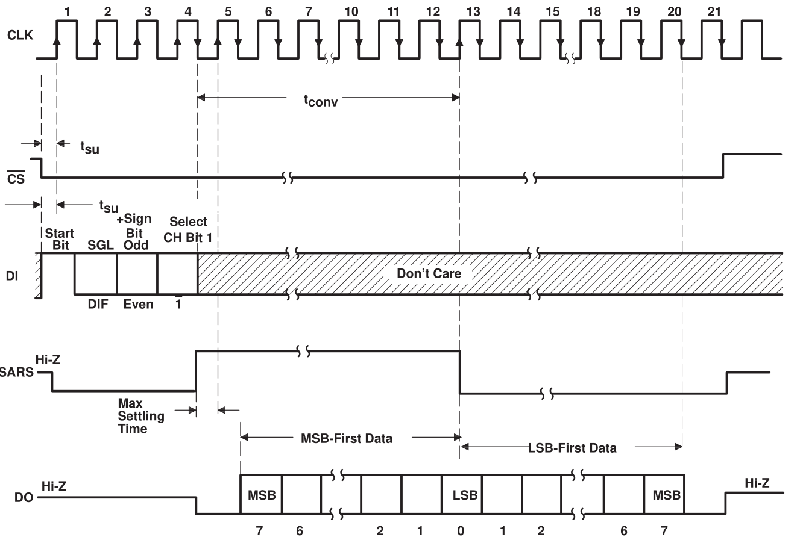
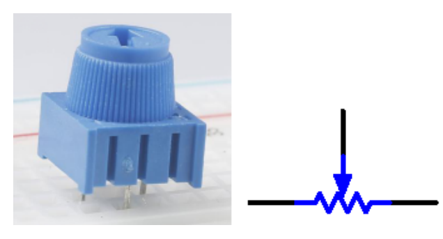
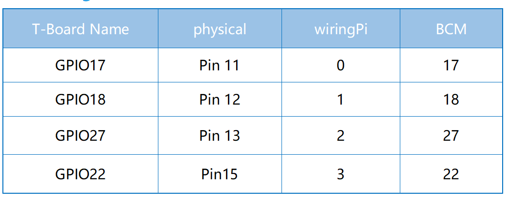
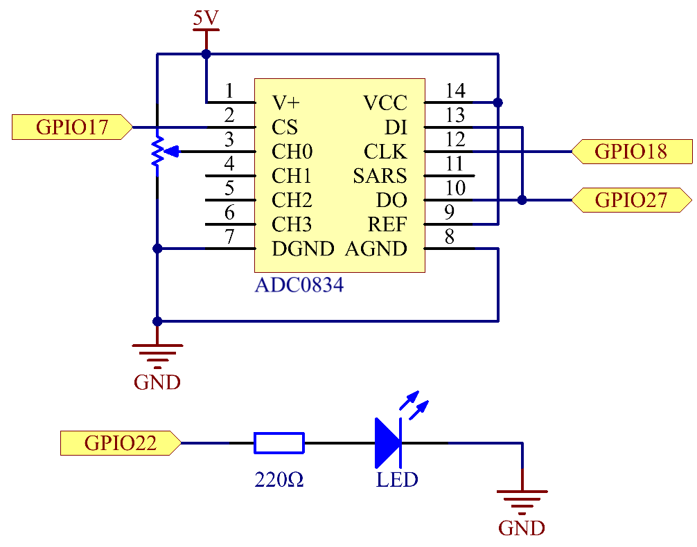
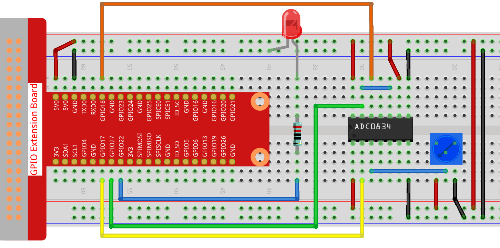
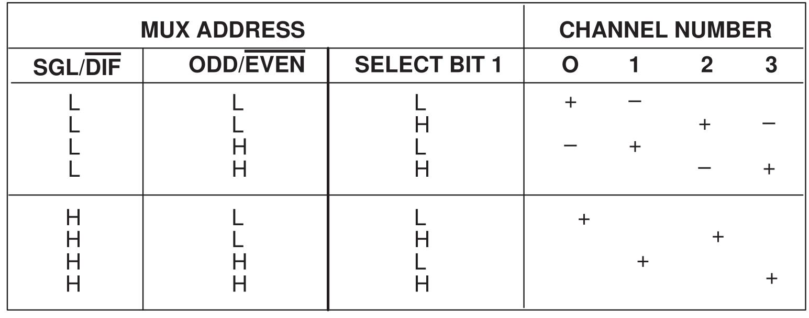
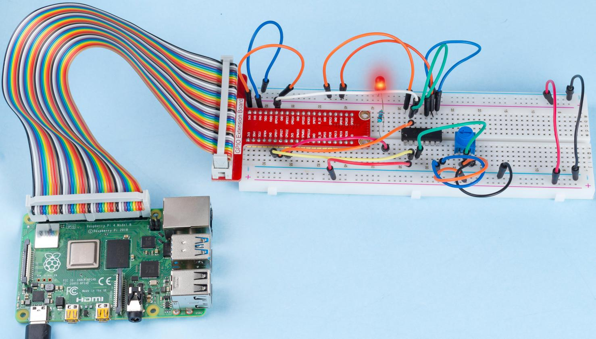

2.1.4 Potentiometer
===================

Introduction
------------

The ADC function can be used to convert analog signals to digital
signals, and in this experiment, ADC0834 is used to get the function
involving ADC. Here, we implement this process by using potentiometer.
Potentiometer changes the physical quantity -- voltage, which is
converted by the ADC function.

Components
----------

.. image:: img/list_2.1.4_potentiometer.png

Principle
---------

**ADC0834**

ADC0834 is an 8-bit `successive
approximation <https://cn.bing.com/dict/search?q=successive approximations&FORM=BDVSP6&mkt=zh-cn>`__
analog-to-digital converter that is equipped with an input-configurable
multichannel multi-plexer and serial input/output. The serial
input/output is configured to interface with standard shift registers or
microprocessors.

**Sequence of Operation**

A conversion is initiated by setting CS low, which enables all logic
circuits. CS must be held low for the complete conversion process. A
clock input is then received from the processor. On each low-to-high
transition of the clock input, the data on DI is clocked into the
multiplexer address shift register. The first logic high on the input is
the start bit. A 3- to 4-bit assignment word follows the start bit. On
each successive low-to-high transition of the clock input, the start bit
and assignment word are shifted through the shift register. When the
start bit is shifted into the start location of the multiplexer
register, the input channel is selected and conversion starts. The SAR
Statu output (SARS) goes high to indicate that a conversion is in
progress, and DI to the multiplexer shift register is disabled the
duration of the conversion.

An interval of one clock period is automatically inserted to allow the
selected multiplexed channel to settle. The data output DO comes out of
the high-impedance state and provides a leading low for this one clock
period of multiplexer settling time. The SAR comparator compares
successive outputs from the resistive ladder with the incoming analog
signal. The comparator output indicates whether the analog input is
greater than or less than the resistive ladder output. As the conversion
proceeds, conversion data is simultaneously output from the DO output
pin, with the most significant bit (MSB) first.

After eight clock periods, the conversion is complete and the SARS
output goes low. Finally outputs the least-significant-bit-first data
after the MSB-first data stream.

**ADC0834 MUX ADDRESS CONTROL LOGIC TABLE**

.. image:: img/image176.png
    :width: 800
    :align: center

**Potentiometer**

Potentiometer is also a resistance component with 3 terminals and its
resistance value can be adjusted according to some regular variation.
Potentiometer usually consists of resistor and movable brush. When the
brush is moving along the resistor, there is a certain resistance or
voltage output depending on the displacement.

The functions of the potentiometer in the circuit are as follows:

1. Serving as a voltage divider

Potentiometer is a continuously adjustable resistor. When you adjust the
shaft or sliding handle of the potentiometer, the movable contact will
slide on the resistor. At this point, a voltage can be output depending
on the voltage applied onto the potentiometer and the angle the movable
arm has rotated to or the distance it moves.

Schematic Diagram
-----------------

Experimental Procedures
-----------------------

**Step 1:** Build the circuit.

.. note::
    Please place the chip by referring to the corresponding position
    depicted in the picture. Note that the grooves on the chip should be on
    the left when it is placed.

For C Language Users
^^^^^^^^^^^^^^^^^^^^

**Step 2:** Open the code file.

.. raw:: html

   <run></run>

.. code-block::

    cd ~/davinci-kit-for-raspberry-pi/c/2.1.4/

**Step 3:** Compile the code.

.. raw:: html

   <run></run>

.. code-block::

    gcc 2.1.4_Potentiometer.c -lwiringPi

**Step 4:** Run.

.. raw:: html

   <run></run>

.. code-block::

    sudo ./a.out

After the code runs, rotate the knob on the potentiometer, the intensity
of LED will change accordingly.

.. note::

    If it does not work after running, or there is an error prompt: \"wiringPi.h: No such file or directory\", please refer to :ref:`C code is not working?`.

**Code**

.. code-block:: c

    #include <wiringPi.h>
    #include <stdio.h>
    #include <softPwm.h>

    typedef unsigned char uchar;
    typedef unsigned int uint;

    #define     ADC_CS    0
    #define     ADC_CLK   1
    #define     ADC_DIO   2
    #define     LedPin    3

    uchar get_ADC_Result(uint channel)
    {
        uchar i;
        uchar dat1=0, dat2=0;
        int sel = channel > 1 & 1;
        int odd = channel & 1;

        pinMode(ADC_DIO, OUTPUT);
        digitalWrite(ADC_CS, 0);
        // Start bit
        digitalWrite(ADC_CLK,0);
        digitalWrite(ADC_DIO,1);    delayMicroseconds(2);
        digitalWrite(ADC_CLK,1);    delayMicroseconds(2);
    //Single End mode
        digitalWrite(ADC_CLK,0);
        digitalWrite(ADC_DIO,1);    delayMicroseconds(2);
        digitalWrite(ADC_CLK,1);    delayMicroseconds(2);
        // ODD
        digitalWrite(ADC_CLK,0);
        digitalWrite(ADC_DIO,odd);  delayMicroseconds(2);
        digitalWrite(ADC_CLK,1);    delayMicroseconds(2);
        //Select
        digitalWrite(ADC_CLK,0);
        digitalWrite(ADC_DIO,sel);    delayMicroseconds(2);
        digitalWrite(ADC_CLK,1);

        digitalWrite(ADC_DIO,1);    delayMicroseconds(2);
        digitalWrite(ADC_CLK,0);
        digitalWrite(ADC_DIO,1);    delayMicroseconds(2);

        for(i=0;i<8;i++)
        {
            digitalWrite(ADC_CLK,1);    delayMicroseconds(2);
            digitalWrite(ADC_CLK,0);    delayMicroseconds(2);

            pinMode(ADC_DIO, INPUT);
            dat1=dat1<<1 | digitalRead(ADC_DIO);
        }

        for(i=0;i<8;i++)
        {
            dat2 = dat2 | ((uchar)(digitalRead(ADC_DIO))<<i);
            digitalWrite(ADC_CLK,1);    delayMicroseconds(2);
            digitalWrite(ADC_CLK,0);    delayMicroseconds(2);
        }

        digitalWrite(ADC_CS,1);
        pinMode(ADC_DIO, OUTPUT);
        return(dat1==dat2) ? dat1 : 0;
    }

    int main(void)
    {
        uchar analogVal;
        if(wiringPiSetup() == -1){ //when initialize wiring failed,print messageto screen
            printf("setup wiringPi failed !");
            return 1;
        }
        softPwmCreate(LedPin,  0, 100);
        pinMode(ADC_CS,  OUTPUT);
        pinMode(ADC_CLK, OUTPUT);

        while(1){
            analogVal = get_ADC_Result(0);
            printf("Current analogVal : %d\n", analogVal);
            delay(100);
            softPwmWrite(LedPin, analogVal);
            delay(100);
        }
        return 0;
    }

**Code Explanation**

.. code-block:: c

    #define     ADC_CS    0
    #define     ADC_CLK   1
    #define     ADC_DIO   2
    #define     LedPin    3

Define CS, CLK, DIO of ADC0834, and connect them to GPIO0, GPIO1 and
GPIO2 respectively. Then attach LED to GPIO3.

.. code-block:: c

    uchar get_ADC_Result(uint channel)
    {
        uchar i;
        uchar dat1=0, dat2=0;
        int sel = channel > 1 & 1;
        int odd = channel & 1;

        pinMode(ADC_DIO, OUTPUT);
        digitalWrite(ADC_CS, 0);
        // Start bit
        digitalWrite(ADC_CLK,0);
        digitalWrite(ADC_DIO,1);    delayMicroseconds(2);
        digitalWrite(ADC_CLK,1);    delayMicroseconds(2);
    //Single End mode
        digitalWrite(ADC_CLK,0);
        digitalWrite(ADC_DIO,1);    delayMicroseconds(2);
        digitalWrite(ADC_CLK,1);    delayMicroseconds(2);
        // ODD
        digitalWrite(ADC_CLK,0);
        digitalWrite(ADC_DIO,odd);  delayMicroseconds(2);
        digitalWrite(ADC_CLK,1);    delayMicroseconds(2);
        //Select
        digitalWrite(ADC_CLK,0);
        digitalWrite(ADC_DIO,sel);    delayMicroseconds(2);
        digitalWrite(ADC_CLK,1);

        digitalWrite(ADC_DIO,1);    delayMicroseconds(2);
        digitalWrite(ADC_CLK,0);
        digitalWrite(ADC_DIO,1);    delayMicroseconds(2);
        for(i=0;i<8;i++)
        {
            digitalWrite(ADC_CLK,1);    delayMicroseconds(2);
            digitalWrite(ADC_CLK,0);    delayMicroseconds(2);

            pinMode(ADC_DIO, INPUT);
            dat1=dat1<<1 | digitalRead(ADC_DIO);
        }

        for(i=0;i<8;i++)
        {
            dat2 = dat2 | ((uchar)(digitalRead(ADC_DIO))<<i);
            digitalWrite(ADC_CLK,1);    delayMicroseconds(2);
            digitalWrite(ADC_CLK,0);    delayMicroseconds(2);
        }

        digitalWrite(ADC_CS,1);
        pinMode(ADC_DIO, OUTPUT);
        return(dat1==dat2) ? dat1 : 0;
    }

There is a function of ADC0834 to get Analog to Digital Conversion. The
specific workflow is as follows:

.. code-block:: c

    digitalWrite(ADC_CS, 0);

Set CS to low level and start enabling AD conversion.

.. code-block:: c

    // Start bit
    digitalWrite(ADC_CLK,0);
    digitalWrite(ADC_DIO,1);    delayMicroseconds(2);
    digitalWrite(ADC_CLK,1);    delayMicroseconds(2);

When the low-to-high transition of the clock input occurs at the first
time, set DIO to 1 as Start bit. In the following three steps, there are
3 assignment words.

.. code-block:: c

    //Single End mode
    digitalWrite(ADC_CLK,0);
    igitalWrite(ADC_DIO,1);    delayMicroseconds(2);
    gitalWrite(ADC_CLK,1);    delayMicroseconds(2);

As soon as the low-to-high transition of the clock input occurs for the
second time, set DIO to 1 and choose SGL mode.

.. code-block:: c

    // ODD
    digitalWrite(ADC_CLK,0);
    digitalWrite(ADC_DIO,odd);  delayMicroseconds(2);
    digitalWrite(ADC_CLK,1);    delayMicroseconds(2);

Once occurs for the third time, the value of DIO is controlled by the
variable **odd**.

.. code-block:: c

    //Select
    digitalWrite(ADC_CLK,0);
    digitalWrite(ADC_DIO,sel);    delayMicroseconds(2);
    digitalWrite(ADC_CLK,1);

The pulse of CLK converted from low level to high level for the forth
time, the value of DIO is controlled by the variable **sel**.

Under the condition that channel=0, sel=0, odd=0, the operational
formulas concerning **sel** and **odd** are as follows:

.. code-block:: c

    int sel = channel > 1 & 1;
    int odd = channel & 1;

When the condition that channel=1, sel=0, odd=1 is met, please refer to
the following address control logic table. Here CH1 is chosen, and the
start bit is shifted into the start location of the multiplexer register
and conversion starts.

.. code-block:: c

    digitalWrite(ADC_DIO,1);    delayMicroseconds(2);
    digitalWrite(ADC_CLK,0);
    digitalWrite(ADC_DIO,1);    delayMicroseconds(2);

Here, set DIO to 1 twice, please ignore it.

.. code-block:: c

    for(i=0;i<8;i++)
        {
            digitalWrite(ADC_CLK,1);    delayMicroseconds(2);
            digitalWrite(ADC_CLK,0);    delayMicroseconds(2);

            pinMode(ADC_DIO, INPUT);
            dat1=dat1<<1 | digitalRead(ADC_DIO);
        }

In the first for() statement, as soon as the fifth pulse of CLK is
converted from high level to low level, set DIO to input mode. Then the
conversion starts and the converted value is stored in the variable
dat1. After eight clock periods, the conversion is complete.

.. code-block:: c

    for(i=0;i<8;i++)
        {
            dat2 = dat2 | ((uchar)(digitalRead(ADC_DIO))<<i);
            digitalWrite(ADC_CLK,1);    delayMicroseconds(2);
            digitalWrite(ADC_CLK,0);    delayMicroseconds(2);
        }

In the second for() statement, output the converted values via DO after
other eight clock periods and store them in the variable dat2.

.. code-block:: c

    digitalWrite(ADC_CS,1);
    pinMode(ADC_DIO, OUTPUT);
    return(dat1==dat2) ? dat1 : 0;

return(dat1==dat2) ? dat1 : 0 is used to compare the value gotten during
the conversion and the output value. If they are equal to each other,
output the converting value dat1; otherwise, output 0. Here, the
workflow of ADC0834 is complete.

.. code-block:: c

    softPwmCreate(LedPin,  0, 100);

The function is to use software to create a PWM pin, LedPin, then the
initial pulse width is set to 0, and the period of PWM is 100 x 100us.

.. code-block:: c

    while(1){
            analogVal = get_ADC_Result(0);
            printf("Current analogVal : %d\n", analogVal);
            softPwmWrite(LedPin, analogVal);
            delay(100);
        }

In the main program, read the value of channel 0 that has been connected
with a potentiometer. And store the value in the variable analogVal then
write it in LedPin. Now you can see the brightness of LED changing with
the value of the potentiometer.

For Python Users
^^^^^^^^^^^^^^^^

**Step 2:** Open the code file

.. raw:: html

   <run></run>

.. code-block::

    cd ~/davinci-kit-for-raspberry-pi/python/

**Step 3:** Run.

.. raw:: html

   <run></run>

.. code-block::

    sudo python3 2.1.4_Potentiometer.py

After the code runs, rotate the knob on the potentiometer, the intensity
of LED will change accordingly.

**Code**

.. note::

    You can **Modify/Reset/Copy/Run/Stop** the code below. But before that, you need to go to  source code path like ``davinci-kit-for-raspberry-pi/python``. 
    
.. raw:: html

    <run></run>

.. code-block:: python

    import RPi.GPIO as GPIO
    import ADC0834
    import time

    LedPin = 22

    def setup():
        global led_val
        # Set the GPIO modes to BCM Numbering
        GPIO.setmode(GPIO.BCM)
        # Set all LedPin's mode to output and initial level to High(3.3v)
        GPIO.setup(LedPin, GPIO.OUT, initial=GPIO.HIGH)
        ADC0834.setup()
        # Set led as pwm channel and frequece to 2KHz
        led_val = GPIO.PWM(LedPin, 2000)
        # Set all begin with value 0
        led_val.start(0)

    def destroy():
        # Stop all pwm channel
        led_val.stop()
        # Release resource
        GPIO.cleanup()
    def loop():
        while True:
            analogVal = ADC0834.getResult()
            print ('analog value = %d' % analogVal)
            led_val.ChangeDutyCycle(analogVal*100/255)
            time.sleep(0.2)
    if __name__ == '__main__':
        setup()
        try:
            loop()
        except KeyboardInterrupt: # When 'Ctrl+C' is pressed, the program destroy() will be executed.
            destroy()

**Code Explanation**

.. code-block:: python

    import ADC0834

import ADC0834 library. You can check the content of the library by
calling the command nano ADC0834.py.

.. code-block:: python

    def setup():
        global led_val
        # Set the GPIO modes to BCM Numbering
        GPIO.setmode(GPIO.BCM)
        # Set all LedPin's mode to output and initial level to High(3.3v)
        GPIO.setup(LedPin, GPIO.OUT, initial=GPIO.HIGH)
        ADC0834.setup()
        # Set led as pwm channel and frequece to 2KHz
        led_val = GPIO.PWM(LedPin, 2000)

        # Set all begin with value 0
        led_val.start(0)

In setup(), define the naming method as BCM, set LedPin as PWM channel
and render it a frequency of 2Khz.

**ADC0834.setup():** Initialize ADC0834, and connect the defined CS,
CLK, DIO of ADC0834 to GPIO17, GPIO18 and GPIO27 respectively.

.. code-block:: python

    def loop():
        while True:
            res = ADC0834.getResult()
            print ('res = %d' % res)
            R_val = MAP(res, 0, 255, 0, 100)
            led_val.ChangeDutyCycle(R_val)
            time.sleep(0.2)

The function getResult() is used to read the analog values of the four
channels of ADC0834. By default, the function reads the value of CH0,
and if you want to read other channels, please input the channel number
in **( )**, ex. getResult(1).

The function loop() first reads the value of CH0, then assign the value
to the variable res. After that, call the function MAP to map the read
value of potentiometer to 0~100. This step is used to control the duty
cycle of LedPin. Now, you may see that the brightness of LED is changing
with the value of potentiometer.

Phenomenon Picture
------------------

