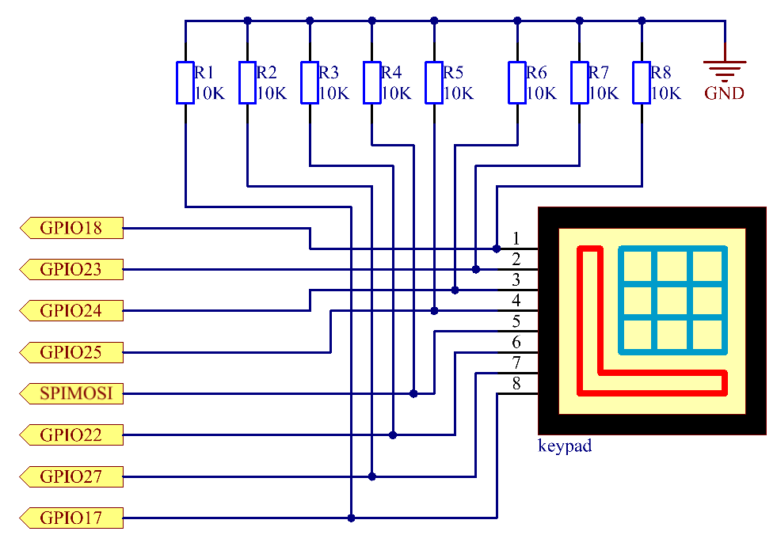
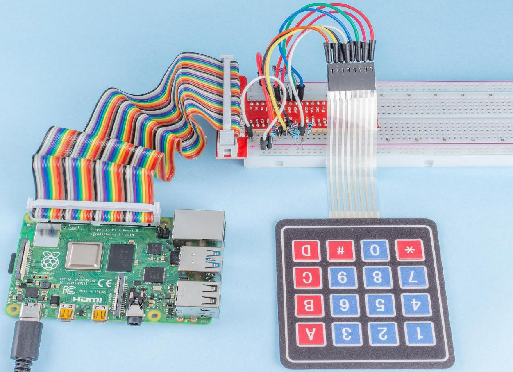

.. note::

    こんにちは、SunFounderのRaspberry Pi & Arduino & ESP32愛好家コミュニティへようこそ！Facebook上でRaspberry Pi、Arduino、ESP32についてもっと深く掘り下げ、他の愛好家と交流しましょう。

    **参加する理由は？**

    - **エキスパートサポート**：コミュニティやチームの助けを借りて、販売後の問題や技術的な課題を解決します。
    - **学び＆共有**：ヒントやチュートリアルを交換してスキルを向上させましょう。
    - **独占的なプレビュー**：新製品の発表や先行プレビューに早期アクセスしましょう。
    - **特別割引**：最新製品の独占割引をお楽しみください。
    - **祭りのプロモーションとギフト**：ギフトや祝日のプロモーションに参加しましょう。

    👉 私たちと一緒に探索し、創造する準備はできていますか？[|link_sf_facebook|]をクリックして今すぐ参加しましょう！

.. _py_keypad:

2.1.5 キーパッド
=================

前書き
------------

キーパッドは、ボタンの長方形の配列である。このプロジェクトでは、入力文字を使用する。

部品
----------

.. image:: media/list_2.1.5_keypad.png

原理
---------

**キーパッド**

キーパッドは12個または16個のOFF-（ON）ボタンの長方形配列である。
リボンケーブルとの接続またはプリント基板への挿入に適したヘッダーを介してそれらの接点にアクセスする。
一部のキーパッドでは、
各ボタンはヘッダーの個別の連絡先に接続されるが、すべてのボタンは共通の接地を共有する。

.. image:: media/image314.png

多くの場合、ボタンはマトリックスエンコードされている。
つまり、各ボタンはマトリックス内の一意のコンダクターペアをブリッジしている。
この構成は、マイクロコントローラーによるポーリングに適し、
4本の水平線のそれぞれに順番に出力パルスを送信するようにプログラムできる。
各パルス中に、残りの4本の垂直ワイヤを順番にチェックして、信号を伝送しているのがどれかを判断する。
信号が存在しない場合にマイクロコントローラの入力が予期しない動作をすることを防ぐため、
入力ワイヤにプルアップまたはプルダウン抵抗を追加してください。

回路図
-----------------

.. image:: media/image315.png

実験手順
-----------------------

ステップ1： 回路を作る。

.. image:: media/image186.png
    :width: 800

C言語ユーザー向け
^^^^^^^^^^^^^^^^^^^^^^

ステップ2： コードファイルを開く。

.. raw:: html

   <run></run>

.. code-block::

    cd ~/davinci-kit-for-raspberry-pi/c/2.1.5/

ステップ3： コードをコンパイルする。

.. raw:: html

   <run></run>

.. code-block::

    gcc 2.1.5_Keypad.cpp -lwiringPi

ステップ4： 実行する。

.. raw:: html

   <run></run>

.. code-block::

    sudo ./a.out

コードの実行後、キーパッドで押されたボタンの値（ボタン値）が画面にプリントされる。

**コード**

.. code-block:: c

    #include <wiringPi.h>
    #include <stdio.h>

    #define ROWS  4 
    #define COLS  4
    #define BUTTON_NUM (ROWS * COLS)

    unsigned char KEYS[BUTTON_NUM] {  
    '1','2','3','A',
    '4','5','6','B',
    '7','8','9','C',
    '*','0','#','D'};

    unsigned char rowPins[ROWS] = {1, 4, 5, 6}; 
    unsigned char colPins[COLS] = {12, 3, 2, 0};

    void keyRead(unsigned char* result);
    bool keyCompare(unsigned char* a, unsigned char* b);
    void keyCopy(unsigned char* a, unsigned char* b);
    void keyPrint(unsigned char* a);
    void keyClear(unsigned char* a);
    int keyIndexOf(const char value);

    void init(void) {
        for(int i=0 ; i<4 ; i++) {
            pinMode(rowPins[i], OUTPUT);
            pinMode(colPins[i], INPUT);
        }
    }

    int main(void){
        unsigned char pressed_keys[BUTTON_NUM];
        unsigned char last_key_pressed[BUTTON_NUM];

        if(wiringPiSetup() == -1){ //when initialize wiring failed,print message to screen
            printf("setup wiringPi failed !");
            return 1; 
        }
        init();
        while(1){
            keyRead(pressed_keys);
            bool comp = keyCompare(pressed_keys, last_key_pressed);
            if (!comp){
                keyPrint(pressed_keys);
                keyCopy(last_key_pressed, pressed_keys);
            }
            delay(100);
        }
        return 0;  
    }

    void keyRead(unsigned char* result){
        int index;
        int count = 0;
        keyClear(result);
        for(int i=0 ; i<ROWS ; i++ ){
            digitalWrite(rowPins[i], HIGH);
            for(int j =0 ; j < COLS ; j++){
                index = i * ROWS + j;
                if(digitalRead(colPins[j]) == 1){
                    result[count]=KEYS[index];
                    count += 1;
                }
            }
            delay(1);
            digitalWrite(rowPins[i], LOW);
        }
    }

    bool keyCompare(unsigned char* a, unsigned char* b){
        for (int i=0; i<BUTTON_NUM; i++){
            if (a[i] != b[i]){
                return false;
            }
        }
        return true;
    }

    void keyCopy(unsigned char* a, unsigned char* b){
        for (int i=0; i<BUTTON_NUM; i++){
            a[i] = b[i];
        }
    }

    void keyPrint(unsigned char* a){
        if (a[0] != 0){
            printf("%c",a[0]);
        }
        for (int i=1; i<BUTTON_NUM; i++){
            if (a[i] != 0){
                printf(", %c",a[i]);
            }
        }
        printf("\n");
    }

    void keyClear(unsigned char* a){
        for (int i=0; i<BUTTON_NUM; i++){
            a[i] = 0;
        }
    }

    int keyIndexOf(const char value){
        for (int i=0; i<BUTTON_NUM; i++){
            if ((const char)KEYS[i] == value){
                return i;
            }
        }
        return -1;
    }

**コードの説明**

.. code-block:: c

    unsigned char KEYS[BUTTON_NUM] {  
    '1','2','3','A',
    '4','5','6','B',
    '7','8','9','C',
    '*','0','#','D'};

    unsigned char rowPins[ROWS] = {1, 4, 5, 6}; 
    unsigned char colPins[COLS] = {12, 3, 2, 0};

マトリックスキーボードの各キーを配列 ``keys[]`` に表示し、各行と列にピンを定義する。

.. code-block:: c

    while(1){
            keyRead(pressed_keys);
            bool comp = keyCompare(pressed_keys, last_key_pressed);
            if (!comp){
                keyPrint(pressed_keys);
                keyCopy(last_key_pressed, pressed_keys);
            }
            delay(100);
        }

これは、ボタン値を読み取り、プリントするメイン関数の一部である。

関数 ``keyRead()`` は、すべてのボタンの状態を読み取る。

``KeyCompare()`` と ``keyCopy()`` は、ボタンの状態が変化したかどうか（つまり、ボタンが押されたか離されたか）を判断するために使用される。

``keyPrint()`` は現在のレベルが高レベル（ボタンが押されている）のボタンのボタン値をプリントする。

.. code-block:: c

    void keyRead(unsigned char* result){
        int index;
        int count = 0;
        keyClear(result);
        for(int i=0 ; i<ROWS ; i++ ){
            digitalWrite(rowPins[i], HIGH);
            for(int j =0 ; j < COLS ; j++){
                index = i * ROWS + j;
                if(digitalRead(colPins[j]) == 1){
                    result[count]=KEYS[index];
                    count += 1;
                }
            }
            delay(1);
            digitalWrite(rowPins[i], LOW);
        }
    }

この関数は各行に順番に高レベルを割り当て、列のキーが押されると、
キーが配置されている列が高レベルになる。two- layer loopの判定後、
キー状態のコンパイルにより配列（ ``reasult[]`` ）が生成される。

ボタン3を押すとき：

.. image:: media/image187.png

``RowPin[0]`` は高レベルで書き込み、
``colPin[2]`` は高レベルになる。
``ColPin[0]`` 、 ``colPin[1]`` 、 ``colPin[3]`` は低レベルになる。

これにより、 ``0,0,1,0`` が得られる。 ``rowPin[1]`` 、 ``rowPin[2]`` 、 ``rowPin[3]`` が高レベルで書き込まれると、
``colPin[0]`` 〜 ``colPin[4]`` は低レベルになる。

ループ判定が完了すると、配列が生成される：

.. code-block:: c

    result[BUTTON_NUM] {  
    0, 0, 1, 0,
    0, 0, 0, 0,
    0, 0, 0, 0,
    0, 0, 0, 0};

.. code-block:: c

    bool keyCompare(unsigned char* a, unsigned char* b){
        for (int i=0; i<BUTTON_NUM; i++){
            if (a[i] != b[i]){
                return false;
            }
        }
        return true;
    }

    void keyCopy(unsigned char* a, unsigned char* b){
        for (int i=0; i<BUTTON_NUM; i++){
            a[i] = b[i];
        }
    }

これら二つの関数は、キーの状態が変化したかどうかを判断するために使用され、たとえば、
「3」または「2」を押したときに手を離すと、 ``keyCompare()`` はfalseを返す。

``KeyCopy() ``はそれぞれの比較後に配列（ ``last_key_pressed[BUTTON_NUM]`` ）
の現在のボタン値を書き換えるために使用される。ですから次回にそれらを比較できる。

.. code-block:: c

    void keyPrint(unsigned char* a){
    //printf("{");
        if (a[0] != 0){
            printf("%c",a[0]);
        }
        for (int i=1; i<BUTTON_NUM; i++){
            if (a[i] != 0){
                printf(", %c",a[i]);
            }
        }
        printf("\n");
    }

この関数は現在押されているボタンの値をプリントするために使用される。
「1」ボタンを押すと、「1」がプリントされる。
ボタン「1」と「3」が押されると、「1、3」がプリントされる。

Python言語ユーザー向け
^^^^^^^^^^^^^^^^^^^^^^^^^

ステップ2： コードファイルを開く。

.. raw:: html

   <run></run>

.. code-block:: 

    cd ~/davinci-kit-for-raspberry-pi/python/

ステップ3： 実行する。

.. raw:: html

   <run></run>

.. code-block:: 

    sudo python3 2.1.5_Keypad.py

コードの実行後、キーパッドで押されたボタンの値（ボタン値）が画面にプリントされる。

**コード**

.. note::

   以下のコードを **変更/リセット/コピー/実行/停止** できます。 ただし、その前に、 ``davinci-kit-for-raspberry-pi/python`` のようなソースコードパスに移動する必要があります。 
    
.. raw:: html

    <run></run>

.. code-block:: python

    import RPi.GPIO as GPIO
    import time

    class Keypad():

        def __init__(self, rowsPins, colsPins, keys):
            self.rowsPins = rowsPins
            self.colsPins = colsPins
            self.keys = keys
            GPIO.setwarnings(False)
            GPIO.setmode(GPIO.BCM)
            GPIO.setup(self.rowsPins, GPIO.OUT, initial=GPIO.LOW)
            GPIO.setup(self.colsPins, GPIO.IN, pull_up_down=GPIO.PUD_DOWN)

        def read(self):
            pressed_keys = []
            for i, row in enumerate(self.rowsPins):
                GPIO.output(row, GPIO.HIGH)
                for j, col in enumerate(self.colsPins):
                    index = i * len(self.colsPins) + j
                    if (GPIO.input(col) == 1):
                        pressed_keys.append(self.keys[index])
                GPIO.output(row, GPIO.LOW)
            return pressed_keys

    def setup():
        global keypad, last_key_pressed
        rowsPins = [18,23,24,25]
        colsPins = [10,22,27,17]
        keys = ["1","2","3","A",
                "4","5","6","B",
                "7","8","9","C",
                "*","0","#","D"]
        keypad = Keypad(rowsPins, colsPins, keys)
        last_key_pressed = []

    def loop():
        global keypad, last_key_pressed
        pressed_keys = keypad.read()
        if len(pressed_keys) != 0 and last_key_pressed != pressed_keys:
            print(pressed_keys)
        last_key_pressed = pressed_keys
        time.sleep(0.1)

    # Define a destroy function for clean up everything after the script finished
    def destroy():
        # Release resource
        GPIO.cleanup() 

    if __name__ == '__main__':     # Program start from here
        try:
            setup()
            while True:
                loop()
        except KeyboardInterrupt:   # When 'Ctrl+C' is pressed, the program destroy() will be executed.
            destroy()

**コードの説明**

.. code-block:: python

    def setup():
        global keypad, last_key_pressed
        rowsPins = [18,23,24,25]
        colsPins = [10,22,27,17]
        keys = ["1","2","3","A",
                "4","5","6","B",
                "7","8","9","C",
                "*","0","#","D"]
        keypad = Keypad(rowsPins, colsPins, keys)
        last_key_pressed = []

マトリックスキーボードの各キーを配列 ``keys[]`` に表示し、各行と列にピンを定義する。

.. code-block:: python

    def loop():
        global keypad, last_key_pressed
        pressed_keys = keypad.read()
        if len(pressed_keys) != 0 and last_key_pressed != pressed_keys:
            print(pressed_keys)
        last_key_pressed = pressed_keys
        time.sleep(0.1)

これは、ボタン値を読み取り、プリントするメイン関数の一部である。

関数 ``keyRead()`` は、すべてのボタンの状態を読み取る。

``if len(pressed_keys)!= 0`` と ``last_key_pressed != Pressed_keys`` のステートメントは、

キーが押されたかどうか、押されたボタンの状態を判断するために使用される。（「1」を押したときに「3」を押した場合、判断は受け入れられる。）

条件が主張できる場合、現在押されているキーの値をプリントする。

ステートメント ``last_key_pressed = pressed_keys`` は、それぞれの判断の状態を配列 ``last_key_pressed`` に割り当て、次の条件判断を容易にする。

.. code-block:: python

    def read(self):
            pressed_keys = []
            for i, row in enumerate(self.rowsPins):
                GPIO.output(row, GPIO.HIGH)
                for j, col in enumerate(self.colsPins):
                    index = i * len(self.colsPins) + j
                    if (GPIO.input(col) == 1):
                        pressed_keys.append(self.keys[index])
                GPIO.output(row, GPIO.LOW)
            return pressed_keys

この関数は各行に順番に高レベルを割り当て、列のボタンが押されると、
キーが配置されている列が高レベルになる。
2層ループが判定された後、状態が1のボタンの値は、 ``pressed_keys`` 配列に保存される。

キー「3」を押すと：

.. image:: media/image187.png

``rowPins[0]`` は高レベルで書き込まれ、 ``colPins[2]`` は高レベルになり。

``colPins[0]`` 、 ``colPins[1]`` 、 ``colPins[3]`` は低レベルになる。

4つの状態がある： ``0、0、1、0`` 。そして、 ``pressed_keys`` に「3」を書き込む。

``rowPins[1]`` 、 ``rowPins[2]`` 、 ``rowPins[3]`` が高レベルに書き込まれると、 ``colPins[0]`` 〜 ``colPins[4]`` は低レベルになる。

ループが停止し、 ``pressed_keys = '3'`` が返される。

ボタン「1」と「3」を押すと、 ``pressed_keys =['1'、'3']`` が返される。

現象画像
------------------

