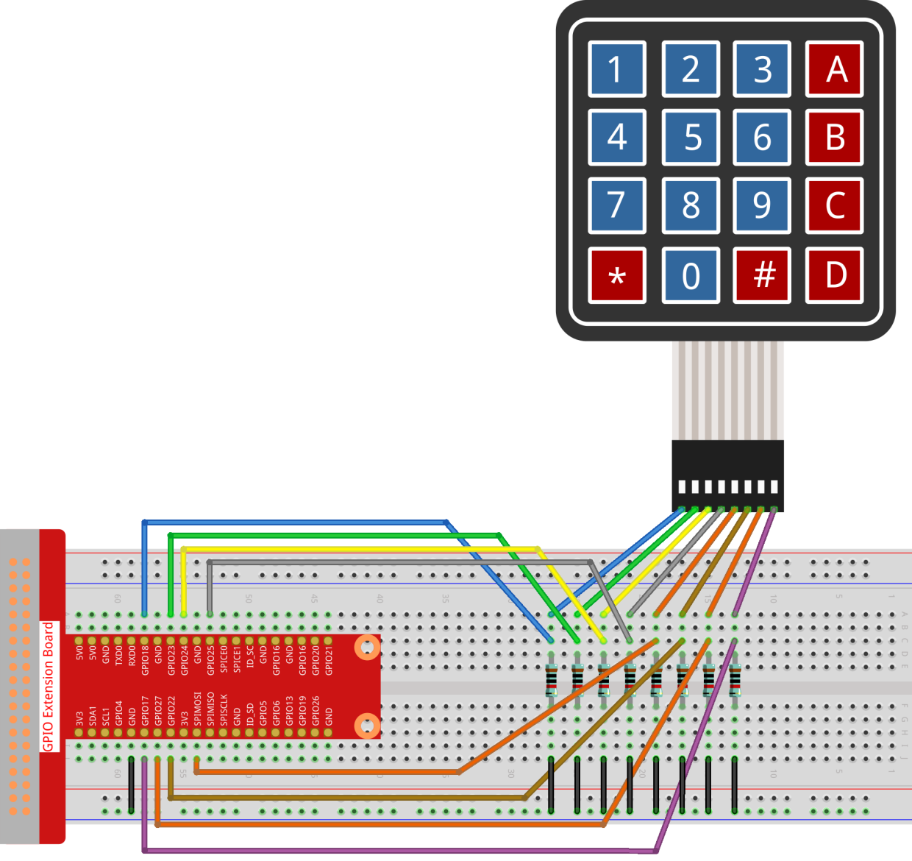

2.1.5 Keypad
============

Introduction
------------

A keypad is a rectangular array of buttons. In this project, We will use
it input characters.

Components
----------

.. image:: img/list_2.1.5_keypad.png

Principle
---------

**Keypad**

A keypad is a rectangular array of 12 or 16 OFF-(ON) buttons. Their
contacts are accessed via a header suitable for connection with a ribbon
cable or insertion into a printed circuit board. In some keypads, each
button connects with a separate contact in the header, while all the
buttons share a common ground.

.. image:: img/image314.png

More often, the buttons are matrix encoded, meaning that each of them
bridges a unique pair of conductors in a matrix. This configuration is
suitable for polling by a microcontroller, which can be programmed to
send an output pulse to each of the four horizontal wires in turn.
During each pulse, it checks the remaining four vertical wires in
sequence, to determine which one, if any, is carrying a signal. Pullup
or pulldown resistors should be added to the input wires to prevent the
inputs of the microcontroller from behaving unpredictably when no signal
is present.

Schematic Diagram
-----------------

.. image:: img/image315.png

.. image:: img/image316.png

Experimental Procedures
-----------------------

**Step 1:** Build the circuit.

For C Language Users
^^^^^^^^^^^^^^^^^^^^^^

**Step 2:** Open the code file.

.. raw:: html

   <run></run>

.. code-block::

    cd ~/davinci-kit-for-raspberry-pi/c/2.1.5/

**Step 3:** Compile the code.

.. raw:: html

   <run></run>

.. code-block::

    gcc 2.1.5_Keypad.cpp -lwiringPi

**Step 4:** Run.

.. raw:: html

   <run></run>

.. code-block::

    sudo ./a.out

After the code runs, the values of pressed buttons on keypad (button
Value) will be printed on the screen.

.. note::

    If it does not work after running, or there is an error prompt: \"wiringPi.h: No such file or directory\", please refer to :ref:`C code is not working?`.
    
**Code**

.. code-block:: c

    #include <wiringPi.h>
    #include <stdio.h>

    #define ROWS  4 
    #define COLS  4
    #define BUTTON_NUM (ROWS * COLS)

    unsigned char KEYS[BUTTON_NUM] {  
    '1','2','3','A',
    '4','5','6','B',
    '7','8','9','C',
    '*','0','#','D'};

    unsigned char rowPins[ROWS] = {1, 4, 5, 6}; 
    unsigned char colPins[COLS] = {12, 3, 2, 0};

    void keyRead(unsigned char* result);
    bool keyCompare(unsigned char* a, unsigned char* b);
    void keyCopy(unsigned char* a, unsigned char* b);
    void keyPrint(unsigned char* a);
    void keyClear(unsigned char* a);
    int keyIndexOf(const char value);

    void init(void) {
        for(int i=0 ; i<4 ; i++) {
            pinMode(rowPins[i], OUTPUT);
            pinMode(colPins[i], INPUT);
        }
    }

    int main(void){
        unsigned char pressed_keys[BUTTON_NUM];
        unsigned char last_key_pressed[BUTTON_NUM];

        if(wiringPiSetup() == -1){ //when initialize wiring failed,print message to screen
            printf("setup wiringPi failed !");
            return 1; 
        }
        init();
        while(1){
            keyRead(pressed_keys);
            bool comp = keyCompare(pressed_keys, last_key_pressed);
            if (!comp){
                keyPrint(pressed_keys);
                keyCopy(last_key_pressed, pressed_keys);
            }
            delay(100);
        }
        return 0;  
    }

    void keyRead(unsigned char* result){
        int index;
        int count = 0;
        keyClear(result);
        for(int i=0 ; i<ROWS ; i++ ){
            digitalWrite(rowPins[i], HIGH);
            for(int j =0 ; j < COLS ; j++){
                index = i * ROWS + j;
                if(digitalRead(colPins[j]) == 1){
                    result[count]=KEYS[index];
                    count += 1;
                }
            }
            delay(1);
            digitalWrite(rowPins[i], LOW);
        }
    }

    bool keyCompare(unsigned char* a, unsigned char* b){
        for (int i=0; i<BUTTON_NUM; i++){
            if (a[i] != b[i]){
                return false;
            }
        }
        return true;
    }

    void keyCopy(unsigned char* a, unsigned char* b){
        for (int i=0; i<BUTTON_NUM; i++){
            a[i] = b[i];
        }
    }

    void keyPrint(unsigned char* a){
        if (a[0] != 0){
            printf("%c",a[0]);
        }
        for (int i=1; i<BUTTON_NUM; i++){
            if (a[i] != 0){
                printf(", %c",a[i]);
            }
        }
        printf("\n");
    }

    void keyClear(unsigned char* a){
        for (int i=0; i<BUTTON_NUM; i++){
            a[i] = 0;
        }
    }

    int keyIndexOf(const char value){
        for (int i=0; i<BUTTON_NUM; i++){
            if ((const char)KEYS[i] == value){
                return i;
            }
        }
        return -1;
    }

**Code Explanation**

.. code-block:: c

    unsigned char KEYS[BUTTON_NUM] {  
    '1','2','3','A',
    '4','5','6','B',
    '7','8','9','C',
    '*','0','#','D'};

    unsigned char rowPins[ROWS] = {1, 4, 5, 6}; 
    unsigned char colPins[COLS] = {12, 3, 2, 0};

Declare each key of the matrix keyboard to the array keys[] and define
the pins on each row and column.

.. code-block:: c

    while(1){
            keyRead(pressed_keys);
            bool comp = keyCompare(pressed_keys, last_key_pressed);
            if (!comp){
                keyPrint(pressed_keys);
                keyCopy(last_key_pressed, pressed_keys);
            }
            delay(100);
        }

This is the part of the main function that reads and prints the button
value.

The function keyRead() will read the state of every button.

KeyCompare() and keyCopy() are used to judge whether the state of a
button has changed (that is, a button has been pressed or released).

keyPrint() will print the button value of the button whose current level
is high level (the button is pressed).

.. code-block:: c

    void keyRead(unsigned char* result){
        int index;
        int count = 0;
        keyClear(result);
        for(int i=0 ; i<ROWS ; i++ ){
            digitalWrite(rowPins[i], HIGH);
            for(int j =0 ; j < COLS ; j++){
                index = i * ROWS + j;
                if(digitalRead(colPins[j]) == 1){
                    result[count]=KEYS[index];
                    count += 1;
                }
            }
            delay(1);
            digitalWrite(rowPins[i], LOW);
        }
    }

This function assigns a high level to each row in turn, and when the key
in the column is pressed, the column in which the key is located gets a
high level. After the two-layer loop judgment, the key state compilation
will generate an array (reasult[]).

When pressing button 3:

.. image:: img/image187.png

RowPin [0] writes in the high level, and colPin[2] gets the high level.
ColPin [0], colPin[1], colPin[3] get the low level.

This gives us 0,0,1,0. When rowPin[1], rowPin[2] and rowPin[3] are
written in high level, colPin[0]~colPin[4] will get low level.

After the loop judgment is completed, an array will be generated:

.. code-block:: c

    result[BUTTON_NUM] {  
    0, 0, 1, 0,
    0, 0, 0, 0,
    0, 0, 0, 0,
    0, 0, 0, 0};

.. code-block:: c

    bool keyCompare(unsigned char* a, unsigned char* b){
        for (int i=0; i<BUTTON_NUM; i++){
            if (a[i] != b[i]){
                return false;
            }
        }
        return true;
    }

    void keyCopy(unsigned char* a, unsigned char* b){
        for (int i=0; i<BUTTON_NUM; i++){
            a[i] = b[i];
        }
    }

These two functions are used to judge whether the key state has changed,
for example when you release your hand when pressing \'3\' or pressing
\'2\', keyCompare() returns false.

KeyCopy() is used to re-write the current button value for the a array
(last_key_pressed[BUTTON_NUM]) after each comparison. So we can compare
them next time.

.. code-block:: c

    void keyPrint(unsigned char* a){
    //printf("{");
        if (a[0] != 0){
            printf("%c",a[0]);
        }
        for (int i=1; i<BUTTON_NUM; i++){
            if (a[i] != 0){
                printf(", %c",a[i]);
            }
        }
        printf("\n");
    }

This function is used to print the value of the button currently
pressed. If the button \'1\' is pressed, the \'1\' will be printed. If the
button \'1\' is pressed and the button \'3\' is pressed, the \'1, 3\' will be
printed.

For Python Language Users
^^^^^^^^^^^^^^^^^^^^^^^^^

**Step 2:** Open the code file.

.. raw:: html

   <run></run>

.. code-block:: 

    cd ~/davinci-kit-for-raspberry-pi/python/

**Step 3:** Run.

.. raw:: html

   <run></run>

.. code-block:: 

    sudo python3 2.1.5_Keypad.py

After the code runs, the values of pressed buttons on keypad (button
Value) will be printed on the screen.

**Code**

.. note::

    You can **Modify/Reset/Copy/Run/Stop** the code below. But before that, you need to go to  source code path like ``davinci-kit-for-raspberry-pi/python``. 
    
.. raw:: html

    <run></run>

.. code-block:: python

    import RPi.GPIO as GPIO
    import time

    class Keypad():

        def __init__(self, rowsPins, colsPins, keys):
            self.rowsPins = rowsPins
            self.colsPins = colsPins
            self.keys = keys
            GPIO.setwarnings(False)
            GPIO.setmode(GPIO.BCM)
            GPIO.setup(self.rowsPins, GPIO.OUT, initial=GPIO.LOW)
            GPIO.setup(self.colsPins, GPIO.IN, pull_up_down=GPIO.PUD_DOWN)

        def read(self):
            pressed_keys = []
            for i, row in enumerate(self.rowsPins):
                GPIO.output(row, GPIO.HIGH)
                for j, col in enumerate(self.colsPins):
                    index = i * len(self.colsPins) + j
                    if (GPIO.input(col) == 1):
                        pressed_keys.append(self.keys[index])
                GPIO.output(row, GPIO.LOW)
            return pressed_keys

    def setup():
        global keypad, last_key_pressed
        rowsPins = [18,23,24,25]
        colsPins = [10,22,27,17]
        keys = ["1","2","3","A",
                "4","5","6","B",
                "7","8","9","C",
                "*","0","#","D"]
        keypad = Keypad(rowsPins, colsPins, keys)
        last_key_pressed = []

    def loop():
        global keypad, last_key_pressed
        pressed_keys = keypad.read()
        if len(pressed_keys) != 0 and last_key_pressed != pressed_keys:
            print(pressed_keys)
        last_key_pressed = pressed_keys
        time.sleep(0.1)

    # Define a destroy function for clean up everything after the script finished
    def destroy():
        # Release resource
        GPIO.cleanup() 

    if __name__ == '__main__':     # Program start from here
        try:
            setup()
            while True:
                loop()
        except KeyboardInterrupt:   # When 'Ctrl+C' is pressed, the program destroy() will be executed.
            destroy()

**Code Explanation**

.. code-block:: python

    def setup():
        global keypad, last_key_pressed
        rowsPins = [18,23,24,25]
        colsPins = [10,22,27,17]
        keys = ["1","2","3","A",
                "4","5","6","B",
                "7","8","9","C",
                "*","0","#","D"]
        keypad = Keypad(rowsPins, colsPins, keys)
        last_key_pressed = []

Declare each key of the matrix keyboard to the array keys[] and define
the pins on each row and column.

.. code-block:: python

    def loop():
        global keypad, last_key_pressed
        pressed_keys = keypad.read()
        if len(pressed_keys) != 0 and last_key_pressed != pressed_keys:
            print(pressed_keys)
        last_key_pressed = pressed_keys
        time.sleep(0.1)

This is the part of the main function that reads and prints the button
value.

The function keyRead() will read the state of every button.

The statement if len(pressed_keys) != 0 and last_key_pressed !=
pressed_keys is used to judge

whether a key is pressed and the state of the pressed button. (If you
press \'3\' when you press \'1\', the judgement is tenable.)

Prints the value of the currently pressed key when the condition is
tenable.

The statement last_key_pressed = pressed_keys assigns the state of each
judgment to an array last_key_pressed to facilitate the next round of
conditional judgment.

.. code-block:: python

    def read(self):
            pressed_keys = []
            for i, row in enumerate(self.rowsPins):
                GPIO.output(row, GPIO.HIGH)
                for j, col in enumerate(self.colsPins):
                    index = i * len(self.colsPins) + j
                    if (GPIO.input(col) == 1):
                        pressed_keys.append(self.keys[index])
                GPIO.output(row, GPIO.LOW)
            return pressed_keys

This function assigns a high level to each row in turn, and when the
button in the column is pressed, the column in which the key is located
gets a high level. After the two-layer loop is judged, the value of the
button whose state is 1 is stored in the array pressed_keys.

If you press the key \'3\':

.. image:: img/image187.png

rowPins[0] is written in high level, and colPins[2] gets high level.

colPins[0]、colPins[1]、colPins[3] get low level.

There are four states:0, 0, 1, 0; and we write \'3\' into pressed_keys.

When rowPins[1] , rowPins[2] , rowPins[3] are written into high level,
colPins[0] ~ colPins[4] get low level.

The loop stopped, there returns pressed_keys = \'3\'.

If you press the buttons \'1\' and \'3\', there will return pressed_keys =
[\'1\',\'3\'].

Phenomenon Picture
------------------

.. image:: img/image188.jpeg

