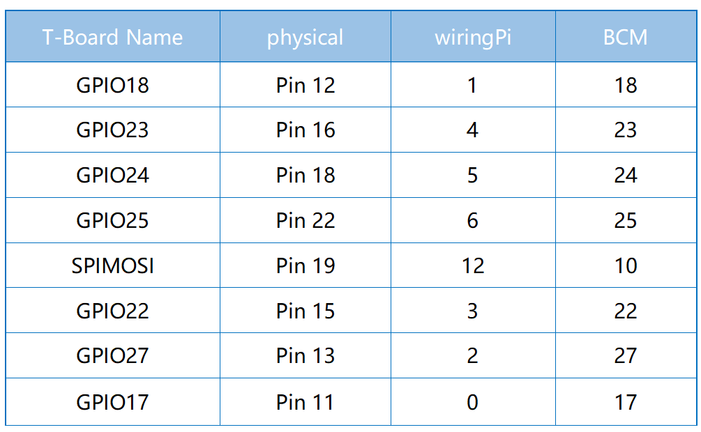

.. note::

    ¡Hola! Bienvenido a la comunidad de entusiastas de SunFounder Raspberry Pi, Arduino y ESP32 en Facebook. Sumérgete en el mundo de Raspberry Pi, Arduino y ESP32 junto a otros apasionados.

    **¿Por qué unirse?**

    - **Soporte Experto**: Resuelve problemas postventa y desafíos técnicos con la ayuda de nuestra comunidad y equipo.
    - **Aprende y Comparte**: Intercambia consejos y tutoriales para mejorar tus habilidades.
    - **Vista Exclusiva**: Obtén acceso anticipado a anuncios de nuevos productos y adelantos.
    - **Descuentos Especiales**: Disfruta de descuentos exclusivos en nuestros productos más recientes.
    - **Promociones y Sorteos Festivos**: Participa en sorteos y promociones especiales por festividades.

     👉 ¿Listo para explorar y crear con nosotros? Haz clic en [|link_sf_facebook|] y únete hoy mismo.

2.1.5 Keypad
================

Introducción
---------------

Un teclado es una matriz rectangular de botones. En este proyecto, 
lo usaremos para ingresar caracteres.

Componentes
--------------

.. image:: img/list_2.1.5_keypad.png

Principio
--------------

**Teclado**

Un teclado es una matriz rectangular de 12 o 16 botones OFF-(ON). 
Sus contactos están disponibles a través de un conector adecuado para 
conexión con un cable de cinta o para insertar en una placa de circuito 
impreso. En algunos teclados, cada botón conecta un contacto separado en 
el conector, mientras que todos los botones comparten una conexión a tierra común.

.. image:: img/image314.png

Con frecuencia, los botones están codificados en una matriz, lo que significa 
que cada uno conecta un par único de conductores en la matriz. Esta configuración 
es ideal para ser sondeada por un microcontrolador, que puede ser programado 
para enviar un pulso de salida a cada uno de los cuatro cables horizontales por 
turno. Durante cada pulso, verifica los otros cuatro cables verticales en 
secuencia para determinar cuál, si alguno, está llevando una señal. Se deben 
agregar resistencias de pull-up o pull-down a los cables de entrada para evitar 
que los pines de entrada del microcontrolador tengan un comportamiento impredecible 
cuando no haya señal.

Diagrama Esquemático
-----------------------

.. image:: img/image316.png

Procedimientos Experimentales
----------------------------------

**Paso 1:** Construye el circuito.

.. image:: img/image186.png
    :width: 800

Para Usuarios de Lenguaje C
^^^^^^^^^^^^^^^^^^^^^^^^^^^^^^

**Paso 2:** Abre el archivo de código.

.. raw:: html

   <run></run>

.. code-block::

    cd ~/davinci-kit-for-raspberry-pi/c/2.1.5/

**Paso 3:** Compila el código.

.. raw:: html

   <run></run>

.. code-block::

    gcc 2.1.5_Keypad.cpp -lwiringPi

**Paso 4:** Ejecuta.

.. raw:: html

   <run></run>

.. code-block::

    sudo ./a.out

Después de ejecutar el código, los valores de las teclas presionadas en 
el teclado (Valor del Botón) se imprimirán en la pantalla.

.. note::

    Si el programa no funciona después de ejecutarlo o aparece un mensaje 
    de error: \"wiringPi.h: No such file or directory\", por favor consulta: :ref:`C code is not working?`.
    
**Código**

.. code-block:: c

    #include <wiringPi.h>
    #include <stdio.h>

    #define ROWS  4 
    #define COLS  4
    #define BUTTON_NUM (ROWS * COLS)

    unsigned char KEYS[BUTTON_NUM] {  
    '1','2','3','A',
    '4','5','6','B',
    '7','8','9','C',
    '*','0','#','D'};

    unsigned char rowPins[ROWS] = {1, 4, 5, 6}; 
    unsigned char colPins[COLS] = {12, 3, 2, 0};

    void keyRead(unsigned char* result);
    bool keyCompare(unsigned char* a, unsigned char* b);
    void keyCopy(unsigned char* a, unsigned char* b);
    void keyPrint(unsigned char* a);
    void keyClear(unsigned char* a);
    int keyIndexOf(const char value);

    void init(void) {
        for(int i=0 ; i<4 ; i++) {
            pinMode(rowPins[i], OUTPUT);
            pinMode(colPins[i], INPUT);
        }
    }

    int main(void){
        unsigned char pressed_keys[BUTTON_NUM];
        unsigned char last_key_pressed[BUTTON_NUM];

        if(wiringPiSetup() == -1){ //cuando la inicialización de wiring falla, muestra mensaje en pantalla
            printf("setup wiringPi failed !");
            return 1; 
        }
        init();
        while(1){
            keyRead(pressed_keys);
            bool comp = keyCompare(pressed_keys, last_key_pressed);
            if (!comp){
                keyPrint(pressed_keys);
                keyCopy(last_key_pressed, pressed_keys);
            }
            delay(100);
        }
        return 0;  
    }

    void keyRead(unsigned char* result){
        int index;
        int count = 0;
        keyClear(result);
        for(int i=0 ; i<ROWS ; i++ ){
            digitalWrite(rowPins[i], HIGH);
            for(int j =0 ; j < COLS ; j++){
                index = i * ROWS + j;
                if(digitalRead(colPins[j]) == 1){
                    result[count]=KEYS[index];
                    count += 1;
                }
            }
            delay(1);
            digitalWrite(rowPins[i], LOW);
        }
    }

    bool keyCompare(unsigned char* a, unsigned char* b){
        for (int i=0; i<BUTTON_NUM; i++){
            if (a[i] != b[i]){
                return false;
            }
        }
        return true;
    }

    void keyCopy(unsigned char* a, unsigned char* b){
        for (int i=0; i<BUTTON_NUM; i++){
            a[i] = b[i];
        }
    }

    void keyPrint(unsigned char* a){
        if (a[0] != 0){
            printf("%c",a[0]);
        }
        for (int i=1; i<BUTTON_NUM; i++){
            if (a[i] != 0){
                printf(", %c",a[i]);
            }
        }
        printf("\n");
    }

    void keyClear(unsigned char* a){
        for (int i=0; i<BUTTON_NUM; i++){
            a[i] = 0;
        }
    }

    int keyIndexOf(const char value){
        for (int i=0; i<BUTTON_NUM; i++){
            if ((const char)KEYS[i] == value){
                return i;
            }
        }
        return -1;
    }
**Explicación del Código**

.. code-block:: c

    unsigned char KEYS[BUTTON_NUM] {  
    '1','2','3','A',
    '4','5','6','B',
    '7','8','9','C',
    '*','0','#','D'};

    unsigned char rowPins[ROWS] = {1, 4, 5, 6}; 
    unsigned char colPins[COLS] = {12, 3, 2, 0};

Declara cada tecla de la matriz del teclado en el array `KEYS[]` y define los pines en cada fila y columna.

.. code-block:: c

    while(1){
            keyRead(pressed_keys);
            bool comp = keyCompare(pressed_keys, last_key_pressed);
            if (!comp){
                keyPrint(pressed_keys);
                keyCopy(last_key_pressed, pressed_keys);
            }
            delay(100);
        }

Esta es la parte de la función principal que lee e imprime el valor del botón.

La función `keyRead()` leerá el estado de cada botón.

`keyCompare()` y `keyCopy()` se utilizan para verificar si el estado de un botón 
ha cambiado (es decir, si un botón ha sido presionado o liberado).

`keyPrint()` imprimirá el valor del botón que actualmente tiene un nivel alto 
(el botón está presionado).

.. code-block:: c

    void keyRead(unsigned char* result){
        int index;
        int count = 0;
        keyClear(result);
        for(int i=0 ; i<ROWS ; i++ ){
            digitalWrite(rowPins[i], HIGH);
            for(int j =0 ; j < COLS ; j++){
                index = i * ROWS + j;
                if(digitalRead(colPins[j]) == 1){
                    result[count]=KEYS[index];
                    count += 1;
                }
            }
            delay(1);
            digitalWrite(rowPins[i], LOW);
        }
    }

Esta función asigna un nivel alto a cada fila por turno, y cuando el botón en 
la columna es presionado, la columna en la que se encuentra el botón obtiene 
un nivel alto. Después del juicio del bucle de dos capas, la compilación del 
estado del botón generará un array (`result[]`).

Al presionar el botón 3:

.. image:: img/image187.png

`RowPin[0]` escribe en el nivel alto, y `colPin[2]` obtiene el nivel alto. 
`colPin[0]`, `colPin[1]`, `colPin[3]` obtienen el nivel bajo.

Esto nos da 0,0,1,0. Cuando `rowPin[1]`, `rowPin[2]` y `rowPin[3]` están en 
nivel alto, `colPin[0]~colPin[4]` tendrán nivel bajo.

Después de completar el juicio del bucle, se generará un array:

.. code-block:: c

    result[BUTTON_NUM] {  
    0, 0, 1, 0,
    0, 0, 0, 0,
    0, 0, 0, 0,
    0, 0, 0, 0};

.. code-block:: c

    bool keyCompare(unsigned char* a, unsigned char* b){
        for (int i=0; i<BUTTON_NUM; i++){
            if (a[i] != b[i]){
                return false;
            }
        }
        return true;
    }

    void keyCopy(unsigned char* a, unsigned char* b){
        for (int i=0; i<BUTTON_NUM; i++){
            a[i] = b[i];
        }
    }

Estas dos funciones se utilizan para verificar si el estado de la tecla ha 
cambiado; por ejemplo, cuando liberas la tecla \'3\' o presionas \'2\', 
`keyCompare()` devuelve `false`.

`KeyCopy()` se utiliza para reescribir el valor actual del botón en el array 
`a` (`last_key_pressed[BUTTON_NUM]`) después de cada comparación, para que 
podamos compararlos la próxima vez.

.. code-block:: c

    void keyPrint(unsigned char* a){
    //printf("{");
        if (a[0] != 0){
            printf("%c",a[0]);
        }
        for (int i=1; i<BUTTON_NUM; i++){
            if (a[i] != 0){
                printf(", %c",a[i]);
            }
        }
        printf("\n");
    }

Esta función se usa para imprimir el valor del botón presionado actualmente. 
Si se presiona el botón \'1\', se imprimirá \'1\'. Si se presiona el botón 
\'1\' y luego el botón \'3\', se imprimirá \'1, 3\'.

Para Usuarios de Lenguaje Python
^^^^^^^^^^^^^^^^^^^^^^^^^^^^^^^^^^^^^^^^

**Paso 2:** Abre el archivo de código.

.. raw:: html

   <run></run>

.. code-block:: 

    cd ~/davinci-kit-for-raspberry-pi/python/

**Paso 3:** Ejecuta.

.. raw:: html

   <run></run>

.. code-block:: 

    sudo python3 2.1.5_Keypad.py

Después de ejecutar el código, los valores de las teclas presionadas en el 
teclado (valor del botón) se imprimirán en la pantalla.

**Código**

.. note::

    Puedes **Modificar/Restablecer/Copiar/Ejecutar/Detener** el código a continuación. Pero antes de eso, debes ir a la ruta del código fuente como ``davinci-kit-for-raspberry-pi/python``.
    
.. raw:: html

    <run></run>

.. code-block:: python

    import RPi.GPIO as GPIO
    import time

    class Keypad():

        def __init__(self, rowsPins, colsPins, keys):
            self.rowsPins = rowsPins
            self.colsPins = colsPins
            self.keys = keys
            GPIO.setwarnings(False)
            GPIO.setmode(GPIO.BCM)
            GPIO.setup(self.rowsPins, GPIO.OUT, initial=GPIO.LOW)
            GPIO.setup(self.colsPins, GPIO.IN, pull_up_down=GPIO.PUD_DOWN)

        def read(self):
            pressed_keys = []
            for i, row in enumerate(self.rowsPins):
                GPIO.output(row, GPIO.HIGH)
                for j, col in enumerate(self.colsPins):
                    index = i * len(self.colsPins) + j
                    if (GPIO.input(col) == 1):
                        pressed_keys.append(self.keys[index])
                GPIO.output(row, GPIO.LOW)
            return pressed_keys

    def setup():
        global keypad, last_key_pressed
        rowsPins = [18,23,24,25]
        colsPins = [10,22,27,17]
        keys = ["1","2","3","A",
                "4","5","6","B",
                "7","8","9","C",
                "*","0","#","D"]
        keypad = Keypad(rowsPins, colsPins, keys)
        last_key_pressed = []

    def loop():
        global keypad, last_key_pressed
        pressed_keys = keypad.read()
        if len(pressed_keys) != 0 and last_key_pressed != pressed_keys:
            print(pressed_keys)
        last_key_pressed = pressed_keys
        time.sleep(0.1)

    # Define una función de limpieza para liberar todos los recursos al finalizar el script
    def destroy():
        # Liberar recursos
        GPIO.cleanup() 

    if __name__ == '__main__':     # El programa comienza aquí
        try:
            setup()
            while True:
                loop()
        except KeyboardInterrupt:   # Cuando se presiona 'Ctrl+C', se ejecutará la función destroy()
            destroy()

**Explicación del Código**

.. code-block:: python

    def setup():
        global keypad, last_key_pressed
        rowsPins = [18,23,24,25]
        colsPins = [10,22,27,17]
        keys = ["1","2","3","A",
                "4","5","6","B",
                "7","8","9","C",
                "*","0","#","D"]
        keypad = Keypad(rowsPins, colsPins, keys)
        last_key_pressed = []

Declara cada tecla del teclado matricial en el array `keys[]` y define los 
pines en cada fila y columna.

.. code-block:: python

    def loop():
        global keypad, last_key_pressed
        pressed_keys = keypad.read()
        if len(pressed_keys) != 0 and last_key_pressed != pressed_keys:
            print(pressed_keys)
        last_key_pressed = pressed_keys
        time.sleep(0.1)

Esta es la parte de la función principal que lee e imprime el valor del botón.

La función `keyRead()` leerá el estado de cada botón.

La instrucción `if len(pressed_keys) != 0 and last_key_pressed != pressed_keys` 
se utiliza para determinar si se ha presionado una tecla y si el estado del 
botón ha cambiado. (Si presionas \'3\' después de haber presionado \'1\', la 
evaluación será verdadera.)

Imprime el valor de la tecla actualmente presionada cuando la condición es verdadera.

La instrucción `last_key_pressed = pressed_keys` asigna el estado de cada juicio al 
array `last_key_pressed` para facilitar la próxima evaluación condicional.

.. code-block:: python

    def read(self):
            pressed_keys = []
            for i, row in enumerate(self.rowsPins):
                GPIO.output(row, GPIO.HIGH)
                for j, col in enumerate(self.colsPins):
                    index = i * len(self.colsPins) + j
                    if (GPIO.input(col) == 1):
                        pressed_keys.append(self.keys[index])
                GPIO.output(row, GPIO.LOW)
            return pressed_keys

Esta función asigna un nivel alto a cada fila por turno, y cuando se presiona 
el botón en la columna, la columna en la que se encuentra el botón obtiene un 
nivel alto. Después de evaluar el bucle de dos capas, el valor del botón cuyo 
estado es 1 se almacena en el array `pressed_keys`.

Si presionas la tecla \'3\':

.. image:: img/image187.png

rowPins[0] se escribe en nivel alto, y colPins[2] obtiene nivel alto.

colPins[0], colPins[1], colPins[3] obtienen nivel bajo.

Hay cuatro estados: 0, 0, 1, 0; y escribimos \'3\' en pressed_keys.

Cuando rowPins[1], rowPins[2] y rowPins[3]` están en nivel alto, colPins[0] ~ colPins[4] obtienen nivel bajo.

El bucle se detiene, y devuelve pressed_keys = \'3\'.

Si presionas las teclas \'1\' y \'3\', devolverá pressed_keys = [\'1\', \'3\'].

Imagen del Fenómeno
------------------------

.. image:: img/image188.jpeg

