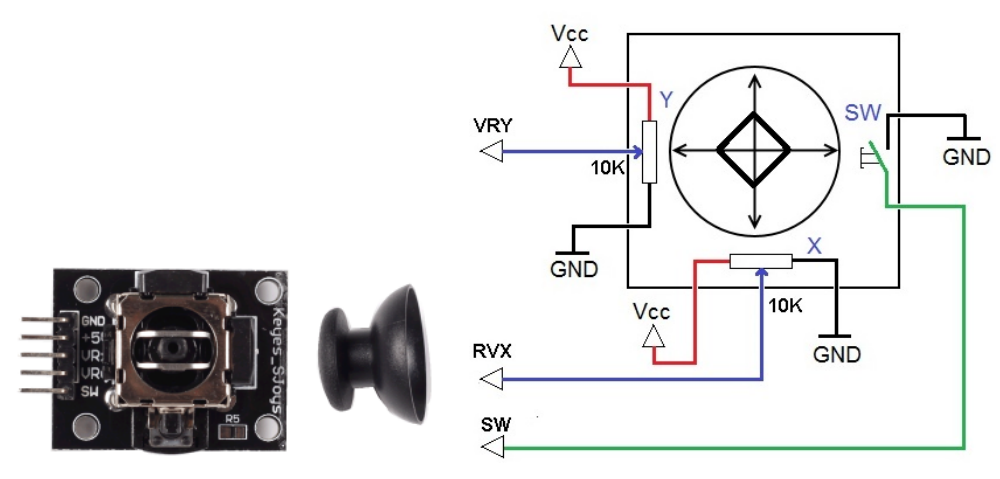

.. note::

    こんにちは、SunFounderのRaspberry Pi & Arduino & ESP32愛好家コミュニティへようこそ！Facebook上でRaspberry Pi、Arduino、ESP32についてもっと深く掘り下げ、他の愛好家と交流しましょう。

    **参加する理由は？**

    - **エキスパートサポート**：コミュニティやチームの助けを借りて、販売後の問題や技術的な課題を解決します。
    - **学び＆共有**：ヒントやチュートリアルを交換してスキルを向上させましょう。
    - **独占的なプレビュー**：新製品の発表や先行プレビューに早期アクセスしましょう。
    - **特別割引**：最新製品の独占割引をお楽しみください。
    - **祭りのプロモーションとギフト**：ギフトや祝日のプロモーションに参加しましょう。

    👉 私たちと一緒に探索し、創造する準備はできていますか？[|link_sf_facebook|]をクリックして今すぐ参加しましょう！

2.1.6 ジョイスティック
======================

前書き
------------

このプロジェクトでは、ジョイスティックの仕組みを学習する。
ジョイスティックを操作して、結果を画面に表示する。

部品
----------

.. image:: media/image317.png

原理
---------

**ジョイスティック**

ジョイスティックの基本的な原理は、スティックの動きをコンピューターが処理できる電子情報に変換することである。

モーションの全範囲をコンピューターに通信するために、ジョイスティックはX軸（左から右）とY軸（上下）の二つの軸でスティックの位置を測定する必要がある。基本的なジオメトリと同様に、X-Y座標はスティックの位置を正確に特定する。

スティックの位置を決定するために、ジョイスティック制御システムは各シャフトの位置を監視する。従来のアナログジョイスティックの設計では、これを二つのポテンショメーターまたは可変抵抗器で行う。

ジョイスティックには、ジョイスティックを押し下げたときに作動するデジタル入力もある。

回路図
-----------------

ジョイスティックのデータを読み取ると、
軸間でいくつかの違いがある：X軸とY軸のデータはアナログであり、
ADC0834を使用してアナログ値をデジタル値に変換する必要がある。
Z軸のデータはデジタルであるため、GPIOを直接使用して読み取るか、
またはADCを使用して読み取ることができる。

.. image:: media/image319.png

.. image:: media/image320.png

実験手順
-----------------------

ステップ1： 回路を作る。

.. image:: media/image193.png
    :width: 800

C言語ユーザー向け
^^^^^^^^^^^^^^^^^^^^

ステップ2： コードのフォルダーに入る。

.. raw:: html

   <run></run>

.. code-block::

    cd /home/pi/davinci-kit-for-raspberry-pi/c/2.1.6/

ステップ3： コードをコンパイルする。

.. raw:: html

   <run></run>

.. code-block::

    gcc 2.1.6_Joystick.c -lwiringPi

ステップ4： EXEファイルを実行する。

.. raw:: html

   <run></run>

.. code-block::

    sudo ./a.out

コードの実行後、ジョイスティックを回すと、対応するx、y、Btnの値が画面に表示される。

**コード**

.. code-block:: c

    #include <wiringPi.h>
    #include <stdio.h>
    #include <softPwm.h>

    typedef unsigned char uchar;
    typedef unsigned int uint;

    #define     ADC_CS    0
    #define     ADC_CLK   1
    #define     ADC_DIO   2
    #define     BtnPin    3

    uchar get_ADC_Result(uint channel)
    {
        uchar i;
        uchar dat1=0, dat2=0;
        int sel = channel > 1 & 1;
        int odd = channel & 1;

        digitalWrite(ADC_CLK, 1);
        delayMicroseconds(2);
        digitalWrite(ADC_CLK, 0);
        delayMicroseconds(2);

        pinMode(ADC_DIO, OUTPUT);
        digitalWrite(ADC_CS, 0);
        // Start bit
        digitalWrite(ADC_CLK,0);
        digitalWrite(ADC_DIO,1);    delayMicroseconds(2);
        digitalWrite(ADC_CLK,1);    delayMicroseconds(2);
        //Single End mode
        digitalWrite(ADC_CLK,0);
        digitalWrite(ADC_DIO,1);    delayMicroseconds(2);
        digitalWrite(ADC_CLK,1);    delayMicroseconds(2);
        // ODD
        digitalWrite(ADC_CLK,0);
        digitalWrite(ADC_DIO,odd);  delayMicroseconds(2);
        digitalWrite(ADC_CLK,1);    delayMicroseconds(2);
        //Select
        digitalWrite(ADC_CLK,0);
        digitalWrite(ADC_DIO,sel);    delayMicroseconds(2);
        digitalWrite(ADC_CLK,1);
        digitalWrite(ADC_DIO,1);    delayMicroseconds(2);
        digitalWrite(ADC_CLK,0);
        digitalWrite(ADC_DIO,1);    delayMicroseconds(2);
        for(i=0;i<8;i++)
        {
            digitalWrite(ADC_CLK,1);    delayMicroseconds(2);
            digitalWrite(ADC_CLK,0);    delayMicroseconds(2);
            pinMode(ADC_DIO, INPUT);
            dat1=dat1<<1 | digitalRead(ADC_DIO);
        }
        for(i=0;i<8;i++)
        {
            dat2 = dat2 | ((uchar)(digitalRead(ADC_DIO))<<i);
            digitalWrite(ADC_CLK,1);    delayMicroseconds(2);
            digitalWrite(ADC_CLK,0);    delayMicroseconds(2);
        }
        digitalWrite(ADC_CS,1);
        pinMode(ADC_DIO, OUTPUT);
        return(dat1==dat2) ? dat1 : 0;
    }
    int main(void)
    {
        uchar x_val;
        uchar y_val;
        uchar btn_val;
        if(wiringPiSetup() == -1){ //when initialize wiring failed,print messageto screen
            printf("setup wiringPi failed !");
            return 1;
        }
        pinMode(BtnPin,  INPUT);
        pullUpDnControl(BtnPin, PUD_UP);
        pinMode(ADC_CS,  OUTPUT);
        pinMode(ADC_CLK, OUTPUT);

        while(1){
            x_val = get_ADC_Result(0);
            y_val = get_ADC_Result(1);
            btn_val = digitalRead(BtnPin);
            printf("x = %d, y = %d, btn = %d\n", x_val, y_val, btn_val);
            delay(100);
        }
        return 0;
    }

**コードの説明**

.. code-block:: c

    uchar get_ADC_Result(uint channel)
    {
        uchar i;
        uchar dat1=0, dat2=0;
        int sel = channel > 1 & 1;
        int odd = channel & 1;
        
        digitalWrite(ADC_CLK, 1);
        delayMicroseconds(2);
        digitalWrite(ADC_CLK, 0);
        delayMicroseconds(2);

        pinMode(ADC_DIO, OUTPUT);
        digitalWrite(ADC_CS, 0);
        // Start bit
        digitalWrite(ADC_CLK,0);
        digitalWrite(ADC_DIO,1);    delayMicroseconds(2);
        digitalWrite(ADC_CLK,1);    delayMicroseconds(2);
        //Single End mode
        digitalWrite(ADC_CLK,0);
        digitalWrite(ADC_DIO,1);    delayMicroseconds(2);
        digitalWrite(ADC_CLK,1);    delayMicroseconds(2);
        ......

機能の動作プロセスについては、2.1.4ポテンショメーターで詳しく説明している。

.. code-block:: c

    while(1){
            x_val = get_ADC_Result(0);
            y_val = get_ADC_Result(1);
            btn_val = digitalRead(BtnPin);
            printf("x = %d, y = %d, btn = %d\n", x_val, y_val, btn_val);
            delay(100);
        }

ジョイスティックのVRXとVRYは、それぞれADC0834のCH0、CH1に接続されている。
したがって、関数 ``getResult()`` が呼び出されて、CH0とCH1の値が読み取られる。
それから、読み取った値を変数 ``x_val`` と ``y_val`` に保存してください。
さらに、ジョイスティックのSWの値を読み取り、変数 ``Btn_val`` に保存する。
最後に、 ``x_val`` 、 ``y_val`` 、と ``Btn_val`` の値は ``print()`` 関数で出力される。

Python言語ユーザー向け
^^^^^^^^^^^^^^^^^^^^^^^^^

ステップ2： コードのフォルダーに入る。

.. raw:: html

   <run></run>

.. code-block::

    cd /home/pi/davinci-kit-for-raspberry-pi/python/

ステップ3： 実行する。

.. raw:: html

   <run></run>

.. code-block::

    sudo python3 2.1.6_Joystick.py

コードの実行後、ジョイスティックを回すと、対応するx、y、Btnの値が画面に表示される。

**コード**

.. note::

   以下のコードを **変更/リセット/コピー/実行/停止** できます。 ただし、その前に、 ``davinci-kit-for-raspberry-pi/python`` のようなソースコードパスに移動する必要があります。 
    
.. raw:: html

    <run></run>

.. code-block:: python

    import RPi.GPIO as GPIO
    import ADC0834
    import time

    BtnPin = 22

    def setup():
        # Set the GPIO modes to BCM Numbering
        GPIO.setmode(GPIO.BCM)
        GPIO.setup(BtnPin, GPIO.IN, pull_up_down=GPIO.PUD_UP)
        ADC0834.setup()

    def destroy():
        # Release resource
        GPIO.cleanup()

    def loop():
        while True:
            x_val = ADC0834.getResult(0)
            y_val = ADC0834.getResult(1)
            Btn_val = GPIO.input(BtnPin)
            print ('X: %d  Y: %d  Btn: %d' % (x_val, y_val, Btn_val))
            time.sleep(0.2)

    if __name__ == '__main__':
        setup()
        try:
            loop()
        except KeyboardInterrupt: # When 'Ctrl+C' is pressed, the program destroy() will be executed.
            destroy()

**コードの説明**

.. code-block:: python

    def loop():
        while True:
            x_val = ADC0834.getResult(0)
            y_val = ADC0834.getResult(1)
            Btn_val = GPIO.input(BtnPin)
            print ('X: %d  Y: %d  Btn: %d' % (x_val, y_val, Btn_val))
            time.sleep(0.2)

ジョイスティックのVRXとVRYは、それぞれADC0834のCH0、CH1に接続されている。
したがって、関数 ``getResult()`` が呼び出されて、CH0とCH1の値が読み取られる。
それから、読み取った値を変数 ``x_val`` と ``y_val`` に保存してください。
さらに、ジョイスティックのSWの値を読み取り、変数 ``Btn_val`` に保存する。
最後に、 ``x_val`` 、 ``y_val`` 、と ``Btn_val`` の値は ``print()`` 関数で出力される。

現象画像
------------------

.. image:: media/image194.jpeg

