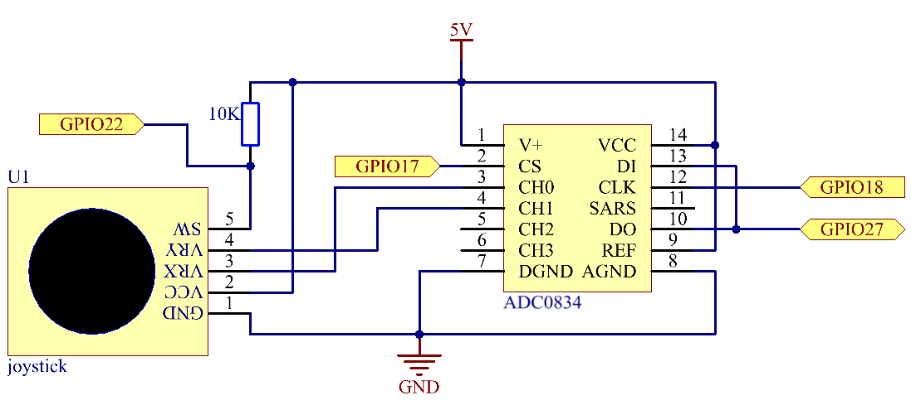

.. note::

    ¡Hola! Bienvenidos a la Comunidad de Entusiastas de SunFounder para Raspberry Pi, Arduino y ESP32 en Facebook. Sumérgete en el mundo de Raspberry Pi, Arduino y ESP32 junto a otros entusiastas.

    **¿Por qué unirse?**

    - **Soporte Experto**: Resuelve problemas post-venta y desafíos técnicos con la ayuda de nuestra comunidad y equipo.
    - **Aprende y Comparte**: Intercambia consejos y tutoriales para mejorar tus habilidades.
    - **Vistas Exclusivas**: Obtén acceso anticipado a anuncios de nuevos productos y adelantos.
    - **Descuentos Especiales**: Disfruta de descuentos exclusivos en nuestros productos más recientes.
    - **Promociones Festivas y Sorteos**: Participa en sorteos y promociones especiales de temporada.

     👉 ¿Listo para explorar y crear con nosotros? Haz clic en [|link_sf_facebook|] y únete hoy.

2.1.6 Joystick
================

Introducción
---------------

En este proyecto, aprenderemos cómo funciona el joystick. Manipularemos 
el joystick y mostraremos los resultados en la pantalla.

Componentes
-------------

.. image:: img/image317.png

Principio
-------------

**Joystick**

La idea básica de un joystick es traducir el movimiento de una palanca en 
información electrónica que una computadora pueda procesar.

Para comunicar un rango completo de movimiento, un joystick necesita medir 
la posición de la palanca en dos ejes: el eje X (izquierda a derecha) y el 
eje Y (arriba y abajo). Al igual que en la geometría básica, las coordenadas 
X-Y identifican la posición de la palanca con precisión.

Para determinar la ubicación de la palanca, el sistema de control del joystick 
simplemente monitorea la posición de cada eje. El diseño de joystick analógico 
convencional hace esto con dos potenciómetros o resistencias variables.

El joystick también cuenta con una entrada digital que se activa cuando el 
joystick se presiona hacia abajo.

.. image:: img/image318.png

Diagrama Esquemático
-------------------------

Al leer los datos del joystick, hay algunas diferencias entre los ejes: los 
datos de los ejes X y Y son analógicos, por lo que se necesita utilizar el 
ADC0834 para convertir el valor analógico a digital. Los datos del eje Z son 
digitales, por lo que puedes leerlos directamente desde el GPIO, aunque también 
puedes usar el ADC para leerlos.

.. image:: img/image319.png

Procedimientos Experimentales
---------------------------------

**Paso 1:** Construye el circuito.

.. image:: img/image193.png
    :width: 800

Para Usuarios de Lenguaje C
^^^^^^^^^^^^^^^^^^^^^^^^^^^^^^^^^

**Paso 2:** Ve a la carpeta del código.

.. raw:: html

   <run></run>

.. code-block::

    cd ~/davinci-kit-for-raspberry-pi/c/2.1.6/

**Paso 3:** Compila el código.

.. raw:: html

   <run></run>

.. code-block::

    gcc 2.1.6_Joystick.c -lwiringPi

**Paso 4:** Ejecuta el archivo compilado.

.. raw:: html

   <run></run>

.. code-block::

    sudo ./a.out

Después de ejecutar el código, mueve el joystick y los valores correspondientes 
de x, y y Btn se mostrarán en la pantalla.

.. note::

    Si no funciona después de ejecutarlo, o aparece un mensaje de error: \"wiringPi.h: No such file or directory\", consulta :ref:`C code is not working?`.

**Código**

.. code-block:: c

    #include <wiringPi.h>
    #include <stdio.h>
    #include <softPwm.h>

    typedef unsigned char uchar;
    typedef unsigned int uint;

    #define     ADC_CS    0
    #define     ADC_CLK   1
    #define     ADC_DIO   2
    #define     BtnPin    3

    uchar get_ADC_Result(uint channel)
    {
        uchar i;
        uchar dat1=0, dat2=0;
        int sel = channel > 1 & 1;
        int odd = channel & 1;

        digitalWrite(ADC_CLK, 1);
        delayMicroseconds(2);
        digitalWrite(ADC_CLK, 0);
        delayMicroseconds(2);

        pinMode(ADC_DIO, OUTPUT);
        digitalWrite(ADC_CS, 0);
        // Bit de inicio
        digitalWrite(ADC_CLK,0);
        digitalWrite(ADC_DIO,1);    delayMicroseconds(2);
        digitalWrite(ADC_CLK,1);    delayMicroseconds(2);
        // Modo de entrada única
        digitalWrite(ADC_CLK,0);
        digitalWrite(ADC_DIO,1);    delayMicroseconds(2);
        digitalWrite(ADC_CLK,1);    delayMicroseconds(2);
        // Impar
        digitalWrite(ADC_CLK,0);
        digitalWrite(ADC_DIO,odd);  delayMicroseconds(2);
        digitalWrite(ADC_CLK,1);    delayMicroseconds(2);
        // Selección
        digitalWrite(ADC_CLK,0);
        digitalWrite(ADC_DIO,sel);    delayMicroseconds(2);
        digitalWrite(ADC_CLK,1);
        
        digitalWrite(ADC_DIO,1);    delayMicroseconds(2);
        digitalWrite(ADC_CLK,0);
        digitalWrite(ADC_DIO,1);    delayMicroseconds(2);
        
        for(i=0;i<8;i++)
        {
            digitalWrite(ADC_CLK,1);    delayMicroseconds(2);
            digitalWrite(ADC_CLK,0);    delayMicroseconds(2);
            pinMode(ADC_DIO, INPUT);
            dat1=dat1<<1 | digitalRead(ADC_DIO);
        }
        for(i=0;i<8;i++)
        {
            dat2 = dat2 | ((uchar)(digitalRead(ADC_DIO))<<i);
            digitalWrite(ADC_CLK,1);    delayMicroseconds(2);
            digitalWrite(ADC_CLK,0);    delayMicroseconds(2);
        }
        digitalWrite(ADC_CS,1);
        pinMode(ADC_DIO, OUTPUT);
        return(dat1==dat2) ? dat1 : 0;
    }
    int main(void)
    {
        uchar x_val;
        uchar y_val;
        uchar btn_val;
        if(wiringPiSetup() == -1){ // Si la inicialización de wiring falla, imprime mensaje en la pantalla
            printf("setup wiringPi failed !");
            return 1;
        }
        pinMode(BtnPin,  INPUT);
        pullUpDnControl(BtnPin, PUD_UP);
        pinMode(ADC_CS,  OUTPUT);
        pinMode(ADC_CLK, OUTPUT);

        while(1){
            x_val = get_ADC_Result(0);
            y_val = get_ADC_Result(1);
            btn_val = digitalRead(BtnPin);
            printf("x = %d, y = %d, btn = %d\n", x_val, y_val, btn_val);
            delay(100);
        }
        return 0;
    }

**Explicación del Código**

.. code-block:: c

    uchar get_ADC_Result(uint channel)
    {
        uchar i;
        uchar dat1=0, dat2=0;
        int sel = channel > 1 & 1;
        int odd = channel & 1;

        digitalWrite(ADC_CLK, 1);
        delayMicroseconds(2);
        digitalWrite(ADC_CLK, 0);
        delayMicroseconds(2);

        pinMode(ADC_DIO, OUTPUT);
        digitalWrite(ADC_CS, 0);
        // Bit de inicio
        digitalWrite(ADC_CLK,0);
        digitalWrite(ADC_DIO,1);    delayMicroseconds(2);
        digitalWrite(ADC_CLK,1);    delayMicroseconds(2);
        // Modo de entrada única
        digitalWrite(ADC_CLK,0);
        digitalWrite(ADC_DIO,1);    delayMicroseconds(2);
        digitalWrite(ADC_CLK,1);    delayMicroseconds(2);
        ......

El proceso de funcionamiento de la función se detalla en el apartado 2.1.4 Potenciómetro.

.. code-block:: c

    while(1){
            x_val = get_ADC_Result(0);
            y_val = get_ADC_Result(1);
            btn_val = digitalRead(BtnPin);
            printf("x = %d, y = %d, btn = %d\n", x_val, y_val, btn_val);
            delay(100);
        }

VRX y VRY del joystick están conectados a CH0 y CH1 del ADC0834 respectivamente. 
Por lo tanto, se llama a la función getResult() para leer los valores de CH0 y CH1. 
Luego, los valores leídos se almacenan en las variables x_val y y_val. Además, 
se lee el valor de SW del joystick y se almacena en la variable btn_val. Finalmente, 
los valores de x_val, y_val y btn_val se muestran usando la función print().

Para Usuarios de Python
^^^^^^^^^^^^^^^^^^^^^^^^^^^

**Paso 2:** Dirígete a la carpeta del código.

.. raw:: html

   <run></run>

.. code-block::

    cd ~/davinci-kit-for-raspberry-pi/python/

**Paso 3:** Ejecuta.

.. raw:: html

   <run></run>

.. code-block::

    sudo python3 2.1.6_Joystick.py

Después de ejecutar el código, mueve el joystick y los valores 
correspondientes de x, y, Btn se mostrarán en la pantalla.

**Código**

.. note::

    Puedes **Modificar/Restablecer/Copiar/Ejecutar/Detener** el 
    código a continuación. Pero antes de hacerlo, debes dirigirte a 
    la ruta del código fuente como ``davinci-kit-for-raspberry-pi/python``.
    
.. raw:: html

    <run></run>

.. code-block:: python

    import RPi.GPIO as GPIO
    import ADC0834
    import time

    BtnPin = 22

    def setup():
        # Establece los modos de GPIO en numeración BCM
        GPIO.setmode(GPIO.BCM)
        GPIO.setup(BtnPin, GPIO.IN, pull_up_down=GPIO.PUD_UP)
        ADC0834.setup()

    def destroy():
        # Libera los recursos
        GPIO.cleanup()

    def loop():
        while True:
            x_val = ADC0834.getResult(0)
            y_val = ADC0834.getResult(1)
            Btn_val = GPIO.input(BtnPin)
            print ('X: %d  Y: %d  Btn: %d' % (x_val, y_val, Btn_val))
            time.sleep(0.2)

    if __name__ == '__main__':
        setup()
        try:
            loop()
        except KeyboardInterrupt: # Cuando se presiona 'Ctrl+C', se ejecutará el programa destroy().
            destroy()

**Explicación del Código**

.. code-block:: python

    def loop():
        while True:
            x_val = ADC0834.getResult(0)
            y_val = ADC0834.getResult(1)
            Btn_val = GPIO.input(BtnPin)
            print ('X: %d  Y: %d  Btn: %d' % (x_val, y_val, Btn_val))
            time.sleep(0.2)

VRX y VRY del joystick están conectados respectivamente a CH0 y CH1 del ADC0834. 
Por lo tanto, se llama a la función getResult() para leer los valores de CH0 y CH1. 
Los valores leídos se almacenan en las variables x_val y y_val. Además, se lee el valor 
de SW del joystick y se almacena en la variable Btn_val. Finalmente, los valores de x_val, 
y_val y Btn_val se muestran utilizando la función print().

Imagen del Fenómeno
------------------------

.. image:: img/image194.jpeg

