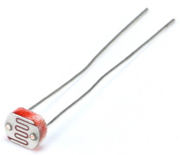

.. note::

    Ciao, benvenuto nella Community di SunFounder Raspberry Pi & Arduino & ESP32 Enthusiasts su Facebook! Unisciti a noi per esplorare più a fondo Raspberry Pi, Arduino e ESP32 con altri appassionati.

    **Perché unirti?**

    - **Supporto Esperto**: Risolvi problemi post-vendita e sfide tecniche con l'aiuto della nostra community e del nostro team.
    - **Impara e Condividi**: Scambia suggerimenti e tutorial per migliorare le tue competenze.
    - **Anteprime Esclusive**: Ottieni accesso anticipato agli annunci di nuovi prodotti e anteprime.
    - **Sconti Speciali**: Goditi sconti esclusivi sui nostri prodotti più recenti.
    - **Promozioni Festive e Giveaway**: Partecipa a promozioni e giveaway durante le festività.

    👉 Sei pronto a esplorare e creare con noi? Clicca [|link_sf_facebook|] e unisciti subito!

2.2.1 Fotoresistore
======================

Introduzione
---------------

Il fotoresistore è un componente comunemente utilizzato per rilevare 
l'intensità della luce ambientale. Aiuta il controller a distinguere 
tra giorno e notte e permette di implementare funzioni di controllo 
della luce, come quelle di una lampada notturna. Questo progetto è 
molto simile a quello con il potenziometro e può essere visto come una 
trasformazione della variazione di tensione in sensibilità alla luce.

Componenti
--------------

.. image:: img/list_2.2.1_photoresistor.png

Principio di Funzionamento
-----------------------------

Un fotoresistore, o fotocellula, è una resistenza variabile controllata 
dalla luce. La resistenza del fotoresistore diminuisce con l'aumentare 
dell'intensità della luce incidente; in altre parole, mostra fotoconduttività. 
Un fotoresistore può essere utilizzato in circuiti di rilevamento sensibili 
alla luce, e in circuiti che si attivano con luce o oscurità.

Schema del Circuito
----------------------

.. image:: img/image321.png

.. image:: img/image322.png

Procedure Sperimentali
-------------------------

**Passaggio 1:** Costruisci il circuito.

.. image:: img/image198.png
    :width: 800

Per Utenti C
^^^^^^^^^^^^^^^

**Passaggio 2:** Accedi alla cartella del codice.

.. raw:: html

   <run></run>

.. code-block::

    cd ~/davinci-kit-for-raspberry-pi/c/2.2.1/

**Passaggio 3:** Compila il codice.

.. raw:: html

   <run></run>

.. code-block::

    gcc 2.2.1_Photoresistor.c -lwiringPi

**Passaggio 4:** Esegui il file eseguibile.

.. raw:: html

   <run></run>

.. code-block::

    sudo ./a.out

Una volta eseguito il codice, la luminosità del LED varierà a seconda 
dell'intensità di luce rilevata dal fotoresistore.

.. note::

    Se il programma non funziona o viene visualizzato un messaggio di errore: \"wiringPi.h: No such file or directory\", consulta la sezione :ref:`Il codice C non funziona?`.
**Codice**

.. code-block:: c

    #include <wiringPi.h>
    #include <stdio.h>
    #include <softPwm.h>

    typedef unsigned char uchar;
    typedef unsigned int uint;

    #define     ADC_CS    0
    #define     ADC_CLK   1
    #define     ADC_DIO   2
    #define     LedPin    3

    uchar get_ADC_Result(uint channel)
    {
        uchar i;
        uchar dat1=0, dat2=0;
        int sel = channel > 1 & 1;
        int odd = channel & 1;

        digitalWrite(ADC_CLK, 1);
        delayMicroseconds(2);
        digitalWrite(ADC_CLK, 0);
        delayMicroseconds(2);

        pinMode(ADC_DIO, OUTPUT);
        digitalWrite(ADC_CS, 0);
        // Bit di avvio
        digitalWrite(ADC_CLK,0);
        digitalWrite(ADC_DIO,1);    delayMicroseconds(2);
        digitalWrite(ADC_CLK,1);    delayMicroseconds(2);
        // Modalità Single End
        digitalWrite(ADC_CLK,0);
        digitalWrite(ADC_DIO,1);    delayMicroseconds(2);
        digitalWrite(ADC_CLK,1);    delayMicroseconds(2);
        // ODD
        digitalWrite(ADC_CLK,0);
        digitalWrite(ADC_DIO,odd);  delayMicroseconds(2);
        digitalWrite(ADC_CLK,1);    delayMicroseconds(2);
        // Selezione
        digitalWrite(ADC_CLK,0);
        digitalWrite(ADC_DIO,sel);    delayMicroseconds(2);
        digitalWrite(ADC_CLK,1);

        digitalWrite(ADC_DIO,1);    delayMicroseconds(2);
        digitalWrite(ADC_CLK,0);
        digitalWrite(ADC_DIO,1);    delayMicroseconds(2);

        for(i=0;i<8;i++)
        {
            digitalWrite(ADC_CLK,1);    delayMicroseconds(2);
            digitalWrite(ADC_CLK,0);    delayMicroseconds(2);

            pinMode(ADC_DIO, INPUT);
            dat1=dat1<<1 | digitalRead(ADC_DIO);
        }

        for(i=0;i<8;i++)
        {
            dat2 = dat2 | ((uchar)(digitalRead(ADC_DIO))<<i);
            digitalWrite(ADC_CLK,1);    delayMicroseconds(2);
            digitalWrite(ADC_CLK,0);    delayMicroseconds(2);
        }

        digitalWrite(ADC_CS,1);
        pinMode(ADC_DIO, OUTPUT);
        return(dat1==dat2) ? dat1 : 0;
    }

    int main(void)
    {
        uchar analogVal;
        if(wiringPiSetup() == -1){ //se l'inizializzazione di wiring fallisce, stampa un messaggio a schermo
            printf("setup wiringPi failed !");
            return 1;
        }
        softPwmCreate(LedPin,  0, 100);
        pinMode(ADC_CS,  OUTPUT);
        pinMode(ADC_CLK, OUTPUT);

        while(1){
            analogVal = get_ADC_Result(0);
            printf("Current analogVal : %d\n", analogVal);
            delay(100);
            softPwmWrite(LedPin, analogVal);
            delay(100);
        }
        return 0;
    }

**Spiegazione del Codice**

I codici qui sono gli stessi presenti nella sezione 2.1.4 Potenziometro. 
Se hai ulteriori domande, consulta la spiegazione del codice in 
**2.1.4 Potenziometro.c** per i dettagli.

Per gli Utenti di Linguaggio Python
^^^^^^^^^^^^^^^^^^^^^^^^^^^^^^^^^^^^^^^

**Passo 2:** Vai alla cartella del codice.

.. raw:: html

   <run></run>

.. code-block::

    cd ~/davinci-kit-for-raspberry-pi/python/

**Passo 3:** Esegui il file eseguibile.

.. raw:: html

   <run></run>

.. code-block::

    sudo python3 2.2.1_Photoresistor.py

Durante l'esecuzione del codice, la luminosità del LED varierà a seconda 
dell'intensità di luce rilevata dalla fotoresistenza.

**Codice**

.. note::

    Puoi **Modificare/Reimpostare/Copiare/Eseguire/Arrestare** il codice qui sotto. Prima di ciò, però, è necessario andare nel percorso del codice sorgente come ``davinci-kit-for-raspberry-pi/python``. 
    
.. raw:: html

    <run></run>

.. code-block:: python

    import RPi.GPIO as GPIO
    import ADC0834
    import time

    LedPin = 22

    def setup():
        global led_val
        # Imposta la modalità GPIO a Numerazione BCM
        GPIO.setmode(GPIO.BCM)
        # Imposta LedPin come output e il livello iniziale ad High (3.3v)
        GPIO.setup(LedPin, GPIO.OUT, initial=GPIO.HIGH)
        ADC0834.setup()
        # Imposta il LED come canale PWM con frequenza a 2KHz
        led_val = GPIO.PWM(LedPin, 2000)

        # Inizializza con il valore 0
        led_val.start(0)

    def destroy():
        # Interrompi tutti i canali PWM
        led_val.stop()
        # Rilascia le risorse
        GPIO.cleanup()

    def loop():
        while True:
            analogVal = ADC0834.getResult()
            print ('analog value = %d' % analogVal)
            led_val.ChangeDutyCycle(analogVal*100/255)
            time.sleep(0.2)

    if __name__ == '__main__':
        setup()
        try:
            loop()
        except KeyboardInterrupt: # Quando viene premuto 'Ctrl+C', verrà eseguito il programma destroy().
            destroy()

**Spiegazione del Codice**

.. code-block:: python

    def loop():
        while True:
            analogVal = ADC0834.getResult()
            print ('analog value = %d' % analogVal)
            led_val.ChangeDutyCycle(analogVal*100/255)
            time.sleep(0.2)

Legge il valore analogico di CH0 di ADC0834. Per impostazione predefinita, 
la funzione getResult() legge il valore di CH0; se desideri leggere altri 
canali, inserisci 1, 2 o 3 nei parametri della funzione getResult(). 
Successivamente, stampa il valore utilizzando la funzione print. Poiché 
l'elemento che cambia è il ciclo di lavoro di LedPin, è necessario utilizzare 
la formula di calcolo analogVal*100/255 per convertire analogVal in percentuale. 
Infine, ChangeDutyCycle() viene chiamata per scrivere la percentuale in LedPin.

Immagine del Fenomeno
---------------------------

.. image:: img/image199.jpeg
