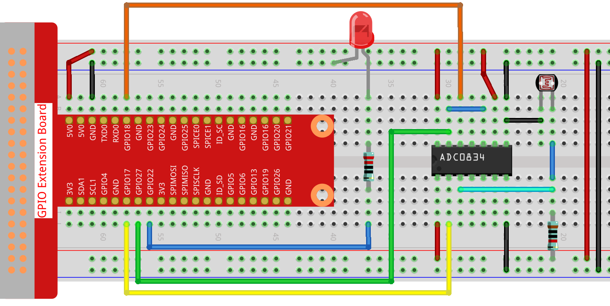
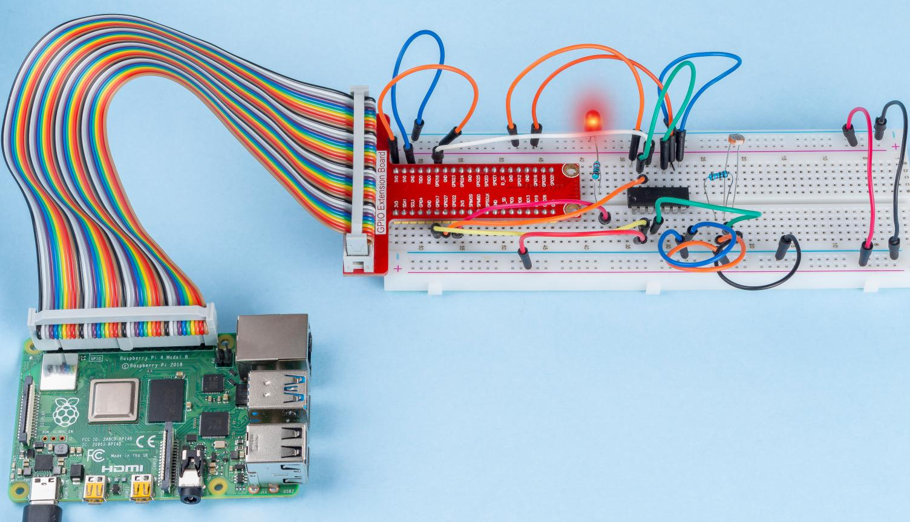

2.2.1 フォトレジスタ
====================

前書き
------------

フォトレジスタは生活の中で環境光の強度によく使用される部品である。
コントローラーが昼と夜を認識し、夜間ランプなどの調光機能を実現することに役立つ。
このプロジェクトはポテンショメータによく似ており、光を感知するための電圧を変えると思うかもしれない。

部品
----------

.. image:: media/list_2.2.1_photoresistor.png

原理
---------

フォトレジスタまたはフォトセルは光制御可変抵抗器である。
フォトレジストの抵抗は入射光強度の増加とともに減少する。つまり、光伝導性を示す。
フォトレジスタは、光に敏感な検出回路、および光・暗闇で作動する切換回路に適用できる。

.. image:: media/image196.png
    :width: 200
    :align: center

回路図
-----------------

.. image:: media/image321.png

.. image:: media/image322.png

実験手順
-----------------------

ステップ1： 回路を作る。

C言語ユーザー向け
^^^^^^^^^^^^^^^^^^^^

ステップ2： コードのフォルダーに入る。

.. raw:: html

   <run></run>

.. code-block::

    cd /home/pi/davinci-kit-for-raspberry-pi/c/2.2.1/

ステップ3： コードをコンパイルする。

.. raw:: html

   <run></run>

.. code-block::

    gcc 2.2.1_Photoresistor.c -lwiringPi

ステップ4： EXEファイルを実行する。

.. raw:: html

   <run></run>

.. code-block::

    sudo ./a.out

コードを実行すると、LEDの輝度はフォトレジスターが感知する光の強度に応じて変化する。

**コード**

.. code-block:: c

    #include <wiringPi.h>
    #include <stdio.h>
    #include <softPwm.h>

    typedef unsigned char uchar;
    typedef unsigned int uint;

    #define     ADC_CS    0
    #define     ADC_CLK   1
    #define     ADC_DIO   2
    #define     LedPin    3

    uchar get_ADC_Result(uint channel)
    {
        uchar i;
        uchar dat1=0, dat2=0;
        int sel = channel > 1 & 1;
        int odd = channel & 1;

        pinMode(ADC_DIO, OUTPUT);
        digitalWrite(ADC_CS, 0);
        // Start bit
        digitalWrite(ADC_CLK,0);
        digitalWrite(ADC_DIO,1);    delayMicroseconds(2);
        digitalWrite(ADC_CLK,1);    delayMicroseconds(2);
        //Single End mode
        digitalWrite(ADC_CLK,0);
        digitalWrite(ADC_DIO,1);    delayMicroseconds(2);
        digitalWrite(ADC_CLK,1);    delayMicroseconds(2);
        // ODD
        digitalWrite(ADC_CLK,0);
        digitalWrite(ADC_DIO,odd);  delayMicroseconds(2);
        digitalWrite(ADC_CLK,1);    delayMicroseconds(2);
        //Select
        digitalWrite(ADC_CLK,0);
        digitalWrite(ADC_DIO,sel);    delayMicroseconds(2);
        digitalWrite(ADC_CLK,1);

        digitalWrite(ADC_DIO,1);    delayMicroseconds(2);
        digitalWrite(ADC_CLK,0);
        digitalWrite(ADC_DIO,1);    delayMicroseconds(2);

        for(i=0;i<8;i++)
        {
            digitalWrite(ADC_CLK,1);    delayMicroseconds(2);
            digitalWrite(ADC_CLK,0);    delayMicroseconds(2);

            pinMode(ADC_DIO, INPUT);
            dat1=dat1<<1 | digitalRead(ADC_DIO);
        }

        for(i=0;i<8;i++)
        {
            dat2 = dat2 | ((uchar)(digitalRead(ADC_DIO))<<i);
            digitalWrite(ADC_CLK,1);    delayMicroseconds(2);
            digitalWrite(ADC_CLK,0);    delayMicroseconds(2);
        }

        digitalWrite(ADC_CS,1);
        pinMode(ADC_DIO, OUTPUT);
        return(dat1==dat2) ? dat1 : 0;
    }

    int main(void)
    {
        uchar analogVal;
        if(wiringPiSetup() == -1){ //when initialize wiring failed,print messageto screen
            printf("setup wiringPi failed !");
            return 1;
        }
        softPwmCreate(LedPin,  0, 100);
        pinMode(ADC_CS,  OUTPUT);
        pinMode(ADC_CLK, OUTPUT);

        while(1){
            analogVal = get_ADC_Result(0);
            printf("Current analogVal : %d\n", analogVal);
            delay(100);
            softPwmWrite(LedPin, analogVal);
            delay(100);
        }
        return 0;
    }

**コードの説明**

ここのコードは、2.1.4ポテンショメーターのコードと同じである。他に質問がある場合は、 ``2.1.4Potentiometer.c`` のコード説明を参照してください。

Python言語ユーザー向け
^^^^^^^^^^^^^^^^^^^^^^^^^

ステップ2： コードのフォルダーに入る。

.. raw:: html

   <run></run>

.. code-block::

    cd /home/pi/davinci-kit-for-raspberry-pi/python/

ステップ3： EXEファイルを実行する。

.. raw:: html

   <run></run>

.. code-block::

    sudo python3 2.2.1_Photoresistor.py

コードを実行すると、LEDの輝度はフォトレジスターが感知する光の強度に応じて変化する。

**コード**

.. note::

   以下のコードを **変更/リセット/コピー/実行/停止** できます。 ただし、その前に、 ``davinci-kit-for-raspberry-pi/python`` のようなソースコードパスに移動する必要があります。 
   
.. raw:: html

    <run></run>

.. code-block:: python

    import RPi.GPIO as GPIO
    import ADC0834
    import time

    LedPin = 22

    def setup():
        global led_val
        # Set the GPIO modes to BCM Numbering
        GPIO.setmode(GPIO.BCM)
        # Set all LedPin's mode to output and initial level to High(3.3v)
        GPIO.setup(LedPin, GPIO.OUT, initial=GPIO.HIGH)
        ADC0834.setup()
        # Set led as pwm channel and frequece to 2KHz
        led_val = GPIO.PWM(LedPin, 2000)

        # Set all begin with value 0
        led_val.start(0)

    def destroy():
        # Stop all pwm channel
        led_val.stop()
        # Release resource
        GPIO.cleanup()

    def loop():
        while True:
            analogVal = ADC0834.getResult()
            print ('analog value = %d' % analogVal)
            led_val.ChangeDutyCycle(analogVal*100/255)
            time.sleep(0.2)

    if __name__ == '__main__':
        setup()
        try:
            loop()
        except KeyboardInterrupt: # When 'Ctrl+C' is pressed, the program destroy() will be executed.
            destroy()

**コードの説明**

.. code-block:: python

    def loop():
        while True:
            analogVal = ADC0834.getResult()
            print ('analog value = %d' % analogVal)
            led_val.ChangeDutyCycle(analogVal*100/255)
            time.sleep(0.2)

ADC0834のCH0のアナログ値を読み取る。
デフォルトでは、関数 ``getResult()`` を使用してCH0の値を読み取る。
したがって、他のチャネルを読み取る場合は、
関数 ``getResult()`` の()に1、2、または3を入力してください。
次に、プリント機能を使用して値をプリントする必要がある。
変化する要素は計算式である ``LedPin`` のデューティサイクルであるため、
``analogVal`` をパーセンテージに変換するには ``analogVal * 100/255`` が必要である。
最後に、 ``ChangeDutyCycle()`` が呼び出されて、パーセンテージが ``LedPin`` に書き込まれる。

現象画像
------------------

