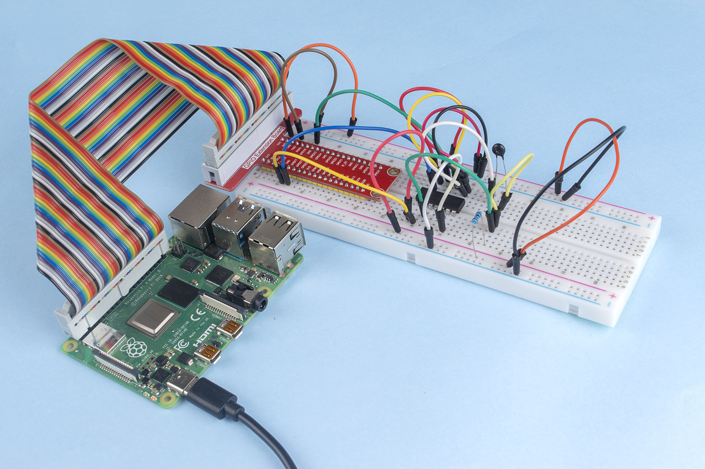

.. _py_temp:

2.2.2 Thermistor
================

Einführung
------------

Genau wie der Fotowiderstand Licht erfassen kann, ist der Thermistor ein temperaturempfindliches elektronisches Gerät, mit dem Funktionen der Temperaturregelung wie z. B. ein Wärmealarm realisiert werden können.

Komponenten
----------------

.. image:: media/list_2.2.2_thermistor.png

Prinzip
---------

Ein Thermistor ist ein wärmeempfindlicher Widerstand, der eine präzise und vorhersagbare Widerstandsänderung proportional zu kleinen Temperaturänderungen aufweist. Wie sehr sich sein Widerstand ändert, hängt von seiner einzigartigen Zusammensetzung ab. Thermistoren sind Teile einer größeren Gruppe passiver Komponenten. Und im Gegensatz zu ihren Gegenstücken mit aktiven Komponenten können passive Geräte keine Leistungsverstärkung oder Verstärkung für eine Schaltung bereitstellen.

Der Thermistor ist ein empfindliches Element und es gibt zwei Arten: den negativen Temperaturkoeffizienten (NTC) und den positiven Temperaturkoeffizienten (PTC), auch bekannt als NTC und PTC. Sein Widerstand variiert erheblich mit der Temperatur. Der Widerstand des PTC-Thermistors steigt mit der Temperatur, während der Zustand des NTC dem ersteren entgegengesetzt ist. In diesem Experiment verwenden wir NTC.

.. image:: media/image325.png

Das Prinzip ist, dass sich der Widerstand des NTC-Thermistors mit der Temperatur der äußeren Umgebung ändert. Es erfasst die Echtzeit-Temperatur der Umgebung. Wenn die Temperatur höher wird, nimmt der Widerstand des Thermistors ab. Anschließend werden die Spannungsdaten vom A / D-Adapter in digitale Größen umgewandelt. Die Temperatur in Celsius oder Fahrenheit wird über die Programmierung ausgegeben.

In diesem Experiment werden ein Thermistor und ein 10k-Pull-up-Widerstand verwendet. Jeder Thermistor hat einen normalen Widerstand. Hier sind es 10 kOhm, die unter 25 Grad Celsius gemessen werden.

Hier ist die Beziehung zwischen dem Widerstand und der Temperatur:

R\ :sub:`T` =R\ :sub:`N` exp\ :sup:`B(1/TK – 1/TN)`

**R\ T** ist der Widerstand des NTC-Thermistors bei einer Temperatur von
**T\ K**.

**R\ N** ist der Widerstand des NTC-Thermistors unter der Nenntemperatur **T\ N**. 
Hier beträgt der numerische Wert von **R\ N** 10k.

**T\ K** ist eine Kelvin-Temperatur und die Einheit ist K. 
Hier beträgt der numerische Wert von **T\ K** 273.15 + Grad Celsius.

**T\ N** ist eine Kelvin-Nenntemperatur; Das Gerät ist auch K. 
Hier beträgt der numerische Wert von **T\ N** 273.15+25.

Und **B**\ (beta), die Materialkonstante des NTC-Thermistors, 
wird auch als Wärmeempfindlichkeitsindex mit einem numerischen Wert von 3950 bezeichnet.

**exp** ist die Abkürzung für exponentiell, 
und die Basisnummer ist eine natürliche Nummer und entspricht ungefähr 2.7.

Konvertieren Sie diese Formel
T\ :sub:`K`\ =1/(ln(R\ :sub:`T`/R\ :sub:`N`)/B+1/T\ :sub:`N`) um eine Kelvin-Temperatur zu erhalten, 
die minus 273.15 Grad Celsius entspricht.

Diese Beziehung ist eine empirische Formel. Sie ist nur dann genau, wenn Temperatur und Widerstand im effektiven Bereich liegen.

Schematische Darstellung
---------------------------------

.. image:: media/image323.png

.. image:: media/image324.png

Experimentelle Verfahren
------------------------------------

Schritt 1: Bauen Sie die Schaltung auf.

.. image:: media/image202.png
    :width: 800

Für Benutzer in C-Sprache
^^^^^^^^^^^^^^^^^^^^^^^^^^^^^^^^^^^

Schritt 2: Gehen Sie zum Ordner der Kode.

.. raw:: html

   <run></run>

.. code-block::

    cd /home/pi/davinci-kit-for-raspberry-pi/c/2.2.2/

Schritt 3: Kompilieren Sie die Kode.

.. raw:: html

   <run></run>

.. code-block::

    gcc 2.2.2_Thermistor.c -lwiringPi -lm

.. note::
    -lm dient zum Laden der Bibliotheksmathematik. Nicht weglassen, sonst wird ein Fehler gemacht.

Schritt 4: Führen Sie die ausführbare Datei aus.

.. raw:: html

   <run></run>

.. code-block::

    sudo ./a.out

Während die Kode ausgeführt wird, erkennt der Thermistor die Umgebungstemperatur, 
die nach Abschluss der Programmberechnung auf dem Bildschirm angezeigt wird.

**Code**

.. code-block:: c

    #include <wiringPi.h>
    #include <stdio.h>
    #include <math.h>

    typedef unsigned char uchar;
    typedef unsigned int uint;

    #define     ADC_CS    0
    #define     ADC_CLK   1
    #define     ADC_DIO   2

    uchar get_ADC_Result(uint channel)
    {
        uchar i;
        uchar dat1=0, dat2=0;
        int sel = channel > 1 & 1;
        int odd = channel & 1;

        pinMode(ADC_DIO, OUTPUT);
        digitalWrite(ADC_CS, 0);
        // Start bit
        digitalWrite(ADC_CLK,0);
        digitalWrite(ADC_DIO,1);    delayMicroseconds(2);
        digitalWrite(ADC_CLK,1);    delayMicroseconds(2);
        //Single End mode
        digitalWrite(ADC_CLK,0);
        digitalWrite(ADC_DIO,1);    delayMicroseconds(2);
        digitalWrite(ADC_CLK,1);    delayMicroseconds(2);
        // ODD
        digitalWrite(ADC_CLK,0);
        digitalWrite(ADC_DIO,odd);  delayMicroseconds(2);
        digitalWrite(ADC_CLK,1);    delayMicroseconds(2);
        //Select
        digitalWrite(ADC_CLK,0);
        digitalWrite(ADC_DIO,sel);    delayMicroseconds(2);
        digitalWrite(ADC_CLK,1);

        digitalWrite(ADC_DIO,1);    delayMicroseconds(2);
        digitalWrite(ADC_CLK,0);
        digitalWrite(ADC_DIO,1);    delayMicroseconds(2);

        for(i=0;i<8;i++)
        {
            digitalWrite(ADC_CLK,1);    delayMicroseconds(2);
            digitalWrite(ADC_CLK,0);    delayMicroseconds(2);

            pinMode(ADC_DIO, INPUT);
            dat1=dat1<<1 | digitalRead(ADC_DIO);
        }

        for(i=0;i<8;i++)
        {
            dat2 = dat2 | ((uchar)(digitalRead(ADC_DIO))<<i);
            digitalWrite(ADC_CLK,1);    delayMicroseconds(2);
            digitalWrite(ADC_CLK,0);    delayMicroseconds(2);
        }

        digitalWrite(ADC_CS,1);
        pinMode(ADC_DIO, OUTPUT);
        return(dat1==dat2) ? dat1 : 0;
    }

    int main(void)
    {
        unsigned char analogVal;
        double Vr, Rt, temp, cel, Fah;
        if(wiringPiSetup() == -1){ //when initialize wiring failed,print messageto screen
            printf("setup wiringPi failed !");
            return 1;
        }
        pinMode(ADC_CS,  OUTPUT);
        pinMode(ADC_CLK, OUTPUT);

        while(1){
            analogVal = get_ADC_Result(0);
            Vr = 5 * (double)(analogVal) / 255;
            Rt = 10000 * (double)(Vr) / (5 - (double)(Vr));
            temp = 1 / (((log(Rt/10000)) / 3950)+(1 / (273.15 + 25)));
            cel = temp - 273.15;
            Fah = cel * 1.8 +32;
            printf("Celsius: %.2f C  Fahrenheit: %.2f F\n", cel, Fah);
            delay(100);
        }
        return 0;
    }

**Code Erklärung**

.. code-block:: c

    #include <math.h>

Es gibt eine C-Numerik-Bibliothek, die eine Reihe von Funktionen deklariert, 
um allgemeine mathematische Operationen und Transformationen zu berechnen.

.. code-block:: c

    analogVal = get_ADC_Result(0);

Mit dieser Funktion wird der Wert des Thermistors abgelesen.

.. code-block:: c

    Vr = 5 * (double)(analogVal) / 255;
    Rt = 10000 * (double)(Vr) / (5 - (double)(Vr));
    temp = 1 / (((log(Rt/10000)) / 3950)+(1 / (273.15 + 25)));
    cel = temp - 273.15;
    Fah = cel * 1.8 +32;
    printf("Celsius: %.2f C  Fahrenheit: %.2f F\n", cel, Fah);

Diese Berechnungen wandeln die Thermistorwerte in Celsiuswerte um.

.. code-block:: c

    Vr = 5 * (double)(analogVal) / 255;
    Rt = 10000 * (double)(Vr) / (5 - (double)(Vr));

Diese beiden Kodezeilen berechnen die Spannungsverteilung mit dem analogen Lesewert, 
um Rt (Widerstand des Thermistors) zu erhalten.

.. code-block:: c

    temp = 1 / (((log(Rt/10000)) / 3950)+(1 / (273.15 + 25)));

Diese Kode bezieht sich auf das Einstecken von Rt in die Formel
**T\ K\ =1/(ln(R\ T/R\ N)/B+1/T\ N)** ,um die Kelvin-Temperatur zu erhalten.

.. code-block:: c

    temp = temp - 273.15;

Wandeln Sie die Kelvin-Temperatur in Grad Celsius um.

.. code-block:: c

    Fah = cel * 1.8 +32;

Konvertieren Sie Grad Celsius in Fahrenheit.
    
.. code-block:: c

    printf("Celsius: %.2f C  Fahrenheit: %.2f F\n", cel, Fah);

Drucken Sie Celsius, Fahrenheit und ihre Einheiten auf dem Display.

Für Python-Sprachbenutzer
^^^^^^^^^^^^^^^^^^^^^^^^^^^^^^^^

Schritt 2: Gehen Sie zum Ordner der Kode.

.. raw:: html

   <run></run>

.. code-block::

    cd /home/pi/davinci-kit-for-raspberry-pi/python/

Schritt 3: Führen Sie die ausführbare Datei aus.

.. raw:: html

   <run></run>

.. code-block::

    sudo python3 2.2.2_Thermistor.py

Während die Kode ausgeführt wird, erkennt der Thermistor die Umgebungstemperatur, die nach Abschluss der Programmberechnung auf dem Bildschirm angezeigt wird.

**Code**

.. note::

    Sie können den folgenden Code **Ändern/Zurücksetzen/Kopieren/Ausführen/Stoppen** . Zuvor müssen Sie jedoch zu einem Quellcodepfad wie ``davinci-kit-for-raspberry-pi/python`` gehen.
    
.. raw:: html

    <run></run>

.. code-block:: python

    import RPi.GPIO as GPIO
    import ADC0834
    import time
    import math

    def init():
        ADC0834.setup()

    def loop():
        while True:
            analogVal = ADC0834.getResult()
            Vr = 5 * float(analogVal) / 255
            Rt = 10000 * Vr / (5 - Vr)
            temp = 1/(((math.log(Rt / 10000)) / 3950) + (1 / (273.15+25)))
            Cel = temp - 273.15
            Fah = Cel * 1.8 + 32
            print ('Celsius: %.2f C  Fahrenheit: %.2f F' % (Cel, Fah))
            time.sleep(0.2)

    if __name__ == '__main__':
        init()
        try:
            loop()
        except KeyboardInterrupt:
            ADC0834.destroy()

**Code Erklärung**

.. code-block:: python

    import math

Es gibt eine numerische Bibliothek, die eine Reihe von Funktionen deklariert, 
um allgemeine mathematische Operationen und Transformationen zu berechnen.

.. code-block:: python

    analogVal = ADC0834.getResult()

Mit dieser Funktion wird der Wert des Thermistors abgelesen.

.. code-block:: python

    Vr = 5 * float(analogVal) / 255
    Rt = 10000 * Vr / (5 - Vr)
    temp = 1/(((math.log(Rt / 10000)) / 3950) + (1 / (273.15+25)))
    Cel = temp - 273.15
    Fah = Cel * 1.8 + 32
    print ('Celsius: %.2f °C  Fahrenheit: %.2f ℉' % (Cel, Fah))

Diese Berechnungen wandeln die Thermistorwerte in Grad Celsius und Fahrenheit um.

.. code-block:: python

    Vr = 5 * float(analogVal) / 255
    Rt = 10000 * Vr / (5 - Vr)

Diese beiden Kodezeilen berechnen die Spannungsverteilung mit dem analogen Lesewert, 
um Rt (Widerstand des Thermistors) zu erhalten.

.. code-block:: python

    temp = 1/(((math.log(Rt / 10000)) / 3950) + (1 / (273.15+25)))

Diese Kode bezieht sich auf das Einstecken von Rt in die Formel
**T\ K\ =1/(ln(R\ T/R\ N)/B+1/T\ N)** ,um die Kelvin-Temperatur zu erhalten.

.. code-block:: python

    temp = temp - 273.15

Wandeln Sie die Kelvin-Temperatur in Grad Celsius um.

.. code-block:: python

    Fah = Cel * 1.8 + 32

Konvertieren Sie den Celsius-Grad in Fahrenheit-Grad.

.. code-block:: python

    print ('Celsius: %.2f °C  Fahrenheit: %.2f ℉' % (Cel, Fah))

Drucken Sie Celsius, Fahrenheit und ihre Einheiten auf dem Display.

Phänomen Bild
------------------

