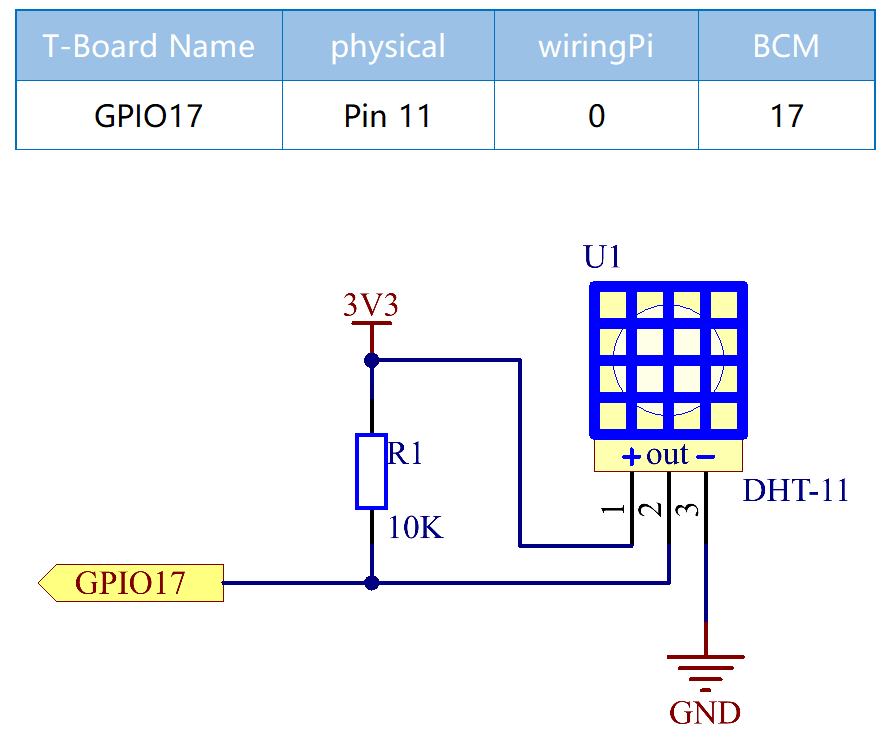
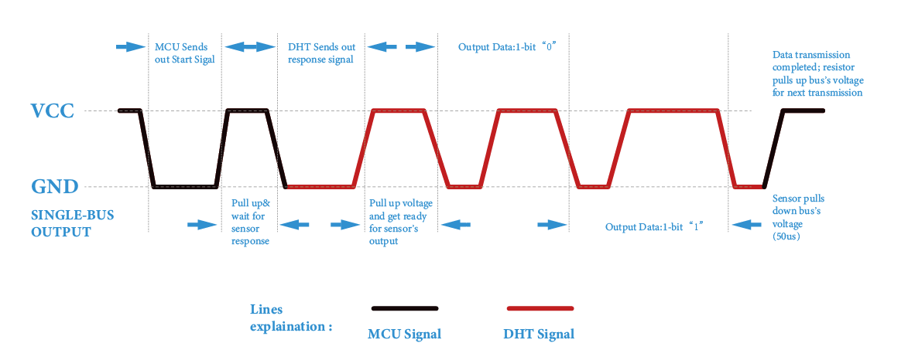

2.2.3 DHT-11
============

Introduction
--------------

The digital temperature and humidity sensor DHT11 is a composite sensor
that contains a calibrated digital signal output of temperature and
humidity. The technology of a dedicated digital modules collection and
the technology of the temperature and humidity sensing are applied to
ensure that the product has high reliability and excellent stability.

The sensors include a wet element resistive sensor and a NTC temperature
sensor and they are connected to a high performance 8-bit
microcontroller.

Components
----------

.. image:: media/list_2.2.3_dht-11.png

Principle
---------

The DHT11 is a basic, ultra low-cost digital temperature and humidity
sensor. It uses a capacitive humidity sensor and a thermistor to measure
the surrounding air, and spits out a digital signal on the data pin (no
analog input pins are needed).

.. image:: media/image205.png

Only three pins are available: VCC, GND, and DATA. The communication
process begins with the DATA line sending start signals to DHT11, and
DHT11 receives the signals and returns an answer signal. Then the host
receives the answer signal and begins to receive 40-bit humiture data
(8-bit humidity integer + 8-bit humidity decimal + 8-bit temperature
integer + 8-bit temperature decimal + 8-bit checksum). For more
information, please refer to DHT11 datasheet.

Schematic Diagram
-----------------

Experimental Procedures
-----------------------

**Step 1:** Build the circuit.

.. image:: media/image207.png

For C Language Users
^^^^^^^^^^^^^^^^^^^^

**Step 2:** Go to the folder of the code.

.. raw:: html

   <run></run>

.. code-block::

    cd /home/pi/davinci-kit-for-raspberry-pi/c/2.2.3/

**Step 3:** Compile the code.

.. raw:: html

   <run></run>

.. code-block::

    gcc 2.2.3_DHT.c -lwiringPi

**Step 4:** Run the executable file.

.. raw:: html

   <run></run>

.. code-block::

    sudo ./a.out

After the code runs, the program will print the temperature and humidity
detected by DHT11 on the computer screen.

**Code**

.. code-block:: c

    #include <wiringPi.h>
    #include <stdio.h>
    #include <stdlib.h>
    #include <stdint.h>

    #define maxTim 85
    #define dhtPin 0

    int dht11_dat[5] = {0,0,0,0,0};

    void readDht11() {
        uint8_t laststate = HIGH;
        uint8_t counter = 0;
        uint8_t j = 0, i;
        float Fah; // fahrenheit
        dht11_dat[0] = dht11_dat[1] = dht11_dat[2] = dht11_dat[3] = dht11_dat[4] = 0;
        // pull pin down for 18 milliseconds
        pinMode(dhtPin, OUTPUT);
        digitalWrite(dhtPin, LOW);
        delay(18);
        // then pull it up for 40 microseconds
        digitalWrite(dhtPin, HIGH);
        delayMicroseconds(40); 
        // prepare to read the pin
        pinMode(dhtPin, INPUT);

        // detect change and read data
        for ( i=0; i< maxTim; i++) {
            counter = 0;
            while (digitalRead(dhtPin) == laststate) {
                counter++;
                delayMicroseconds(1);
                if (counter == 255) {
                    break;
                }
            }
            laststate = digitalRead(dhtPin);

            if (counter == 255) break;
            // ignore first 3 transitions
            if ((i >= 4) && (i%2 == 0)) {
                // shove each bit into the storage bytes
                dht11_dat[j/8] <<= 1;
                if (counter > 50)
                    dht11_dat[j/8] |= 1;
                j++;
            }
        }
        // check we read 40 bits (8bit x 5 ) + verify checksum in the last byte
        // print it out if data is good
        if ((j >= 40) && 
                (dht11_dat[4] == ((dht11_dat[0] + dht11_dat[1] + dht11_dat[2] + dht11_dat[3]) & 0xFF)) ) {
            Fah = dht11_dat[2] * 9. / 5. + 32;
            printf("Humidity = %d.%d %% Temperature = %d.%d *C (%.1f *F)\n", 
                    dht11_dat[0], dht11_dat[1], dht11_dat[2], dht11_dat[3], Fah);
        }
    }

    int main (void) {
        if(wiringPiSetup() == -1){ //when initialize wiring failed, print messageto screen
            printf("setup wiringPi failed !");
            return 1; 
        }
        while (1) {
            readDht11();
            delay(500); // wait 1sec to refresh
        }
        return 0 ;
    }

**Code Explanation**

.. code-block:: c

    void readDht11() {
        uint8_t laststate = HIGH;
        uint8_t counter = 0;
        uint8_t j = 0, i;
        float Fah; // fahrenheit
        dht11_dat[0] = dht11_dat[1] = dht11_dat[2] = dht11_dat[3] = dht11_dat[4] = 0;
        // ...
    }

This function is used to realize the function of DHT11.

It generally can be divided into 3 parts:

1. prepare to read the pin:

.. code-block:: c

    // pull pin down for 18 milliseconds
    pinMode(dhtPin, OUTPUT);
    digitalWrite(dhtPin, LOW);
    delay(18);
    // then pull it up for 40 microseconds
    digitalWrite(dhtPin, HIGH);
    delayMicroseconds(40); 
    // prepare to read the pin
    pinMode(dhtPin, INPUT);

Its communication flow is determined by work timing.

When DHT11 starts up, MCU will send a low level signal and then keep the
signal at high level for 40us. After that, the detection of the
condition of external environment will start.

2. read data:

.. code-block:: c

    // detect change and read data  
    for ( i=0; i< maxTim; i++) {
            counter = 0;
            while (digitalRead(dhtPin) == laststate) {
                counter++;
                delayMicroseconds(1);
                if (counter == 255) {
                    break;
                }
            }
            laststate = digitalRead(dhtPin);
            if (counter == 255) break;
            // ignore first 3 transitions
            if ((i >= 4) && (i%2 == 0)) {
                // shove each bit into the storage bytes
                dht11_dat[j/8] <<= 1;
                if (counter > 50)
                    dht11_dat[j/8] |= 1;
                j++;
            }
        }

The loop stores the detected data in the dht11_dat[] array. DHT11
transmits data of 40 bits at a time. The first 16 bits are related to
humidity, the middle 16 bits are related to temperature, and the last
eight bits are used for verification. The data format is:

**8bit humidity integer data** + **8bit humidity decimal data** + **8bit
temperature integer data** + **8bit temperature decimal data** + **8bit
check bit**.

3. Print Humidity & Temperature.

.. code-block:: c

    // check we read 40 bits (8bit x 5 ) + verify checksum in the last byte
    // print it out if data is good
    if ((j >= 40) && 
            (dht11_dat[4] == ((dht11_dat[0] + dht11_dat[1] + dht11_dat[2] + dht11_dat[3]) & 0xFF)) ) {
        Fah = dht11_dat[2] * 9. / 5. + 32;
        printf("Humidity = %d.%d %% Temperature = %d.%d *C (%.1f *F)\n", 
                dht11_dat[0], dht11_dat[1], dht11_dat[2], dht11_dat[3], Fah);
    }

When the data storage is up to 40 bits, check the validity of the data
through the **check bit (dht11_dat[4])**, and then print the temperature
and humidity.

For example, if the received data is 00101011(8-bit value of humidity
integer) 00000000 (8-bit value of humidity decimal) 00111100 (8-bit
value of temperature integer) 00000000 (8-bit value of temperature
decimal) 01100111 (check bit)

**Calculation:**

00101011+00000000+00111100+00000000=01100111.

The final result is equal to the check bit data, then the received data
is correct:

Humidity =43%，Temperature =60*C.

If it is not equal to the check bit data, the data transmission is not
normal and the data is received again.

For Python Language Users
^^^^^^^^^^^^^^^^^^^^^^^^^

**Step 2:** Go to the folder of the code.

.. raw:: html

   <run></run>

.. code-block::

    cd /home/pi/davinci-kit-for-raspberry-pi/python/

**Step 3:** Run the executable file.

.. raw:: html

   <run></run>

.. code-block::

    sudo python3 2.2.3_DHT.py

After the code runs, the program will print the temperature and humidity
detected by DHT11 on the computer screen.

**Code**

.. code-block:: python

    import RPi.GPIO as GPIO
    import time

    dhtPin = 17

    GPIO.setmode(GPIO.BCM)

    MAX_UNCHANGE_COUNT = 100

    STATE_INIT_PULL_DOWN = 1
    STATE_INIT_PULL_UP = 2
    STATE_DATA_FIRST_PULL_DOWN = 3
    STATE_DATA_PULL_UP = 4
    STATE_DATA_PULL_DOWN = 5

    def readDht11():
        GPIO.setup(dhtPin, GPIO.OUT)
        GPIO.output(dhtPin, GPIO.HIGH)
        time.sleep(0.05)
        GPIO.output(dhtPin, GPIO.LOW)
        time.sleep(0.02)
        GPIO.setup(dhtPin, GPIO.IN, GPIO.PUD_UP)

        unchanged_count = 0
        last = -1
        data = []
        while True:
            current = GPIO.input(dhtPin)
            data.append(current)
            if last != current:
                unchanged_count = 0
                last = current
            else:
                unchanged_count += 1
                if unchanged_count > MAX_UNCHANGE_COUNT:
                    break

        state = STATE_INIT_PULL_DOWN

        lengths = []
        current_length = 0

        for current in data:
            current_length += 1

            if state == STATE_INIT_PULL_DOWN:
                if current == GPIO.LOW:
                    state = STATE_INIT_PULL_UP
                else:
                    continue
            if state == STATE_INIT_PULL_UP:
                if current == GPIO.HIGH:
                    state = STATE_DATA_FIRST_PULL_DOWN
                else:
                    continue
            if state == STATE_DATA_FIRST_PULL_DOWN:
                if current == GPIO.LOW:
                    state = STATE_DATA_PULL_UP
                else:
                    continue
            if state == STATE_DATA_PULL_UP:
                if current == GPIO.HIGH:
                    current_length = 0
                    state = STATE_DATA_PULL_DOWN
                else:
                    continue
            if state == STATE_DATA_PULL_DOWN:
                if current == GPIO.LOW:
                    lengths.append(current_length)
                    state = STATE_DATA_PULL_UP
                else:
                    continue
        if len(lengths) != 40:
            #print ("Data not good, skip")
            return False

        shortest_pull_up = min(lengths)
        longest_pull_up = max(lengths)
        halfway = (longest_pull_up + shortest_pull_up) / 2
        bits = []
        the_bytes = []
        byte = 0

        for length in lengths:
            bit = 0
            if length > halfway:
                bit = 1
            bits.append(bit)
        #print ("bits: %s, length: %d" % (bits, len(bits)))
        for i in range(0, len(bits)):
            byte = byte << 1
            if (bits[i]):
                byte = byte | 1
            else:
                byte = byte | 0
            if ((i + 1) % 8 == 0):
                the_bytes.append(byte)
                byte = 0
        #print (the_bytes)
        checksum = (the_bytes[0] + the_bytes[1] + the_bytes[2] + the_bytes[3]) & 0xFF
        if the_bytes[4] != checksum:
            #print ("Data not good, skip")
            return False

        return the_bytes[0], the_bytes[2]

    def main():

        while True:
            result = readDht11()
            if result:
                humidity, temperature = result
                print ("humidity: %s %%,  Temperature: %s C`" % (humidity, temperature))
            time.sleep(1)

    def destroy():
        GPIO.cleanup()

    if __name__ == '__main__':
        try:
            main()
        except KeyboardInterrupt:
            destroy() 

**Code Explanation**

.. code-block:: python

    def readDht11():
        GPIO.setup(dhtPin, GPIO.OUT)
        GPIO.output(dhtPin, GPIO.HIGH)
        time.sleep(0.05)
        GPIO.output(dhtPin, GPIO.LOW)
        time.sleep(0.02)
        GPIO.setup(dhtPin, GPIO.IN, GPIO.PUD_UP)
        unchanged_count = 0
        last = -1
        data = []
        #...

This function is used to implement the functions of DHT11. It stores the
detected data in the the_bytes[] array. DHT11 transmits data of 40 bits
at a time. The first 16 bits are related to humidity, the middle 16 bits
are related to temperature, and the last eight bits are used for
verification. The data format is:

**8bit humidity integer data** +\ **8bit humidity decimal data**
+\ **8bit temperature integer data** + **8bit temperature decimal data**
+ **8bit check bit**.

When the validity is detected via the check bit, the function returns
two results: 1. error; 2. humidity and temperature.

.. code-block:: python

    checksum = (the_bytes[0] + the_bytes[1] + the_bytes[2] + the_bytes[3]) & 0xFF
    if the_bytes[4] != checksum:
        #print ("Data not good, skip")
        return False

    return the_bytes[0], the_bytes[2]

For example, if the received date is 00101011(8-bit value of humidity
integer) 00000000 (8-bit value of humidity decimal) 00111100 (8-bit
value of temperature integer) 00000000 (8-bit value of temperature
decimal) 01100111 (check bit)

**Calculation:**

00101011+00000000+00111100+00000000=01100111.

If the final result is equal to the check bit data, the data
transmission is abnormal: return False.

If the final result is equal to the check bit data, the received data is
correct, then there will return the_bytes[0] and the_bytes[2] and output
“Humidity =43%，Temperature =60C”.

Phenomenon Picture
------------------

.. image:: media/image209.jpeg