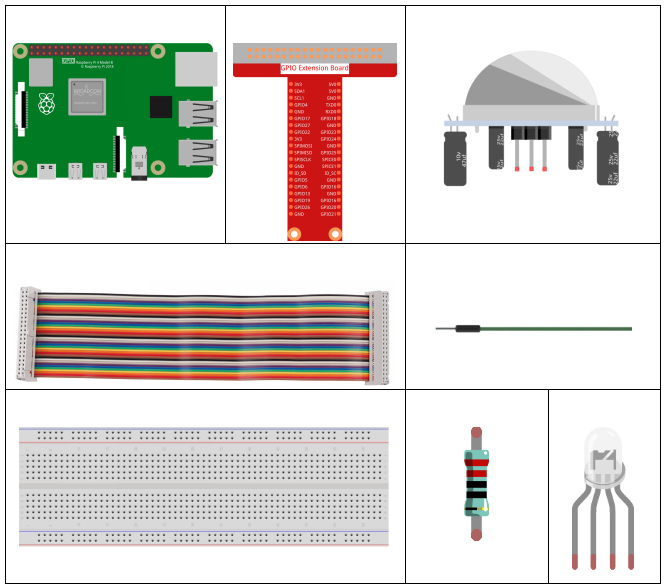
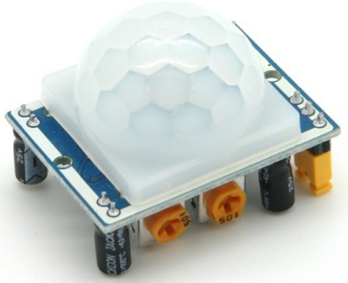
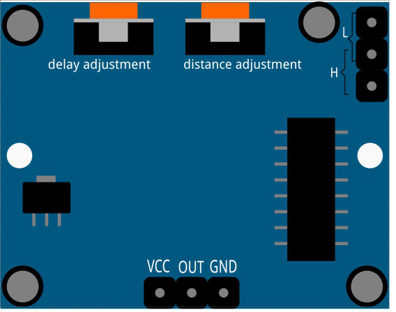
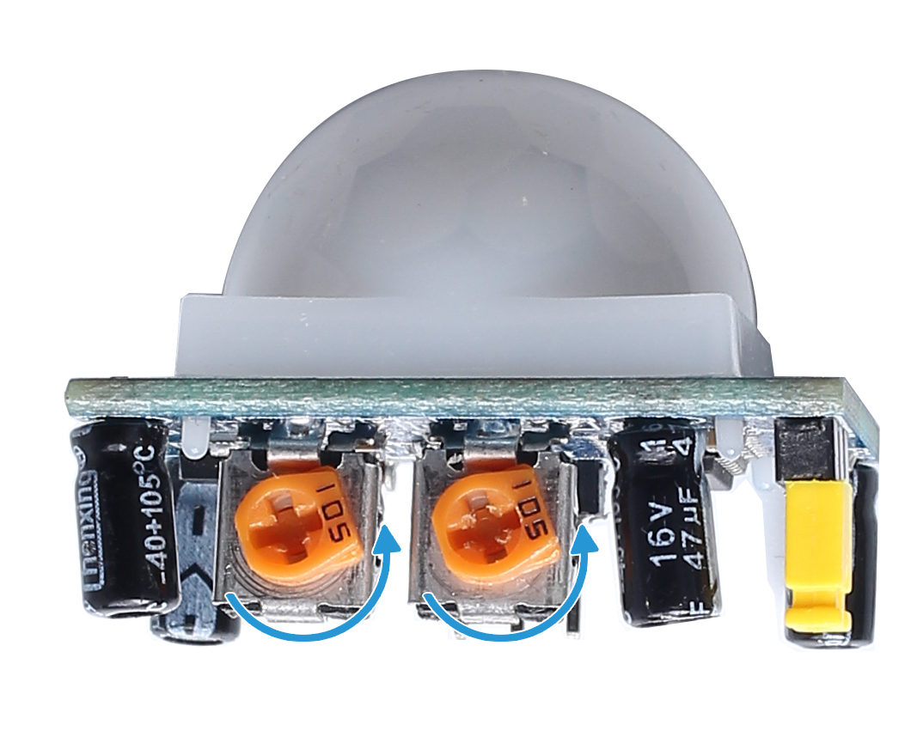

2.2.4 PIR
=========

前書き
------------

このプロジェクトでは、人体の赤外線焦電センサーを使用してデバイスを作成する。誰かがLEDに近づくと、LEDは自動的に点灯する。そうでない場合、ライトは消灯する。この赤外線モーションセンサーは、人間や動物が発する赤外線を検出できるセンサーの一種である。

部品
----------

原理
---------

PIRセンサーは、赤外線熱放射を検出し、赤外線熱放射を放出する生物の存在を検出するために使用できる。

PIRセンサーは差動増幅器に接続される2つのスロットに分割される。
静止物体がセンサーの前にあるときはいつでも、二つのスロットは同じ量の放射線を受け取り、
出力はゼロである。動いている物体がセンサーの前にあるときはいつでも、
スロットの一つが他のスロットよりも多くの放射線を受け取り、出力を上下に変動させる。
この出力電圧の変化は、動きの検出の結果である。

検知モジュールの配線後、1分間の初期化が行われる。初期化中に、モジュールは間隔を置いて0〜3回出力する。その後、モジュールはスタンバイモードになる。干渉信号によって引き起こされる誤動作を避けるために、光源と他の源の干渉をモジュールの表面から遠ざけてください。
風はセンサーにも干渉する可能性があるため、風があまり無くてモジュールを使用することをお勧めする。

**距離調整**

距離調整ポテンショメータのノブを時計回りに回すと、検知距離の範囲が広がり、
最大検知距離範囲は約0〜7メートルである。
反時計回りに回すと、検知距離の範囲が狭くなり、最小検知距離の範囲は約0〜3メートルである。

**遅延調整**

遅延調整ポテンショメーターのノブを時計回りに回すと、検知遅延が増加することも分かる。
検知遅延の最大値は、最大300秒に達する可能性がある。
逆に、反時計回りに回転させると、最小5秒で遅延を短縮できる。

二つのトリガーモード：（ジャンパーキャップを使用して異なるモードを選択する）。

* **H： 繰り返し可能なトリガーモード**、人体を感知した後、モジュールは高レベルを出力します。 その後の遅延期間中に、誰かが検知範囲に入ると、出力は高レベルのままになります。

* **L： 繰り返し不可のトリガーモード**、人体を感知すると高レベルを出力します。 遅延後、出力は自動的に高レベルから低レベルに変わります。

回路図
-----------------

.. image:: media/image327.png

実験手順
-----------------------

ステップ1： 回路を作る。

.. image:: media/image214.png
    :width: 800

C言語ユーザー向け
^^^^^^^^^^^^^^^^^^^^

ステップ2： コードのフォルダーに入る。

.. raw:: html

   <run></run>

.. code-block::

    cd /home/pi/davinci-kit-for-raspberry-pi/c/2.2.4/

ステップ3： コードをコンパイルする。

.. raw:: html

   <run></run>

.. code-block::

    gcc 2.2.4_PIR.c -lwiringPi

ステップ4： EXEファイルを実行する。

.. raw:: html

   <run></run>

.. code-block::

    sudo ./a.out

コードの実行後、PIR は周囲を検出し、誰かが通り過ぎるのを感知すると、
RGB LED を黄色に点灯させます。 PIR モジュールには 2 つのポテンショメータがあり、
1 つは感度を調整するためのもので、もう 1 つは検出距離を調整するためのものです。 
PIR モジュールがうまく機能するためには、両方を完全に反時計回りに回す必要があります。

**コード**

.. code-block:: c

    #include <wiringPi.h>
    #include <softPwm.h>
    #include <stdio.h>
    #define uchar unsigned char

    #define pirPin    0     //the pir connect to GPIO0
    #define redPin    1
    #define greenPin  2
    #define bluePin   3

    void ledInit(void){
        softPwmCreate(redPin,  0, 100);
        softPwmCreate(greenPin,0, 100);
        softPwmCreate(bluePin, 0, 100);
    }
    void ledColorSet(uchar r_val, uchar g_val, uchar b_val){
        softPwmWrite(redPin,   r_val);
        softPwmWrite(greenPin, g_val);
        softPwmWrite(bluePin,  b_val);
    }
    int main(void)
    {
        int pir_val;
        if(wiringPiSetup() == -1){ //when initialize wiring failed,print message to screen
            printf("setup wiringPi failed !");
            return 1;
        }
        ledInit();
        pinMode(pirPin, INPUT);
        while(1){
        pir_val = digitalRead(pirPin);
            if(pir_val== 1){ //if read pir is HIGH level
                ledColorSet(0xff,0xff,0x00); 
            }
            else {
            ledColorSet(0x00,0x00,0xff); 
            }
        }
        return 0;
    }

**コードの 説明**

.. code-block:: c

    void ledInit(void);
    void ledColorSet(uchar r_val, uchar g_val, uchar b_val);

これらのコードは、RGB LEDの色を設定するために使用されます。詳細については、 :ref:`1.1.2 RGB LED` を参照してください。

.. code-block:: c

    int main(void)
    {
        int pir_val;
        //…… 
        pinMode(pirPin, INPUT);
        while(1){
        pir_val = digitalRead(pirPin);
            if(pir_val== 1){ //if read pir is HIGH level
                ledColorSet(0xff,0xff,0x00); 
            }
            else {
            ledColorSet(0x00,0x00,0xff); 
            }
        }
        return 0;
    }

PIRが人間の赤外線スペクトルを検出すると、RGB LEDが黄色の光を発する。そうでない場合は、青色の光を発する。

Python言語ユーザー向け
^^^^^^^^^^^^^^^^^^^^^^^^^

ステップ2： コードのフォルダーに入る。

.. raw:: html

   <run></run>

.. code-block::

    cd /home/pi/davinci-kit-for-raspberry-pi/python/

ステップ3： EXEファイルを実行する。

.. raw:: html

   <run></run>

.. code-block::

    sudo python3 2.2.4_PIR.py

コードの実行後、PIR は周囲を検出し、誰かが通り過ぎるのを感知すると、
RGB LED を黄色に点灯させます。 PIR モジュールには 2 つのポテンショメータがあり、
1 つは感度を調整するためのもので、もう 1 つは検出距離を調整するためのものです。 
PIR モジュールがうまく機能するためには、両方を完全に反時計回りに回す必要があります。

**コード**

.. note::

   以下のコードを **変更/リセット/コピー/実行/停止** できます。 ただし、その前に、 ``davinci-kit-for-raspberry-pi/python`` のようなソースコードパスに移動する必要があります。 
   

.. raw:: html

    <run></run>

.. code-block:: python

    import RPi.GPIO as GPIO
    import time

    rgbPins = {'Red':18, 'Green':27, 'Blue':22}
    pirPin = 17    # the pir connect to pin17

    def setup():
        global p_R, p_G, p_B
        GPIO.setmode(GPIO.BCM)		# Set the GPIO modes to BCM Numbering
        GPIO.setup(pirPin, GPIO.IN)    # Set pirPin to input
        # Set all LedPin's mode to output and initial level to High(3.3v)
        for i in rgbPins:
            GPIO.setup(rgbPins[i], GPIO.OUT, initial=GPIO.HIGH)

        # Set all led as pwm channel and frequece to 2KHz
        p_R = GPIO.PWM(rgbPins['Red'], 2000)
        p_G = GPIO.PWM(rgbPins['Green'], 2000)
        p_B = GPIO.PWM(rgbPins['Blue'], 2000)

        # Set all begin with value 0
        p_R.start(0)
        p_G.start(0)
        p_B.start(0)

    # Define a MAP function for mapping values.  Like from 0~255 to 0~100
    def MAP(x, in_min, in_max, out_min, out_max):
        return (x - in_min) * (out_max - out_min) / (in_max - in_min) + out_min

    # Define a function to set up colors 
    def setColor(color):
    # configures the three LEDs' luminance with the inputted color value . 
        # Devide colors from 'color' veriable
        R_val = (color & 0xFF0000) >> 16
        G_val = (color & 0x00FF00) >> 8
        B_val = (color & 0x0000FF) >> 0
        # Map color value from 0~255 to 0~100
        R_val = MAP(R_val, 0, 255, 0, 100)
        G_val = MAP(G_val, 0, 255, 0, 100)
        B_val = MAP(B_val, 0, 255, 0, 100)
        
        #Assign the mapped duty cycle value to the corresponding PWM channel to change the luminance. 
        p_R.ChangeDutyCycle(R_val)
        p_G.ChangeDutyCycle(G_val)
        p_B.ChangeDutyCycle(B_val)
        #print ("color_msg: R_val = %s,	G_val = %s,	B_val = %s"%(R_val, G_val, B_val))

    def loop():
        while True:
            pir_val = GPIO.input(pirPin)
            if pir_val==GPIO.HIGH:
                setColor(0xFFFF00)
            else :
                setColor(0x0000FF)

    def destroy():
        p_R.stop()
        p_G.stop()
        p_B.stop()
        GPIO.cleanup()                     # Release resource

    if __name__ == '__main__':     # Program start from here
        setup()
        try:
            loop()
        except KeyboardInterrupt:  # When 'Ctrl+C' is pressed, the child program destroy() will be  executed.
            destroy()

**コードの 説明**

.. code-block:: python

    rgbPins = {'Red':18, 'Green':27, 'Blue':22}

    def setup():
        global p_R, p_G, p_B
        GPIO.setmode(GPIO.BCM)  
        # …… 
        for i in rgbPins:
            GPIO.setup(rgbPins[i], GPIO.OUT, initial=GPIO.HIGH)
        p_R = GPIO.PWM(rgbPins['Red'], 2000)
        p_G = GPIO.PWM(rgbPins['Green'], 2000)
        p_B = GPIO.PWM(rgbPins['Blue'], 2000)
        p_R.start(0)
        p_G.start(0)
        p_B.start(0)

    def MAP(x, in_min, in_max, out_min, out_max):
        return (x - in_min) * (out_max - out_min) / (in_max - in_min) + out_min

    def setColor(color):
    ...

これらのコードは、RGB LEDの色を設定するために使用されます。詳細については、 :ref:`1.1.2 RGB LED` を参照してください。

.. code-block:: python

    def loop():
        while True:
            pir_val = GPIO.input(pirPin)
            if pir_val==GPIO.HIGH:
                setColor(0xFFFF00)
            else :
                setColor(0x0000FF)

PIRが人間の赤外線スペクトルを検出すると、RGB LEDが黄色の光を発する。そうでない場合は、青色の光を発する。

現象画像
------------------

.. image:: media/image215.jpeg