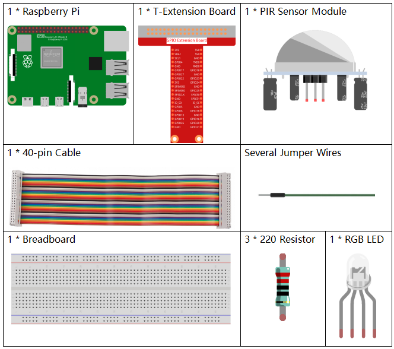
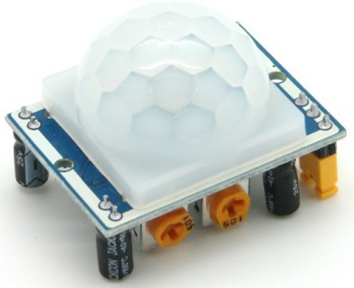
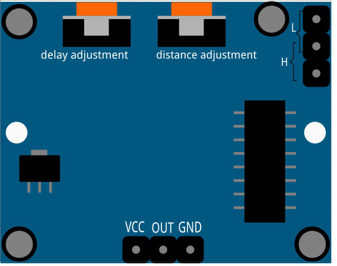
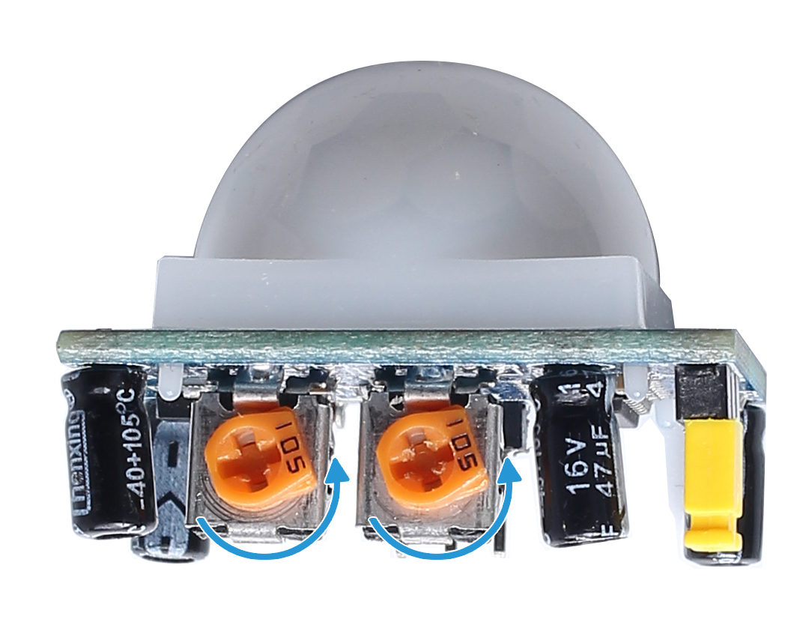

.. note::

    Ciao, benvenuto nella Community SunFounder Raspberry Pi & Arduino & ESP32 Enthusiasts su Facebook! Approfondisci l’uso di Raspberry Pi, Arduino ed ESP32 con altri appassionati.

    **Perché unirsi?**

    - **Supporto tecnico**: Risolvi problemi post-vendita e sfide tecniche con l’aiuto della nostra community e del team.
    - **Impara e condividi**: Scambia consigli e tutorial per migliorare le tue competenze.
    - **Anteprime esclusive**: Ottieni accesso anticipato a nuove presentazioni di prodotti.
    - **Sconti speciali**: Goditi sconti esclusivi sui nostri prodotti più recenti.
    - **Promozioni e omaggi**: Partecipa a promozioni e omaggi speciali.

    👉 Pronto a esplorare e creare con noi? Clicca su [|link_sf_facebook|] e unisciti oggi stesso!

2.2.4 PIR
===========

Introduzione
---------------

In questo progetto, costruiremo un dispositivo utilizzando un sensore 
piroelettrico a infrarossi per il rilevamento del corpo umano. Quando 
qualcuno si avvicina al LED, questo si accenderà automaticamente. In 
assenza di movimento, il LED si spegnerà. Questo sensore di movimento 
a infrarossi è un tipo di sensore capace di rilevare l’infrarosso emesso 
da esseri umani e animali.

Componenti
--------------

Principio
------------

Il sensore PIR rileva la radiazione infrarossa emessa dal calore corporeo, 
rendendolo adatto per rilevare la presenza di esseri viventi che emettono 
radiazione termica infrarossa.

Il sensore PIR è suddiviso in due slot collegati a un amplificatore differenziale. 
Quando un oggetto stazionario si trova di fronte al sensore, i due slot ricevono 
la stessa quantità di radiazione e l'uscita è zero. Se un oggetto in movimento è 
davanti al sensore, uno degli slot riceve più radiazione dell’altro, provocando 
una variazione dell'uscita in alto o in basso. Questa variazione nella tensione 
di uscita indica la rilevazione di un movimento.

Dopo il collegamento del modulo di rilevamento, segue un periodo di 
inizializzazione di circa un minuto. Durante questa fase, il modulo 
potrebbe emettere segnali di uscita per 0~3 volte a intervalli. 
Successivamente, il modulo entra in modalità standby. È importante 
evitare che la luce o altre fonti di disturbo interferiscano con la 
superficie del modulo per evitare attivazioni accidentali dovute a 
segnali di interferenza. Anche il vento può interferire con il sensore, 
quindi è preferibile utilizzare il modulo in ambienti senza troppa corrente 
d’aria.

**Regolazione della distanza**

Ruotando in senso orario la manopola del potenziometro di regolazione della 
distanza, il raggio di rilevamento aumenta, fino a un massimo di circa 7 metri. 
Ruotandola in senso antiorario, la distanza di rilevamento diminuisce fino a 
un minimo di circa 3 metri.

**Regolazione del ritardo**

Ruotando in senso orario la manopola del potenziometro di regolazione del ritardo, si aumenta il tempo di rilevamento, con un massimo di ritardo fino a 300 secondi. In senso antiorario, il ritardo diminuisce fino a un minimo di 5 secondi.

Due modalità di attivazione: (selezionabili tramite il ponticello).

- **H:** **Modalità di attivazione ripetibile**: dopo aver rilevato una persona, il modulo emette un segnale ad alto livello. Durante il periodo di ritardo, se qualcuno entra nel raggio di rilevamento, l'uscita rimarrà a livello alto.
  
- **L:** **Modalità di attivazione non ripetibile**: emette un segnale ad alto livello quando rileva una persona. Dopo il ritardo, l'uscita passa automaticamente da alto a basso.

Schema del circuito
-------------------

.. image:: img/image327.png

Procedure sperimentali
----------------------

**Step 1:** Costruire il circuito.

.. image:: img/image214.png
    :width: 800

Per gli utenti di C
^^^^^^^^^^^^^^^^^^^^

**Step 2:** Vai alla cartella del codice.

.. raw:: html

   <run></run>

.. code-block::

    cd ~/davinci-kit-for-raspberry-pi/c/2.2.4/

**Step 3:** Compila il codice.

.. raw:: html

   <run></run>

.. code-block::

    gcc 2.2.4_PIR.c -lwiringPi

**Step 4:** Esegui il file eseguibile.

.. raw:: html

   <run></run>

.. code-block::

    sudo ./a.out

Dopo l’esecuzione del codice, il PIR rileva l'ambiente circostante e accende il LED 
RGB con un colore giallo se rileva qualcuno nelle vicinanze. Ci sono due potenziometri 
sul modulo PIR: uno per regolare la sensibilità e l'altro per la distanza di rilevamento. 
Per migliorare il funzionamento del modulo PIR, si consiglia di ruotarli entrambi in senso 
antiorario fino in fondo.

.. note::

    Se il codice non funziona o appare l'errore: \"wiringPi.h: No such file or directory\", consulta la sezione :ref:`Il codice C non funziona?`.

**Codice**

.. code-block:: c

    #include <wiringPi.h>
    #include <softPwm.h>
    #include <stdio.h>
    #define uchar unsigned char

    #define pirPin    0     // il PIR è collegato al GPIO0
    #define redPin    1
    #define greenPin  2
    #define bluePin   3

    void ledInit(void){
        softPwmCreate(redPin,  0, 100);
        softPwmCreate(greenPin,0, 100);
        softPwmCreate(bluePin, 0, 100);
    }
    void ledColorSet(uchar r_val, uchar g_val, uchar b_val){
        softPwmWrite(redPin,   r_val);
        softPwmWrite(greenPin, g_val);
        softPwmWrite(bluePin,  b_val);
    }
    int main(void)
    {
        int pir_val;
        if(wiringPiSetup() == -1){ // se l'inizializzazione fallisce, stampa un messaggio
            printf("setup wiringPi failed !");
            return 1;
        }
        ledInit();
        pinMode(pirPin, INPUT);
        while(1){
            pir_val = digitalRead(pirPin);
            if(pir_val == 1){ // se il PIR rileva un livello alto
                ledColorSet(0xff,0xff,0x00); 
            }
            else {
                ledColorSet(0x00,0x00,0xff); 
            }
        }
        return 0;
    }

**Spiegazione del Codice**

.. code-block:: c

    void ledInit(void);
    void ledColorSet(uchar r_val, uchar g_val, uchar b_val);

Queste funzioni sono usate per impostare il colore del LED RGB. Per ulteriori 
dettagli, fare riferimento a :ref:`1.1.2 LED RGB`.

.. code-block:: c

    int main(void)
    {
        int pir_val;
        //…… 
        pinMode(pirPin, INPUT);
        while(1){
            pir_val = digitalRead(pirPin);
            if(pir_val == 1){ // se il PIR rileva un livello alto
                ledColorSet(0xff,0xff,0x00); 
            }
            else {
                ledColorSet(0x00,0x00,0xff); 
            }
        }
        return 0;
    }

Quando il sensore PIR rileva lo spettro infrarosso umano, il LED RGB emette 
luce gialla; altrimenti emette luce blu.

Per gli utenti Python
^^^^^^^^^^^^^^^^^^^^^^^^^

**Passaggio 2:** Vai alla cartella del codice.

.. raw:: html

   <run></run>

.. code-block::

    cd ~/davinci-kit-for-raspberry-pi/python/

**Passaggio 3:** Esegui il file eseguibile.

.. raw:: html

   <run></run>

.. code-block::

    sudo python3 2.2.4_PIR.py

Dopo l’esecuzione del codice, il sensore PIR rileva l’ambiente circostante 
e accende il LED RGB con una luce gialla se rileva qualcuno nelle vicinanze. 
Sul modulo PIR ci sono due potenziometri: uno per regolare la sensibilità e 
l'altro per la distanza di rilevamento. Per ottenere prestazioni ottimali dal 
modulo PIR, si consiglia di ruotarli entrambi completamente in senso antiorario.

**Codice**

.. note::

    Puoi **Modificare/Reimpostare/Copiare/Eseguire/Interrompere** il codice qui sotto. Prima di procedere, però, assicurati di trovarti nel percorso del codice sorgente, ad esempio ``davinci-kit-for-raspberry-pi/python``.

.. raw:: html

    <run></run>

.. code-block:: python

    import RPi.GPIO as GPIO
    import time

    rgbPins = {'Red':18, 'Green':27, 'Blue':22}
    pirPin = 17    # il sensore PIR è collegato al pin 17

    def setup():
        global p_R, p_G, p_B
        GPIO.setmode(GPIO.BCM)		# Imposta la modalità GPIO su numerazione BCM
        GPIO.setup(pirPin, GPIO.IN)    # Configura pirPin come input
        # Imposta tutti i LedPin come output e livello iniziale su Alto (3,3V)
        for i in rgbPins:
            GPIO.setup(rgbPins[i], GPIO.OUT, initial=GPIO.HIGH)

        # Configura ogni LED come canale PWM con frequenza di 2KHz
        p_R = GPIO.PWM(rgbPins['Red'], 2000)
        p_G = GPIO.PWM(rgbPins['Green'], 2000)
        p_B = GPIO.PWM(rgbPins['Blue'], 2000)

        # Inizializza il valore di tutti i LED a 0
        p_R.start(0)
        p_G.start(0)
        p_B.start(0)

    # Definisce una funzione MAP per mappare i valori, ad esempio da 0~255 a 0~100
    def MAP(x, in_min, in_max, out_min, out_max):
        return (x - in_min) * (out_max - out_min) / (in_max - in_min) + out_min

    # Definisce una funzione per impostare i colori
    def setColor(color):
        # Configura la luminosità dei tre LED in base al valore colore in ingresso
        R_val = (color & 0xFF0000) >> 16
        G_val = (color & 0x00FF00) >> 8
        B_val = (color & 0x0000FF) >> 0
        # Mappa i valori del colore da 0~255 a 0~100
        R_val = MAP(R_val, 0, 255, 0, 100)
        G_val = MAP(G_val, 0, 255, 0, 100)
        B_val = MAP(B_val, 0, 255, 0, 100)
        
        # Assegna il valore del duty cycle mappato al corrispondente canale PWM per cambiare la luminosità
        p_R.ChangeDutyCycle(R_val)
        p_G.ChangeDutyCycle(G_val)
        p_B.ChangeDutyCycle(B_val)
        #print ("color_msg: R_val = %s, G_val = %s, B_val = %s"%(R_val, G_val, B_val))

    def loop():
        while True:
            pir_val = GPIO.input(pirPin)
            if pir_val==GPIO.HIGH:
                setColor(0xFFFF00)
            else :
                setColor(0x0000FF)

    def destroy():
        p_R.stop()
        p_G.stop()
        p_B.stop()
        GPIO.cleanup()                     # Rilascia le risorse

    if __name__ == '__main__':     # Inizio programma
        setup()
        try:
            loop()
        except KeyboardInterrupt:  # Quando viene premuto 'Ctrl+C', viene eseguito destroy()
            destroy()

**Spiegazione del Codice**

.. code-block:: python

    rgbPins = {'Red':18, 'Green':27, 'Blue':22}

    def setup():
        global p_R, p_G, p_B
        GPIO.setmode(GPIO.BCM)  
        # …… 
        for i in rgbPins:
            GPIO.setup(rgbPins[i], GPIO.OUT, initial=GPIO.HIGH)
        p_R = GPIO.PWM(rgbPins['Red'], 2000)
        p_G = GPIO.PWM(rgbPins['Green'], 2000)
        p_B = GPIO.PWM(rgbPins['Blue'], 2000)
        p_R.start(0)
        p_G.start(0)
        p_B.start(0)

    def MAP(x, in_min, in_max, out_min, out_max):
        return (x - in_min) * (out_max - out_min) / (in_max - in_min) + out_min

    def setColor(color):
    ...

Questi codici sono utilizzati per impostare il colore del LED RGB; 
per maggiori dettagli consulta :ref:`1.1.2 LED RGB`.

.. code-block:: python

    def loop():
        while True:
            pir_val = GPIO.input(pirPin)
            if pir_val==GPIO.HIGH:
                setColor(0xFFFF00)
            else :
                setColor(0x0000FF)

Quando il PIR rileva lo spettro infrarosso di un essere umano, il LED RGB 
emette luce gialla; altrimenti emette luce blu.

Immagine Dimostrativa
------------------------

.. image:: img/image215.jpeg