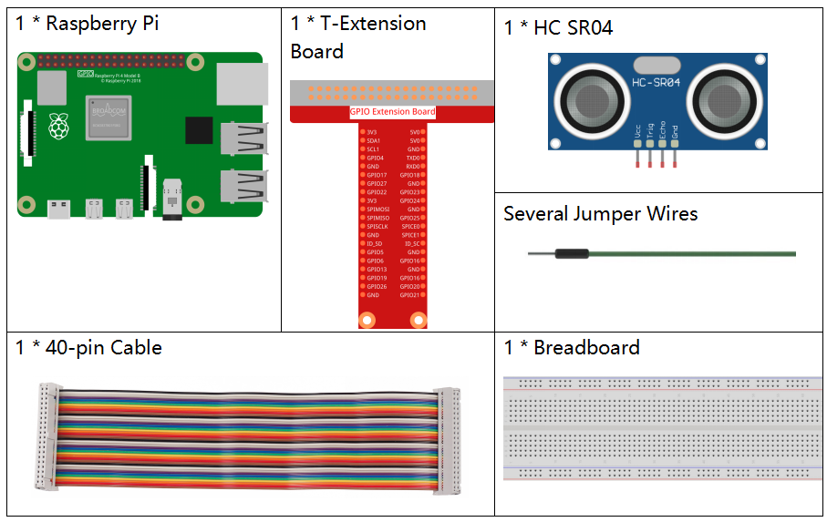
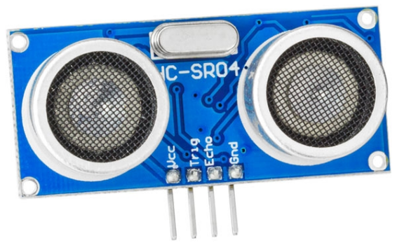

2.2.5 Ultrasonic Sensor Module
==============================

Introduction
--------------

The ultrasonic sensor uses ultrasonic to accurately detect objects and
measure distances. It sends out ultrasonic waves and converts them into
electronic signals.

Components
----------

Principle
---------

**Ultrasonic**

Ultrasonic ranging module provides 2cm - 400cm non-contact measurement
function, and the ranging accuracy can reach to 3mm. It can ensure that
the signal is stable within 5m, and the signal is gradually weakened
after 5m, till the 7m position disappears.

The module includes ultrasonic transmitters, receiver and control
circuit. The basic principles are as follows:

(1)Use an IO flip-flop to process a high level signal of at least 10us.

(2)The module automatically sends eight 40khz and detects if there is a
pulse signal return.

(3)If the signal returns, passing the high level, the high output IO
duration is the time from the transmission of the ultrasonic wave to the
return of it. Here, test distance = (high time x sound speed (340 m / s)
/ 2.

.. image:: media/image328.png
    :width: 500

The timing diagram is shown below. You only need to supply a short 10us
pulse for the trigger input to start the ranging, and then the module
will send out an 8 cycle burst of ultrasound at 40 kHz and raise its
echo. You can calculate the range through the time interval between
sending trigger signal and receiving echo signal.

Formula: us / 58 = centimeters or us / 148 =inch; or: the range = high
level time \* velocity (340M/S) / 2; you are suggested to use
measurement cycle over 60ms in order to prevent signal collisions of
trigger signal and the echo signal.

.. image:: media/image218.png
    :width: 800

Schematic Diagram
-----------------

.. image:: media/image329.png

Experimental Procedures
-----------------------

**Step 1:** Build the circuit.

.. image:: media/image220.png
    :width: 800

For C Language Users
^^^^^^^^^^^^^^^^^^^^

**Step 2:** Go to the folder of the code.

.. raw:: html

   <run></run>

.. code-block::

    cd /home/pi/davinci-kit-for-raspberry-pi/c/2.2.5/

**Step 3:** Compile the code.

.. raw:: html

   <run></run>

.. code-block::

    gcc 2.2.5_Ultrasonic.c -lwiringPi

**Step 4:** Run the executable file.

.. raw:: html

   <run></run>

.. code-block::

    sudo ./a.out

With the code run, the ultrasonic sensor module detects the distance
between the obstacle ahead and the module itself, then the distance
value will be printed on the screen.

.. note::

    If it does not work after running, or there is an error prompt: \"wiringPi.h: No such file or directory\", please refer to :ref:`C code is not working?`.

**Code**

.. code-block:: c

    #include <wiringPi.h>
    #include <stdio.h>
    #include <sys/time.h>

    #define Trig    4
    #define Echo    5

    void ultraInit(void)
    {
        pinMode(Echo, INPUT);
        pinMode(Trig, OUTPUT);
    }

    float disMeasure(void)
    {
        struct timeval tv1;
        struct timeval tv2;
        long time1, time2;
    float dis;

        digitalWrite(Trig, LOW);
        delayMicroseconds(2);

        digitalWrite(Trig, HIGH);
        delayMicroseconds(10);      
        digitalWrite(Trig, LOW);
                                    
        while(!(digitalRead(Echo) == 1));   
        gettimeofday(&tv1, NULL);           

        while(!(digitalRead(Echo) == 0));   
        gettimeofday(&tv2, NULL);           

        time1 = tv1.tv_sec * 1000000 + tv1.tv_usec;   
        time2  = tv2.tv_sec * 1000000 + tv2.tv_usec;

        dis = (float)(time2 - time1) / 1000000 * 34000 / 2;  

        return dis;
    }

    int main(void)
    {
        float dis;
        if(wiringPiSetup() == -1){ //when initialize wiring failed,print message to screen
            printf("setup wiringPi failed !");
            return 1;
        }

        ultraInit();
        
        while(1){
            dis = disMeasure();
            printf("%0.2f cm\n\n",dis);
            delay(300);
        }

        return 0;
    }

**Code Explanation**

.. code-block:: c

    void ultraInit(void)
    {
        pinMode(Echo, INPUT);
        pinMode(Trig, OUTPUT);
    }

Initialize the ultrasonic pin; meanwhile, set Echo to input, Trig to
output.

.. code-block:: c

    float disMeasure(void){};

This function is used to realize the function of ultrasonic sensor by
calculating the return detection distance.

.. code-block:: c

    struct timeval tv1;
    struct timeval tv2;

Struct timeval is a structure used to store the current time. The
complete structure is as follows:

.. code-block:: c

    struct timeval
    {
    __time_t tv_sec;        /* Seconds. */
    __suseconds_t tv_usec;  /* Microseconds. */
    };

Here, tv_sec represents the seconds that Epoch spent when creating
struct timeval. Tv_usec stands for microseconds or a fraction of
seconds.

.. code-block:: c

    digitalWrite(Trig, HIGH);
    delayMicroseconds(10);     
    digitalWrite(Trig, LOW);

A 10us ultrasonic pulse is being sent out.

.. code-block:: c

    while(!(digitalRead(Echo) == 1));
    gettimeofday(&tv1, NULL);

This empty loop is used to ensure that when the trigger signal is sent,
there is no interfering echo signal and then get the current time.

.. code-block:: c

    while(!(digitalRead(Echo) == 0)); 
    gettimeofday(&tv2, NULL);

This empty loop is used to ensure that the next step is not performed
until the echo signal is received and then get the current time.

.. code-block:: c

    time1 = tv1.tv_sec * 1000000 + tv1.tv_usec;
    time2  = tv2.tv_sec * 1000000 + tv2.tv_usec;

Convert the time stored by struct timeval into a full microsecond time.

.. code-block:: c

    dis = (float)(time2 - time1) / 1000000 * 34000 / 2;  

The distance is calculated by the time interval and the speed of sound
propagation. The speed of sound in the air: 34000cm/s.

For Python Language Users
^^^^^^^^^^^^^^^^^^^^^^^^^

**Step 2:** Go to the folder of the code.

.. raw:: html

   <run></run>

.. code-block::

    cd /home/pi/davinci-kit-for-raspberry-pi/python/

**Step 3:** Run the executable file.

.. raw:: html

   <run></run>

.. code-block::

    sudo python3 2.2.5_Ultrasonic.py

With the code run, the ultrasonic sensor module detects the distance
between the obstacle ahead and the module itself, then the distance
value will be printed on the screen.

**Code**

.. note::

    You can **Modify/Reset/Copy/Run/Stop** the code below. But before that, you need to go to  source code path like ``davinci-kit-for-raspberry-pi/python``. 
    
.. raw:: html

    <run></run>

.. code-block:: python

    import RPi.GPIO as GPIO
    import time

    TRIG = 16
    ECHO = 18

    def setup():
        GPIO.setmode(GPIO.BOARD)
        GPIO.setup(TRIG, GPIO.OUT)
        GPIO.setup(ECHO, GPIO.IN)

    def distance():
        GPIO.output(TRIG, 0)
        time.sleep(0.000002)

        GPIO.output(TRIG, 1)
        time.sleep(0.00001)
        GPIO.output(TRIG, 0)

        
        while GPIO.input(ECHO) == 0:
            a = 0
        time1 = time.time()
        while GPIO.input(ECHO) == 1:
            a = 1
        time2 = time.time()

        during = time2 - time1
        return during * 340 / 2 * 100

    def loop():
        while True:
            dis = distance()
            print ('Distance: %.2f' % dis)
            time.sleep(0.3)

    def destroy():
        GPIO.cleanup()

    if __name__ == "__main__":
        setup()
        try:
            loop()
        except KeyboardInterrupt:
            destroy()

**Code Explanation**

.. code-block:: python

    def distance():

This function is used to realize the function of ultrasonic sensor by
calculating the return detection distance.

.. code-block:: python

    GPIO.output(TRIG, 1)
    time.sleep(0.00001)
    GPIO.output(TRIG, 0)

This is sending out a 10us ultrasonic pulse.

.. code-block:: python

    while GPIO.input(ECHO) == 0:
        a = 0
    time1 = time.time()

This empty loop is used to ensure that when the trigger signal is sent,
there is no interfering echo signal and then get the current time.

.. code-block:: python

    while GPIO.input(ECHO) == 1:
        a = 1
    time2 = time.time()

This empty loop is used to ensure that the next step is not performed
until the echo signal is received and then get the current time.

.. code-block:: python

    during = time2 - time1

Execute the interval calculation.

.. code-block:: python

    return during * 340 / 2 * 100

The distance is calculated in the light of time interval and the speed
of sound propagation. The speed of sound in the air: 340m/s.

Phenomenon Picture
------------------

.. image:: media/image221.jpeg