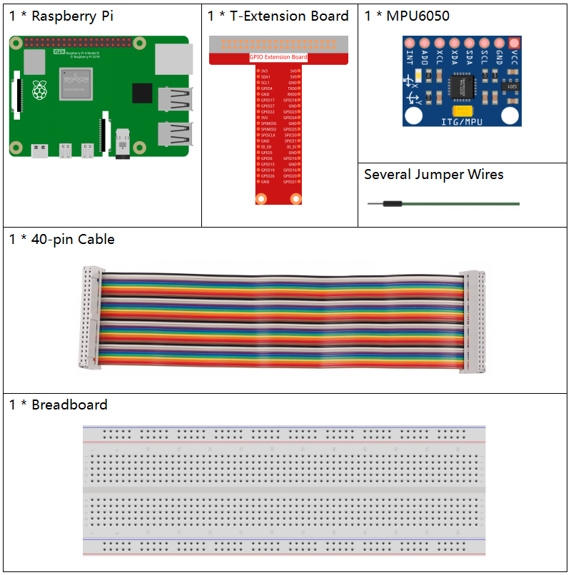
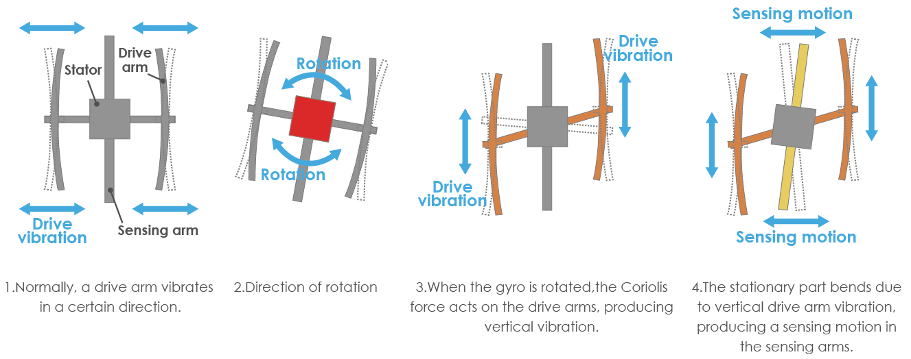

.. note::

    こんにちは、SunFounderのRaspberry Pi & Arduino & ESP32愛好家コミュニティへようこそ！Facebook上でRaspberry Pi、Arduino、ESP32についてもっと深く掘り下げ、他の愛好家と交流しましょう。

    **参加する理由は？**

    - **エキスパートサポート**：コミュニティやチームの助けを借りて、販売後の問題や技術的な課題を解決します。
    - **学び＆共有**：ヒントやチュートリアルを交換してスキルを向上させましょう。
    - **独占的なプレビュー**：新製品の発表や先行プレビューに早期アクセスしましょう。
    - **特別割引**：最新製品の独占割引をお楽しみください。
    - **祭りのプロモーションとギフト**：ギフトや祝日のプロモーションに参加しましょう。

    👉 私たちと一緒に探索し、創造する準備はできていますか？[|link_sf_facebook|]をクリックして今すぐ参加しましょう！

2.2.6 MPU6050モジュール
=======================

前書き
------------

MPU-6050は、低消費電力、低コスト、高性能などの機能を備えたスマートフォン、タブレット、ウェアラブルセンサー向けに設計された世界初で唯一の6軸物標追跡装置（3軸ジャイロスコープと3軸加速度センサー）である。

この実験では、I2Cを使用して、MPU6050の3軸加速度センサーと3軸ジャイロスコープの値を取得し、画面に表示する。

部品
----------

原理
---------

**MPU6050**

MPU-6050は、6軸（3軸ジャイロスコープ、3軸加速度計を組み合わせた）物標追跡装置である。

その三つの座標系は次のように定義される：

MPU6050をテーブルの上に平らに置き、ラベルのある面が上向きで、
この表面のドットが左上隅にあることを確認してください。
次に、上向きの直立方向がチップのz軸である。左から右への方向はX軸と見なされる。
したがって、後ろから前への方向はY軸として定義される。

.. image:: media/image223.png

**3-軸加速度計**

加速度計は加えられた機械応力に応答して電荷を生成する特定の材料の能力である圧電効果の原理で動作する。

ここで、上記の写真のように、小さなボールの中に直方体の箱があることを想像してください。
この箱の壁は圧電結晶で作られている。箱を傾けると、重力によりボールが傾斜の方向に移動する。
ボールが衝突する壁は、小さな圧電電流を生成する。
合計で、立方体には3組の向かい合った壁がある。
各ペアは、3D空間の軸：X、Y、Z軸に対応する。
圧電壁から生成される電流に応じて、傾斜の方向とその大きさを決定できる。

.. image:: media/image224.png

MPU6050を使用して、各座標軸の加速度を検出できる（静止デスクトップ状態では、Z軸の加速度は1重力単位で、X軸とY軸は0である）。傾斜または無重量/重量超過の状態にある場合、対応する測定値が変化する。

プログラムで選択できる測定範囲には、+/-2g、+/-4g、+/-8g、と各精度に対応する+/-16g（デフォルトでは2g）の4種類がある。値の範囲は-32768〜32767である。

読み取り値を測定範囲にマッピングすることにより、加速度計の読み取り値は加速度値に変換される。

加速度=（加速度計軸の生データ / 65536 * フルスケールの加速度範囲）g

X軸を例として、加速度計X軸の生データは16384の場合、範囲を +/-2gに選択する：

**X軸による加速度 = (16384 / 65536 \* 4) g**  **=1g**

**3軸ジャイロスコープ**

ジャイロスコープはコリオリ加速の原理で動作する。
フォークのような構造があり、常に前後に動いていると想像してください。
圧電結晶を使用して所定の位置に保持される。
この配置を傾けようとするたびに、結晶は傾斜の方向に力を受ける。
これは、可動フォークの慣性の結果によって引き起こされる。
したがって、結晶は圧電効果と一致して電流を生成し、この電流は増幅される。

また、ジャイロスコープには、+ /-250、+ /-500、+ /-1000、+/- 2000.計算方法と加速は基本的に一貫している。

読み取り値を角速度に変換する式は次の通りである：

角速度=（ジャイロスコープの軸生データ/ 65536 *フルスケールジャイロスコープの範囲）°/ s

X軸、たとえば、加速度計のX軸の生データは16384で、範囲は+ /-250°/ sである：

**X軸による角速度 = (16384 / 65536 \* 500)°/s** **=125°/s**

回路図
-----------------

MPU6050はI2Cバスインターフェイスを介してマイクロコントローラーと通信する。
SDA1とSCL1を対応するピンに接続する必要がある。

.. image:: media/image330.png
    :width: 600
    :align: center

実験手順
---------------------------

ステップ1： 回路を作る。

.. image:: media/image227.png
    :width: 800

ステップ2： :ref:`i2c_config` （付録を参照してください。I2Cを設定している場合は、この手順をスキップしてください。）

C言語ユーザー向け
^^^^^^^^^^^^^^^^^^^^

ステップ3： コードのフォルダーに入る。

.. raw:: html

   <run></run>

.. code-block::

    cd /home/pi/davinci-kit-for-raspberry-pi/c/2.2.6/

ステップ4： コードをコンパイルする。

.. raw:: html

   <run></run>

.. code-block::

    gcc 2.2.6_mpu6050.c -lwiringPi -lm

ステップ5： EXEファイルを実行する。

.. raw:: html

   <run></run>

.. code-block::

    sudo ./a.out

コードを実行すると、MPU6050によって読み取られたx軸、y軸の転向角、加速度、各軸の角速度が計算後に画面に入力される。

**コード**

.. code-block:: c

    #include  <wiringPiI2C.h>
    #include <wiringPi.h>
    #include  <stdio.h>
    #include  <math.h>
    int fd;
    int acclX, acclY, acclZ;
    int gyroX, gyroY, gyroZ;
    double acclX_scaled, acclY_scaled, acclZ_scaled;
    double gyroX_scaled, gyroY_scaled, gyroZ_scaled;

    int read_word_2c(int addr)
    {
    int val;
    val = wiringPiI2CReadReg8(fd, addr);
    val = val << 8;
    val += wiringPiI2CReadReg8(fd, addr+1);
    if (val >= 0x8000)
        val = -(65536 - val);
    return val;
    }

    double dist(double a, double b)
    {
    return sqrt((a*a) + (b*b));
    }

    double get_y_rotation(double x, double y, double z)
    {
    double radians;
    radians = atan2(x, dist(y, z));
    return -(radians * (180.0 / M_PI));
    }

    double get_x_rotation(double x, double y, double z)
    {
    double radians;
    radians = atan2(y, dist(x, z));
    return (radians * (180.0 / M_PI));
    }

    int main()
    {
    fd = wiringPiI2CSetup (0x68);
    wiringPiI2CWriteReg8 (fd,0x6B,0x00);//disable sleep mode 
    printf("set 0x6B=%X\n",wiringPiI2CReadReg8 (fd,0x6B));
    
    while(1) {

        gyroX = read_word_2c(0x43);
        gyroY = read_word_2c(0x45);
        gyroZ = read_word_2c(0x47);

        gyroX_scaled = gyroX / 131.0;
        gyroY_scaled = gyroY / 131.0;
        gyroZ_scaled = gyroZ / 131.0;

        //Print values for the X, Y, and Z axes of the gyroscope sensor.
        printf("My gyroX_scaled: %f\n", gyroY X_scaled);
        delay(100);
        printf("My gyroY_scaled: %f\n", gyroY Y_scaled);
        delay(100);
        printf("My gyroZ_scaled: %f\n", gyroY Z_scaled);
        delay(100);

        acclX = read_word_2c(0x3B);
        acclY = read_word_2c(0x3D);
        acclZ = read_word_2c(0x3F);

        acclX_scaled = acclX / 16384.0;
        acclY_scaled = acclY / 16384.0;
        acclZ_scaled = acclZ / 16384.0;
        
        //Print the X, Y, and Z values of the acceleration sensor.
        printf("My acclX_scaled: %f\n", acclX_scaled);
        delay(100);
        printf("My acclY_scaled: %f\n", acclY_scaled);
        delay(100);
        printf("My acclZ_scaled: %f\n", acclZ_scaled);
        delay(100);

        printf("My X rotation: %f\n", get_x_rotation(acclX_scaled, acclY_scaled, acclZ_scaled));
        delay(100);
        printf("My Y rotation: %f\n", get_y_rotation(acclX_scaled, acclY_scaled, acclZ_scaled));
        delay(100);
        
        delay(100);
    }
    return 0;
    }

**コードの説明**

.. code-block:: c

    int read_word_2c(int addr)
    {
    int val;
    val = wiringPiI2CReadReg8(fd, addr);
    val = val << 8;
    val += wiringPiI2CReadReg8(fd, addr+1);
    if (val >= 0x8000)
        val = -(65536 - val);
    return val;
    }

MPU6050から送信されたセンサーデータを読み取る。

.. code-block:: c

    double get_y_rotation(double x, double y, double z)
    {
    double radians;
    radians = atan2(x, dist(y, z));
    return -(radians * (180.0 / M_PI));
    }

Y軸の転向角を取得する。

.. code-block:: c

    double get_x_rotation(double x, double y, double z)
    {
    double radians;
    radians = atan2(y, dist(x, z));
    return (radians * (180.0 / M_PI));
    }

x軸の転向角を計算する。

.. code-block:: c

    gyroX = read_word_2c(0x43);
    gyroY = read_word_2c(0x45);
    gyroZ = read_word_2c(0x47);

    gyroX_scaled = gyroX / 131.0;
    gyroY_scaled = gyroY / 131.0;
    gyroZ_scaled = gyroZ / 131.0;

    //Print values for the X, Y, and Z axes of the gyroscope sensor.
    printf("My gyroX_scaled: %f\n", gyroY X_scaled);
    printf("My gyroY_scaled: %f\n", gyroY Y_scaled);
    printf("My gyroZ_scaled: %f\n", gyroY Z_scaled);

ジャイロセンサーのx軸、y軸、z軸の値を読み取り、メタデータを角速度値に変換してから出力する。

.. code-block:: c

    acclX = read_word_2c(0x3B);
    acclY = read_word_2c(0x3D);
    acclZ = read_word_2c(0x3F);

    acclX_scaled = acclX / 16384.0;
    acclY_scaled = acclY / 16384.0;
    acclZ_scaled = acclZ / 16384.0;
        
    //Print the X, Y, and Z values of the acceleration sensor.
    printf("My acclX_scaled: %f\n", acclX_scaled);
    printf("My acclY_scaled: %f\n", acclY_scaled);
    printf("My acclZ_scaled: %f\n", acclZ_scaled);

加速度センサーのx軸、y軸、z軸の値を読み取り、メタデータを加速速度値（重力単位）に変換してから出力する。

.. code-block:: c

    printf("My X rotation: %f\n", get_x_rotation(acclX_scaled, acclY_scaled, acclZ_scaled));
    printf("My Y rotation: %f\n", get_y_rotation(acclX_scaled, acclY_scaled, acclZ_scaled));

x軸とy軸の転向角をプリントする。

Python言語ユーザー向け
^^^^^^^^^^^^^^^^^^^^^^^^^

ステップ3： コードのフォルダーに入る。

.. raw:: html

   <run></run>

.. code-block::

    cd /home/pi/davinci-kit-for-raspberry-pi/python

ステップ4： EXEファイルを実行する。

.. raw:: html

   <run></run>

.. code-block::

    sudo python3 2.2.6_mpu6050.py

コードを実行し、x軸とy軸の転向角、加速度とMPU6050によって読み取られた各軸の角速度は、計算後に画面に入力される。

**コード**

.. note::

   以下のコードを **変更/リセット/コピー/実行/停止** できます。 ただし、その前に、 ``davinci-kit-for-raspberry-pi/python`` のようなソースコードパスに移動する必要があります。 
   
.. raw:: html

    <run></run>

.. code-block:: python

    import smbus
    import math
    import time

    # Power management registers
    power_mgmt_1 = 0x6b
    power_mgmt_2 = 0x6c

    def read_byte(adr):
        return bus.read_byte_data(address, adr)

    def read_word(adr):
        high = bus.read_byte_data(address, adr)
        low = bus.read_byte_data(address, adr+1)
        val = (high << 8) + low
        return val

    def read_word_2c(adr):
        val = read_word(adr)
        if (val >= 0x8000):
            return -((65535 - val) + 1)
        else:
            return val

    def dist(a,b):
        return math.sqrt((a*a)+(b*b))

    def get_y_rotation(x,y,z):
        radians = math.atan2(x, dist(y,z))
        return -math.degrees(radians)

    def get_x_rotation(x,y,z):
        radians = math.atan2(y, dist(x,z))
        return math.degrees(radians)

    bus = smbus.SMBus(1) # or bus = smbus.SMBus(1) for Revision 2 boards
    address = 0x68       # This is the address value read via the i2cdetect command

    # Now wake the 6050 up as it starts in sleep mode
    bus.write_byte_data(address, power_mgmt_1, 0)

    while True:
        time.sleep(0.1)
        gyro_xout = read_word_2c(0x43)
        gyro_yout = read_word_2c(0x45)
        gyro_zout = read_word_2c(0x47)

        print ("gyro_xout : ", gyro_xout, " scaled: ", (gyro_xout / 131))
        print ("gyro_yout : ", gyro_yout, " scaled: ", (gyro_yout / 131))
        print ("gyro_zout : ", gyro_zout, " scaled: ", (gyro_zout / 131))

        accel_xout = read_word_2c(0x3b)
        accel_yout = read_word_2c(0x3d)
        accel_zout = read_word_2c(0x3f)

        accel_xout_scaled = accel_xout / 16384.0
        accel_yout_scaled = accel_yout / 16384.0
        accel_zout_scaled = accel_zout / 16384.0

        print ("accel_xout: ", accel_xout, " scaled: ", accel_xout_scaled)
        print ("accel_yout: ", accel_yout, " scaled: ", accel_yout_scaled)
        print ("accel_zout: ", accel_zout, " scaled: ", accel_zout_scaled)

        print ("x rotation: " , get_x_rotation(accel_xout_scaled, accel_yout_scaled, accel_zout_scaled))
        print ("y rotation: " , get_y_rotation(accel_xout_scaled, accel_yout_scaled, accel_zout_scaled))

        time.sleep(0.5)

**コードの説明**

.. code-block:: python

    def read_word(adr):
        high = bus.read_byte_data(address, adr)
        low = bus.read_byte_data(address, adr+1)
        val = (high << 8) + low
        return val

    def read_word_2c(adr):
        val = read_word(adr)
        if (val >= 0x8000):
            return -((65535 - val) + 1)
        else:
            return val

MPU6050から送信されたセンサーデータを読み取る。

.. code-block:: python

    def get_y_rotation(x,y,z):
        radians = math.atan2(x, dist(y,z))
        return -math.degrees(radians)

y軸の転向角を計算する。

.. code-block:: python

    def get_x_rotation(x,y,z):
        radians = math.atan2(y, dist(x,z))
        return math.degrees(radians)

x軸の転向角を計算する。

.. code-block:: python

    gyro_xout = read_word_2c(0x43)
    gyro_yout = read_word_2c(0x45)
    gyro_zout = read_word_2c(0x47)

    print ("gyro_xout : ", gyro_xout, " scaled: ", (gyro_xout / 131))
    print ("gyro_yout : ", gyro_yout, " scaled: ", (gyro_yout / 131))
    print ("gyro_zout : ", gyro_zout, " scaled: ", (gyro_zout / 131))

ジャイロセンサーのx軸、y軸、z軸の値を読み取り、メタデータを角速度値に変換してから出力する。

.. code-block:: python

    accel_xout = read_word_2c(0x3b)
    accel_yout = read_word_2c(0x3d)
    accel_zout = read_word_2c(0x3f)

    accel_xout_scaled = accel_xout / 16384.0
    accel_yout_scaled = accel_yout / 16384.0
    accel_zout_scaled = accel_zout / 16384.0

    print ("accel_xout: ", accel_xout, " scaled: ", accel_xout_scaled)
    print ("accel_yout: ", accel_yout, " scaled: ", accel_yout_scaled)
    print ("accel_zout: ", accel_zout, " scaled: ", accel_zout_scaled)

加速度センサーのx軸、y軸、z軸の値を読み取り、メタデータを加速速度値（重力単位）に変換してから出力する。

.. code-block:: python

    print ("x rotation: " , get_x_rotation(accel_xout_scaled, accel_yout_scaled, accel_zout_scaled))
    print ("y rotation: " , get_y_rotation(accel_xout_scaled, accel_yout_scaled, accel_zout_scaled))

x軸とy軸の転向角をプリントする。

現象画像
------------------

.. image:: media/image228.jpeg