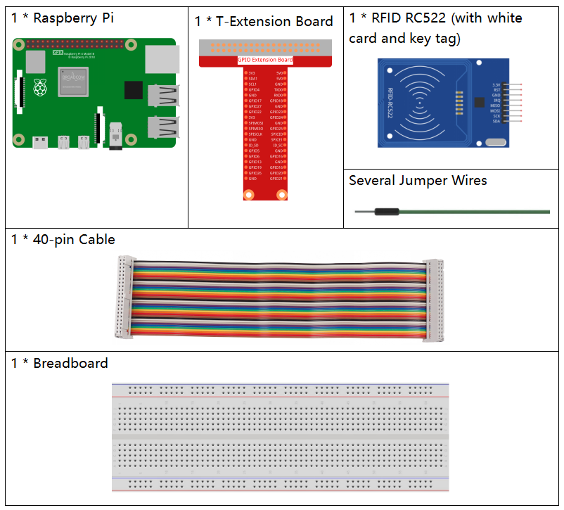
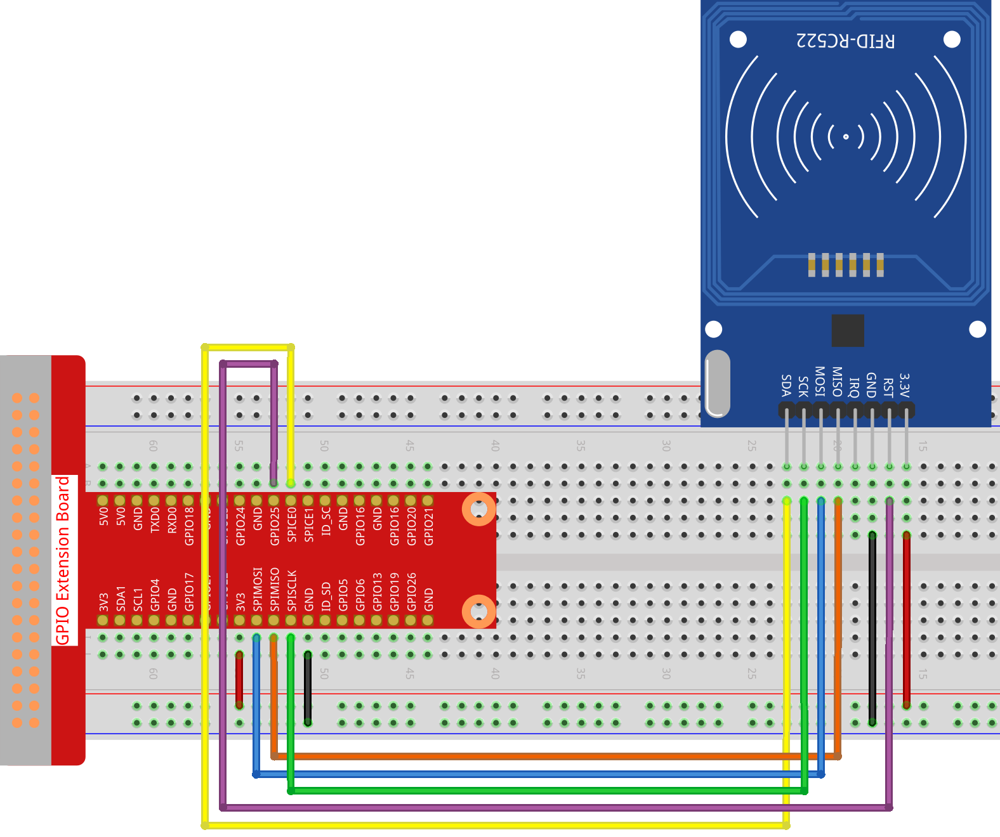
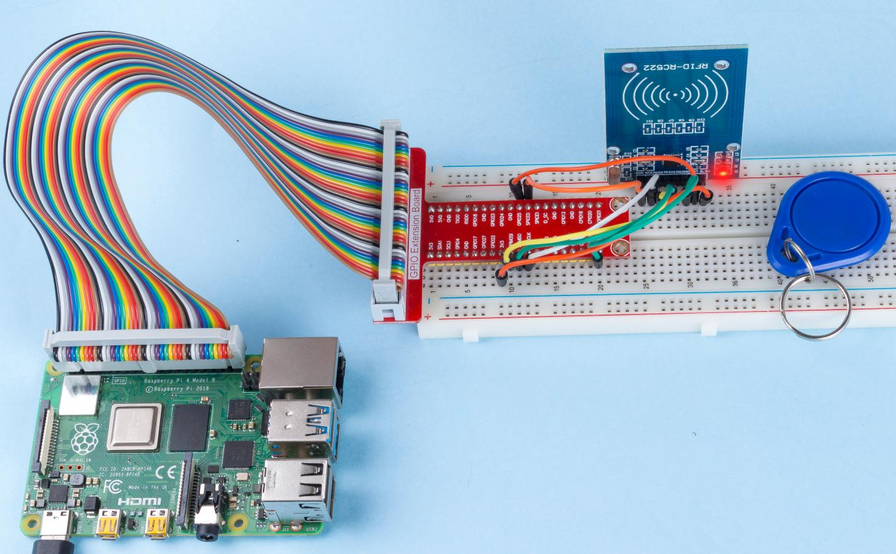

.. note::

    こんにちは、SunFounderのRaspberry Pi & Arduino & ESP32愛好家コミュニティへようこそ！Facebook上でRaspberry Pi、Arduino、ESP32についてもっと深く掘り下げ、他の愛好家と交流しましょう。

    **参加する理由は？**

    - **エキスパートサポート**：コミュニティやチームの助けを借りて、販売後の問題や技術的な課題を解決します。
    - **学び＆共有**：ヒントやチュートリアルを交換してスキルを向上させましょう。
    - **独占的なプレビュー**：新製品の発表や先行プレビューに早期アクセスしましょう。
    - **特別割引**：最新製品の独占割引をお楽しみください。
    - **祭りのプロモーションとギフト**：ギフトや祝日のプロモーションに参加しましょう。

    👉 私たちと一緒に探索し、創造する準備はできていますか？[|link_sf_facebook|]をクリックして今すぐ参加しましょう！

2.2.7 MFRC522 RFIDモジュール
=============================

前書き
---------------

無線周波数識別（RFID）は、オブジェクト（またはタグ）と質問デバイス（またはリーダー）の間の無線通信を使用して、そのようなオブジェクトを自動的に追跡したり識別したりする技術を指す。

この技術の最も一般的なアプリケーションには、小売サプライチェーン、軍事サプライチェーン、自動決済方法、荷物の追跡と管理、ドキュメントの追跡と医薬品管理などが含まれておる。

このプロジェクトでは、読み取りと書き込みにRFIDを使用する。

部品
----------

原理
---------

**RFID**

無線周波数識別（RFID）は、オブジェクト（またはタグ）と質問デバイス（またはリーダー）の間の無線通信を使用して、
そのようなオブジェクトを自動的に追跡したり識別したりする技術を指す。
タグの送信範囲はリーダーから数メートルに制限されている。
リーダーとタグの間の明確な見通し線は必ずしも必要ではない。

ほとんどのタグには、少なくとも1つの集積回路（IC）とアンテナが含まれている。
マイクロチップは情報を保存し、リーダーとの無線周波数（RF）通信を管理する。
パッシブタグは独立したエネルギー源を持たず、リーダーによって提供される外部電磁信号に依存して動作する。
しかしアクティブタグバッテリーなどの独立したエネルギー源が含まれている。
したがって、処理、送信機能と範囲が拡大している可能性がある。

.. image:: media/image230.png

**MFRC522**

MFRC522は、読み取りと書き込みカードチップの一種である。通常、13.56MHzの無線で使用される。NXP Companyによって発売された低電圧、低コスト、小型の非接触カードチップであり、インテリジェント機器と持ち転びやすい手持ちデバイスの最良の選択である。

MF RC522はすべてのタイプの13.56MHzパッシブ非接触通信方法とプロトコルで完全に開示された高度な変調と復調の概念を使用している。
さらに、MIFARE製品を検証するための高速CRYPTO1暗号化アルゴリズムをサポートしている。
MFRC522は最大424kbit/sの双方向データ伝送速度で、MIFAREシリーズの高速非接触通信もサポートしている。
13.56MHz高集積リーダーカードシリーズの新しいメンバーとして、MF RC522は既存のMF RC500とMF RC530と非常に似ているが、多くの違いがある。
配線が少ないシリアル方式でホストマシンと通信する。SPI、I2C、とシリアルUARTモード（RS232に類似）から選択できる。
これにより、接続の削減、PCBボードスペースの節約（サイズの縮小）、およびコストの削減に役立つ。

回路図
-----------------

.. image:: media/image331.png

実験手順
-----------------------

ステップ1： 回路を作る

ステップ2： :ref:`spi_config` (SPIを設定している場合は、このステップをスキップしてください。)

C言語ユーザー向け
^^^^^^^^^^^^^^^^^^^^

ステップ3： コードのフォルダーに入る。

.. raw:: html

   <run></run>

.. code-block:: 

    cd /home/pi/davinci-kit-for-raspberry-pi/c/2.2.7/

ステップ4： コードをコンパイルする。

.. raw:: html

   <run></run>

.. code-block:: 

    make read
    make write

.. note::
    カードIDの読み取りまたは書き込みには二つの例があり、必要に応じていずれかを選択できる。

ステップ5： EXEファイルを実行する。

.. raw:: html

   <run></run>

.. code-block:: 

    sudo ./read

.. raw:: html

   <run></run>
   
.. code-block:: 

    sudo ./write

**コードの説明**

.. code-block:: c

    InitRc522();

この関数はRFID RC522モジュールを初期化するために使用される。

.. code-block:: c

    uint8_t read_card_data();

この関数はカードのデータを読み取るために使用され、読み取りが成功すると「1」が返されます。

.. code-block:: c

    uint8_t write_card_data(uint8_t *data);

この関数はカードのデータを書き込むために使用され、書き込みが成功すると「1」を返します。 ``*data`` は、カードに書き込まれる情報です。

Python言語ユーザー向け
^^^^^^^^^^^^^^^^^^^^^^^^^

**ステップ2**: 仮想環境の有効化。

.. note::
    
    * 有効化する前に、仮想環境を作成していることを確認してください。詳細はこちらを参照してください: :ref:`create_virtual`.

    * Raspberry Piを再起動するたびや、新しいターミナルを開くたびに、仮想環境を有効化するために次のコマンドを再度実行する必要があります。

.. raw:: html

    <run></run>

.. code-block:: shell

    source myenv/bin/activate

仮想環境が有効化されると、コマンドラインのプロンプトの前に環境名が表示され、仮想環境内で作業していることが示されます。

**ステップ3**: ライブラリのインストール。

``spidev`` ライブラリはSPIとのやり取りを処理し、このチュートリアルの重要なコンポーネントであり、Raspberry PiがRFID RC522とのやり取りに必要です。

以下のコマンドを実行して、 ``pip`` を介して ``spidev`` をRaspberry Piにインストールします。

.. raw:: html

    <run></run>
 
.. code-block::

    sudo pip3 install spidev

MFRC522ライブラリのインストールを続行します。 MFRC522ライブラリには2つのファイルが含まれています: ``MFRC522.py`` と ``SimpleMFRC522.py``。

``MFRC522.py`` 

はRFID RC522インターフェースの実装であり、このライブラリはPiのSPIインターフェースを介してRFIDとの通信のすべての重い作業を処理します。

``SimpleMFRC522.py`` は ``MFRC522.py`` ファイルを取り、わずかな関数の代わりにわずかな関数で処理できるように大幅に簡素化します。

.. raw:: html

    <run></run>
 
.. code-block::

    sudo pip3 install mfrc522

**ステップ4**: 仮想環境の終了。

作業を完了し、仮想環境から退出したい場合は、単純に次のコマンドを実行します:

.. raw:: html

    <run></run>

.. code-block:: shell

    deactivate

これにより、システムのグローバルPython環境に戻ります。

**ステップ5**： コードのフォルダーに入る。

.. raw:: html

    <run></run>
 
.. code-block::

    cd /home/pi/davinci-kit-for-raspberry-pi/python/2.2.7

**ステップ6**： EXEファイルを実行する。

.. raw:: html

   <run></run>

.. code-block::

    sudo python3 2.2.7_read.py

.. raw:: html

   <run></run>

.. code-block::

    sudo python3 2.2.7_write.py

.. note::

    ``2.2.7_read.py`` を実行すると、カードの ID とテキストがシェルに出力されます。
    ``2.2.7_write.py`` を実行した後、最初にメッセージを書き込み、Enter を押して確認し、最後にカードを MFRC522 RFID モジュールに置いて書き込みを完了する必要があります。

**コード**

.. note::

   以下のコードを **変更/リセット/コピー/実行/停止** できます。 ただし、その前に、 ``davinci-kit-for-raspberry-pi/python`` のようなソースコードパスに移動する必要があります。 
      
.. raw:: html

    <run></run>

.. code-block:: python

    # read
    import time
    from mfrc522 import SimpleMFRC522
    import RPi.GPIO as GPIO

    reader = SimpleMFRC522()

    def main():
        while True:
            print("Reading...Please place the card...")
            id, text = reader.read()
            print("ID: %s\nText: %s" % (id,text))
            time.sleep(3)
            
    def destroy():
        GPIO.cleanup()
        
    if __name__ == '__main__':
        try:
            main()
        # When 'Ctrl+C' is pressed, the program destroy() will be  executed.
        except KeyboardInterrupt:
            destroy()

    
.. raw:: html

    <run></run>
        
.. code-block:: python

    # write
    from mfrc522 import SimpleMFRC522
    import RPi.GPIO as GPIO

    reader = SimpleMFRC522()

    def main():
        while True:
            text = input('Please write new data:')
            print("Please place the card to complete writing")
            reader.write(text)
            print("Data writing is complete")
            
    def destroy():
        GPIO.cleanup()
        
    if __name__ == '__main__':
        try:
            main()
        # When 'Ctrl+C' is pressed, the program destroy() will be  executed.
        except KeyboardInterrupt:
            destroy()

**コードの説明**

.. code-block:: python

    reader = SimpleMFRC522()

``SimpleMFRC522()`` クラスをインスタンス化します。

.. code-block:: python

    reader.read()

この機能は、カードデータを読み取るために使用されます。 読み取りが成功すると、IDとテキストが返されます。

.. code-block:: python

    reader.write(text)

この機能は、カードに情報を書き込むために使用されます。「Enter」キーを押して書き込みを終了します。 ``text`` は、カードに書き込まれる情報です。

現象画像
------------------

