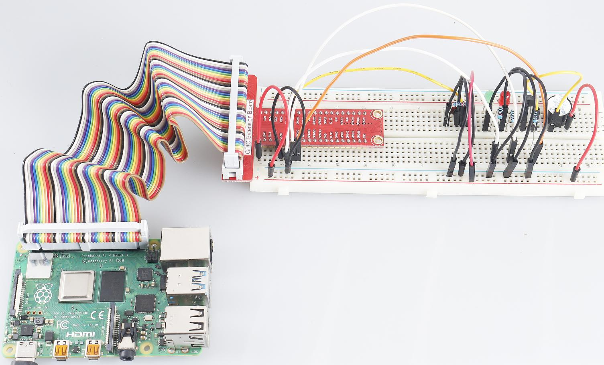

3.1.10 Alarmglocke
~~~~~~~~~~~~~~~~~~~~~~~~

Einführung
-----------------

In diesem Kurs erstellen wir ein manuelles Alarmgerät. 
Sie können den Kippschalter durch einen Thermistor oder einen lichtempfindlichen Sensor ersetzen, 
um einen Temperaturalarm oder einen Lichtalarm auszulösen.

Komponenten
---------------

.. image:: media/list_Alarm_Bell.png
    :align: center

Schematische Darstellung
-------------------------

============ ======== ======== ===
T-Karte Name physisch wiringPi BCM
GPIO17       Pin 11   0        17
GPIO18       Pin 12   1        18
GPIO27       Pin 13   2        27
GPIO22       Pin 15   3        22
============ ======== ======== ===

.. image:: media/Schematic_three_one10.png
   :align: center

Experimentelle Verfahren
-----------------------------

Schritt 1: Bauen Sie die Schaltung auf.

.. image:: media/image266.png
   :alt: Alarm Bell_bb
   :width: 800

Für Benutzer in C-Sprache
^^^^^^^^^^^^^^^^^^^^^^^^^^

Schritt 2: Verzeichnis wechseln.

.. raw:: html

   <run></run>

.. code-block:: 

    cd /home/pi/davinci-kit-for-raspberry-pi/c/3.1.10/

Schritt 3: Kompilieren.

.. raw:: html

   <run></run>

.. code-block::

    gcc 3.1.10_AlarmBell.c -lwiringPi -lpthread

Schritt 4: Ausführen.

.. raw:: html

   <run></run>

.. code-block::

    sudo ./a.out

Nach dem Start des Programms wird der Kippschalter nach rechts umgeschaltet und der Summer gibt Alarmtöne aus. 
Gleichzeitig blinken die roten und grünen LEDs mit einer bestimmten Frequenz.

**Code Erklärung**

.. code-block:: c

    #include <pthread.h>

In dieser Kode verwenden Sie eine neue Bibliothek, ``pthread.h`` , 
die aus einer Reihe allgemeiner Thread-Bibliotheken besteht und Multithreading realisieren kann. 
Wir fügen den Parameter ``-lpthread`` zur Kompilierungszeit hinzu, 
damit die LED und der Summer unabhängig voneinander arbeiten können.

.. code-block:: c

    void *ledWork(void *arg){       
        while(1)    
        {   
            if(flag==0){
                pthread_exit(NULL);
            }
            digitalWrite(ALedPin,HIGH);
            delay(500);
            digitalWrite(ALedPin,LOW);
            digitalWrite(BLedPin,HIGH);
            delay(500);
            digitalWrite(BLedPin,LOW);
        }
    }

Die Funktion ``ledWork()`` hilft beim Einstellen des Arbeitszustands dieser beiden LEDs: Sie leuchtet die grüne LED 0,5 Sekunden lang auf und erlischt dann. In ähnlicher Weise leuchtet die rote LED 0,5 Sekunden lang auf und erlischt dann.

.. code-block:: c

    void *buzzWork(void *arg){
        while(1)
        {
            if(flag==0){
                pthread_exit(NULL);
            }
            if((note>=800)||(note<=130)){
                pitch = -pitch;
            }
            note=note+pitch;
            softToneWrite(BeepPin,note);
            delay(10);
        }
    }

Mit der Funktion ``buzzWork()`` wird der Arbeitszustand des Summers eingestellt. 
Hier stellen wir die Frequenz zwischen 130 und 800 ein, 
um sie in einem Intervall von 20 zu akkumulieren oder abzunehmen.

.. code-block:: c

    void on(){
        flag = 1;
        if(softToneCreate(BeepPin) == -1){
            printf("setup softTone failed !");
            return; 
        }    
        pthread_t tLed;     
        pthread_create(&tLed,NULL,ledWork,NULL);    
        pthread_t tBuzz;  
        pthread_create(&tBuzz,NULL,buzzWork,NULL);      
    }

In der Funktion ``on()``:

1. Definieren Sie die Markierung „flag = 1“, die das Ende des Kontrollthreads angibt.
#. Erstellen Sie einen softwaregesteuerten Ton-Pin ``BeepPin``.
#. Erstellen Sie zwei separate Threads, damit die LED und der Summer gleichzeitig arbeiten können.

``pthread_t tLed`` : Deklariert einen Thread tLed.

``pthread_create(&tLed,NULL,ledWork,NULL)`` : Erstellen Sie den Thread und sein Prototyp lautet wie folgt:

    .. code-block:: c

        int pthread_create(pthread_t *restrict tidp,const pthread_attr_t *restrict_attr,void*(*start_rtn)(void*),void *restrict arg);

**Geben Sie den Wert zurück**

Wenn dies erfolgreich ist, geben Sie „0“ zurück. Andernfalls geben Sie die Fallzahl „-1“ zurück.

Parameter

| Der erste Parameter ist ein Zeiger auf die Thread-ID.
| Der zweite wird verwendet, um das Thread-Attribut festzulegen.
| Die dritte ist die Startadresse der Thread-Running-Funktion.
| Der letzte ist derjenige, der die Funktion ausführt.

.. code-block:: c

    void off(){
        flag = 0;
        softToneStop(BeepPin);
        digitalWrite(ALedPin,LOW);
        digitalWrite(BLedPin,LOW);
    }

Die Funktion ``off()`` definiert „flag=0“, 
um die Threads ledWork und BuzzWork zu verlassen und dann den Summer und die LED auszuschalten.

.. code-block:: c

    int main(){       
        setup(); 
        int lastState = 0;
        while(1){
            int currentState = digitalRead(switchPin);
            if ((currentState == 1)&&(lastState==0)){
                on();
            }
            else if((currentState == 0)&&(lastState==1)){
                off();
            }
            lastState=currentState;
        }
        return 0;
    }

``main()`` enthält den gesamten Prozess des Programms: 
Lesen Sie zuerst den Wert des Schiebeschalters; 
Wenn der Kippschalter nach rechts umgeschaltet ist (der Messwert ist 1), 
wird die Funktion ``on()`` aufgerufen, 
der Summer wird zur Ausgabe von Tönen angesteuert und die rote und die grüne LED blinken. 
Andernfalls funktionieren der Summer und die LED nicht.

Für Python-Sprachbenutzer
^^^^^^^^^^^^^^^^^^^^^^^^^^^^^^^^

Schritt 2: Verzeichnis wechseln.

.. raw:: html

   <run></run>

.. code-block::

    cd /home/pi/davinci-kit-for-raspberry-pi/python/

Schritt 3: Ausführen.

.. raw:: html

   <run></run>

.. code-block::

    sudo python3 3.1.10_AlarmBell.py

Nach dem Start des Programms wird der Kippschalter nach rechts umgeschaltet und der Summer gibt Alarmtöne aus. 
Gleichzeitig blinken die roten und grünen LEDs mit einer bestimmten Frequenz.

**Code**

.. note::

    Sie können den folgenden Code **Ändern/Zurücksetzen/Kopieren/Ausführen/Stoppen** . Zuvor müssen Sie jedoch zu einem Quellcodepfad wie ``davinci-kit-for-raspberry-pi/python`` gehen.
     
.. raw:: html

    <run></run>

.. code-block:: python

    import RPi.GPIO as GPIO
    import time
    import threading

    BeepPin=22
    ALedPin=17
    BLedPin=27
    switchPin=18

    Buzz=0
    flag =0
    note=150
    pitch=20

    def setup():
        GPIO.setmode(GPIO.BCM)
        GPIO.setup(BeepPin, GPIO.OUT)
        GPIO.setup(ALedPin,GPIO.OUT,initial=GPIO.LOW)
        GPIO.setup(BLedPin,GPIO.OUT,initial=GPIO.LOW)
        GPIO.setup(switchPin,GPIO.IN)
        global Buzz
        Buzz=GPIO.PWM(BeepPin,note)

    def ledWork():
        while flag:
            GPIO.output(ALedPin,GPIO.HIGH)
            time.sleep(0.5)
            GPIO.output(ALedPin,GPIO.LOW)
            GPIO.output(BLedPin,GPIO.HIGH)
            time.sleep(0.5)
            GPIO.output(BLedPin,GPIO.LOW)

    def buzzerWork():
        global pitch
        global note
        while flag:
            if note >= 800 or note <=130:
                pitch = -pitch
            note = note + pitch 
            Buzz.ChangeFrequency(note)
            time.sleep(0.01)

    def on():
        global flag
        flag = 1
        Buzz.start(50)
        tBuzz = threading.Thread(target=buzzerWork) 
        tBuzz.start()
        tLed = threading.Thread(target=ledWork) 
        tLed.start()    

    def off():
        global flag
        flag = 0
        Buzz.stop()
        GPIO.output(ALedPin,GPIO.LOW)
        GPIO.output(BLedPin,GPIO.LOW)      

    def main():
        lastState=0
        while True:
            currentState =GPIO.input(switchPin)
            if currentState == 1 and lastState == 0:
                on()
            elif currentState == 0 and lastState == 1:
                off()
            lastState=currentState

    
    def destroy():
        off()
        GPIO.cleanup()

    if __name__ == '__main__':
        setup()
        try:
            main()
        except KeyboardInterrupt:
            destroy()

**Code Erklärung**

.. code-block:: python

    import threading

Hier importieren wir das Threading-Modul und es ermöglicht Ihnen, 
mehrere Dinge gleichzeitig zu tun, während normale Programme Kode nur von oben nach unten ausführen können. 
Bei Threading-Modulen können die LED und der Summer separat arbeiten.

.. code-block:: python

    def ledWork():
        while flag:
            GPIO.output(ALedPin,GPIO.HIGH)
            time.sleep(0.5)
            GPIO.output(ALedPin,GPIO.LOW)
            GPIO.output(BLedPin,GPIO.HIGH)
            time.sleep(0.5)
            GPIO.output(BLedPin,GPIO.LOW)

Die Funktion ``ledWork()`` hilft beim Einstellen des Arbeitszustands dieser beiden LEDs: 
Sie leuchtet die grüne LED 0,5 Sekunden lang auf und erlischt dann. 
In ähnlicher Weise leuchtet die rote LED 0,5 Sekunden lang auf und erlischt dann.

.. code-block:: python

    def buzzerWork():
        global pitch
        global note
        while flag:
            if note >= 800 or note <=130:
                pitch = -pitch
            note = note + pitch 
            Buzz.ChangeFrequency(note)
            time.sleep(0.01)

Mit der Funktion ``buzzWork()`` wird der Arbeitszustand des Summers eingestellt. 
Hier stellen wir die Frequenz zwischen 130 und 800 ein, 
um sie in einem Intervall von 20 zu akkumulieren oder abzunehmen.

.. code-block:: python

    def on():
        global flag
        flag = 1
        Buzz.start(50)
        tBuzz = threading.Thread(target=buzzerWork) 
        tBuzz.start()
        tLed = threading.Thread(target=ledWork) 
        tLed.start()  

In der Funktion ``on()``:

1. Definieren Sie die Markierung „flag = 1“, die das Ende des Kontrollthreads angibt.
#. Starten Sie den Buzz und stellen Sie den Arbeitszyklus auf 50% ein.
#. Erstellen Sie 2 separate Threads, damit die LED und der Summer gleichzeitig arbeiten können.

``tBuzz = threading.Thread(target=buzzerWork)`` : Create the thread and its prototype is as follows:

.. code-block:: python

    class threading.Thread(group=None, target=None, name=None, args=(), kwargs={}, *, daemon=None)

Unter den Konstruktionsmethoden ist der Hauptparameter target. Wir müssen dem Ziel ein aufrufbares Objekt zuweisen (hier sind die Funktionen ledWork und BuzzWork).

Next ``start()`` wird aufgerufen, um das Thread-Objekt zu starten. 
Beispiel: ``tBuzz.start()`` wird verwendet, um den neu installierten tBuzz-Thread zu starten.

.. code-block:: python

    def off():
        global flag
        flag = 0
        Buzz.stop()
        GPIO.output(ALedPin,GPIO.LOW)
        GPIO.output(BLedPin,GPIO.LOW)

Die Funktion ``Off()`` definiert „flag=0“, 
um die Threads ledWork und BuzzWork zu verlassen und dann den Summer und die LED auszuschalten.

.. code-block:: python

    def main():
        lastState=0
        while True:
            currentState =GPIO.input(switchPin)
            if currentState == 1 and lastState == 0:
                on()
            elif currentState == 0 and lastState == 1:
                off()
            lastState=currentState

``main()`` enthält den gesamten Prozess des Programms: 
Lesen Sie zuerst den Wert des Schiebeschalters; 
Wenn der Kippschalter nach rechts umgeschaltet ist (der Messwert ist 1), 
wird die Funktion ``on()`` aufgerufen, 
der Summer wird zur Ausgabe von Tönen angesteuert und die rote und die grüne LED blinken. 
Andernfalls funktionieren der Summer und die LED nicht.

Phänomen Bild
------------------------

