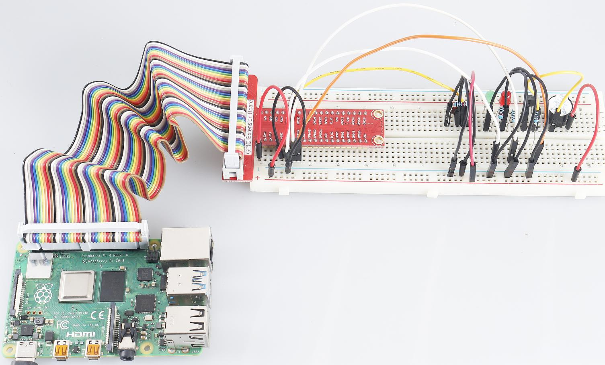

.. note:: 

    Ciao! Benvenuto nella Community di appassionati SunFounder di Raspberry Pi, Arduino e ESP32 su Facebook! Esplora più a fondo Raspberry Pi, Arduino ed ESP32 insieme ad altri appassionati.

    **Perché unirsi?**

    - **Supporto Esperto**: Risolvi problemi post-vendita e sfide tecniche con l'aiuto della nostra community e del nostro team.
    - **Impara e Condividi**: Scambia suggerimenti e tutorial per migliorare le tue competenze.
    - **Anteprime Esclusive**: Ottieni accesso anticipato a nuovi annunci di prodotto e anticipazioni.
    - **Sconti Speciali**: Goditi sconti esclusivi sui nostri prodotti più recenti.
    - **Promozioni e Omaggi Festivi**: Partecipa a omaggi e promozioni speciali durante le festività.

    👉 Pronto a esplorare e creare con noi? Clicca [|link_sf_facebook|] e unisciti oggi stesso!

3.1.10 Campanello di Allarme
=============================

Introduzione
-----------------

In questo corso, realizzeremo un dispositivo di allarme manuale. È possibile 
sostituire l'interruttore con un termistore o un sensore fotosensibile per 
creare un allarme di temperatura o di luce.

Componenti
---------------

.. image:: img/list_Alarm_Bell.png
    :align: center

Schema Elettrico
-------------------------

============ ======== ======== ===
T-Board Name physical wiringPi BCM
GPIO17       Pin 11   0        17
GPIO18       Pin 12   1        18
GPIO27       Pin 13   2        27
GPIO22       Pin 15   3        22
============ ======== ======== ===

.. image:: img/Schematic_three_one10.png
   :align: center

Procedure Sperimentali
-----------------------------

**Step 1**: Costruisci il circuito.

.. image:: img/image266.png
   :alt: Alarm Bell_bb
   :width: 800

**Per utenti linguaggio C**
^^^^^^^^^^^^^^^^^^^^^^^^^^^^^^^

**Step 2**: Cambia directory.

.. raw:: html

   <run></run>

.. code-block:: 

    cd ~/davinci-kit-for-raspberry-pi/c/3.1.10/

**Step 3**: Compila.

.. raw:: html

   <run></run>

.. code-block:: 

    gcc 3.1.10_AlarmBell.c -lwiringPi -lpthread

**Step 4**: Esegui.

.. raw:: html

   <run></run>

.. code-block:: 

    sudo ./a.out

Dopo l’avvio del programma, l’interruttore a leva viene posizionato a 
destra e il cicalino emette suoni di allarme. Contemporaneamente, i 
LED rosso e verde lampeggiano a una certa frequenza.

.. note::

    Se non funziona dopo l'avvio, o appare un messaggio di errore: \"wiringPi.h: No such file or directory", fai riferimento a :ref:`Il codice C non funziona?`.

**Spiegazione del Codice**

.. code-block:: c

    #include <pthread.h>

In questo codice, si utilizza una nuova libreria, pthread.h, una libreria 
comune per i thread che consente di realizzare il multithreading. Aggiungiamo 
il parametro **-lpthread** in fase di compilazione per consentire il 
funzionamento indipendente del LED e del cicalino.

.. code-block:: c

    void *ledWork(void *arg){       
        while(1)    
        {   
            if(flag==0){
                pthread_exit(NULL);
            }
            digitalWrite(ALedPin,HIGH);
            delay(500);
            digitalWrite(ALedPin,LOW);
            digitalWrite(BLedPin,HIGH);
            delay(500);
            digitalWrite(BLedPin,LOW);
        }
    }

La funzione ledWork() imposta lo stato di funzionamento dei 2 LED: mantiene 
acceso il LED verde per 0,5s e poi lo spegne; analogamente, accende il LED 
rosso per 0,5s e poi lo spegne.

.. code-block:: c

    void *buzzWork(void *arg){
        while(1)
        {
            if(flag==0){
                pthread_exit(NULL);
            }
            if((note>=800)||(note<=130)){
                pitch = -pitch;
            }
            note=note+pitch;
            softToneWrite(BeepPin,note);
            delay(10);
        }
    }

La funzione buzzWork() imposta lo stato di funzionamento del cicalino. 
Qui impostiamo la frequenza tra 130 e 800, con un intervallo di accumulo 
o decadenza di 20.

.. code-block:: c

    void on(){
        flag = 1;
        if(softToneCreate(BeepPin) == -1){
            printf("setup softTone failed !");
            return; 
        }     
        pthread_t tLed;     
        pthread_create(&tLed,NULL,ledWork,NULL);     
        pthread_t tBuzz;  
        pthread_create(&tBuzz,NULL,buzzWork,NULL);       
    }

Nella funzione on():

1) Definiamo la variabile di stato "flag=1" per terminare il thread di controllo.

2) Creiamo un pin per toni controllato da software **BeepPin**.

3) Creiamo due thread separati in modo che LED e cicalino possano funzionare 
   contemporaneamente.

**pthread_t tLed:** Dichiara un thread **tLed**.

**pthread_create(&tLed,NULL,ledWork,NULL):** Crea il thread con il seguente 
prototipo:

int pthread_create(pthread_t *restrict tidp, const pthread_attr_t *restrict 
attr, void*(*start_rtn)(void*), void *restrict arg);

**Valore Restituito**

Se ha successo, restituisce "0"; in caso contrario, restituisce il numero di 
errore "-1".

**Parametro**

| Il primo parametro è un puntatore all'identificatore del thread.
| Il secondo parametro serve per impostare l'attributo del thread.
| Il terzo è l'indirizzo di partenza della funzione del thread.
| L'ultimo è l'argomento passato alla funzione.

.. code-block:: c

    void off(){
        flag = 0;
        softToneStop(BeepPin);
        digitalWrite(ALedPin,LOW);
        digitalWrite(BLedPin,LOW);
    }

La funzione Off() imposta "flag=0" per uscire dai thread 
**ledWork** e **BuzzWork**, quindi spegne il cicalino e i LED.

.. code-block:: c

    int main(){       
        setup(); 
        int lastState = 0;
        while(1){
            int currentState = digitalRead(switchPin);
            if ((currentState == 1)&&(lastState==0)){
                on();
            }
            else if((currentState == 0)&&(lastState==1)){
                off();
            }
            lastState=currentState;
        }
        return 0;
    }

Main() contiene l'intero processo del programma: innanzitutto legge il 
valore dell'interruttore a scorrimento; se viene spostato a destra 
(lettura pari a 1), viene chiamata la funzione on(), attivando il cicalino 
e facendo lampeggiare i LED rosso e verde. Altrimenti, il cicalino e i 
LED rimangono spenti.

**Per Utenti Python**
^^^^^^^^^^^^^^^^^^^^^^^^^^^^^^^^

**Passo 2:** Cambia directory.

.. raw:: html

   <run></run>

.. code-block::

    cd ~/davinci-kit-for-raspberry-pi/python/

**Passo 3:** Esegui.

.. raw:: html

   <run></run>

.. code-block::

    sudo python3 3.1.10_AlarmBell.py

Dopo l'avvio del programma, sposta l'interruttore a leva a destra e il 
cicalino emetterà suoni di allarme. Contemporaneamente, i LED rosso e 
verde lampeggeranno a una certa frequenza.

**Codice**

.. note::

    Puoi **Modificare/Resettare/Copiare/Eseguire/Interrompere** il codice qui sotto. Prima di farlo, però, devi andare al percorso del codice sorgente, come ``davinci-kit-for-raspberry-pi/python``. 
    
.. raw:: html

    <run></run>

.. code-block:: python

    import RPi.GPIO as GPIO
    import time
    import threading

    BeepPin=22
    ALedPin=17
    BLedPin=27
    switchPin=18

    Buzz=0
    flag =0
    note=150
    pitch=20

    def setup():
        GPIO.setmode(GPIO.BCM)
        GPIO.setup(BeepPin, GPIO.OUT)
        GPIO.setup(ALedPin,GPIO.OUT,initial=GPIO.LOW)
        GPIO.setup(BLedPin,GPIO.OUT,initial=GPIO.LOW)
        GPIO.setup(switchPin,GPIO.IN)
        global Buzz
        Buzz=GPIO.PWM(BeepPin,note)

    def ledWork():
        while flag:
            GPIO.output(ALedPin,GPIO.HIGH)
            time.sleep(0.5)
            GPIO.output(ALedPin,GPIO.LOW)
            GPIO.output(BLedPin,GPIO.HIGH)
            time.sleep(0.5)
            GPIO.output(BLedPin,GPIO.LOW)

    def buzzerWork():
        global pitch
        global note
        while flag:
            if note >= 800 or note <=130:
                pitch = -pitch
            note = note + pitch 
            Buzz.ChangeFrequency(note)
            time.sleep(0.01)

    def on():
        global flag
        flag = 1
        Buzz.start(50)
        tBuzz = threading.Thread(target=buzzerWork) 
        tBuzz.start()
        tLed = threading.Thread(target=ledWork) 
        tLed.start()    

    def off():
        global flag
        flag = 0
        Buzz.stop()
        GPIO.output(ALedPin,GPIO.LOW)
        GPIO.output(BLedPin,GPIO.LOW)      

    def main():
        lastState=0
        while True:
            currentState =GPIO.input(switchPin)
            if currentState == 1 and lastState == 0:
                on()
            elif currentState == 0 and lastState == 1:
                off()
            lastState=currentState

    
    def destroy():
        off()
        GPIO.cleanup()

    if __name__ == '__main__':
        setup()
        try:
            main()
        except KeyboardInterrupt:
            destroy()

**Spiegazione del Codice**

.. code-block:: python

    import threading

Qui importiamo il modulo **Threading** che permette di eseguire più 
operazioni contemporaneamente, mentre i programmi normali possono 
eseguire codice solo in ordine sequenziale dall’alto verso il basso. 
Grazie a **Threading**, il LED e il cicalino possono funzionare separatamente.

.. code-block:: python

    def ledWork():
        while flag:
            GPIO.output(ALedPin,GPIO.HIGH)
            time.sleep(0.5)
            GPIO.output(ALedPin,GPIO.LOW)
            GPIO.output(BLedPin,GPIO.HIGH)
            time.sleep(0.5)
            GPIO.output(BLedPin,GPIO.LOW)

La funzione ledWork() serve a impostare lo stato operativo dei 2 LED: 
mantiene il LED verde acceso per 0,5 secondi per poi spegnerlo; 
analogamente, mantiene il LED rosso acceso per 0,5 secondi e poi lo spegne.

.. code-block:: python

    def buzzerWork():
        global pitch
        global note
        while flag:
            if note >= 800 or note <=130:
                pitch = -pitch
            note = note + pitch 
            Buzz.ChangeFrequency(note)
            time.sleep(0.01)

La funzione buzzWork() imposta lo stato operativo del cicalino. Qui la 
frequenza è impostata tra 130 e 800, con un intervallo di accumulo o 
decadimento di 20.

.. code-block:: python

    def on():
        global flag
        flag = 1
        Buzz.start(50)
        tBuzz = threading.Thread(target=buzzerWork) 
        tBuzz.start()
        tLed = threading.Thread(target=ledWork) 
        tLed.start()   

Nella funzione on():

1) Definisce il marcatore "flag=1", indicando la fine del thread di controllo.

2) Avvia il cicalino (Buzz) e imposta il ciclo di lavoro al 50%.

3) Crea **2** thread separati affinché LED e cicalino possano funzionare 
   contemporaneamente.

   tBuzz = threading.Thread(target=buzzerWork): Crea il thread con il 
   seguente prototipo:

class threading.Thread(group=None, target=None, name=None, args=(), kwargs={}, \*, daemon=None)

Tra i metodi costruttivi, il parametro principale è **target**, 
a cui assegnare un oggetto invocabile (qui le funzioni **ledWork** 
e **BuzzWork**).

Poi, **start()** avvia l’oggetto thread, es., tBuzz.start() serve ad avviare 
il nuovo thread tBuzz.

.. code-block:: python

    def off():
        global flag
        flag = 0
        Buzz.stop()
        GPIO.output(ALedPin,GPIO.LOW)
        GPIO.output(BLedPin,GPIO.LOW)

La funzione off() definisce "flag=0" per uscire dai thread 
**ledWork** e **BuzzWork** e quindi spegnere il cicalino e i LED.

.. code-block:: python

    def main():
        lastState=0
        while True:
            currentState =GPIO.input(switchPin)
            if currentState == 1 and lastState == 0:
                on()
            elif currentState == 0 and lastState == 1:
                off()
            lastState=currentState

Main() contiene l'intero processo del programma: legge inizialmente il 
valore dell’interruttore a scorrimento; se l’interruttore a leva è 
spostato a destra (il valore letto è 1), viene chiamata la funzione on(), 
il cicalino emette suoni di allarme e i LED rosso e verde lampeggiano. 
Altrimenti, né il cicalino né i LED funzionano.

Immagine del Fenomeno
------------------------

