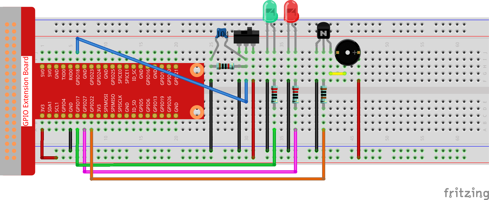

3.1.10 警報ベル
~~~~~~~~~~~~~~~~~

前書き
-----------------

このコースでは、手動警報装置を作成する。
トグルスイッチをサーミスタまたは感光センサーに交換して、温度警報または光警報を作成できる。

部品
---------------

.. image:: media/list_Alarm_Bell.png
    :align: center

回路図
-------------------------

============ ======== ======== ===
T-Board Name physical wiringPi BCM
GPIO17       Pin 11   0        17
GPIO18       Pin 12   1        18
GPIO27       Pin 13   2        27
GPIO22       Pin 15   3        22
============ ======== ======== ===

.. image:: media/Schematic_three_one10.png
   :align: center

実験手順
-----------------------------

ステップ1： 回路を作る。

C言語ユーザー向け
^^^^^^^^^^^^^^^^^^^^^^^^^^

ステップ2： ディレクトリを変更する。

.. raw:: html

   <run></run>

.. code-block:: 

    cd /home/pi/davinci-kit-for-raspberry-pi/c/3.1.10/

ステップ3： コンパイルする。

.. raw:: html

   <run></run>

.. code-block::

    gcc 3.1.10_AlarmBell.c -lwiringPi -lpthread

ステップ4： 実行。

.. raw:: html

   <run></run>

.. code-block::

    sudo ./a.out

プログラムが起動すると、トグルスイッチが右に切り替わり、ブザーが警報音を出す。同時に、特定の周波数で赤と緑のLEDが点滅する。

**コードの説明**

.. code-block:: c

    #include <pthread.h>

このコードでは、新しいライブラリ ``thread.h`` を使用する。
これは、一般的なスレッドライブラリのセットであり、マルチスレッドを実現できる。
コンパイル時に ``-lpthread`` パラメーターを追加して、LEDとブザーを独立して動作させる。

.. code-block:: c

    void *ledWork(void *arg){       
        while(1)    
        {   
            if(flag==0){
                pthread_exit(NULL);
            }
            digitalWrite(ALedPin,HIGH);
            delay(500);
            digitalWrite(ALedPin,LOW);
            digitalWrite(BLedPin,HIGH);
            delay(500);
            digitalWrite(BLedPin,LOW);
        }
    }

関数 ``ledWork()`` は、これら2つのLEDの動作状態を設定するために役立つ：
緑色のLEDを0.5秒間点灯させた後、消灯する。同様に、赤いLEDを0.5秒間点灯させてから消灯する。

.. code-block:: c

    void *buzzWork(void *arg){
        while(1)
        {
            if(flag==0){
                pthread_exit(NULL);
            }
            if((note>=800)||(note<=130)){
                pitch = -pitch;
            }
            note=note+pitch;
            softToneWrite(BeepPin,note);
            delay(10);
        }
    }

関数 ``buzzWork()`` は、ブザーの動作状態を設定するために使用される。
ここでは、周波数を130〜800に設定し、20の間隔で累積・減衰する。

.. code-block:: c

    void on(){
        flag = 1;
        if(softToneCreate(BeepPin) == -1){
            printf("setup softTone failed !");
            return; 
        }    
        pthread_t tLed;     
        pthread_create(&tLed,NULL,ledWork,NULL);    
        pthread_t tBuzz;  
        pthread_create(&tBuzz,NULL,buzzWork,NULL);      
    }

関数 ``on()`` で：

* 制御スレッドの終了を示すマーク「flag = 1」を定義する。

* ソフトウェア制御のトーンピン ``BeepPin`` を作成する。

* LEDとブザーが同時に動作できるように、二つの個別のスレッドを作成する。

``pthread_t tLed`` : スレッド tLed を宣言する。

``pthread_create(&tLed,NULL,ledWork,NULL)`` ： スレッドを作成し、そのプロトタイプは次の通りである： ``int pthread_create(pthread_t *restrict tidp,const pthread_attr_t *restrict attr,void*（*start_rtn)(void*),void *restrict arg);``

**値を返す**

成功した場合は「0」を返し、それ以外の場合は落下数「-1」を返します。

**パラメータ**

* 最初のパラメーターは、スレッドIDへのポインターです。
* 2つ目は、スレッド属性を設定するために使用されます。
* 3番目は、スレッド実行関数の開始アドレスです。
* 最後のものは、関数を実行するものです。

.. code-block:: c

    void off(){
        flag = 0;
        softToneStop(BeepPin);
        digitalWrite(ALedPin,LOW);
        digitalWrite(BLedPin,LOW);
    }

スレッド ``ledWork`` と ``BuzzWork`` を終了するために、
関数 ``Off()`` は「flag = 0」を定義しそして、ブザーとLEDをオフにする。

.. code-block:: c

    int main(){       
        setup(); 
        int lastState = 0;
        while(1){
            int currentState = digitalRead(switchPin);
            if ((currentState == 1)&&(lastState==0)){
                on();
            }
            else if((currentState == 0)&&(lastState==1)){
                off();
            }
            lastState=currentState;
        }
        return 0;
    }

``main()`` には、プログラムのプロセス全体が含まれている：まず、スライドスイッチの値を読み取る。
トグルスイッチが右に切り替えられた場合（読み取り値が1）、関数 ``on()`` が呼び出され、
ブザーが駆動されて音が鳴り、赤と緑のLEDが点滅する。そうしないと、ブザーとLEDが機能しない。

**Python言語ユーザー向け**
^^^^^^^^^^^^^^^^^^^^^^^^^^^^^^^^

ステップ2： ディレクトリを変更する。

.. raw:: html

   <run></run>

.. code-block::

    cd /home/pi/davinci-kit-for-raspberry-pi/python/

ステップ3： 実行する。

.. raw:: html

   <run></run>

.. code-block::

    sudo python3 3.1.10_AlarmBell.py

プログラムが起動すると、トグルスイッチが右に切り替わり、
ブザーが警報音を出す。同時に、特定の周波数で赤と緑のLEDが点滅する。

**コード**

.. note::

   以下のコードを **変更/リセット/コピー/実行/停止** できます。 ただし、その前に、 ``davinci-kit-for-raspberry-pi/python`` のようなソースコードパスに移動する必要があります。 
   
.. raw:: html

    <run></run>

.. code-block:: python

    import RPi.GPIO as GPIO
    import time
    import threading

    BeepPin=22
    ALedPin=17
    BLedPin=27
    switchPin=18

    Buzz=0
    flag =0
    note=150
    pitch=20

    def setup():
        GPIO.setmode(GPIO.BCM)
        GPIO.setup(BeepPin, GPIO.OUT)
        GPIO.setup(ALedPin,GPIO.OUT,initial=GPIO.LOW)
        GPIO.setup(BLedPin,GPIO.OUT,initial=GPIO.LOW)
        GPIO.setup(switchPin,GPIO.IN)
        global Buzz
        Buzz=GPIO.PWM(BeepPin,note)

    def ledWork():
        while flag:
            GPIO.output(ALedPin,GPIO.HIGH)
            time.sleep(0.5)
            GPIO.output(ALedPin,GPIO.LOW)
            GPIO.output(BLedPin,GPIO.HIGH)
            time.sleep(0.5)
            GPIO.output(BLedPin,GPIO.LOW)

    def buzzerWork():
        global pitch
        global note
        while flag:
            if note >= 800 or note <=130:
                pitch = -pitch
            note = note + pitch 
            Buzz.ChangeFrequency(note)
            time.sleep(0.01)

    def on():
        global flag
        flag = 1
        Buzz.start(50)
        tBuzz = threading.Thread(target=buzzerWork) 
        tBuzz.start()
        tLed = threading.Thread(target=ledWork) 
        tLed.start()    

    def off():
        global flag
        flag = 0
        Buzz.stop()
        GPIO.output(ALedPin,GPIO.LOW)
        GPIO.output(BLedPin,GPIO.LOW)      

    def main():
        lastState=0
        while True:
            currentState =GPIO.input(switchPin)
            if currentState == 1 and lastState == 0:
                on()
            elif currentState == 0 and lastState == 1:
                off()
            lastState=currentState

    
    def destroy():
        off()
        GPIO.cleanup()

    if __name__ == '__main__':
        setup()
        try:
            main()
        except KeyboardInterrupt:
            destroy()

**コードの説明**

.. code-block:: python

    import threading

ここでは、 ``Threading`` モジュールをインポートし、
複数のことを一度に行えるようにするが、通常のプログラムはコードを上から下にしか実行できない。 
``Threading`` モジュールを使用すると、LEDとブザーを個別に動作させることができる。

.. code-block:: python

    def ledWork():
        while flag:
            GPIO.output(ALedPin,GPIO.HIGH)
            time.sleep(0.5)
            GPIO.output(ALedPin,GPIO.LOW)
            GPIO.output(BLedPin,GPIO.HIGH)
            time.sleep(0.5)
            GPIO.output(BLedPin,GPIO.LOW)

関数 ``ledWork()`` は、これら2つのLEDの動作状態を設定するために役立つ：緑色のLEDを0.5秒間点灯させた後、消灯する。
同様に、赤いLEDを0.5秒間点灯させてから消灯する。

.. code-block:: python

    def buzzerWork():
        global pitch
        global note
        while flag:
            if note >= 800 or note <=130:
                pitch = -pitch
            note = note + pitch 
            Buzz.ChangeFrequency(note)
            time.sleep(0.01)

関数 ``buzzWork()`` は、ブザーの動作状態を設定するために使用される。
ここでは、周波数を130〜800に設定し、20の間隔で累積・減衰する。

.. code-block:: python

    def on():
        global flag
        flag = 1
        Buzz.start(50)
        tBuzz = threading.Thread(target=buzzerWork) 
        tBuzz.start()
        tLed = threading.Thread(target=ledWork) 
        tLed.start()  

関数 ``on()`` で：

* 制御スレッドの終了を示すマーク「flag = 1」を定義する。

* バズを開始し、デューティサイクルを50％に設定する。

* LEDとブザ ー が同時に動作できるように、二つの個別のスレッドを作成する。

``tBuzz = threading.Thread(target=buzzerWork)`` : スレッドを作成すると、そのプロトタイプは以下の通りである： ``class threading.Thread(group=None, target=None, name=None, args=(), kwargs={}, \*, daemon=None)``

構築メソッドの中で、主要なパラメーターは ターゲット であり、呼び出し可能なオブジェクト（ここでは関数 ``ledWork`` と ``BuzzWork`` ）を ターゲット に割り当てる必要がある。

次に、スレッドオブジェクトを開始するために ``start()`` が呼び出される。
たとえば、 ``tBuzz.start()`` は、新しくインストールされたtBuzzスレッドを開始するために使用される。

.. code-block:: python

    def off():
        global flag
        flag = 0
        Buzz.stop()
        GPIO.output(ALedPin,GPIO.LOW)
        GPIO.output(BLedPin,GPIO.LOW)

スレッド ``ledWork`` と ``BuzzWork`` を終了するために、
関数 ``Off()`` は「flag = 0」を定義しそして、ブザーとLEDをオフにする。

.. code-block:: python

    def main():
        lastState=0
        while True:
            currentState =GPIO.input(switchPin)
            if currentState == 1 and lastState == 0:
                on()
            elif currentState == 0 and lastState == 1:
                off()
            lastState=currentState

``main()`` には、プログラムのプロセス全体が含まれている：
まず、スライドスイッチの値を読み取る。
トグルスイッチが右に切り替えられた場合（読み取り値が1）、関数 ``on()`` が呼び出され、
ブザーが駆動されて音が鳴り、赤と緑のLEDが点滅する。そうしないと、ブザーとLEDが機能しない。

現象画像
------------------------

.. image:: media/image267.jpeg
   :align: center